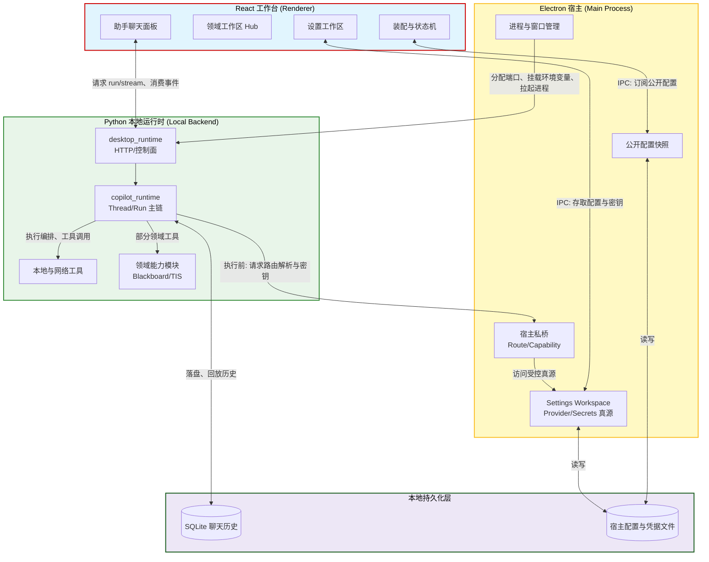
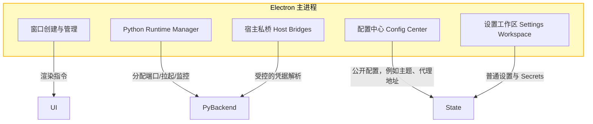
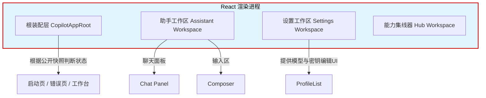
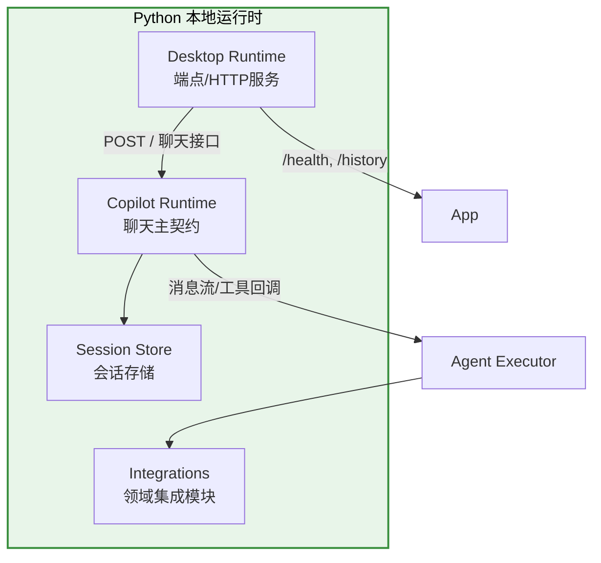
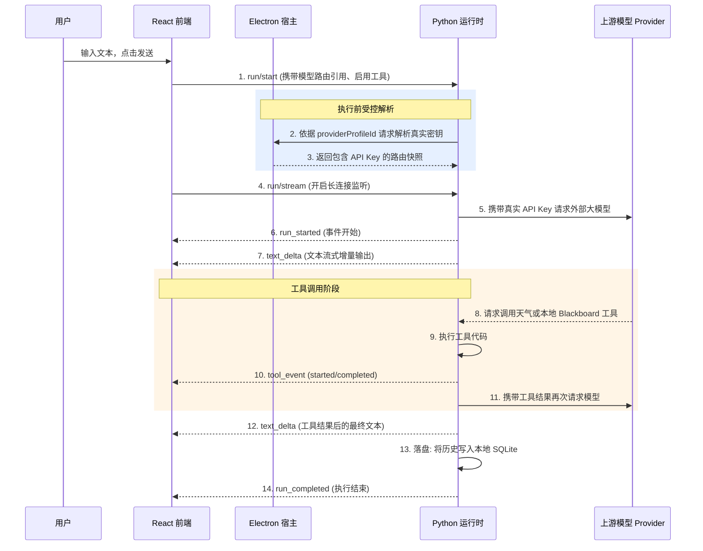

# 赶渡 CanDue 系统架构设计

当前系统采用“Electron 桌面宿主 + React 前端工作台 + Python 本地运行时”的混合桌面应用架构。整个系统并非传统的“B/S 架构网页客户端”，而是以本地优先原则构建的独立桌面数字生命助手。

## 1. 核心架构图

以下架构图展示了系统的四大核心层级及其关键交互：

## 2. 架构设计详解

系统由三个主要运行环境构成，这三部分各司其职，保证了本地数据安全、良好的桌面交互体验以及强大的后端执行能力。

### 2.1 Electron 宿主（主进程）：安全边界与生命周期管理

Electron 主进程是整个系统的“大管家”与安全沙箱。它不直接渲染界面，也不负责 AI 的对话生成，而是牢牢掌握着用户最敏感的数据，并提供底层系统级能力。

主进程承担了多项核心职责：

- **进程管理**：负责寻找 Python 可执行文件，分配 Loopback 端口，作为子进程启动 Python 本地运行时，并在应用退出时回收进程。
- **配置真源**：分为两层。一层是 `Config Center`，负责存储可以公开给前端的配置（如主题、运行时地址）；另一层是 `Settings Workspace`，负责存储用户配置的模型服务、API Key 以及校园网 CAS 密码等敏感数据（Secrets）。
- **安全隔离（宿主私桥）**：这是架构中最关键的安全设计。前端请求模型时只发送公开的“路由指纹”，真实的 API Key 仅保存在 Electron 中。Python 运行时在实际请求外部 LLM 之前，必须通过私有桥接通道向主进程发起请求，换取真实的鉴权信息。这就保证了敏感密钥既不在前端内存中暴露，也不会轻易随运行时的日志流出。

### 2.2 React 渲染进程：前端工作台与状态机

渲染进程专注于桌面应用的用户交互与视图呈现。它的核心是驱动界面的多个“状态机”，而不是单纯处理点击事件。

前端的设计重点在于：
- **启动态管理**：前端通过读取 Electron 暴露的公开配置快照以及 Python 运行时的就绪状态，决定当前应用是停留在启动屏、降级模式（仅有前端）还是正常进入主工作台。
- **聊天流消费**：在进入聊天面板后，前端将作为 `run/stream` 流式事件的消费者。当后端返回诸如 `run_started`、`tool_event`、`text_delta`、`run_completed` 时，前端依据这些事件实时更新界面。这种基于状态机的事件消费机制，取代了传统的一问一答阻塞请求。

### 2.3 Python 本地运行时：执行引擎与业务网关

后端以独立子进程运行，是执行模型调用、工具编排和持久化本地历史的中枢。

Python 层包含四个层次的划分：
- **`desktop_runtime`**：作为服务外壳，提供生命周期端点、健康检查，以及处理本地请求的基础 HTTP 接口。
- **`copilot_runtime`**：承载聊天的实际契约（Thread/Run）。它包含模型路由解析、流式事件编码、工具调用和会话状态管理，将单次的对话抽象为一个 `Run` 的执行流。
- **持久化层**：负责利用 SQLite 记录每次对话的 Thread、Run 和具体事件（Event）。应用重启后的历史会话恢复功能，依赖于这里的单机数据库读取，而非云端。
- **领域模块与工具**：集成层包括文件处理、Blackboard（南科大黑板系统）和 TIS（教务系统）等工具能力，为模型提供了强大的本地和网络执行手臂。

### 2.4 核心交互链路：对话处理流程

整个系统最典型的交互场景是发送一条消息。这里的时序图展示了前端发起聊天到收到流式响应的全过程。

这条链路体现了系统设计的三层分工：前端仅负责呈现流式数据与交互意图；Electron 宿主负责下放执行权限并提供鉴权保护；Python 后端负责协调模型网络请求、工具执行步骤和最终状态存档。

## 3. 架构选择的考量与隐藏假设

### 3.1 为什么选择这种架构？

1. **本地数据主权优先**：
   相较于传统的云端 SaaS 产品，当前架构将聊天历史（SQLite）、用户配置、各种凭证（Secrets）全部沉淀在用户本地物理设备上。Python 运行时仅作为本地服务工作，不存在集中的云端数据库收集用户聊天隐私。
2. **敏感信息的安全隔离**：
   如果将密钥下放到前端或直接写在后端的明文配置中，容易造成内存泄露或跨进程污染。现在的“凭证托管在 Electron 主进程、执行时 Python 按需向主进程请求解析”模式，建立了一道坚固的安全隔离墙，确保 Python 运行时在“不知道密码库全貌”的情况下，仅能拿到当前请求合法授权的单次凭据。
3. **语言生态的优势互补**：
   前端采用 React/TypeScript 能够提供丰富、极具响应性的桌面 UI 体验；而后端业务（尤其是 LLM 编排、数据处理、校园系统爬虫等）若用 Node.js 编写则缺乏成熟的生态。Python 拥有 `PydanticAI`、`pdfplumber` 等强大的 AI 和数据清洗库，双引擎架构完美结合了两者的长处。

### 3.2 图中未完全展示的隐藏假设

- **不依赖持续的云端同步**：当前架构预设历史记录恢复（Replay）仅在“单机本地 SQLite”语境下生效。应用重启时依赖本地数据库重建会话树，暂不提供跨设备的实时状态同步通道。
- **状态不一致容忍机制（Drift）**：架构假设用户的本地配置（如某个模型 Provider）可能随时被删除。当历史会话试图继续，却发现绑定的模型路由已经失效时，系统不会阻断运行，而是由 Python 后端抛出明确的诊断事件（Diagnostic Event），前端配合展示配置漂移（Drift）界面，要求用户重新绑定有效路由再继续执行。
- **无感知的端口分配**：尽管 Python 运行时是个 HTTP 服务，但它的端口在每次 Electron 启动时是动态寻找可用空闲端口分配的，并由 Electron 静态注入前端视图，从而规避了本地端口冲突的风险。