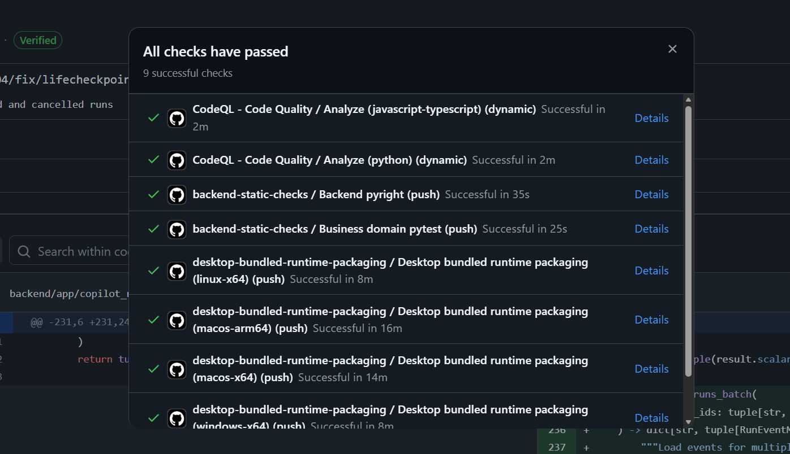

# CanDue 最终报告 — 团队 26spring-26s-23

---

## 1. 指标（Metrics）

我们使用了以下工具来计算项目指标：

- **Python / 后端**：[radon](https://pypi.org/project/radon/)（圈复杂度计算）、`pyproject.toml`（依赖数量统计），以及自定义 Python 脚本用于代码行数和文件数统计。
- **TypeScript / 前端**：[ESLint](https://eslint.org/) 的 `complexity` 规则（圈复杂度计算）、`package.json`（依赖数量统计），以及同一个自定义脚本用于代码行数和文件数统计。

指标计算脚本位于 [`scripts/metrics.py`](../scripts/metrics.py)，运行方式如下：

```powershell
python scripts/metrics.py
```

### 1.1 统计结果

| 指标 | 后端 (Python) | 前端 (TypeScript) | **总计** |
|---|---|---|---|
| **源文件数量** | 248 | 451 | **699** |
| **代码行数 (LOC)** | 56,166 | 77,801 | **133,967** |
| **依赖数量** | 13 | 16 | **29** |
| **圈复杂度 – 函数总数** | 2,978 | 12,645 | **15,623** |
| **圈复杂度 – 平均值** | 3.25 | 1.78 | **2.06**（加权） |
| **圈复杂度 – 最大值** | 20 | 30 | **30** |

### 1.2 圈复杂度最高的 5 个文件

**后端 (Python)：**

| 文件 | 最大 CC | 平均 CC | 函数数 |
|---|---|---|---|
| `copilot_runtime/persistence/drift.py` | 20 | 6.43 | 14 |
| `copilot_runtime/persistence/_projections/helpers.py` | 20 | 4.50 | 20 |
| `copilot_runtime/_debug_logging/summarizers.py` | 20 | 5.08 | 25 |
| `integrations/sustech/blackboard/api/course_catalog.py` | 20 | 6.17 | 18 |
| `integrations/sustech/blackboard/facade/tools.py` | 20 | 3.56 | 45 |

**前端 (TypeScript)：**

| 文件 | 最大 CC | 平均 CC | 函数数 |
|---|---|---|---|
| `electron/capability-bridge/protocol.ts` | 30 | 3.21 | 24 |
| `electron/capability-bridge/services/DesktopCapabilityBrowserService.ts` | 18 | 3.23 | 53 |
| `electron/mcp-registry/service.ts` | 16 | 2.83 | 95 |
| `electron/runtime/python-runtime-manager.ts` | 16 | 1.82 | 51 |
| `electron/settings-workspace/provider-route-resolver.ts` | 16 | 2.47 | 17 |

### 1.3 分析

- 后端的平均圈复杂度为 **3.25**，处于健康范围内（通常 < 10 被视为低风险）。最大圈复杂度 20 集中在持久化层和集成层，这符合数据同步与 Blackboard API 交互的固有复杂性。
- 前端的平均圈复杂度较低，为 **1.78**，但最大值为 **30**，位于 [`electron/capability-bridge/protocol.ts`](../frontend-copilot/electron/capability-bridge/protocol.ts)。该文件负责 Electron 主进程与 Python 后端之间的通信协议，包含大量条件分支。建议持续关注此文件，必要时进行重构。
- 前端的源文件数（451 vs. 248）和代码行数（77,801 vs. 56,166）明显多于后端，这反映了更丰富的 UI 层和 Electron 桌面外壳。

---

## 2. CI/CD 管道描述

我们的项目使用 **GitHub Actions** 作为 CI/CD 平台。管道由 **6 个工作流** 组成，涵盖静态分析、测试、文档部署、桌面打包以及 AI 辅助代码审查。

所有工作流配置文件均位于 [`.github/workflows/`](https://github.com/sustech-cs304/team-project-26spring-26s-23/tree/main/.github/workflows) 目录下。

### 2.1 管道总览

```
                    ┌──────────────────────────────┐
                    │      Push / Pull Request      │
                    └──────────────┬───────────────┘
                                   │
           ┌───────────────────────┼───────────────────────┐
           │                       │                       │
           ▼                       ▼                       ▼
┌──────────────────┐   ┌──────────────────┐   ┌──────────────────┐
│ backend-static-  │   │ frontend-        │   │ website-         │
│ checks（后端静态   │   │ validation       │   │ validation       │
│ 检查）            │   │ （前端验证）       │   │ （网站验证）       │
│                  │   │                  │   │                  │
│ • pyright 类型    │   │ • tsc 类型检查    │   │ • tsc 类型检查    │
│   检查            │   │ • vitest 测试     │   │ • 构建           │
│ • pytest 单元     │   │ • vite 构建       │   │                  │
│   测试            │   │                  │   │                  │
│ • pytest 冒烟     │   │                  │   │                  │
│   测试            │   │                  │   │                  │
└──────────────────┘   └──────────────────┘   └──────────────────┘
           │                       │                       │
           └───────────────────────┼───────────────────────┘
                                   │ （main 分支 docs/** 变更时触发）
                                   ▼
                       ┌──────────────────┐
                       │ deploy-docs-to-  │
                       │ github-pages     │
                       │ （文档部署）       │
                       │                  │
                       │ • 构建文档网站     │
                       │ • 部署到          │
                       │   GitHub Pages   │
                       └──────────────────┘

                    ┌──────────────────────────────┐
                    │    PR 创建 / 更新 / 评论       │
                    └──────────────┬───────────────┘
                                   │
                                   ▼
                       ┌──────────────────┐
                       │ pr-agent         │
                       │ （AI 代码审查）    │
                       │                  │
                       │ • AI 自动审查     │
                       │ • PR 总结         │
                       └──────────────────┘

                    ┌──────────────────────────────┐
                    │   手动触发 / 发布版本           │
                    └──────────────┬───────────────┘
                                   │
                                   ▼
                       ┌──────────────────┐
                       │ desktop-bundled- │
                       │ runtime-packaging│
                       │ （桌面端多平台打包）│
                       │                  │
                       │ • Win/Mac/       │
                       │   Linux 安装包    │
                       └──────────────────┘
```

### 2.2 各工作流详细说明

#### 2.2.1 后端静态检查（`backend-static-checks`）

**触发条件**：Push/PR 涉及 `backend/**` 路径 | **配置文件**：[`.github/workflows/backend-static-checks.yml`](../.github/workflows/backend-static-checks.yml)

该工作流包含 **3 个并行作业**：

| 作业 | 工具 | 说明 |
|---|---|---|
| **Backend pyright** | [pyright](https://github.com/microsoft/pyright) | 对四个活跃应用域进行静态类型检查：Blackboard 集成、教务系统集成、Copilot 运行时和桌面运行时 |
| **业务域 pytest** | [pytest](https://pytest.org/) + [pytest-asyncio](https://pytest-asyncio.readthedocs.io/) | Blackboard 和教务系统业务逻辑的单元测试（API、数据、Provider、共享层），排除 `live` 和 `e2e` 标记 |
| **运行时与冒烟 pytest** | [pytest](https://pytest.org/) + [pytest-asyncio](https://pytest-asyncio.readthedocs.io/) | Copilot 运行时和桌面运行时模块的单元测试，以及 CI 安全的集成冒烟测试 |

**环境配置**：Python 版本来自 [`.python-version`](https://github.com/sustech-cs304/team-project-26spring-26s-23/blob/main/backend/.python-version)，依赖通过 `uv sync --frozen` 安装，由 [astral-sh/setup-uv](https://github.com/astral-sh/setup-uv) 管理。

#### 2.2.2 前端验证（`frontend-validation`）

**触发条件**：Push/PR 涉及 `frontend-copilot/**` 路径 | **配置文件**：[`.github/workflows/frontend-validation.yml`](../.github/workflows/frontend-validation.yml)

| 步骤 | 工具 | 说明 |
|---|---|---|
| **类型检查** | [TypeScript](https://www.typescriptlang.org/) (`tsc --noEmit`) | 检查 `tsconfig.json` 和 `tsconfig.node.json` 中的类型错误 |
| **测试** | [Vitest](https://vitest.dev/) + [@testing-library/react](https://testing-library.com/docs/react-testing-library/intro/) | 运行 `src/` 和 `electron/` 目录下所有 `*.test.ts` 和 `*.test.tsx` 文件 |
| **构建** | [Vite](https://vitejs.dev/) | 生产环境构建，验证应用打包是否成功 |

**环境配置**：Node.js 22，npm 依赖通过 `npm ci` 安装，同时配置 Python/uv 用于前端构建过程中引用的后端运行时。

#### 2.2.3 网站验证（`website-validation`）

**触发条件**：Push/PR 涉及 `website/**` 或 `docs/**` 路径 | **配置文件**：[`.github/workflows/website-validation.yml`](../.github/workflows/website-validation.yml)

| 步骤 | 工具 | 说明 |
|---|---|---|
| **类型检查** | [TypeScript](https://www.typescriptlang.org/) | 对 Docusaurus 文档网站进行类型检查 |
| **构建** | [Docusaurus](https://docusaurus.io/) | 静态站点生成，验证文档构建是否正确 |

#### 2.2.4 文档部署至 GitHub Pages（`deploy-docs-to-github-pages`）

**触发条件**：Push 到 `main` 分支，涉及 `website/**` 或 `docs/**` 变更 | **配置文件**：[`.github/workflows/deploy-docs-to-github-pages.yml`](../.github/workflows/deploy-docs-to-github-pages.yml)

| 步骤 | 工具 | 说明 |
|---|---|---|
| **构建** | [Docusaurus](https://docusaurus.io/) + TypeScript | 构建文档网站 |
| **部署** | [actions/deploy-pages](https://github.com/actions/deploy-pages) | 将构建好的站点部署到 GitHub Pages |

该工作流使用并发组 `github-pages`，设置 `cancel-in-progress: true` 以避免过期部署。

#### 2.2.5 桌面端多平台打包（`desktop-bundled-runtime-packaging`）

**触发条件**：手动触发 (`workflow_dispatch`) 或 Push/PR 涉及桌面端相关路径 | **配置文件**：[`.github/workflows/desktop-bundled-runtime-packaging.yml`](../.github/workflows/desktop-bundled-runtime-packaging.yml)

采用 **矩阵构建策略**，覆盖 4 个目标平台：

| 平台 | 运行环境 | 架构 | 安装包格式 |
|---|---|---|---|
| Windows | `windows-2022` | x64 | `.exe`（NSIS 安装程序） |
| Linux | `ubuntu-22.04` | x64 | `.AppImage` |
| macOS Intel | `macos-15-intel` | x64 | `.dmg` |
| macOS Apple Silicon | `macos-14` | arm64 | `.dmg` |

| 步骤 | 工具 | 说明 |
|---|---|---|
| **下载 Python** | [`.github/scripts/download-distributable-python.ps1`](../.github/scripts/download-distributable-python.ps1) / `.sh` | 下载并解压独立的 Python 3.12.10 发行版用于打包 |
| **构建后端** | [uv](https://docs.astral.sh/uv/) | 安装后端依赖并准备 Python 运行时 |
| **构建前端** | [Vite](https://vitejs.dev/) + [electron-builder](https://www.electron.build/) | 构建 React 前端并打包 Electron 桌面应用 |
| **打包** | [electron-builder](https://www.electron.build/) | 生成包含内嵌 Python 运行时的平台特定安装包 |

#### 2.2.6 PR AI 审查（`pr-agent`）

**触发条件**：PR 创建/重新打开/更新，或 Issue 评论中使用 `/` 命令 | **配置文件**：[`.github/workflows/pr-agent.yml`](../.github/workflows/pr-agent.yml)

| 工具 | 说明 |
|---|---|
| [Codium-ai/pr-agent](https://github.com/Codium-ai/pr-agent) | AI 驱动的 PR 审查，自动分析代码变更并提供内联建议。使用 GPT-5.4 模型，通过自定义 API 端点调用 |

### 2.3 工具与技术总览

| 类别 | 后端 | 前端 | 共享 / 基础设施 |
|---|---|---|---|
| **CI/CD 平台** | — | — | GitHub Actions |
| **依赖管理** | uv（Python） | npm（Node.js） | — |
| **静态类型检查** | pyright | TypeScript (`tsc`) | — |
| **代码检查（Lint）** | ruff、bandit | ESLint | — |
| **测试框架** | pytest + pytest-asyncio | Vitest + @testing-library/react | — |
| **代码覆盖率** | pytest-cov | — | — |
| **构建** | — | Vite | electron-builder |
| **文档** | — | — | Docusaurus |
| **AI 代码审查** | — | — | Codium-ai/pr-agent |
| **部署** | — | — | GitHub Pages |

### 2.4 管道执行证明

所有工作流在 Push 和 Pull Request 事件时自动执行。成功的运行记录可在仓库的 [GitHub Actions 页面](https://github.com/sustech-cs304/team-project-26spring-26s-23/actions) 查看。

以下是各工作流成功执行的截图：



