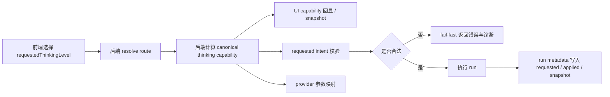

# 2026-04-04 Thinking 能力单一事实来源重构设计

## 文档定位

本文替换此前以“前后端各自维护 thinking 规则并尽量对齐”为核心的方案，改为以**后端运行时 resolved route** 为锚点，统一产出 **canonical thinking capability**，并让前端聊天 UI 只消费该结果，不再把本地规则当作能力真相。

本轮目标不是继续扩充前端推断规则，而是正本清源地解决以下问题：

1. thinking 能力在前后端存在分叉。
2. `xhigh -> auto` 一类串错由多处推断与映射造成，难以定位。
3. 用户选择 `off` 时，运行中仍可能出现 reasoning 展示。
4. UI 展示的能力面与运行时真实能力不一致。
5. unknown 路由没有受控降级路径，既不安全也不透明。

## 设计目标

1. 把 thinking 能力的单一事实来源锚定在后端运行时。
2. 后端基于 **resolved route** 统一计算 canonical capability，并用同一结果驱动：
   - 聊天 UI 能力回显
   - requested thinking intent 校验
   - provider 参数映射
   - fail-fast
3. 设置页中的 thinking 声明降级为 **override 输入**，仅作为 unknown 路由的候选信息。
4. unknown 路由采用“受控 override”策略：可展示、可诊断、不可突破真实适配边界。
5. 每次 run 都带上 `requestedThinkingLevel`、`appliedThinkingLevel`、`thinkingCapabilitySnapshot`。
6. 前端 run state 消费后端元数据，并在 `appliedThinkingLevel = off` 时防御性抑制 reasoning 卡片。
7. 增加结构化日志，保证 capability 来源、判定链、映射结果与失败原因可追踪。
8. 分阶段迁移，最终移除前端把本地 thinking 规则当聊天真相的职责。

## 非目标

本轮不做以下事项：

- 新增 provider 原生参数透传 UI。
- 让设置页 override 直接突破后端真实适配边界。
- 为 unknown 路由做乐观下发或静默容错发送。
- 新增大段解释型 UI 文案。
- 围绕本任务以外的通用配置中心、消息列表或工具系统重构。

## 术语

| 术语 | 含义 |
| --- | --- |
| resolved route | 后端经过配置、默认值与路由解析后得到的实际 provider / endpoint / model 路由。 |
| canonical thinking capability | 后端基于 resolved route 产出的 thinking 能力权威快照。 |
| verified | 后端已知并可真实适配的路由结论。 |
| unknown | 后端无法从内置适配矩阵中确认真实支持性的路由结论。 |
| override | 设置页提供的候选 thinking 声明，仅供 unknown 路由参考。 |
| requestedThinkingLevel | 用户本次发送意图选择的 thinking intent。 |
| appliedThinkingLevel | 后端实际接受并用于 provider 参数映射的 thinking intent。 |
| capability snapshot | 本次 run 固化保存的 canonical capability。 |

## 核心原则

### 1. 单一事实来源在后端

thinking 能力真相只由后端运行时计算。

前端聊天页不得再将本地 `resolveThinkingCapability()` 的输出作为聊天能力真相。前端可以保留最小遗留工具函数用于：

- 设置页编辑与表单归一化。
- 测试夹具。
- 与后端契约兼容的输入校验。

但这些逻辑都不再直接驱动聊天页“当前模型支持哪些 thinking 档位”的判断。

### 2. 同一份 canonical 结果贯穿整条发送链路

每次发送开始时，后端必须先完成以下步骤：

1. 解析 resolved route。
2. 结合 override 输入，计算 canonical capability。
3. 用该 capability 校验 requested intent。
4. 基于同一 capability 计算 applied intent 与 provider 参数映射。
5. 将 capability snapshot 与 requested/applied 元数据写入 run 生命周期。

禁止出现“UI 用一套判断，发送时再用另一套判断”的双轨制。

### 3. override 只能收敛 unknown，不能突破 verified 边界

设置页 override 的职责从“前端模型能力声明”降级为“unknown 路由的候选输入”：

- 对 verified-supported 路由，override 不能扩大或缩小后端已验证支持集。
- 对 verified-unsupported 路由，override 不能强行改成支持。
- 只有对 unknown 路由，override 才能把候选档位带入 canonical capability，并明确标记来源为 override。
- 即使 unknown + override 成立，真正发送时仍由后端统一校验与 fail-fast。

## Canonical Capability 契约

### 状态枚举

canonical capability 至少包含如下状态：

- `verified-supported`
- `verified-unsupported`
- `unknown-without-override`
- `unknown-with-override`

同时保留来源字段，便于 UI 与日志低成本消费：

- `verified`
- `override`
- `unknown`

### 建议数据结构

```ts
export type CanonicalThinkingCapabilityStatus =
  | 'verified-supported'
  | 'verified-unsupported'
  | 'unknown-without-override'
  | 'unknown-with-override'

export type CanonicalThinkingCapabilitySource = 'verified' | 'override' | 'unknown'

export interface CanonicalThinkingCapability {
  status: CanonicalThinkingCapabilityStatus
  source: CanonicalThinkingCapabilitySource
  supported: boolean
  supportedLevels: ThinkingLevelIntent[]
  defaultLevel: ThinkingLevelIntent | null
  reasonCode: string
  providerHint?: string | null
  routeFingerprint: {
    providerProfileId: string
    provider: string
    endpointType: string
    baseUrl: string
    modelId: string
  }
  overrideLevels?: ThinkingLevelIntent[]
}
```

### 字段语义

- `supported`
  - 只表达“当前 UI 是否可展示 thinking 选择”。
- `supportedLevels`
  - canonical 的最终允许集合；若支持则必须包含统一关闭项 `off`。
- `defaultLevel`
  - 当前 capability 下前端默认建议值。
- `reasonCode`
  - 面向诊断的稳定原因码，例如 `zai_glm_verified_supported`、`route_not_verified`、`override_levels_applied`、`override_ignored_verified_unsupported`。
- `providerHint`
  - 面向调试的人类可读提示，例如 `zai-glm-openai-compatible`。
- `overrideLevels`
  - 仅在 unknown + override 场景下用于回显候选来源，不作为突破真实边界的证据。

## 后端单一事实来源设计

### 输入

后端 capability resolver 的输入应只包含：

1. resolved route
2. 可选 override 声明

其中 override 输入来自设置页模型声明的最小必要归一化结果，例如：

```ts
interface ThinkingCapabilityOverrideInput {
  supported: boolean
  levels?: ThinkingLevelIntent[]
  defaultLevel?: ThinkingLevelIntent | null
}
```

### 输出

后端输出 canonical capability，并作为：

- 发送前校验依据
- provider 参数映射依据
- 对前端回显的聊天能力依据
- run 元数据快照

### 解析顺序

1. resolved route 命中已验证适配矩阵：返回 `verified-supported` 或 `verified-unsupported`。
2. resolved route 未命中已验证矩阵：进入 `unknown`。
3. 若 unknown 且存在合法 override 候选档位：返回 `unknown-with-override`。
4. 若 unknown 且无 override：返回 `unknown-without-override`。

### 已验证路由的约束

已验证路由由后端适配层维护真实矩阵，至少定义：

- 是否支持 thinking。
- 真实支持的档位集合。
- 默认档位。
- provider 参数映射规则。
- 稳定 reason code / provider hint。

前端不再复制该矩阵来驱动聊天 UI。

## Unknown + Override 策略

### 设计结论

对 unknown 路由不再直接视为“前端不支持且后端静默 no-op”，而是改为“受控 override”：

1. 后端允许返回 unknown 状态。
2. 设置页若提供 override 候选档位，后端可把这些候选档位纳入 canonical capability。
3. UI 在展示这些候选档位时，必须能识别其来源为 override。
4. 真正发送时仍由后端统一校验与 fail-fast。

### 行为矩阵

| 场景 | canonical status | UI 展示 | 发送校验 |
| --- | --- | --- | --- |
| verified-supported | `verified-supported` | 展示真实支持集 | 按真实支持集校验 |
| verified-unsupported | `verified-unsupported` | 不展示 thinking 档位 | 非 `off` / `null` 直接 fail-fast |
| unknown + 无 override | `unknown-without-override` | 不展示 thinking 档位 | 非 `off` / `null` 直接 fail-fast |
| unknown + 有 override | `unknown-with-override` | 展示 override 候选档位，并标记来源 | 仍由后端统一校验；无法映射时 fail-fast |

### unknown + override 的边界

- 可以让聊天页在 unknown 路由下呈现候选档位。
- 不代表 provider 一定真实支持。
- 不允许静默把非法 requested intent 改写成 `auto`、`off` 或其他档位继续发送。
- 一旦 requested intent 不被 canonical capability 允许，必须直接失败。

## 请求链路、校验与 fail-fast

### 统一链路

每次消息发送必须遵循以下顺序：



### 校验规则

1. `requestedThinkingLevel = null`：视为未显式请求。
2. `requestedThinkingLevel = off`：合法，`appliedThinkingLevel = off`，并应映射为“显式关闭”或“不下发 reasoning 参数”的 provider 行为。
3. `requestedThinkingLevel` 为正向档位时：
   - 必须属于 canonical `supportedLevels`；否则直接 fail-fast。
4. 禁止把不支持的 `xhigh` 静默降为 `auto`。
5. 禁止 unknown 路由在无法确认真实支持时带着非法档位继续发送。

### fail-fast 要求

若用户选择的 intent 不在 canonical capability 的允许集内：

- 直接终止本次发送。
- 返回明确错误码与必要诊断。
- 不继续执行 agent stream。
- 不做 silent fallback。

建议错误码至少包括：

- `thinking_not_supported_for_route`
- `thinking_level_not_allowed`
- `thinking_capability_resolution_failed`

## Provider 参数映射

provider 参数映射必须消费 canonical capability 与 appliedThinkingLevel，而不是再次独立推断。

映射层输出至少包含：

- `appliedThinkingLevel`
- `providerParameters` / `modelSettings`
- `mappingReasonCode`
- `providerHint`

当 `appliedThinkingLevel = off` 时，映射层必须显式表达“关闭”或“不要下发 reasoning 参数”的结果，避免后续链路因为默认值漏掉而触发 reasoning。

## Run 元数据与前端消费

### 每次 run 必带元数据

本次 run 的元数据必须至少包含：

```ts
interface RuntimeThinkingRunMetadata {
  requestedThinkingLevel: ThinkingLevelIntent | null
  appliedThinkingLevel: ThinkingLevelIntent | null
  thinkingCapabilitySnapshot: CanonicalThinkingCapability
}
```

### 传递位置

最小可用方案如下：

1. 发送前若聊天 UI 需要展示能力面，前端通过新增的最小后端契约获取 canonical capability。
2. run 开始时，后端在 `run_started` 事件中回传本次 run 的 thinking 元数据。
3. terminal 事件与 diagnostic 事件在需要时复用同一 snapshot 或引用其中的 `reasonCode`。

### 前端状态收敛

前端聊天相关状态只保留：

- 用户偏好（当前想要的 requested intent）
- 本次 run 的 `requestedThinkingLevel`
- 本次 run 的 `appliedThinkingLevel`
- 本次 run 的 `thinkingCapabilitySnapshot`

前端不再独立维护一份“模型真实 thinking 能力真相”。

## 前端 UI / 状态迁移

### 聊天浮层

聊天浮层只消费后端 canonical capability：

- `supported = false`：不展开 thinking 选项。
- `supported = true`：展示 `supportedLevels`。
- `source = override`：以低噪音方式标记候选来源为 override。

不增加大段解释文案，只在必要处做轻量来源提示。

### 设置页

设置页中的 thinking 声明继续存在，但职责变为：

- 作为 override 输入来源。
- 供后端 unknown 路由参考。
- 供测试与配置编辑使用。

设置页不再被视为聊天页的能力真相来源。

### 前端本地规则的迁移策略

分三步迁移：

1. **第一步**：引入后端 canonical capability 契约，聊天页开始消费后端结果。
2. **第二步**：移除前端本地 thinking 规则作为聊天真相的职责，仅保留设置页输入与测试辅助所需最小遗留。
3. **第三步**：清理旧分叉逻辑、旧命名与无效兜底。

## Reasoning 抑制

### 背景

即使前端已选择 `off`，仍可能因为 provider 或中间链路异常返回 reasoning delta。为避免 UI 与本次 applied intent 不一致，前端需要做防御性抑制。

### 规则

- run state 收到 `run_started` 后，保存 `appliedThinkingLevel`。
- 若 `appliedThinkingLevel = off`，则即使流中收到 reasoning delta：
  - reducer / view-model 也不得渲染 reasoning 卡片；
  - 同时写入结构化调试日志，标记 reasoning suppression 已触发。

该抑制是**展示层防御**，不替代后端映射与校验责任。

## 后端契约建议

### 聊天页发送前能力查询

若聊天 UI 在发送前需要 capability 回显，应新增最小必要后端契约，例如：

```ts
method: 'thinking/capability/get'
body: {
  sessionId: string
  modelRoute: RuntimeModelRoute
}
response: {
  ok: true
  capability: CanonicalThinkingCapability
}
```

实现要求：

- 后端内部必须复用与发送链路同一套 capability resolver。
- 不能在查询接口里复制第二套规则。
- 返回结果应与同一路由在真正发送时看到的 snapshot 保持一致，除非运行时配置发生变化。

### 运行事件扩展

`run_started` 至少补充：

```ts
payload: {
  assistantMessageId: string
  requestedThinkingLevel: ThinkingLevelIntent | null
  appliedThinkingLevel: ThinkingLevelIntent | null
  thinkingCapabilitySnapshot: CanonicalThinkingCapability
}
```

这样前端可以在收到任意 reasoning delta 前就确定本次 run 的真实能力与应用结果。

## 日志与诊断

必须新增结构化日志，至少覆盖以下维度：

1. resolved route 对应的 canonical capability。
2. capability 来源与状态：`verified` / `override` / `unknown`。
3. `requestedThinkingLevel`。
4. `appliedThinkingLevel`。
5. provider 参数映射结果。
6. fail-fast 原因、错误码与 reason code。
7. reasoning suppression 是否触发。

### 建议日志点

- `thinking.capability_resolved`
- `thinking.request_validated`
- `thinking.provider_mapping_resolved`
- `thinking.fail_fast`
- `thinking.run_metadata_attached`
- `thinking.reasoning_suppressed`

### 用户可见性

- 普通用户：只看到必要错误信息。
- 调试模式：可看到 capability 来源、判定链、reason code、provider hint 等诊断字段。

## 兼容与迁移

### 兼容要求

- 保持现有请求级 `thinkingLevelIntent` 值域不变。
- 设置页已有 thinking 声明数据结构尽量兼容读取。
- 旧会话与旧 run 在没有 thinking metadata 时按空值安全处理。
- reasoning 事件协议保持增量兼容，新增字段优先挂在 run metadata，而不是破坏现有 delta 结构。

### 清理目标

最终需要清理：

- 前端把本地 `resolveThinkingCapability()` 当聊天真相的调用点。
- 与后端 canonical capability 冲突的前端 built-in thinking 规则分支。
- 把不支持档位静默改写或降级继续发送的历史行为。

## 测试关注点

### 后端

1. verified-supported 路由能产出正确 canonical capability。
2. verified-unsupported 路由会拒绝非 `off` 请求。
3. unknown + 无 override 返回 `unknown-without-override`。
4. unknown + override 返回 `unknown-with-override`，并保留 override 候选信息。
5. 非法 requested intent 触发 fail-fast，不进入执行流。
6. `requestedThinkingLevel` / `appliedThinkingLevel` / `thinkingCapabilitySnapshot` 能进入 run 元数据。
7. provider 参数映射只消费 canonical capability，不再重复推断。
8. 结构化日志包含 capability、来源、映射与失败原因。

### 前端

1. 聊天浮层只展示后端 canonical capability 提供的档位。
2. unknown + override 时，UI 能展示候选档位并标记来源。
3. 前端本地 route 切换不再自行推断 thinking 真相。
4. `run_started` thinking metadata 能进入 run state。
5. `appliedThinkingLevel = off` 时 reasoning delta 被防御性抑制。
6. fail-fast 错误能在 UI 中保持低噪音但可诊断的反馈。
7. 前后端契约字段新增后，旧数据路径仍可空值安全运行。

## 风险与缓解

### 风险一：查询 capability 与发送 capability 不一致

若发送前查询与发送时解析走了不同代码路径，仍会重新引入双轨问题。

缓解：统一抽出后端 capability resolver，查询接口与发送链路必须复用同一实现。

### 风险二：override 被误当成 verified 真相

若 UI 不区分来源，用户会误以为 unknown + override 等于已验证支持。

缓解：canonical capability 明确暴露 `status` 与 `source`，UI 用低噪音方式标记 override 来源。

### 风险三：off 仍展示 reasoning

若运行事件先到、run metadata 后到，可能短暂闪出 reasoning 卡片。

缓解：在 `run_started` 中尽早下发 thinking metadata；前端 reducer / view-model 对 `appliedThinkingLevel = off` 做硬性抑制。

### 风险四：历史前端规则残留造成行为漂移

缓解：分阶段迁移后清理旧分叉逻辑，并用契约测试覆盖聊天页只消费后端 canonical capability 的关键调用点。

## 结论

本次重构的核心不是再扩充一轮 thinking 规则，而是把 thinking 能力的**真相、校验、映射、元数据与展示**统一收束到后端运行时的 canonical capability 上。

最终系统边界如下：

- 后端基于 resolved route 产出 canonical thinking capability。
- 前端聊天 UI 只消费 canonical capability，不再自己猜。
- 设置页 thinking 声明降级为 override 输入，仅在 unknown 路由下受控生效。
- requested / applied / capability snapshot 贯穿每次 run。
- 非法 thinking intent 统一 fail-fast，不再 silent fallback。
- `appliedThinkingLevel = off` 时前端防御性抑制 reasoning 展示。
- 所有关键判定点都有结构化日志可供诊断。
