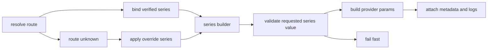

# 2026-04-04 Thinking 系列优先彻底重构总设计

## 文档定位与路线纠偏

- 本文重写旧版总设计。
- 旧版以“单一事实来源 + generic control kind + structured selection”为骨架，虽然解决了部分前后端分叉，但已偏离 2026-04-06 两份文档确认的产品路线。
- 偏离点不是实现细节误差，而是领域模型选错：旧路线把产品系列压扁成 generic kind 和离散 intent，再由兼容层补洞。
- 本文是后续彻底重构的唯一总设计。旧兼容路线停止延续，不再以 runtime shim 保活。

### 本文替代的旧核心假设

1. generic control kind 可以作为统一产品模型。
2. structured selection 可以长期建立在 generic kind 之上。
3. `ThinkingLevelIntent` 可以继续作为主协议中心。
4. verified / unknown 可以继续挂在旧 intent 兼容链路上。
5. 历史兼容可以继续通过 `thinkingLevelIntent` 与旧 run metadata 字段维持。

### 新核心结论

1. 产品系列是唯一一等领域对象。
2. 单一事实来源仍在后端，但真相对象改为“系列化 capability snapshot”。
3. verified route 直接绑定唯一系列。
4. unknown + override 直接绑定 override 系列。
5. provider 只认系列和值，不认 generic kind。
6. 不可映射一律 fail-fast。
7. 日志、错误、run metadata 都说系列语言，不再说 generic kind 语言。

## 旧路线为何失真

| 旧路线做法 | 失真原因 | 直接后果 |
| --- | --- | --- |
| 用 `fixed` / `binary` / `off-auto` / `discrete` / `budget` 组织产品 | 这是交互模式，不是产品系列 | OpenAI、Anthropic、Gemini 被错误压平 |
| 用 `ThinkingLevelIntent = off / auto / low / medium / high / xhigh` 驱动请求与运行时 | 这是旧离散兼容轴，不覆盖 `disabled`、`dynamic`、`max`、`budget_tokens`、固定推理 | 多家 provider 真实代码被二次翻译 |
| 让 structured selection 继续围绕 generic kind 演化 | selection 不再直接表达产品真实值 | provider 映射和 UI 回显都要额外翻译 |
| 让 verified / unknown 继续回落到旧 intent 入口 | 新模型表面存在，旧兼容链仍然掌权 | 路线漂移、silent fallback、调试困难 |
| run metadata 与日志继续记录旧离散 intent | 丢失系列、真实代码、来源、映射器信息 | 审计无法说明到底按哪个系列发送 |

### 纠偏原则

- 不再以语义桶组织产品。
- 不再以旧离散 intent 组织协议。
- 不再为历史前端或旧 run 留运行时 shim。
- 允许保留底层资产，但必须把领域边界改回系列优先。

## 新的一等产品系列模型

### 领域原则

1. 系列是 provider 参数能力的最小完整单位。
2. 一个 verified route 在任一时刻只能解析到一个系列。
3. **`OpenAI 6 档总超集` 与 `OpenAI 4 档子集` 是两个不同系列，不是同系列的模型子集。**
4. 同一种 UI 形态不代表同一个系列。
5. 同一种 provider 参数名也不代表同一个系列。
6. 一个系列必须同时定义：
   - `seriesId`
   - 中文显示名
   - 真实值集合或值 schema
   - 默认值
   - UI 编辑器
   - provider 参数构造器
   - 日志显示格式
   - fail-fast 校验规则

### 已接受系列清单

| 系列 ID | 系列名 | 值模型 | 备注 |
| --- | --- | --- | --- |
| `openai-6-level-superset-v1` | OpenAI 6 档总超集 | `none / minimal / low / medium / high / xhigh` | 最高离散超集 |
| `openai-4-level-minimal-v1` | OpenAI 4 档 minimal 系 | `minimal / low / medium / high` | 与 6 档总超集不同系列 |
| `openai-4-level-none-v1` | OpenAI 4 档 none 系 | `none / low / medium / high` | 与 minimal 系不同系列 |
| `openai-3-level-classic-v1` | OpenAI 3 档 classic 系 | `low / medium / high` | 老 reasoning 子集 |
| `openai-1-level-high-v1` | OpenAI 单档 high 系 | `high` | 例如只允许高强度的模型 |
| `anthropic-adaptive-4-v1` | Anthropic Adaptive 4 档 | `disabled / low / medium / high` | Adaptive 系列 |
| `anthropic-adaptive-max-v1` | Anthropic Adaptive Max 5 态 | `disabled / low / medium / high / max` | 含 `max` 的 Adaptive 系列 |
| `anthropic-budget-v1` | Anthropic Budget | `off / budget_tokens` | 预算型系列 |
| `gemini-3-level-v1` | Gemini 3 离散系列 | `minimal / low / medium / high` | 离散型，不等于 OpenAI 4 档 |
| `gemini-2.5-budget-v1` | Gemini 2.5 Budget | `off / dynamic / budget_tokens` | 系列自带 `dynamic` 语义 |
| `xai-low-high-v1` | xAI 两档系列 | `low / high` | 两档离散 |
| `mistral-none-high-v1` | Mistral 两档系列 | `none / high` | 两档离散 |
| `qwen-thinking-switch-v1` | Qwen Thinking 开关 | `false / true` | 纯开关 |
| `kimi-k2.5-switch-v1` | Kimi K2.5 开关 | `disabled / enabled` | 纯开关 |
| `deepseek-fixed-reasoning-v1` | DeepSeek 固定推理 | `fixed` | 固定推理，不可调 |
| `magistral-fixed-reasoning-v1` | Magistral 固定推理 | `fixed` | 固定推理，不可调 |
| `kimi-k2-thinking-fixed-v1` | Kimi K2 Thinking 固定推理 | `fixed` | 固定推理，不可调 |

### 系列值表示

统一抽象不是 generic kind，而是 `系列 + 当前系列值`。

```ts
type RuntimeThinkingSeriesValue =
  | {
      valueType: 'code'
      code: string
      labelZh: string
    }
  | {
      valueType: 'budget'
      mode: 'off' | 'dynamic' | 'budget'
      budgetTokens: number | null
      labelZh: string
    }
  | {
      valueType: 'fixed'
      code: 'fixed'
      labelZh: string
    }

interface RuntimeThinkingSeriesSelection {
  series: ThinkingSeriesId
  value: RuntimeThinkingSeriesValue
}
```

设计要求：
- 离散系列直接使用真实代码，不再映射回旧 `off / auto / low / medium / high / xhigh` 轴。
- 预算系列保留自身模式和值 schema，不拆回 generic `budget kind`。
- 固定推理系列仍是系列，只是无可编辑值集合。

### 模块边界

| 模块 | 责任 | 禁止事项 |
| --- | --- | --- |
| 系列注册表 | 声明系列 ID、值 schema、默认值、UI 编辑器与日志格式 | 不做 provider 路由解析 |
| route -> series 解析器 | 把 verified route 绑定到唯一系列 | 不做旧 intent 兼容回退 |
| override 系列声明 | 为 unknown route 提供候选系列模板 | 不得突破 verified 结果 |
| series builder 注册表 | `series -> provider 参数构造器` | 不接受 generic kind 输入 |
| 前端系列 UI 渲染层 | 基于 capability 中的系列信息渲染动态内容区 | 不本地推断模型真实系列 |

## 统一协议与运行时模型

### 请求模型

新请求协议只接受系列化选择，不再接受旧离散 intent。

```ts
interface RuntimeMessageExecutionPolicy {
  modelRoute: RuntimeModelRoute
  thinkingSeriesSelection: RuntimeThinkingSeriesSelection | null
  thinkingSeriesOverride: RuntimeThinkingSeriesDeclaration | null
  enabledTools: string[]
  debugModeEnabled?: boolean
  requestOptions: Record<string, unknown>
}
```

约束：
- 删除旧 `thinkingLevelIntent` 入口。
- 删除“根据 `thinkingLevelIntent` 自动补生成 structured selection”的行为。
- 删除“无 selection 时按旧离散 default 补齐”的兼容分支。

### 能力快照模型

能力快照围绕系列建模，而不是围绕旧 intent 建模。

```ts
interface RuntimeThinkingCapabilitySnapshot {
  status: 'verified-supported' | 'verified-unsupported' | 'unknown-without-override' | 'unknown-with-override'
  source: 'verified' | 'override' | 'unknown'
  series: ThinkingSeriesId | null
  seriesLabelZh: string | null
  editorType: 'discrete' | 'budget' | 'fixed' | null
  allowedValues: RuntimeThinkingSeriesValue[]
  defaultValue: RuntimeThinkingSeriesValue | null
  providerBuilderKey: string | null
  reasonCode: string
  routeFingerprint: {
    providerProfileId: string
    provider: string
    endpointType: string
    baseUrl: string
    modelId: string
  }
}
```

约束：
- verified route 必须返回唯一 `series`。
- unknown + override 必须返回 override 的 `series`。
- unknown 且无 override 时，`series = null`，`allowedValues = []`。
- 不再输出以 `supportedLevels` 为中心的能力快照。

### run metadata

run metadata 只记录系列化请求和值。

```ts
interface RuntimeThinkingRunMetadata {
  requestedThinkingSeriesSelection: RuntimeThinkingSeriesSelection | null
  appliedThinkingSeriesSelection: RuntimeThinkingSeriesSelection | null
  thinkingCapabilitySnapshot: RuntimeThinkingCapabilitySnapshot
  reasoningSuppressionReason: string | null
}
```

约束：
- 删除 `requestedThinkingLevel`。
- 删除 `appliedThinkingLevel`。
- 删除旧 run metadata 中为了兼容 intent 视图而保留的离散字段。
- 如需决策详情，使用新的 `thinkingSeriesDecision` 结构，不再沿用旧 `thinkingSelectionResult` 语义壳。

### 错误模型

错误信息必须直接点名系列和值。

建议错误码：
- `thinking_series_not_supported_for_route`
- `thinking_series_value_not_allowed`
- `thinking_series_builder_missing`
- `thinking_series_mapping_failed`
- `thinking_series_unknown_without_override`

错误内容至少包含：
- route 指纹
- requested series
- requested 真实值
- 当前 resolved series
- 原因码
- 是否 verified / override

## 设置页交互模型

### 数据模型

设置页编辑的是“系列模板 / override 系列”，不是 generic kind。

```ts
interface ThinkingSeriesOverrideDeclaration {
  series: ThinkingSeriesId
  template: {
    defaultValue: RuntimeThinkingSeriesValue | null
    allowedValues?: RuntimeThinkingSeriesValue[]
    budget?: {
      minTokens: number
      maxTokens: number
      stepTokens: number
      anchorTokens: number[]
    }
  }
  source: 'settings-model-declaration'
}
```

### UI 结构

设置页统一使用：
1. 系列下拉框
2. 当前系列的动态内容区

动态内容区规则：
- 离散系列：展示中文昵称 + 真实代码。
- 预算系列：展示独占非线性滑块。
- 固定系列：展示只读固定说明，不再伪装成可调离散项。

### 交互原则

- 选择系列后，只加载该系列专属编辑器。
- 不再出现 `fixed / binary / off-auto / discrete / budget` 这类 generic 入口。
- 不再在设置页里编辑 `ThinkingLevelIntent`。
- 设置页写出的内容只是 override 模板，不是聊天页真相。

### 建议保留的底层资产

- 现有“下拉框 + 动态内容区”的外层布局。
- 预算滑块的非线性分段与吸附机制。
- 系列化表单归一化与存储入口。

### 必须回退或重做的部分

- 所有 generic kind 驱动的系列选项生成逻辑。
- 由正向 `ThinkingLevelIntent` 列表推导系列的表单逻辑。
- 以 `supportedLevels` 为中心的设置页默认值编辑方式。

## 聊天页交互模型

### 数据来源

聊天灯泡浮层只消费后端返回的系列能力快照。
前端不得再本地解析“当前模型属于什么系列”。

### UI 结构

聊天页也统一采用：
1. 系列下拉框
2. 动态内容区

但其数据来源与设置页不同：
- 设置页：编辑 override 系列模板。
- 聊天页：读取后端 resolved capability。

### 展示规则

- verified route：下拉框只展示当前唯一系列。
- unknown + override：下拉框只展示 override 系列，并标记来源为 override。
- unknown 且无 override：下拉框禁用，动态内容区不渲染系列编辑器。
- 离散系列继续显示中文昵称 + 真实代码。
- 预算系列继续使用独占非线性滑块。
- 固定推理系列显示只读状态，不伪装成 `off / auto / low / high`。

### 草稿与发送模型

聊天草稿存的是当前系列值：

```ts
interface CopilotComposerDraft {
  thinkingSeriesSelection: RuntimeThinkingSeriesSelection | null
}
```

禁止事项：
- 不再保存全局 `thinkingLevelIntent` 草稿。
- 不再先用本地 generic capability 修正，再发给后端。
- 不再把不匹配的系列值静默改写成 `auto` 或其他离散档位。

## 后端 provider 映射、fail-fast 与日志诊断

### 运行时主链路



### provider 映射

后端映射的唯一入口是：

`series -> provider 参数构造器`

不是：
- `ThinkingLevelIntent -> provider 参数`
- `generic control kind -> provider 参数`
- `provider -> 再猜一次系列`

要求：
1. 每个 verified series 必须绑定一个明确的 builder key。
2. builder 输入是系列值原文，不是旧离散 intent。
3. builder 输出必须能表达真实 provider 参数：
   - 离散代码
   - budget tokens
   - disabled / dynamic / fixed 等原始语义
4. 相同 provider 下的不同系列，允许绑定不同 builder。

### verified / unknown 规则

- verified route：直接绑定唯一系列，并使用该系列 builder。
- unknown + override：直接绑定 override 系列；若该系列无 builder，立即 fail-fast。
- unknown + 无 override：拒绝任何正向 thinking 请求。
- 不可映射场景一律 fail-fast，不做 silent fallback。

### fail-fast 要求

以下场景必须立即失败：
1. requested series 与 resolved series 不一致。
2. requested value 不在当前系列允许集合内。
3. 当前系列没有 provider builder。
4. builder 无法把当前系列值转换为 provider 参数。
5. unknown + override 的系列值不合法。
6. fixed 系列被请求成可调值。

### 日志与诊断

日志统一使用系列语言，至少记录：
- resolved series id
- series 中文名
- requested value 中文昵称
- requested value 真实代码或 budget
- applied value 中文昵称
- applied value 真实代码或 budget
- source
- providerBuilderKey
- requested / applied 差异
- fail-fast 原因
- reasoning suppression 原因

建议日志点：
- `thinking.series_resolved`
- `thinking.series_request_validated`
- `thinking.series_builder_selected`
- `thinking.series_mapping_built`
- `thinking.series_fail_fast`
- `thinking.reasoning_suppressed`

## 旧链路删除清单

### 必删概念

| 删除项 | 删除原因 | 替代物 |
| --- | --- | --- |
| `ThinkingLevelIntent` 中心模型 | 旧离散轴不是统一真实模型 | `ThinkingSeriesId + RuntimeThinkingSeriesValue` |
| 旧 `thinkingLevelIntent` 协议入口 | 兼容入口会继续绑架运行时 | `thinkingSeriesSelection` |
| 旧 run metadata 兼容字段 | 继续暴露旧 intent 会迫使前端保留兼容渲染 | `requestedThinkingSeriesSelection` / `appliedThinkingSeriesSelection` |
| generic control kind | 只描述交互形态，不描述产品系列 | `series registry` 中的 series-specific editor |
| generic `supportedLevels` 语言 | 只适用于旧离散意图 | `allowedValues` |
| 旧 discrete selection compat 系列 | 只是旧 intent 的包壳 | 真实产品系列 |
| 旧 intent <-> structured selection shim | 运行时兼容层会继续制造双轨 | 直接传输系列化 selection |
| 所有 generic kind 驱动的产品交互模型 | 会继续把产品压扁成语义桶 | 系列下拉 + 系列专属动态区 |

### 建议保留的底层资产

- verified / unknown 路由分类框架
- route fingerprint 与 provenance 结构
- thinking capability query 入口的存在形态
- run metadata 事件投影机制
- 结构化日志基础设施
- 设置页与聊天页已有的动态区域容器
- 非线性滑块的交互实现资产

### 必须重做的资产

- capability snapshot schema
- request policy schema
- run metadata schema
- provider mapping dispatcher
- 前端 composer draft 中的 thinking 字段
- 聊天页 capability resolver
- 设置页系列编辑器的数据模型
- 全部围绕旧 intent 的测试夹具与断言

## 分阶段实施计划

### 阶段 1：定义系列注册表与新协议

输出：
- 固化 series registry
- 固化 `RuntimeThinkingSeriesValue`
- 固化 `RuntimeThinkingSeriesSelection`
- 固化新 capability snapshot 与 run metadata schema

删除：
- 新协议中的 `thinkingLevelIntent`
- 新协议中的 generic kind 输入

完成标准：
- 后端与前端共享同一套 series id 和值 schema
- OpenAI 各子集系列明确分开

### 阶段 2：重建后端 route -> series -> builder 链路

输出：
- verified route 绑定唯一系列
- unknown + override 绑定 override 系列
- `series -> builder` 映射表
- 新 fail-fast 错误模型
- 新日志字段

删除：
- 旧 intent 到 provider 参数的翻译链
- generic kind 到 provider 参数的翻译链
- legacy level fallback

完成标准：
- 不存在把非法值静默降级为 `auto`
- 不存在 builder 内再次猜系列

### 阶段 3：重建设置页

输出：
- 系列下拉框
- 系列专属动态内容区
- 离散系列昵称 + 真实代码展示
- 预算系列独占非线性滑块
- override 系列模板存储

删除：
- generic kind 选择器
- 旧离散 intent 默认值编辑器

完成标准：
- 设置页仅输出 override 系列模板
- 设置页不再声称自己定义模型真实能力

### 阶段 4：重建聊天页

输出：
- 后端 capability 驱动的系列下拉框
- 基于 capability 的动态内容区
- composer draft 的系列值模型
- series-based send payload

删除：
- 本地 capability 真相解析
- 旧 intent 草稿
- 发送前本地 silent fallback

完成标准：
- 聊天页只消费后端系列能力
- fixed 系列与 budget 系列都按真实模型展示

### 阶段 5：清除兼容层并完成回归

输出：
- 删除旧协议入口
- 删除旧 run metadata 字段
- 删除旧 logging labels
- 更新全量测试

删除：
- `ThinkingLevelIntent` 主链路
- `thinkingLevelIntent` 请求解析
- 旧 compatibility selection series
- generic kind 产品交互模型

完成标准：
- 运行时无旧离散 shim
- 日志、错误、UI、测试全部改用系列语言

## 风险与回归测试要求

### 主要风险

| 风险 | 说明 | 缓解 |
| --- | --- | --- |
| OpenAI 子系列误绑定 | 4 档与 6 档容易被错误视作同系列 | 为每个子系列单独建 route fixtures 与 builder tests |
| 预算系列语义丢失 | `dynamic`、`disabled`、`budget_tokens` 容易再次被压平 | budget 系列单独做 schema 与 round-trip tests |
| override 越权 | unknown + override 可能被错误拿去覆盖 verified route | verified route 上强制忽略 override 系列 |
| 前端残留旧 intent | UI 可能继续依赖旧草稿字段或旧展示逻辑 | 组件级测试禁止出现旧字段输入 |
| 日志失真 | 只记 series id 不记真实代码会再次失去可审计性 | 强制记录中文昵称与真实代码双字段 |
| suppression 漏记 | `off` 或 `disabled` 下仍出现 reasoning delta | 在 run metadata 和日志中同时记录 suppression reason |

### 必测后端

1. verified route 必须只产出一个系列。
2. unknown + override 必须产出 override 系列。
3. unknown + 无 override 必须拒绝正向请求。
4. requested series 与 resolved series 不一致时必须 fail-fast。
5. requested value 非法时必须 fail-fast。
6. builder 缺失时必须 fail-fast。
7. 日志必须同时记录系列、中文昵称、真实代码、requested / applied。
8. run metadata 不再出现旧 intent 兼容字段。

### 必测前端

1. 设置页只能编辑系列模板，不能编辑 generic kind。
2. 设置页离散系列必须同时展示中文昵称与真实代码。
3. 设置页预算系列必须使用独占非线性滑块。
4. 聊天页只消费后端 capability，不本地推断系列。
5. 聊天页 verified 场景只显示唯一系列。
6. 聊天页 unknown + override 场景必须显示 override 系列来源。
7. 聊天页 fixed 系列必须以只读方式展示。
8. 发送 payload 不再包含 `thinkingLevelIntent`。
9. run state 与消息投影不再依赖旧 run metadata 字段。
10. suppression 触发时 UI 不渲染 reasoning 卡片，并记录 suppression 原因。

## 结论

本次设计重写不是在旧方案上继续补兼容，而是把领域模型从 `generic control kind + ThinkingLevelIntent` 彻底切回 `产品系列 + 当前系列值`。

后续重构必须满足以下硬约束：
- 产品系列是唯一一等对象。
- verified route 直接绑定唯一系列。
- unknown + override 直接绑定 override 系列。
- provider 只认系列和值。
- 设置页与聊天页都使用系列下拉框 + 动态内容区。
- 离散项展示中文昵称 + 真实代码。
- 预算型使用独占非线性滑块。
- 不可映射一律 fail-fast。
- 日志与诊断全面改用系列语言。
- 旧离散链路与兼容字段整体删除，不再延寿。
