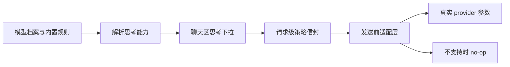

# 2026-04-04 思考参数调整机制设计

## 背景与约束

当前项目已经存在一个不能回避的现实：**部分模型与路由本身已经支持思考或 reasoning 参数**，但系统还没有形成统一的真实能力声明，也没有形成发送前适配层。结果是：

- 前端只能看到粗粒度的模型能力信息，不能稳定判断当前模型到底支不支持思考、支持哪些档位、默认应该落在哪一档。
- 后端虽然已有请求级策略信封与 `requestOptions` 通道，但没有一条专门面向思考参数的、可观测且可降级的适配边界。
- 如果直接在 GUI 上补一个看似高级的滑杆、预算条或 provider 原生参数输入框，很容易把不存在的能力包装成存在的体验，最终形成伪 UI。

本设计补的不是一个视觉控件，而是一套**真实能力声明 + 请求级离散意图 + 发送前适配**机制。目标是让聊天区、模型设置、请求构造和 provider 下发四段链路表达同一件事，并且在不支持时稳定回退为 no-op。

本设计同时受 Cherry Studio 的思路启发：它证明了思考控制应该是**模型感知、请求感知、能力感知**的问题，而不是全局开关问题。但当前项目不会照搬 provider 原生控制，而是选择更保守的跨 provider 统一层。原因有三点：

1. 当前项目的聊天主路径已经是跨 provider 模型目录，而不是单一 provider 主线。
2. 不同 provider 的 reasoning 参数语义、参数名、取值域并不一致，不能把原生字段直接暴露成统一产品语义。
3. 首版要优先保证兼容、降级和可验证性，而不是追求表面上的高度自由。

因此，本方案采用以下硬约束：

- 采用 **离散档位能力矩阵 + 内置规则识别 + 模型设置手动覆盖**。
- 不做假滑杆、假预算、假透传。
- 不支持的模型只保留一个禁用态“思考”入口，并配极短提示“当前模型不支持”。
- 聊天中的思考选择是**请求级偏好**，不进入公共全局配置。
- 真实参数下发只能发生在发送前适配层确认可映射时；否则必须静默退化，不影响正常聊天。

## 目标与非目标

### 目标

1. 在模型档案层引入统一的“思考能力声明”语义，用来表达支持性、支持集和默认档位。
2. 允许设置页对模型能力做手动覆盖；未覆盖时，系统按 provider 或 model 的内置规则推断。
3. 在聊天参数区提供一个紧凑、低噪音的“思考”下拉，其选项严格来自当前模型支持集。
4. 把聊天区选择结果作为请求级策略信封的一部分传给后端，而不是放进 config-center 公共字段。
5. 在后端新增最小必要的发送前适配边界，把统一离散档位意图翻译为真实 provider 参数。
6. 保证未知路由、空字段、旧会话、旧模型档案都能继续工作，不破坏现有聊天主链与兼容壳。

### 非目标

首版明确不做以下事项：

- 思考内容展示。
- 思维链可视化。
- reasoning token 面板。
- 多参数自由组合器。
- 假预算或连续滑杆控制。
- provider 原生参数公开透传。
- 对所有未知路由做乐观下发。
- 把思考偏好做成公共全局设置。

## 术语与数据模型

### 术语

| 术语 | 含义 |
| --- | --- |
| 思考能力声明 | 模型档案层的一段事实描述，只表达是否支持、支持哪些离散档位、默认档位。 |
| 内置规则 | 系统内置的 provider、endpointType、modelId 识别规则，用于在模型未手动配置时推断思考能力。 |
| 手动覆盖 | 用户在模型设置中显式写入的能力声明。显式配置优先于内置规则。 |
| 思考离散档位意图 | 统一的请求级值域：`off | auto | low | medium | high | max`。 |
| 发送前适配层 | 位于消息请求进入 agent 前的一段转换边界，用于把统一意图翻译为真实 provider 参数，或在不支持时退化为 no-op。 |

### 数据模型原则

当前 `frontend-copilot/src/workbench/types.ts` 中的 `ProviderModelProfile` 已经承载模型档案语义，但现有 `capabilities` 仅能表达粗粒度标签，例如 `reasoning`。这个标签可以继续保留为展示型能力摘要，但它不足以承担思考参数控制，因为它无法回答三个关键问题：

1. 当前模型是否真的支持思考参数。
2. 如果支持，支持哪些离散档位。
3. 默认应该回落到哪个档位。

因此，需要在 `ProviderModelProfile` 语义上新增一段**可选的思考能力声明**。建议的数据形态如下：

```ts
type ThinkingLevelIntent = 'off' | 'auto' | 'low' | 'medium' | 'high' | 'max'

interface ThinkingCapabilityDeclaration {
  supported: boolean
  levels?: Array<Exclude<ThinkingLevelIntent, 'off'>>
  defaultLevel?: ThinkingLevelIntent
}
```

约束如下：

- 字段必须是可选的；缺失表示“未手动声明，交给内置规则推断”。
- `supported = false` 表示显式声明不支持，此时 `levels` 和 `defaultLevel` 应为空。
- `supported = true` 时，`levels` 只保存正向思考档位，不保存 `off`；`off` 是统一 GUI 层自动补出的关闭项。
- `defaultLevel` 允许为 `off` 或 `levels` 中的某一项。
- 所有新字段都必须空值安全，旧模型档案不因缺少新字段而报错。

为了避免每一处调用点都重新判断优先级，系统内部还需要一个“解析后的能力视图”概念：

```ts
interface ResolvedThinkingCapability {
  supported: boolean
  levels: ThinkingLevelIntent[]
  defaultLevel: ThinkingLevelIntent | null
}
```

其中：

- 若支持，则 `levels` 实际表现为 `['off', ...声明档位]`。
- 若不支持，则 `levels = []`，`defaultLevel = null`。
- 解析结果来自“手动覆盖优先，否则使用内置规则，否则视为不支持”。

## 能力声明机制

### 设计原则

思考能力声明只表达**事实**，不表达 provider 参数细节。

也就是说，模型档案层只负责回答“这个模型能不能选、能选什么、默认落哪一档”，不负责回答“最终请求里应该写哪个原生字段”。后者属于发送前适配层的职责。

这样拆分有三个直接好处：

1. 前端 GUI 不被 provider 参数命名污染。
2. 设置页持久化的数据保持稳定，不跟着 provider 参数格式变化而抖动。
3. 后端可以在未知路由上安全 no-op，而不把 provider 差异暴露到用户配置面。

### 解析优先级

思考能力解析结果统一按下面的优先级生成：

1. **显式手动覆盖优先**。
2. **未配置时，按内置规则推断**。
3. **规则无法确认时，视为不支持**。

可以用下表表示：

| 模型档案中的声明 | 内置规则结果 | 最终结果 |
| --- | --- | --- |
| 显式声明支持 | 任意 | 使用显式声明 |
| 显式声明不支持 | 任意 | 使用显式声明 |
| 未配置 | 可识别支持集 | 使用内置规则 |
| 未配置 | 无法识别 | 视为不支持 |

### 为什么选择离散档位矩阵

本项目选择离散档位矩阵，而不是自由滑杆或 provider 原生参数直出，核心原因如下：

#### 1. 自由滑杆会制造不存在的精度

很多 provider 的思考控制不是连续区间，而是离散枚举或少量档位映射。如果前端提供一个连续滑杆，用户会自然理解成“每个刻度都对应真实能力”，这和当前实际能力不符。

#### 2. 假预算会制造错误心智模型

如果系统没有对 reasoning budget、token 配额或深度预算建立真实映射，就不应该补一个预算输入框。否则用户会误以为这类预算一定会真实生效。

#### 3. provider 原生参数直出会破坏跨 provider 一致性

直接把不同 provider 的原生字段暴露给聊天区，会让 UI、持久化和请求链路都绑定到 provider 细节上。最终会出现同一个“思考”入口在不同模型上完全不同、不可比较、不可回退的情况。

离散档位矩阵的作用，是给 GUI 和请求链路一个统一、可验证、可退化的上层语义，再由发送前适配层做 provider 差异翻译。

## GUI 方案

### 聊天参数区

在 `frontend-copilot/src/features/copilot/CopilotComposer.tsx` 的聊天参数区新增一个紧凑下拉“思考”。这个控件遵循以下规则：

1. 选项严格来自当前模型的解析后支持集。
2. 如果模型支持，始终包含 `无`，再拼接支持档位。
3. 典型展示形态只允许出现以下真实组合：
   - `无 / 自动`
   - `无 / 低 / 中 / 高`
   - `无 / 低 / 中 / 高 / 超高`
4. 如果模型不支持，则控件保持禁用，并显示极短提示“当前模型不支持”。
5. 不增加额外说明卡片、警告面板或复杂悬浮说明，避免视觉噪音。

这里的 GUI 只承担两件事：

- 告诉用户当前模型**能不能选**。
- 在能选时，把用户意图收敛到统一离散值域。

GUI 不负责 provider 参数拼装，也不承诺每个非空档位一定会被下发成功。

### 设置页模型编辑器

在 `frontend-copilot/src/workbench/settings/ProviderModelEditorDialog.tsx` 增加一个克制的“思考能力”编辑区，用于手动覆盖模型档案中的能力声明。

这个编辑区需要支持三种状态：

1. **未配置**：不写入显式声明，回退到内置规则。
2. **显式不支持**：写入 `supported = false`。
3. **显式支持**：写入 `supported = true`，并允许编辑支持集和默认档位。

这样设计的原因是：仅有“支持/不支持”两态不足以表达“我想删除覆盖，重新跟随系统规则”这一需求。

编辑约束：

- 只有在显式支持时，才显示支持集与默认档位编辑控件。
- 默认档位必须是 `off` 或当前支持集中的一项。
- 如果支持集为空，不允许保存显式支持态。
- 控件整体保持轻量，不引入 provider 专属参数输入框。

### 主数据流



## 状态与持久化

### 状态边界

思考相关状态需要严格分层，避免再次落回“全局设置控制所有聊天请求”的旧思路。

| 状态 | owner | 生命周期 | 持久化位置 |
| --- | --- | --- | --- |
| 模型级能力声明 | settings workspace | 长生命周期 | 模型档案 |
| 聊天中的当前选择 | renderer 会话 | 当前窗口会话期 | 不持久化 |
| 发送前解析结果 | 单次请求 | 单轮消息 | 不持久化 |
| 真实 provider 参数 | 单次请求 | 单轮消息 | 不持久化 |

### 持久化原则

#### 1. 模型级能力声明进入 settings workspace

模型档案中的“思考能力声明/默认档位”持久化在 settings workspace 的模型资料中。这符合它的语义：它属于模型元数据，不属于公共全局配置，也不属于后端运行态。

#### 2. 聊天中的当前选择不进入 config-center 公共字段

聊天区里的“当前思考档位”属于当前会话的请求偏好，不能进入 config-center。原因很直接：

- 它不是应用级显示设置。
- 它不是启动装配所需状态。
- 它不是所有聊天请求共享的全局值。

#### 3. 当前选择只在 renderer 会话内按模型记忆

聊天中的当前选择只在 renderer 会话内按模型记忆，不做跨窗口、跨重启、跨工作区持久化。记忆规则如下：

- 切换回同一模型时，优先恢复本次 renderer 会话里该模型上次选择。
- 如果该模型在本次 renderer 会话里尚未选过，则回退到模型默认档位。
- 如果模型不支持，则固定为不可用态。

这里的“按模型记忆”应以**当前请求模型路由身份**为键，而不是仅用裸 `modelId`。原因是同名模型在不同 provider 或 endpointType 下的真实能力可能不同。

#### 4. 切换模型时即时重建

切换模型后，思考下拉必须立即根据“显式声明或内置规则解析结果”重建选项。

- 如果旧值仍在新模型支持集内，则可以继续保留。
- 如果旧值不在新模型支持集内，则自动回退到新模型默认值。
- 如果新模型不支持，则立即进入禁用态，不保留旧模型值。

## 请求与适配链路

### 请求级表达位置

思考档位必须通过请求级策略信封传递。也就是在 `backend/app/copilot_runtime/contracts.py` 中 `RuntimeMessageExecutionPolicy` 一类的结构里增加统一的思考意图字段，而不是把它做成全局公开设置。

建议在策略信封层引入一个显式字段，例如：

```ts
thinkingLevelIntent?: 'off' | 'auto' | 'low' | 'medium' | 'high' | 'max'
```

设计要点：

- 字段可选，空值安全。
- 未设置或为 `off` 时，表示明确不下发思考参数。
- 兼容壳 `message/send` 与真实主链 `run/start` 都应走同一策略语义。
- 不要求把 provider 原生参数回显到前端。

### 发送前适配边界

在 `backend/app/copilot_runtime/message_runs.py` 与 `backend/app/copilot_runtime/agent.py` 之间新增一个最小必要的“思考参数适配”边界。

这条边界接收两类输入：

1. 统一的离散档位意图：`off | auto | low | medium | high | max`。
2. 当前请求的模型路由事实：`provider`、`endpointType`、`modelId`，以及必要时的 provider profile 身份。

然后只做一件事：

- 若存在已验证的参数映射，则构造真实可下发参数。
- 若不存在合法映射，则返回 no-op，并附带可观测诊断。

职责边界必须清楚：

- **GUI 决定能不能选**。
- **发送前适配层决定能不能送**。

也就是说，某个模型在 GUI 上看起来支持思考，只代表它在产品层面拥有能力声明；并不代表任意运行路由一定可以构造出可发送参数。真正下发前，还要经过路由级验证。

### 发送规则

发送链路统一遵守以下规则：

1. 用户未选，或选了 `无`，则明确不下发思考参数。
2. 用户选了非空档位，但当前路由无法确认支持，则静默降级为不下发该参数。
3. 只有发送前适配层确认支持时，才真正把参数送入 provider 请求。
4. 若模型被手动声明支持，但适配层仍无法构造合法参数，应写入可观测日志或调试诊断，但不能让聊天失败。

这套规则保证了首版系统优先维持聊天成功率，而不是优先维持思考参数的强一致下发。

## 降级与兼容

### 兼容要求

所有新增字段必须满足以下兼容约束：

- 可选。
- 默认空值安全。
- 不破坏现有 `message/send` 与 `run/start` 主链。
- 不破坏现有设置工作区读写。
- 不要求旧文档、旧 provider 档案、旧会话立即迁移出完整思考配置。

### 降级策略

#### 1. 未知模型或未知路由

如果内置规则无法识别模型能力，则前端按“不支持”处理；如果后端适配层无法识别发送参数，则按 no-op 处理。两者都不应导致聊天失败。

#### 2. 手动声明与实际路由不一致

如果用户在设置页显式声明模型支持思考，但当前请求路由仍然无法构造合法 provider 参数，系统应保留调试日志或可观测诊断，帮助开发者发现能力声明与适配规则之间的偏差；但对用户而言，请求仍应正常发送，只是不带思考参数。

#### 3. 未覆盖路由维持兼容行为

首版只对“已验证可映射”的路由真实下发思考参数。未知路由一律保持 no-op，不做猜测性发送。

#### 4. 兼容壳继续可用

`message/send` 当前仍是外部可见的兼容入口，因此思考意图不能只挂在新主链上。无论请求最终走兼容壳还是 thread/run 主链，都应落到同一适配逻辑上。

## 测试策略

### 前端最小测试集

前端最小测试集应覆盖四类问题：

1. **显式声明、内置规则、覆盖优先级**
   - 未配置时使用内置规则。
   - 显式支持覆盖内置规则。
   - 显式不支持覆盖内置规则。
   - 空值与旧档案可正常解析。

2. **聊天区支持态与禁用态**
   - 支持模型展示正确离散选项集。
   - 不支持模型显示禁用态与极短提示。
   - 切换模型后立即重建选项。

3. **按模型记忆当前 renderer 会话选择**
   - 回切同一模型恢复上次选择。
   - 未选过时回落默认档位。
   - 切换到不支持模型后进入不可用态。
   - 旧值不在新支持集内时自动回退。

4. **请求构造链路**
   - 非空思考档位进入请求级策略信封。
   - `off` 或空值不进入下发参数分支。
   - 兼容壳与主链请求构造保持一致。

### 后端最小测试集

后端最小测试集应覆盖四类问题：

1. **协议解析新字段**
   - `message/send` 与 `run/start` 都能解析新的思考意图字段。
   - 缺省值与未知字段不破坏旧请求。

2. **发送前适配**
   - 已验证路由能把统一离散档位映射为真实 provider 参数。
   - `off` 或空值不产生 provider 参数。

3. **支持时下发，不支持时不下发**
   - 适配成功时，agent 收到真实参数。
   - 适配失败或未知路由时，不下发参数且聊天继续成功。

4. **调试日志可观察性**
   - 手动声明支持但适配失败时，能留下非敏感诊断信息。
   - no-op 降级路径可被测试验证，而不是静默吞没到不可观测。

### 兼容回归要求

除新增测试外，还应保留对以下主链的回归保护：

- 无思考参数时的普通聊天。
- 空模型目录与空默认模型状态。
- 现有工具选择、模型选择与流式 run 生命周期。
- settings workspace 的旧数据读写兼容。

## 实施边界与风险

### 首版实施边界

首版只覆盖以下范围：

1. 模型档案层增加思考能力声明。
2. 设置页允许对支持集和默认档位做手动覆盖。
3. 聊天参数区提供紧凑思考下拉与禁用态。
4. 请求级策略信封增加统一离散思考意图。
5. 后端发送前适配层只对已验证可映射路由真实下发参数。
6. 未覆盖路由一律 no-op。

任何超出以上边界的能力，例如思考内容展示、思维链可视化、reasoning token 仪表盘或多参数调优器，均不纳入本设计首版范围。

### 主要风险

#### 1. 内置规则与真实支持面漂移

provider 的模型能力可能变化，内置规则如果不维护，会与真实路由产生偏差。缓解方式是：把“能力声明”和“发送适配”分层，并允许设置页做显式覆盖。

#### 2. 前端能力判断与后端适配结果不一致

前端可能认为某模型支持，后端适配层却无法构造合法参数。这个不一致在首版中允许存在，但必须通过 no-op 与调试日志控制风险，不能演化成请求失败。

#### 3. 手动覆盖导致假阳性

用户可以把模型显式声明为支持，但这不保证每条运行路由都真实可发。设计上已经明确：手动覆盖只影响“能不能选”的产品层判断，不绕过发送前适配层。

#### 4. 未来 provider 扩展压力

一旦后续接入更多 provider，离散档位与真实参数之间的映射表会增长。当前设计通过统一离散意图和最小适配边界，把扩展压力限定在发送前适配层，而不是扩散到 GUI、持久化和公共配置面。

## 结论

本设计的核心不是给聊天区补一个新的视觉控件，而是把“已有部分模型真实支持思考”这件事，补齐为一套可以贯穿模型档案、设置页、聊天请求和 provider 下发的统一机制。

首版最终采取的路线是：

- 用模型档案中的**思考能力声明**表达支持事实。
- 用**内置规则 + 手动覆盖**得到解析结果。
- 用聊天区紧凑下拉承载**请求级离散档位意图**。
- 用 `RuntimeMessageExecutionPolicy` 一类的策略信封传递该意图。
- 用后端**发送前适配层**决定是否把它翻译成真实 provider 参数。
- 在任何无法确认支持的路径上，统一退化为 **no-op 且不影响聊天成功**。

这保证了当前项目补的是机制，而不是伪 UI；补的是跨 provider 的真实能力控制，而不是表面上的自由参数面板。
