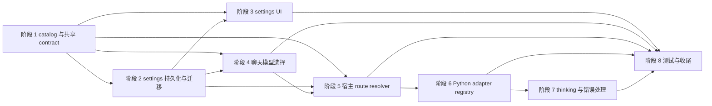

# 2026-04-06 Provider 支持完全数据驱动重构实施计划

## 文档定位

本文将已获批准的设计文档转换为可执行实施计划，只覆盖实现拆分、依赖顺序、风险控制、验收边界与分批策略，不包含任何代码实现。

本文默认目标是把 provider 支持从当前多处硬编码状态，收敛到“catalog + profile 实例 + 稳定 route 引用 + 宿主解析 + Python adapter registry”这条主线，并在首批真正打通 OpenAI、Anthropic、Gemini、Ollama、Groq、Mistral 六类 provider。

## 实施原则

1. **先统一数据与契约，再扩展 provider 执行能力。** 避免在旧状态模型和旧路由语义上继续叠加适配逻辑。
2. **先打通稳定 route 引用，再改聊天与 runtime。** 默认模型、聊天选择、thinking 校验都必须围绕稳定引用工作。
3. **公开数据与私有数据严格分层。** settings state、宿主返回的 public resolved route、宿主与 Python 间私有 auth payload 必须分离。
4. **首批只做核心字段 UI。** 首版 settings UI 只覆盖 API Key、可选 Base URL、模型列表、默认模型；扩展字段只在 schema 中预留。
5. **首批真实可运行范围与 catalog-only 范围明确分开。** catalog 可先容纳更多 provider，但聊天主链只允许 enabled provider 进入真实执行。
6. **thinking 与错误处理以后端 resolved route 为锚点。** 不允许前端本地规则重新成为能力真相。
7. **迁移宁可显式失效，也不做隐式猜测。** 尤其是旧字符串默认模型迁移到 route 引用时，出现歧义必须要求用户重选。

## 第一批必须实现范围

| 主题 | 第一批必须实现的范围 |
| --- | --- |
| provider 元数据 | 引入统一 provider catalog 与 schema，覆盖首批六类 enabled provider，并把其余 provider 以 catalog-only 方式纳入数据模型。 |
| settings 持久化 | 把 provider profile、默认模型、secret 结构升级到新 schema，并提供显式 migrator。 |
| settings UI | 创建入口、详情表单、默认模型选择器改为数据驱动；只暴露 API Key、Base URL、模型列表、默认模型。 |
| 聊天模型选择 | 模型选择器与 composer 改为使用稳定 route 引用，不再按裸 modelId 回退。 |
| 宿主路由解析 | 宿主按 route 引用解析 profile + catalog + secret，返回 public resolved route 与 private auth 数据。 |
| Python runtime | 引入 provider adapter registry，并真实打通 OpenAI、Anthropic、Gemini、Ollama、Groq、Mistral 的基础聊天与流式主链。 |
| thinking | 以 resolved route 为锚点接入 adapter 能力查询与最终校验。 |
| 错误处理 | 增加从 settings、宿主 resolver、adapter、上游调用四层贯通的稳定错误码。 |
| 测试 | 建立 catalog/schema、迁移、settings UI、聊天前端、宿主 resolver、adapter、e2e、live test 分层。 |

## 后续可延期范围

| 主题 | 可延期范围 |
| --- | --- |
| 高级认证 | OAuth、service account、项目级 token、组织参数、额外 header、区域参数等复杂认证与扩展字段 UI。 |
| provider 深度配置 | 自动拉取模型目录、价格与能力自动同步、复杂模型参数编辑器、provider 专属高级配置。 |
| 全量 provider 运行时支持 | 其余 catalog-only provider 的 adapter 落地与 live test 纳入。 |
| agent 级默认模型契约 | 当前 agent directory 中 `defaultModelPreference` 仍是字符串，可在首批完成后再升级为 route 引用。 |
| 更细粒度能力 UI | 更丰富的 provider/model capability 可视化、能力来源说明、诊断面板增强。 |
| 更复杂迁移提示 | 首版只要求把歧义项显式失效并要求重选，后续再补一次性迁移报告与更细文案。 |

## 阶段总览

| 阶段 | 名称 | 主要输出 | 前置依赖 |
| --- | --- | --- | --- |
| 阶段 1 | provider catalog 与共享 contract 基线 | catalog、schema、共享 provider 标识与 route 契约 | 无 |
| 阶段 2 | settings 持久化与迁移 | 新 state schema、secret schema、migrator、兼容策略 | 阶段 1 |
| 阶段 3 | settings UI 数据驱动化 | provider 创建/编辑 UI、默认模型 UI、兼容态展示 | 阶段 1、阶段 2 |
| 阶段 4 | 聊天模型选择与默认路由重构 | model picker、composer、默认路由读取与禁用态 | 阶段 1、阶段 2 |
| 阶段 5 | 宿主 route resolver 与桥接协议升级 | route ref 解析、public/private route 分离、bridge 契约更新 | 阶段 1、阶段 2、阶段 4 |
| 阶段 6 | Python runtime provider adapter registry | adapter registry、六类 provider 首批执行主链 | 阶段 1、阶段 5 |
| 阶段 7 | thinking 能力对接与错误归一化 | adapter 驱动的 thinking 校验、稳定错误码与映射 | 阶段 5、阶段 6 |
| 阶段 8 | 测试分层、live test gating 与收尾 | 分层测试矩阵、回归用例、分 PR 落地与清理 | 阶段 1 至阶段 7 |

## 阶段 1：provider catalog 与共享 contract 基线

### 目标

建立系统级单一 provider 元数据源，并把 provider 身份、endpoint 语义、runtime 状态、auth/baseUrl/model 配置策略、adapter 绑定以及稳定 route 引用形态固定下来，为后续 settings、聊天、宿主、Python runtime 提供统一契约。

### 涉及文件/模块

- 新增 `provider-catalog/registry.json`
- 新增 `provider-catalog/schema.json`
- 建议新增 TS catalog loader 模块，供 Electron 与前端共享
- 建议新增 Python catalog loader 模块，供 runtime 消费
- `frontend-copilot/src/workbench/types.ts`
- `frontend-copilot/src/features/copilot/thread-run-contract.ts`
- `backend/app/copilot_runtime/model_routes.py`
- `frontend-copilot/electron/settings-workspace/provider-schema.ts`

### 主要改动点

1. 定义 catalog schema，至少包含：
   - `providerId`
   - `displayName`
   - `endpointType`
   - `runtimeStatus`
   - `adapterId`
   - `authSchema`
   - `baseUrlPolicy`
   - `modelConfigPolicy`
   - `capabilityHints`
   - `catalogRevision`
2. 在 catalog 中把 OpenAI、Anthropic、Gemini、Ollama、Groq、Mistral 标记为 `enabled`。
3. 其余 PydanticAI provider 先以 `catalog-only` 进入 catalog，保证 schema 与扩展位一次到位。
4. 把“稳定 route 引用”与“resolved route”拆成两类契约：
   - `ModelRouteRef` 只保存 `routeKind + profileId + modelId`
   - `ResolvedRuntimeModelRoute` 保存 `providerId + endpointType + baseUrl + modelId + adapterId + runtimeStatus`，并预留 `catalogRevision`
5. 明确 `providerId` 与 `endpointType` 分离，不再允许任何调用方依赖 `provider === openai ? openai-compatible : provider` 这种投影规则。
6. 明确 auth 策略必须至少支持 `api-key` 与 `none`，否则无法覆盖 Ollama 这一类本地或无密钥场景。
7. 明确前端与后端都从同一份 catalog 读取 enabled provider 列表，禁止再维护独立 provider 枚举。

### 依赖关系

- 无前置代码依赖，是整个实施链路的基线阶段。
- 阶段 2 到阶段 7 都依赖本阶段固定的 provider 与 route 契约。

### 风险点

- 若 catalog 字段定义过窄，后续补充高级 auth 或 provider 特性时会再次扩 schema。
- 若 route 契约仍混入可推导字段，settings 状态会继续重复存储 provider 能力。
- 若 Ollama 的无密钥场景未在首阶段建模，后续 secret schema 会被迫返工。

### 验收标准

- catalog 与 schema 可以独立通过校验测试。
- 首批六类 provider 在 catalog 中存在且状态正确。
- TS 与 Python 都能读取同一份 catalog 并获得一致字段。
- 共享 route 契约中不再要求请求端提交 `provider + endpointType + baseUrl` 手写 snapshot。

## 阶段 2：settings 持久化与迁移

### 目标

把 settings 持久层从旧的 provider/profile/string-model 结构升级为“profile 引用 catalog + 默认路由对象 + secret envelope + compatibility 标记”的新结构，并确保旧数据可控迁移。

### 涉及文件/模块

- `frontend-copilot/electron/settings-workspace/state-schema.ts`
- `frontend-copilot/electron/settings-workspace/provider-schema.ts`
- `frontend-copilot/electron/settings-workspace/secret-schema.ts`
- `frontend-copilot/electron/settings-workspace/settings-workspace-state-storage.ts`
- `frontend-copilot/electron/settings-workspace/settings-workspace-document-io.ts`
- `frontend-copilot/electron/settings-workspace/settings-workspace-serialization.ts`
- `frontend-copilot/electron/settings-workspace/service.ts`
- 建议新增 migration 模块，例如 state migration 与 secret migration
- `frontend-copilot/electron/settings-workspace/service.test.ts`

### 主要改动点

1. 升级 state document 版本与 secrets document 版本。
2. 把旧 `ProviderProfile` 存储结构改造成新 profile 持久化结构，核心字段建议至少包括：
   - `profileId`
   - `providerId`
   - `displayName`
   - `baseUrl`
   - `models`
   - `defaultModelId`
   - `compatibility`
   - `extensions`
3. 把默认模型从旧字符串升级为可空 route 引用对象：
   - `primaryAssistantModel: ModelRouteRef | null`
   - `fastAssistantModel: ModelRouteRef | null`
4. 把 secrets 从旧的 `providerId -> apiKey` 映射升级为 `profileId -> auth envelope`：
   - `profileId`
   - `authKind`
   - `secretValues`
5. 迁移顺序严格按照设计执行：
   - 旧 profile 迁新 profile
   - 旧 secret 迁 auth envelope
   - 旧默认模型字符串迁 route 引用
6. 歧义迁移规则必须显式失效：
   - 同名 `modelId` 在多个 profile 命中时，默认路由置空
   - 无法映射 providerId 时，profile 标记为 `legacy` 或 `unsupported`
   - 无法命中模型时，默认路由置空
7. 旧字段如 `organization`、`region`、`notes` 不作为首版 UI 主字段，但要决定保留位置：
   - 可迁入 `extensions`
   - 或仅保留 legacy 原始数据以便后续人工迁移
8. 对于 `legacy` 与 `unsupported` profile，必须保留非敏感数据与 secret 索引，不允许丢失用户配置。

### 依赖关系

- 依赖阶段 1 已确定的 catalog schema 与 route/ref contract。
- 阶段 3、阶段 4、阶段 5 直接消费本阶段输出的 state shape。

### 风险点

- 旧数据模型中 `id` 既像 provider 身份又像实例主键，迁移时容易把 providerId 与 profileId 混淆。
- 若默认模型失效只以空字符串表示，UI 很难区分“未选择”和“迁移失败”。
- 若 secrets 迁移不改成 `profileId` 键空间，复制 profile 或同 provider 多实例会继续冲突。

### 验收标准

- 旧版本 state/secrets 文档可成功加载到新 editable state。
- 同名 `modelId` 歧义会导致默认路由显式失效，而不是猜测命中。
- 复制同一 provider 的多个 profile 后，secret 不再互相覆盖。
- `legacy` 与 `unsupported` profile 会被保留并带兼容状态，而不是被静默删除。

## 阶段 3：settings UI 数据驱动化

### 目标

把 settings 页的 provider 创建、编辑、默认模型选择、兼容状态展示全部切换到 catalog 驱动，去掉静态 provider 枚举与协议硬编码，同时保持首版 UI 只聚焦核心字段。

### 涉及文件/模块

- `frontend-copilot/src/workbench/settings/config.ts`
- `frontend-copilot/src/workbench/settings/provider-profiles.ts`
- `frontend-copilot/src/workbench/settings/ProviderProfilesSection.tsx`
- `frontend-copilot/src/workbench/settings/ProviderProfileDetails.tsx`
- `frontend-copilot/src/workbench/settings/ProviderSecretPanel.tsx`
- `frontend-copilot/src/workbench/settings/DefaultModelRoutesSection.tsx`
- `frontend-copilot/src/workbench/settings/settings-workspace-provider-controller.ts`
- `frontend-copilot/src/workbench/settings/settings-workspace-form-state.ts`
- `frontend-copilot/src/workbench/settings/settings-workspace-save-input.ts`
- `frontend-copilot/src/workbench/settings/SettingsWorkspace.providers.test.tsx`
- `frontend-copilot/src/workbench/settings/SettingsWorkspace.persistence.test.tsx`
- `frontend-copilot/src/workbench/settings/SettingsWorkspace.secrets.test.tsx`

### 主要改动点

1. 删除 settings 侧静态 `protocolOptions` 作为 provider 真相来源的职责，改为读取 catalog 生成创建菜单。
2. provider 详情页改为按 catalog 描述渲染：
   - API Key 输入是否显示
   - Base URL 是否可编辑、可选、固定
   - 模型列表是否允许编辑
   - 默认模型字段约束
3. `ProviderProfile` 前端编辑态需要升级为“实例字段 + catalog 引用 + compatibility 展示态”。
4. 默认模型区的 `SelectField` 选项值改为稳定 route 引用序列化值或 route ref 视图模型，而不是裸 `modelId`。
5. 对 `catalog-only` provider：
   - 设置页允许创建与保存
   - 明确显示“仅数据层兼容，当前运行时未启用”
6. 对 `legacy` 或 `unsupported` provider：
   - 保留查看与复制能力
   - 禁止选为默认聊天模型
   - 展示失效原因
7. 首版 UI 不再要求暴露 `organization`、`region`、`notes` 等高级字段；如需保留可放在折叠区或暂时隐藏，只确保数据不会在保存时丢失。
8. 如果 provider 不要求 API Key，例如 Ollama，UI 不能硬性阻塞保存。

### 依赖关系

- 依赖阶段 1 的 catalog。
- 依赖阶段 2 的新 settings state 和 secret schema。
- 阶段 4 的聊天模型目录会复用本阶段的 route option 组织方式。

### 风险点

- 当前 UI controller 假设 provider 的主键就是 `id`，重构到 `profileId + providerId` 后需要清理大量隐式假设。
- 如果默认模型选择器仍保存字符串，阶段 4 会继续受到同名 modelId 冲突影响。
- 如果 UI 同时兼顾过多高级字段，第一批交付范围会失控。

### 验收标准

- provider 创建入口完全来自 catalog，而不是手写枚举。
- 用户可以为 enabled 与 catalog-only provider 创建 profile，并保存核心字段。
- 默认模型选择器保存并回显的是 route 引用，而不是裸 `modelId`。
- legacy 与 catalog-only provider 在设置页展示态、禁用态、提示文案清晰可见。

## 阶段 4：聊天模型选择与默认路由重构

### 目标

让聊天前端只围绕稳定 route 引用工作，默认模型、模型选择器、composer 缓存键、禁用态判断都不再依赖裸 `modelId` 或本地 endpoint 枚举。

### 涉及文件/模块

- `frontend-copilot/src/features/copilot/model-picker.ts`
- `frontend-copilot/src/features/copilot/thread-run-contract.ts`
- `frontend-copilot/src/features/copilot/copilot-chat-helpers.ts`
- `frontend-copilot/src/features/copilot/components/ModelPicker.tsx`
- `frontend-copilot/src/features/copilot/model-picker.test.ts`
- `frontend-copilot/src/features/copilot/CopilotChatPanel.test.tsx`
- `frontend-copilot/src/features/copilot/chat-contract.*`
- settings 侧默认模型输出模块

### 主要改动点

1. 把聊天请求携带的模型标识从旧 `providerProfileId + snapshot` 改为稳定 route 引用对象。
2. `createCopilotModelCatalog()` 改为消费 `profile + catalog` 组装模型目录：
   - provider 显示名来自 catalog
   - 运行时可用性来自 `runtimeStatus`
   - endpointType 不再由前端手工投影
3. 删除以下旧逻辑：
   - `STREAMING_CHAT_SUPPORTED_ENDPOINT_TYPES = ['openai-compatible']`
   - `provider === 'openai' ? 'openai-compatible' : provider`
   - 按裸 `modelId` 兜底命中默认模型
4. composer 中的 `selectedModelId` 与 `selectedModelRoute` 需要改成“可稳定回放的 route ref + 可选 resolved public view”，避免再次把 snapshot 当请求输入。
5. thinking 选择的内存键需要从旧 snapshot 组合串过渡为：
   - route ref 作为稳定选择键
   - resolved route fingerprint 作为运行时 capability 缓存键
6. 对 `catalog-only`、`legacy`、`unsupported`、`runtime disabled` provider，聊天模型列表必须直接禁用，不允许先选中后在发送时报错。
7. 当前 agent directory 中的 `defaultModelPreference` 仍是字符串。首批建议保留该字段兼容，但聊天入口优先使用 settings 中的新默认 route；agent 级 route ref 升级列入延期项。

### 依赖关系

- 依赖阶段 1 的 route/ref contract。
- 依赖阶段 2 的默认模型 route 持久化。
- 阶段 5 需要本阶段产出的 route ref 请求契约。

### 风险点

- 聊天前端当前有大量测试夹具仍以字符串 `defaultModelPreference` 或 snapshot 组织，改动面较大。
- 若 selected model 仍保留 modelId 兜底，会让迁移后的稳定路由失去意义。
- thinking 记忆键如果仍包含可变 baseUrl 或 endpoint 片段，用户切换配置后可能出现旧缓存残留。

### 验收标准

- 同名 modelId 出现在不同 profile 下时，聊天前端仍能稳定命中正确模型。
- 未启用 provider 不会出现在可发送模型列表中。
- 模型路由请求不再要求前端自己拼出 `provider` 与 `endpointType`。
- 所有默认模型相关前端测试改为围绕 route 引用断言。

## 阶段 5：宿主 route resolver 与桥接协议升级

### 目标

让 Electron 宿主成为“稳定 route 引用 -> resolved route + private auth”的唯一解析入口，并同步升级宿主与 Python 之间的桥接协议。

### 涉及文件/模块

- `frontend-copilot/electron/settings-workspace/provider-route-resolver.ts`
- `frontend-copilot/electron/settings-workspace/service.ts`
- `frontend-copilot/electron/runtime/host-model-route-bridge.ts`
- `frontend-copilot/electron/runtime/host-model-route-bridge.test.ts`
- `backend/app/desktop_runtime/host_model_route_bridge.py`
- `backend/app/copilot_runtime/model_routes.py`
- `backend/app/copilot_runtime/protocol.py`
- `backend/app/copilot_runtime/bridge.py`

### 主要改动点

1. 宿主 resolver 的输入从旧 `providerProfileId + snapshot` 改为 `ModelRouteRef`。
2. resolver 根据 `profileId + providerId + modelId` 读取：
   - settings state
   - provider catalog
   - secret envelope
3. resolver 输出拆分为两段：
   - public resolved route：供聊天页、thinking 回显、run 完成事件使用
   - private auth payload：只在宿主与 Python runtime 间传输
4. public resolved route 至少包含：
   - `routeRef`
   - `providerId`
   - `endpointType`
   - `baseUrl`
   - `modelId`
   - `adapterId`
   - `runtimeStatus`
   - `catalogRevision`
5. private auth payload 至少包含：
   - `authKind`
   - `authPayload`
   - 未来扩展位
6. resolver 需要新增前置校验：
   - profile 是否存在
   - provider 是否在 catalog 中存在
   - provider 是否 enabled
   - model 是否属于该 profile
   - secret 是否满足 auth schema
   - profile compatibility 是否允许执行
7. backend 桥客户端与运行时 contract 要同步升级，解析新 response 形态，并避免把 secret 泄露到 public payload。
8. adapter 是否已注册可分两层保障：
   - 宿主根据 catalog 中 enabled provider 与 adapterId 做静态前置校验
   - Python runtime 以 adapter registry 做最终防御性校验并返回 `adapter_missing`

### 依赖关系

- 依赖阶段 1 的 route/ref contract。
- 依赖阶段 2 的新 settings state 与 secret envelope。
- 依赖阶段 4 的聊天请求已改为 route ref。

### 风险点

- 如果 bridge response 仍沿用旧字段名和旧 snapshot 结构，Python runtime 会继续把 resolved route 与 request ref 混在一起。
- 宿主与 Python 两端若不同步升级 contract，最容易在桌面链路出现静默不兼容。
- 若 private auth 与 public route 分层不彻底，测试中很容易再次把 secret 回传到 renderer。

### 验收标准

- 聊天发送只提交 route ref，宿主能够解析并返回新 resolved route。
- public route payload 中不包含任何 secret 信息。
- profile 不存在、provider 不存在、runtime disabled、secret 缺失、model 不属于 profile 等错误都能稳定命中对应错误码。
- 宿主桥接测试覆盖新 request/response 结构并通过。

## 阶段 6：Python runtime provider adapter registry

### 目标

在 Python runtime 中引入统一 adapter registry，替换当前对 OpenAI provider 的硬编码，并按统一 resolved route 执行首批六类 provider。

### 涉及文件/模块

- `backend/app/copilot_runtime/agent.py`
- `backend/app/copilot_runtime/agent_registry.py`
- `backend/app/copilot_runtime/message_runs.py`
- `backend/app/copilot_runtime/bridge.py`
- `backend/app/copilot_runtime/model_routes.py`
- 建议新增 adapter registry 模块
- 建议新增各 provider adapter 模块
- 相关 unit tests 与 integration tests

### 主要改动点

1. 设计 adapter registry 接口，至少包含：
   - 通过 `providerId + resolved route + secret` 构造 provider/model
   - 声明聊天与流式是否可用
   - 映射 request options
   - 提供 thinking verified capability
   - 归一化上游错误
2. 把 `agent.py` 中 `_SUPPORTED_STREAM_ENDPOINT_TYPES` 与 `_build_stream_model()` 的 OpenAI 专用路径替换为 adapter 调用。
3. 把 `ResolvedRuntimeModelRoute` 扩展为 adapter registry 可直接消费的结构，而不是只携带 OpenAI 所需字段。
4. 为首批 provider 建立独立 adapter：
   - OpenAI
   - Groq
   - Mistral
   - Ollama
   - Anthropic
   - Gemini
5. 对共享 openai-compatible 传输层的 provider，可以共享基础 helper，但不能共享 providerId 语义与错误归一化结果。
6. 禁止 catalog-only provider 在没有 adapter 的情况下进入真实执行链路。
7. runtime scaffold 与 orchestrator 的日志、diagnostics、completion metadata 需要输出新的 providerId 与 adapterId 语义，便于排查多 provider 行为差异。

### 依赖关系

- 依赖阶段 5 输出的 resolved route。
- 阶段 7 的 thinking 与错误归一化依赖本阶段 adapter registry 基础设施。

### 风险点

- 若 registry 只负责构造 provider/model 而不承接 thinking 与错误映射，能力真相仍会分散。
- Groq 与 Mistral 若被粗暴归为“OpenAI 别名”，会再次丢失 provider 身份。
- Ollama 需要覆盖本地 endpoint 与可选无密钥场景，若接口只面向云 provider 设计会被卡住。

### 验收标准

- runtime 不再直接硬编码 `OpenAIProvider` 作为默认唯一路径。
- 首批六类 provider 都能通过 adapter registry 进入基础聊天与流式执行。
- catalog-only provider 在执行前即被拒绝，并返回明确错误。
- adapter registry 的诊断日志能区分 `providerId`、`endpointType`、`adapterId`。

## 阶段 7：thinking 能力对接与错误归一化

### 目标

把当前 thinking 能力与错误处理彻底收敛到“resolved route + adapter registry”上，确保 capability query、发送前校验、provider 参数映射、上游错误归一化围绕同一套事实来源。

### 涉及文件/模块

- `backend/app/copilot_runtime/thinking_adapter.py`
- `backend/app/copilot_runtime/message_runs.py`
- `backend/app/copilot_runtime/bridge.py`
- `backend/app/copilot_runtime/errors.py`
- `frontend-copilot/src/features/copilot/thread-run-contract.ts`
- `frontend-copilot/src/features/copilot/copilot-chat-helpers.ts`
- `frontend-copilot/src/workbench/thinking-capabilities.ts`
- 相关聊天 UI 测试与 runtime 测试

### 主要改动点

1. 让 thinking verified matrix 由 adapter 或 adapter registry 提供，不再把 provider 识别逻辑散落在 `thinking_adapter.py` 的本地特判中。
2. `resolve_canonical_thinking_capability()` 的输入继续以 resolved route 为锚点，但其 verified 结论改为依赖 adapter 提供的数据。
3. capability query 与真正发送必须复用同一套 adapter 能力结果：
   - UI 展示用 capability snapshot
   - send 前校验 requested thinking intent
   - provider 参数映射
4. `off` 必须始终可显式关闭 thinking，不允许 UI 或 adapter 静默改写为其他档位。
5. 对 unknown + override 仍保留受控路径，但其边界必须由 adapter registry 最终裁决，不能让前端 override 突破 provider 真实边界。
6. 增加统一错误码分层：
   - settings 输入错误
   - route resolver 错误
   - adapter 语义错误
   - upstream 调用错误
7. 上游典型错误至少归一化为稳定类别：
   - auth failed
   - model not found
   - rate limited
   - quota exhausted
   - timeout
   - upstream unavailable
   - streaming unsupported
   - thinking unsupported

### 依赖关系

- 依赖阶段 5 的 resolved route 契约。
- 依赖阶段 6 的 adapter registry 与 provider verified capability。

### 风险点

- 若 capability query 与 send 使用不同入口，thinking 又会回到双轨制。
- 若错误码只在 backend 内部稳定，而前端诊断事件不升级契约，用户仍只会看到模糊失败信息。
- 若 override 逻辑没有被 adapter 最终复核，unknown provider 容易继续出现乐观发送。

### 验收标准

- UI 查询到的 thinking 能力与发送时最终校验基于同一 resolved route 与同一 adapter 结果。
- 不支持 thinking 的 provider/model 不影响普通聊天主链。
- 不支持的 thinking 请求会 fail-fast，而不是静默降级。
- 上游常见错误能够被归一化到稳定错误码并传回前端。

## 阶段 8：测试分层、live test gating 与收尾

### 目标

建立与新架构一致的测试矩阵，并按低风险顺序完成收尾、清理遗留硬编码与验证首批 provider 落地质量。

### 涉及文件/模块

- `frontend-copilot/src/workbench/settings/*.test.tsx`
- `frontend-copilot/src/features/copilot/*.test.tsx`
- `frontend-copilot/electron/settings-workspace/*.test.ts`
- `frontend-copilot/electron/runtime/*.test.ts`
- `backend/tests/unit/**`
- `backend/tests/e2e/**`
- 建议新增 adapter unit tests 与 live test suites

### 主要改动点

1. 按层建立测试矩阵：
   - catalog/schema 测试
   - settings migration 测试
   - settings UI 数据驱动测试
   - 聊天前端 route/ref 测试
   - 宿主 resolver/bridge 测试
   - backend adapter 单测
   - e2e stubbed 主链测试
   - live test
2. 把 live test 限定为首批六类 enabled provider，并要求：
   - 显式凭据
   - 显式开关
   - 默认不在常规 CI 主矩阵中运行
3. e2e 优先覆盖“设置保存 -> route 解析 -> runtime 执行 -> 聊天回显”完整主链，但默认使用可控桩件而非真实上游 provider。
4. 收尾清理项要明确：
   - 移除静态 provider 枚举依赖
   - 移除旧 snapshot 请求路径
   - 移除旧默认模型字符串兜底逻辑
   - 移除只适用于 OpenAI 的 endpoint 支持判断
5. 对迁移失败与 legacy provider 增加回归用例，防止后续继续误删用户数据。

### 依赖关系

- 依赖阶段 1 至阶段 7 全部输出。

### 风险点

- 如果只补 happy path 测试，最容易在 migration 与 disabled provider 边界出现回归。
- 如果 live test 与普通 CI 混跑，凭据与稳定性成本会明显上升。
- 如果不为 catalog-only provider 建立禁用态测试，后续容易再次误入聊天主链。

### 验收标准

- 测试矩阵覆盖设计文档中要求的所有层次。
- e2e 可以验证完整主链且不依赖真实 provider。
- live test 仅对首批 enabled provider 开放，并有显式开关。
- 遗留硬编码位置有明确删除或替换用例证明。

## 首批 provider 落地顺序

建议按以下顺序推进首批 provider，以最大化复用基础设施并尽早暴露关键差异：

1. **OpenAI**
   - 作为首个 baseline adapter，先验证 catalog -> route resolver -> adapter registry -> 聊天主链的最短闭环。
2. **Groq**
   - 与 OpenAI 共享 openai-compatible 传输层，但保留独立 providerId、baseUrl、错误归一化与 capability 判定。
3. **Mistral**
   - 再验证一个共享传输层但独立 provider 语义的实现，巩固“providerId 不等于 endpointType”的边界。
4. **Ollama**
   - 验证本地/self-hosted、可选无密钥、可覆盖 baseUrl 的差异路径，尽早暴露 auth schema 与 resolver 约束问题。
5. **Anthropic**
   - 验证第一类非 openai-compatible 原生 provider，重点检查 streaming、thinking 与错误归一化。
6. **Gemini**
   - 验证第二类原生 provider，重点检查 thinking、capability 与请求参数映射的非对称差异。

该顺序的核心目标不是按 provider 热度排序，而是按“共享基础设施复用 -> 本地部署边界 -> 原生协议差异”逐步扩张验证面。

## 推荐分 PR / 分 commit 策略

建议按可回滚、可独立评审的顺序拆分，而不是做一个超大 PR。

### PR 1：catalog 与共享 contract 基线

- 引入 `provider-catalog/registry.json` 与 `provider-catalog/schema.json`
- 固定 providerId、endpointType、runtimeStatus、adapterId、route ref 契约
- 增加 catalog/schema 校验测试

### PR 2：settings schema、secret schema 与 migrator

- 升级 state/secrets 版本
- 落地 profile 新结构、auth envelope、默认路由对象
- 补迁移与兼容回归测试

### PR 3：settings UI 数据驱动化

- provider 创建入口、详情页、默认模型选择器改为 catalog 驱动
- 加入 catalog-only 与 legacy 展示态

### PR 4：聊天 route ref 化与宿主 resolver 升级

- 聊天模型选择器切到 route ref
- bridge request/response 改新 contract
- 宿主 resolver 增加 public/private route 分层

### PR 5：runtime adapter registry 基础设施 + OpenAI / Groq / Mistral

- 建 adapter registry
- 替换 OpenAI 硬编码
- 先落地最能复用基础设施的三类 provider

### PR 6：Ollama / Anthropic / Gemini + thinking + 错误归一化

- 覆盖无密钥、自托管与原生协议差异
- 完成 adapter 驱动的 thinking 与统一错误码

### PR 7：测试补齐、live test gating 与遗留清理

- 分层测试矩阵收口
- 清理旧 provider 枚举、旧 snapshot、旧 modelId 兜底逻辑

## 实施完成判定

当且仅当满足以下条件，才视为本轮 provider 数据驱动重构进入“首批完成”状态：

1. settings、聊天、宿主、Python runtime 使用同一份 provider catalog 语义。
2. 默认模型与聊天选中模型均基于稳定 route 引用，而不是裸字符串 modelId。
3. OpenAI、Anthropic、Gemini、Ollama、Groq、Mistral 六类 provider 均可完成基础聊天与流式主链。
4. thinking 能力查询与发送校验均以 resolved route + adapter 结果为真相来源。
5. catalog-only provider 可被配置但不会被误当作可发送模型。
6. 迁移不会丢失旧 profile 数据，歧义项会显式失效并要求用户重选。
7. 测试矩阵覆盖 schema、迁移、UI、resolver、adapter、e2e、live test 分层。
