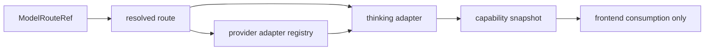

# 2026-04-09 Merge Conflict Resolution 设计

> 本文档记录本轮已批准的合并冲突解决设计，用于后续逐文件解冲突时作为正式裁决依据，而不是实现补丁说明或兼容保留清单。

## 背景

当前合并冲突来自两条同时推进的主线：

- 一条主线将 thinking 深化为多系列、多模型、结构化 selection；
- 另一条主线将 provider 扩展为多 provider 主链，并引入 route-ref、resolved route 与 adapter registry。

两条主线同时触及聊天发送、默认模型选择、provider 身份判定、thinking 能力展示、状态持久化与运行时错误边界。如果不先统一真相来源，冲突会继续在 [`backend/app/copilot_runtime/router.py`](../../backend/app/copilot_runtime/router.py)、[`backend/app/copilot_runtime/bridge.py`](../../backend/app/copilot_runtime/bridge.py)、[`backend/app/copilot_runtime/protocol.py`](../../backend/app/copilot_runtime/protocol.py)、[`backend/app/copilot_runtime/message_runs.py`](../../backend/app/copilot_runtime/message_runs.py) 与 [`frontend-copilot/src/features/copilot/model-picker.ts`](../../frontend-copilot/src/features/copilot/model-picker.ts)、[`frontend-copilot/src/features/copilot/thread-run-contract.ts`](../../frontend-copilot/src/features/copilot/thread-run-contract.ts)、[`frontend-copilot/src/workbench/thinking-capabilities.ts`](../../frontend-copilot/src/workbench/thinking-capabilities.ts) 之间反复扩散旧语义。

本轮设计目标不是让两套语义长期并存，而是明确一条合并后的单一主链，并用清晰的删除与迁移边界，为后续逐文件解冲突提供统一裁决标准。

## 目标

- 统一合并后的唯一正式运行时主链为 `ModelRouteRef -> resolved route -> provider adapter registry`。
- 让聊天发送、默认模型选择、provider 身份判定全部围绕该主链收口。
- 让 thinking 能力来源、默认挡位、实验性标签与切换路由时的 selection 失效规则统一由后端决定。
- 以结构化 thinking selection 作为唯一正式存储与恢复格式。
- 给出逐层测试顺序、逐文件解冲突顺序与文件级裁决标准，避免最后一次性处理数十处冲突。

## 非目标

- 不保留 thinking 的独立 provider 真相。
- 不继续维护前端本地 provider × thinking 规则推断。
- 不为旧 `MESSAGE_SEND_METHOD`、旧 snapshot、裸 `modelId` 弱匹配建立长期并存语义。
- 不为了 legacy round-trip 完整性而牺牲主链收口。
- 不把本设计写成逐行 patch 指南、实现清单或过渡期兼容大全。

## 总体架构与真相来源

### 决策

合并后的唯一正式运行时主链定义如下：

该主链的正式含义如下：

- [`frontend-copilot/src/workbench/types.ts`](../../frontend-copilot/src/workbench/types.ts) 中的 `ModelRouteRef` 是前端与协议层唯一正式入口。
- resolved route 是后端运行时唯一的路由真相，收口于 [`backend/app/copilot_runtime/contracts.py`](../../backend/app/copilot_runtime/contracts.py)、[`backend/app/copilot_runtime/router.py`](../../backend/app/copilot_runtime/router.py)、[`backend/app/copilot_runtime/bridge.py`](../../backend/app/copilot_runtime/bridge.py)、[`backend/app/copilot_runtime/protocol.py`](../../backend/app/copilot_runtime/protocol.py) 与 [`backend/app/copilot_runtime/message_runs.py`](../../backend/app/copilot_runtime/message_runs.py)。
- provider 能力与执行映射由 [`backend/app/copilot_runtime/provider_adapter_registry.py`](../../backend/app/copilot_runtime/provider_adapter_registry.py) 统一提供。
- thinking 能力 canonical 化与 selection 适配由 [`backend/app/copilot_runtime/thinking_adapter.py`](../../backend/app/copilot_runtime/thinking_adapter.py) 基于 resolved route 与 adapter registry 决定。
- 前端 [`frontend-copilot/src/workbench/thinking-capabilities.ts`](../../frontend-copilot/src/workbench/thinking-capabilities.ts) 只消费后端能力快照，不再把本地 provider、protocol、endpoint 或 modelId 推断结果当作真相。

### 架构约束

- 聊天发送、默认模型选择、provider 身份判定，必须围绕同一主链收口。
- 旧 `MESSAGE_SEND_METHOD` 与裸 `modelId` 弱匹配，不再是正式语义；若冲突允许，应优先删除；若一次删不净，只允许保留迁移期薄兼容层，不得继续向下游扩散。
- thinking 不再拥有独立 provider 真相，任何与 provider 相关的能力结论都必须回到 resolved route 与 adapter registry。
- route 最终支持哪些挡位、默认挡位是什么、切换 route 时是否应清空旧 selection，统一由后端 `provider adapter registry + thinking adapter` 决定。
- 总体采用方案 B：主链严格收口，但对可映射组合尽量放行，并将未验证但可映射组合标记为实验性。

### 锚点文件

本轮设计应以以下文件作为关键锚点：

- [`backend/app/copilot_runtime/contracts.py`](../../backend/app/copilot_runtime/contracts.py)
- [`backend/app/copilot_runtime/router.py`](../../backend/app/copilot_runtime/router.py)
- [`backend/app/copilot_runtime/bridge.py`](../../backend/app/copilot_runtime/bridge.py)
- [`backend/app/copilot_runtime/thinking_adapter.py`](../../backend/app/copilot_runtime/thinking_adapter.py)
- [`backend/app/copilot_runtime/provider_adapter_registry.py`](../../backend/app/copilot_runtime/provider_adapter_registry.py)
- [`frontend-copilot/electron/settings-workspace/provider-schema.ts`](../../frontend-copilot/electron/settings-workspace/provider-schema.ts)
- [`frontend-copilot/electron/settings-workspace/provider-route-resolver.ts`](../../frontend-copilot/electron/settings-workspace/provider-route-resolver.ts)
- [`frontend-copilot/src/workbench/thinking-capabilities.ts`](../../frontend-copilot/src/workbench/thinking-capabilities.ts)
- [`frontend-copilot/src/workbench/types.ts`](../../frontend-copilot/src/workbench/types.ts)
- [`frontend-copilot/src/features/copilot/thread-run-contract.ts`](../../frontend-copilot/src/features/copilot/thread-run-contract.ts)

## 架构原则

### 原则 1：单一主链优先于局部兼容

凡是仍以 snapshot、裸 `modelId`、前端 provider 特判或旧 method alias 作为主语义的实现，在冲突裁决时默认删除。只有当删除会阻断必要迁移入口时，才允许留下最薄壳层。

### 原则 2：后端单一真相优先于前端本地推断

前端的职责是展示、提交、消费与按快照回填，而不是重新推断 provider 真相或 thinking 规则。与 thinking 能力有关的正式结论必须来自后端。

### 原则 3：可映射优先于品牌隔离

provider 品牌身份主要决定默认推荐与风险展示强度，不自动构成可选挡位的上限。只要底层协议形状可映射，就允许同一 provider 下出现多个挡位体系。

### 原则 4：激进清理优先于 legacy round-trip 完整性

本轮正确性主要依赖测试与 CI，而不是通过保留旧逻辑兜底。跨 provider 或跨能力域的旧 selection 不再享有无损 round-trip 优先权。

### 原则 5：错误语义必须比 legacy 更清晰

即便兼容层被进一步删除，也要显式区分：

- route 解析失败
- provider 不可用
- thinking selection 不兼容
- 实验性组合被 provider 拒绝

## 能力映射规则

### 正式结论

某个 route 的可选 thinking 挡位集合，不由 provider 品牌直接硬编码上限，而是由后端 canonical 能力解析与 selection 适配联合决定：

- `resolve_canonical_thinking_capability()` 决定 route 在当前 registry 语义下的 canonical capability；
- `adapt_thinking_selection()` 决定给定 selection 是否可映射、是否实验性、是否需要回退兜底。

对应锚点位于 [`backend/app/copilot_runtime/thinking_adapter.py`](../../backend/app/copilot_runtime/thinking_adapter.py)。

### 规则细化

- provider 身份只决定默认推荐，不再构成可选挡位的强制上限。
- 只要底层协议形状可映射，就允许把多个挡位体系并入同一 provider 的可选集合，而不是硬隔离。
- provider 品牌身份主要用于：
  - 默认挡位
  - 提示文案
  - 风险提示强度
- 前端只展示后端下发的能力快照与实验性标签，不自行推断更多挡位。

### 分层优先级

1. 已验证、稳定映射 -> 正式能力
2. 未验证但协议形状可映射 -> 实验性能力
3. 既无已知映射、也无可靠协议映射 -> 回退基础开关两档兜底

### 对前端的约束

- [`frontend-copilot/src/workbench/thinking-capabilities.ts`](../../frontend-copilot/src/workbench/thinking-capabilities.ts) 只处理能力快照与展示转换，不继续维护本地 provider × thinking 推断矩阵。
- [`frontend-copilot/src/workbench/types.ts`](../../frontend-copilot/src/workbench/types.ts) 与 [`frontend-copilot/src/features/copilot/thread-run-contract.ts`](../../frontend-copilot/src/features/copilot/thread-run-contract.ts) 应承接结构化能力与实验性标签，而不是为旧 intent 或旧 snapshot 继续扩展主语义。
- [`frontend-copilot/electron/settings-workspace/provider-route-resolver.ts`](../../frontend-copilot/electron/settings-workspace/provider-route-resolver.ts) 负责 route ref 到 resolved route 所需输入的宿主解析，不应再成为独立 thinking 真相来源。

## 兼容与迁移策略

### 正式存储格式

- [`_to_stored_thinking_selection()`](../../backend/app/copilot_runtime/bridge.py:774) 与 [`_to_runtime_thinking_selection()`](../../backend/app/copilot_runtime/bridge.py:789) 以结构化 thinking selection 为唯一正式存储与恢复格式。
- 旧离散 intent、旧 snapshot、裸 `modelId` 不再作为长期兼容字段保留。
- 仅在必要迁移入口做一次性读取与转换；转换成功后立即写回新结构。

### route 切换时的失效规则

当 `ModelRouteRef` 变化，且新的 canonical capability 判定当前 selection 不兼容时：

1. 旧 selection 立即失效并清空。
2. 按新 route 的能力快照生成默认值。
3. 前端不继续沿用不兼容旧 selection。
4. 不为跨 provider 或跨能力域旧 selection 保留无损 round-trip 优先权。

### legacy 壳层边界

- 旧主链只允许保留最薄入口，且优先考虑直接删除。
- 若无法一次删净，只允许保留一次性转换壳层。
- 禁止旧 snapshot 主语义、裸 `modelId` 弱匹配、前端本地 provider 真相继续向下游扩散。

### 错误语义要求

在更激进清理兼容层的前提下，router 与 runtime 必须让错误更可判别。至少要显式区分：

- route 解析失败
- provider 不可用
- thinking 选择不兼容
- 实验性组合被 provider 拒绝

这类错误边界最终会穿过 [`backend/app/copilot_runtime/router.py`](../../backend/app/copilot_runtime/router.py)、[`backend/app/copilot_runtime/bridge.py`](../../backend/app/copilot_runtime/bridge.py) 与 [`frontend-copilot/src/features/copilot/thread-run-contract.ts`](../../frontend-copilot/src/features/copilot/thread-run-contract.ts)。

## 逐文件解冲突顺序

### 层级 1：backend runtime 主链

优先解决以下文件，先把唯一主链收口：

- [`backend/app/copilot_runtime/contracts.py`](../../backend/app/copilot_runtime/contracts.py)
- [`backend/app/copilot_runtime/router.py`](../../backend/app/copilot_runtime/router.py)
- [`backend/app/copilot_runtime/bridge.py`](../../backend/app/copilot_runtime/bridge.py)
- [`backend/app/copilot_runtime/protocol.py`](../../backend/app/copilot_runtime/protocol.py)
- [`backend/app/copilot_runtime/message_runs.py`](../../backend/app/copilot_runtime/message_runs.py)

这一层的目标是先统一请求输入、resolved route 语义、bridge 持久化与 message run 执行主链，再进入前端 resolver 与 thinking 展示层。

### 层级 2：provider schema 与 resolver

在主链稳定后，解决：

- [`frontend-copilot/electron/settings-workspace/provider-schema.ts`](../../frontend-copilot/electron/settings-workspace/provider-schema.ts)
- [`frontend-copilot/electron/settings-workspace/provider-route-resolver.ts`](../../frontend-copilot/electron/settings-workspace/provider-route-resolver.ts)
- [`frontend-copilot/src/workbench/types.ts`](../../frontend-copilot/src/workbench/types.ts)

这一层的目标是确保设置侧 schema、route ref 与 resolved route 输入结构都与后端主链一致，不再给前端留下第二套 provider 真相。

### 层级 3：thinking canonical 能力与适配边界

再解决：

- [`backend/app/copilot_runtime/thinking_adapter.py`](../../backend/app/copilot_runtime/thinking_adapter.py)
- [`frontend-copilot/src/workbench/thinking-capabilities.ts`](../../frontend-copilot/src/workbench/thinking-capabilities.ts)
- [`frontend-copilot/src/features/copilot/model-picker.ts`](../../frontend-copilot/src/features/copilot/model-picker.ts)

这一层的目标是把 canonical capability、selection adaptation、默认值生成、实验性标签与 UI 选项源统一到后端能力快照。

### 层级 4：聊天 UI、stream、reducer 与测试

最后统一：

- [`frontend-copilot/src/features/copilot/thread-run-contract.ts`](../../frontend-copilot/src/features/copilot/thread-run-contract.ts)
- [`frontend-copilot/src/features/copilot/CopilotChatPanel.tsx`](../../frontend-copilot/src/features/copilot/CopilotChatPanel.tsx)
- [`frontend-copilot/src/features/copilot/runtime-message-stream.ts`](../../frontend-copilot/src/features/copilot/runtime-message-stream.ts)
- [`frontend-copilot/src/features/copilot/run-segment-reducer.ts`](../../frontend-copilot/src/features/copilot/run-segment-reducer.ts)
- 同层测试文件

这一层的目标是清理 UI 内仍可能残留的 legacy 恢复逻辑、事件语义别名与 selection 保留路径，使展示层完全服从前面三层的单一真相。

## 测试策略

### 总原则

每完成一个层级，先跑该层级测试，再继续下一层，避免数十处冲突在最后一次性爆炸。

### 推荐测试分层

#### backend runtime 主链层

重点覆盖：

- route ref 输入解析
- resolved route 主链
- run start 与 message send 的 route 收口
- 结构化 thinking selection 存储与恢复
- provider adapter registry 驱动的错误边界

可优先关注：

- [`backend/tests/unit/copilot_runtime/test_protocol.py`](../../backend/tests/unit/copilot_runtime/test_protocol.py)
- [`backend/tests/unit/copilot_runtime/test_router.py`](../../backend/tests/unit/copilot_runtime/test_router.py)
- [`backend/tests/unit/copilot_runtime/test_message_runs.py`](../../backend/tests/unit/copilot_runtime/test_message_runs.py)
- [`backend/tests/unit/copilot_runtime/test_bridge.py`](../../backend/tests/unit/copilot_runtime/test_bridge.py)

#### provider schema 与 resolver 层

重点覆盖：

- settings schema 是否仍输出 route-ref-first 结构
- resolver 是否停止依赖旧 snapshot 主语义
- front/back 两侧的 route 字段命名是否一致

可优先关注：

- [`frontend-copilot/electron/settings-workspace/provider-route-resolver.test.ts`](../../frontend-copilot/electron/settings-workspace/provider-route-resolver.test.ts)

#### thinking 能力与适配层

重点覆盖：

- canonical capability 分层优先级
- verified 与 experimental 标签
- selection 不兼容时的清空与默认重建
- 前端仅消费快照，不自行补推断

可优先关注：

- [`frontend-copilot/src/features/copilot/model-picker.test.ts`](../../frontend-copilot/src/features/copilot/model-picker.test.ts)
- [`backend/tests/unit/copilot_runtime/test_message_runs.py`](../../backend/tests/unit/copilot_runtime/test_message_runs.py) 中的 thinking 相关用例

#### UI、stream 与 reducer 层

重点覆盖：

- UI 不再使用旧 provider 本地真相
- stream 事件与 thinking metadata 的消费一致
- reducer 不继续保留不兼容旧 selection
- thread contract 与运行时错误码保持一致

可优先关注：

- [`frontend-copilot/src/features/copilot/runtime-message-stream.test.ts`](../../frontend-copilot/src/features/copilot/runtime-message-stream.test.ts)
- [`frontend-copilot/src/features/copilot/run-segment-reducer.test.ts`](../../frontend-copilot/src/features/copilot/run-segment-reducer.test.ts)
- [`frontend-copilot/src/features/copilot/thread-run-contract.primary-path.test.ts`](../../frontend-copilot/src/features/copilot/thread-run-contract.primary-path.test.ts)

## 冲突裁决原则

### 总裁决顺序

1. 优先保留新 provider 主链。
2. 优先保留后端单一真相。
3. 优先保留激进清理 legacy 的一侧。
4. 再把 thinking 深化分支中对多挡位、多模型、round-trip 修复真正必要的部分移植进来。

### 默认删除项

任何仍维持以下语义的内容，原则上直接删除：

- 前端本地 provider 真相
- 旧 snapshot 主语义
- 裸 `modelId` 弱匹配
- 旧 `MESSAGE_SEND_METHOD` 主路径
- 继续优先保持不兼容旧 selection 的 legacy round-trip

### 默认保留项

应明确保留并向单一主链迁移的能力包括：

- route-ref-first 的输入语义
- resolved route 与 provider adapter registry 的执行语义
- 结构化 thinking selection
- 多挡位、多模型能力表达
- verified 与 experimental 的能力分层
- route 切换时 selection 失效与默认重建机制

## 风险与待确认点

### 主要风险

1. **过度保留 legacy 入口**  
   若解冲突时为了暂时通过编译而保留过多旧 snapshot 或裸 `modelId` 路径，会再次形成双主链。

2. **前端继续偷跑本地推断**  
   若 [`frontend-copilot/src/workbench/thinking-capabilities.ts`](../../frontend-copilot/src/workbench/thinking-capabilities.ts) 或 [`frontend-copilot/src/features/copilot/model-picker.ts`](../../frontend-copilot/src/features/copilot/model-picker.ts) 继续按 provider、protocol、endpoint、本地 modelId 规则推断能力，会破坏后端单一真相。

3. **结构化 selection 迁移边界被拉长**  
   若为了兼容历史记录而保留旧 intent、旧 snapshot 与旧 selection 多格式并存，会让 `bridge` 与 reducer 持续承担额外复杂度。

4. **错误分类不清晰**  
   若删除 legacy 后仍以统一模糊错误返回，调试成本会显著上升，并削弱实验性能力策略的可观测性。

### 待确认点

本轮已确认完毕。

## 结论

本轮合并冲突解决设计的核心约束如下：

- 运行时唯一主链是 `ModelRouteRef -> resolved route -> provider adapter registry`。
- thinking 不再拥有独立 provider 真相。
- thinking 能力集合由后端 canonical 能力解析与 selection 适配联合决定，允许可映射组合，并把未验证组合标记为实验性。
- 结构化 thinking selection 是唯一正式存储与恢复格式，legacy 仅保留必要的一次性转换壳层。
- route 变化且 selection 不兼容时，必须立即清空并按新快照生成默认值。
- 解冲突顺序必须先主链、再 schema/resolver、再 thinking adapter、最后 UI 与测试。
- 裁决时优先保留新 provider 主链、后端单一真相与激进清理 legacy 的一侧。

后续逐文件解冲突应以本文为直接裁决依据，避免再次回到双主链、双真相或前端本地推断的旧状态。
