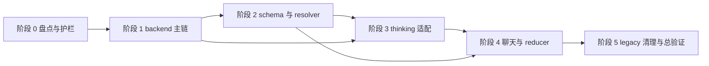

# 2026-04-09 Merge Conflict Resolution 实施计划

## 文档定位

本文将已确认的设计文档 [`2026-04-09-merge-conflict-resolution-design.md`](./2026-04-09-merge-conflict-resolution-design.md) 转换为面向实际解冲突执行的实施清单，只覆盖执行顺序、文件范围、冲突裁决原则、同步测试、验证方式、风险控制与回退策略，不包含任何代码补丁内容。

本文的使用方式是：后续在代码模式中按阶段逐步处理，每完成一阶段就先验证、再进入下一阶段，避免把所有冲突集中到最后一次性收敛。

## 与设计文档的一致性基线

后续所有文件级裁决必须以 [`2026-04-09-merge-conflict-resolution-design.md`](./2026-04-09-merge-conflict-resolution-design.md) 为最高依据。若某个文件的局部实现习惯、测试旧断言或冲突两侧语义与设计不一致，统一按下列基线裁决：

1. 唯一正式运行时主链必须收口到 `ModelRouteRef -> resolved route -> provider adapter registry`。
2. thinking 不再拥有独立 provider 真相，前端只消费后端能力快照。
3. 主链严格收口，但 thinking 适配层对可映射组合尽量放行，并将未验证但可映射组合标记为实验性。
4. 持久化与恢复以结构化 thinking selection 为唯一正式格式。
5. 正确性优先依赖测试与 CI，不依赖保留大面积 legacy 逻辑兜底。
6. 解冲突顺序必须先 backend runtime 主链，再 schema 与 resolver，再 thinking 适配，再聊天 UI 与 reducer，最后做 legacy 清理与总验证。

## 执行总原则

1. **先收口主链，再修展示层。** 后端 contracts、router、bridge、protocol、message runs 的裁决先完成，前端展示层不抢跑。
2. **先消除双真相，再补齐类型。** 若某文件同时保留 route-ref-first 和 snapshot-first 两套正式语义，优先删除旧语义而不是继续补类型。
3. **每阶段只解决一个责任层。** 不在同一提交中同时重构 backend 主链、前端 resolver、thinking UI 与 stream reducer。
4. **测试与代码同行。** 每个阶段在改主文件时同步改对应测试，不允许把测试滞后到最后补。
5. **保留最薄迁移壳，拒绝长期兼容壳。** 允许一次性读取旧结构并立即写回新结构；不允许让旧结构继续成为运行时主语义。
6. **一阶段一回退边界。** 每阶段结束前都应形成独立可回退提交或等价变更集。

## 阶段总览

| 阶段 | 名称 | 目标 | 完成标志 |
| --- | --- | --- | --- |
| 阶段 0 | 冲突盘点与护栏建立 | 明确当前未解决冲突文件、阶段边界与删除优先级 | 得到按阶段排序的冲突文件清单与验证入口 |
| 阶段 1 | backend runtime 主链收口 | 收口请求输入、resolved route、bridge 持久化与 message run 执行主链 | backend 主链不再以旧 snapshot、裸 modelId、旧 message send 为正式路径 |
| 阶段 2 | settings schema 与 route resolver 收口 | 前端设置侧与宿主 resolver 改为 route-ref-first，消除第二套 provider 真相 | schema、resolver、workbench 基础类型统一围绕 route ref |
| 阶段 3 | thinking canonical 能力与 selection 适配收口 | 统一 thinking canonical 能力、实验性标签、selection 适配与默认值生成 | thinking 规则只由后端能力快照与适配结果驱动 |
| 阶段 4 | 聊天 contract、stream、reducer 与 panel 收口 | UI 层彻底服从前面三层的单一真相 | 聊天发送、stream 消费、reducer 恢复与展示不再保留 legacy 语义 |
| 阶段 5 | legacy 删除、总验证与收尾 | 删除剩余 legacy、清理冲突标记、完成全量验证 | 仓库无冲突标记，关键测试与类型检查通过 |

## 当前冲突主文件优先清单

以下文件已出现实际冲突标记，或是设计文档指定的主链锚点，应优先纳入执行序列。优先级越高，越应先处理。

| 优先级 | 文件 | 归属阶段 | 处理原因 |
| --- | --- | --- | --- |
| P0 | [`../../backend/app/copilot_runtime/contracts.py`](../../backend/app/copilot_runtime/contracts.py) | 阶段 1 | 统一请求输入、thinking selection 与主链类型边界 |
| P0 | [`../../backend/app/copilot_runtime/router.py`](../../backend/app/copilot_runtime/router.py) | 阶段 1 | 运行时入口与错误边界核心收口点 |
| P0 | [`../../backend/app/copilot_runtime/bridge.py`](../../backend/app/copilot_runtime/bridge.py) | 阶段 1 | 持久化与恢复格式、legacy 迁移壳层核心位置 |
| P0 | [`../../backend/app/copilot_runtime/protocol.py`](../../backend/app/copilot_runtime/protocol.py) | 阶段 1 | request 与 response 契约收口 |
| P0 | [`../../backend/app/copilot_runtime/message_runs.py`](../../backend/app/copilot_runtime/message_runs.py) | 阶段 1 | run 执行主链与 thinking 适配落点 |
| P0 | [`../../frontend-copilot/electron/settings-workspace/provider-schema.ts`](../../frontend-copilot/electron/settings-workspace/provider-schema.ts) | 阶段 2 | 设置侧 schema 是否继续传播旧 provider 真相 |
| P0 | [`../../frontend-copilot/electron/settings-workspace/provider-route-resolver.ts`](../../frontend-copilot/electron/settings-workspace/provider-route-resolver.ts) | 阶段 2 | route ref 到 resolved route 的宿主输入边界 |
| P0 | [`../../frontend-copilot/src/workbench/types.ts`](../../frontend-copilot/src/workbench/types.ts) | 阶段 2 | 前端共享类型是否继续保留旧 defaultModel 与旧 provider 语义 |
| P0 | [`../../backend/app/copilot_runtime/thinking_adapter.py`](../../backend/app/copilot_runtime/thinking_adapter.py) | 阶段 3 | canonical 能力解析与 selection 适配正式锚点 |
| P0 | [`../../frontend-copilot/src/workbench/thinking-capabilities.ts`](../../frontend-copilot/src/workbench/thinking-capabilities.ts) | 阶段 3 | 前端是否继续本地推断 thinking 真相 |
| P0 | [`../../frontend-copilot/src/features/copilot/model-picker.ts`](../../frontend-copilot/src/features/copilot/model-picker.ts) | 阶段 3 | 模型目录、可用性、route ref 与 thinking 展示交汇点 |
| P0 | [`../../frontend-copilot/src/features/copilot/thread-run-contract.ts`](../../frontend-copilot/src/features/copilot/thread-run-contract.ts) | 阶段 4 | 聊天请求与运行时 transport 契约核心冲突文件 |
| P0 | [`../../frontend-copilot/src/features/copilot/runtime-message-stream.ts`](../../frontend-copilot/src/features/copilot/runtime-message-stream.ts) | 阶段 4 | stream 事件消费与 thinking 元数据传播 |
| P0 | [`../../frontend-copilot/src/features/copilot/run-segment-reducer.ts`](../../frontend-copilot/src/features/copilot/run-segment-reducer.ts) | 阶段 4 | 运行态 reducer 是否继续保留旧 selection 恢复逻辑 |
| P1 | [`../../frontend-copilot/src/features/copilot/run-segment-view-model.ts`](../../frontend-copilot/src/features/copilot/run-segment-view-model.ts) | 阶段 4 | thinking capability snapshot 与展示态收口 |
| P1 | [`../../frontend-copilot/src/features/copilot/CopilotChatPanel.tsx`](../../frontend-copilot/src/features/copilot/CopilotChatPanel.tsx) | 阶段 4 | UI 交互面是否还在偷跑本地规则 |
| P1 | [`../../frontend-copilot/src/workbench/settings/provider-profiles.ts`](../../frontend-copilot/src/workbench/settings/provider-profiles.ts) | 阶段 2 | 旧字段默认值与 route ref 迁移冲突 |
| P1 | [`../../frontend-copilot/src/workbench/settings/ProviderProfileDetails.tsx`](../../frontend-copilot/src/workbench/settings/ProviderProfileDetails.tsx) | 阶段 2 | 设置 UI 是否继续围绕旧 endpoint 与字符串 default model |
| P1 | [`../../frontend-copilot/src/workbench/settings/provider-profile-list-helpers.ts`](../../frontend-copilot/src/workbench/settings/provider-profile-list-helpers.ts) | 阶段 2 | 搜索与展示逻辑是否继续依赖旧 endpoint/provider 投影 |
| P1 | [`../../frontend-copilot/src/workbench/components/FormFields.tsx`](../../frontend-copilot/src/workbench/components/FormFields.tsx) | 阶段 2 | 设置表单冲突辅助文件，需在 schema 收口后同步裁决 |
| P1 | [`../../backend/tests/unit/desktop_runtime/test_server.py`](../../backend/tests/unit/desktop_runtime/test_server.py) | 阶段 1 与阶段 5 | 桌面 runtime 入口用例会暴露 transport 与错误语义漂移 |

## 阶段 0：冲突盘点与护栏建立

### 目标

在开始实际代码解冲突前，先锁定阶段边界、文件顺序、删除优先级与验证命令，避免多人或多次编辑导致同一个 legacy 语义在多个层级被重复保留。

### 主处理文件

- [`./2026-04-09-merge-conflict-resolution-design.md`](./2026-04-09-merge-conflict-resolution-design.md)
- [`../../backend/app/copilot_runtime/`](../../backend/app/copilot_runtime/)
- [`../../frontend-copilot/electron/settings-workspace/`](../../frontend-copilot/electron/settings-workspace/)
- [`../../frontend-copilot/src/workbench/`](../../frontend-copilot/src/workbench/)
- [`../../frontend-copilot/src/features/copilot/`](../../frontend-copilot/src/features/copilot/)

### 冲突裁决原则

1. 不在阶段 0 做功能决策，只建立执行护栏。
2. 盘点结果必须按依赖顺序组织，不能按文件字母序盲目处理。
3. 若某个文件同时属于多个阶段，以更上游依赖阶段为准。

### 执行清单

1. 通过未解决冲突列表确认真实待处理文件，并按阶段分桶。
2. 为每个阶段列出主文件、同步测试文件、预期删除的 legacy 项。
3. 明确每阶段结束后的最小验证集，写入执行单。
4. 明确回退边界：阶段未通过验证前，不进入下一阶段。

### 完成后验证方式

- 列出未解决冲突文件：`git diff --name-only --diff-filter=U`
- 搜索残留冲突标记：`git grep -n "^<<<<<<<\|^=======\|^>>>>>>>" -- backend frontend-copilot`
- 人工确认分阶段顺序与设计文档一致。

### 主要风险

- 误把测试辅助文件当成主链起点，导致裁决顺序倒置。
- 误把 `.git/rr-cache` 中的临时内容当成正式源文件。

### 回退策略

- 若盘点结果与设计文档顺序冲突，立即停止后续编辑并以设计文档重新排序。
- 阶段 0 不产生代码变更，不需要代码回退，只需要重做盘点。

## 阶段 1：backend runtime 主链收口

### 目标

先把 backend runtime 的唯一正式主链收口到 route-ref-first 输入、resolved route、provider adapter registry、structured thinking selection 与清晰错误边界。只有 backend 主链稳定后，前端才有可信的单一真相可以消费。

### 主处理文件

- [`../../backend/app/copilot_runtime/contracts.py`](../../backend/app/copilot_runtime/contracts.py)
- [`../../backend/app/copilot_runtime/router.py`](../../backend/app/copilot_runtime/router.py)
- [`../../backend/app/copilot_runtime/bridge.py`](../../backend/app/copilot_runtime/bridge.py)
- [`../../backend/app/copilot_runtime/protocol.py`](../../backend/app/copilot_runtime/protocol.py)
- [`../../backend/app/copilot_runtime/message_runs.py`](../../backend/app/copilot_runtime/message_runs.py)

### 可能同步调整文件

- [`../../backend/app/copilot_runtime/model_routes.py`](../../backend/app/copilot_runtime/model_routes.py)
- [`../../backend/app/copilot_runtime/provider_adapter_registry.py`](../../backend/app/copilot_runtime/provider_adapter_registry.py)
- [`../../backend/app/copilot_runtime/errors.py`](../../backend/app/copilot_runtime/errors.py)
- [`../../backend/app/copilot_runtime/run_events.py`](../../backend/app/copilot_runtime/run_events.py)
- [`../../backend/app/copilot_runtime/session_store.py`](../../backend/app/copilot_runtime/session_store.py)
- [`../../backend/app/copilot_runtime/legacy_event_projection.py`](../../backend/app/copilot_runtime/legacy_event_projection.py)

### 需要同步更新的测试文件

- [`../../backend/tests/unit/copilot_runtime/test_protocol.py`](../../backend/tests/unit/copilot_runtime/test_protocol.py)
- [`../../backend/tests/unit/copilot_runtime/test_router.py`](../../backend/tests/unit/copilot_runtime/test_router.py)
- [`../../backend/tests/unit/copilot_runtime/test_bridge.py`](../../backend/tests/unit/copilot_runtime/test_bridge.py)
- [`../../backend/tests/unit/copilot_runtime/test_message_runs.py`](../../backend/tests/unit/copilot_runtime/test_message_runs.py)
- [`../../backend/tests/unit/copilot_runtime/test_provider_adapter_registry.py`](../../backend/tests/unit/copilot_runtime/test_provider_adapter_registry.py)
- [`../../backend/tests/unit/copilot_runtime/test_errors.py`](../../backend/tests/unit/copilot_runtime/test_errors.py)
- [`../../backend/tests/unit/desktop_runtime/test_server.py`](../../backend/tests/unit/desktop_runtime/test_server.py)

### 冲突裁决原则

1. 保留 route-ref-first 与 resolved route 主链，删除以旧 snapshot 为正式输入的分支。
2. 结构化 thinking selection 是唯一正式持久化与恢复格式；旧 intent、旧 snapshot、裸 `modelId` 只能作为一次性读取转换入口。
3. 旧 `MESSAGE_SEND_METHOD` 不再作为正式主路径；若必须暂存，只允许保留最薄兼容壳层，并在阶段 5 删除。
4. 错误边界必须至少区分 route 解析失败、provider 不可用、thinking selection 不兼容、实验性组合被 provider 拒绝。
5. 不保留“双字段都写、双语义都读”的长期兼容代码。

### 执行清单

1. 先在 [`../../backend/app/copilot_runtime/contracts.py`](../../backend/app/copilot_runtime/contracts.py) 统一请求、selection、capability 与错误相关类型，确保其他 backend 文件引用的都是同一套正式定义。
2. 在 [`../../backend/app/copilot_runtime/protocol.py`](../../backend/app/copilot_runtime/protocol.py) 收口 transport 契约，确保 request 与 response 不再把旧 snapshot 字段当正式真相。
3. 在 [`../../backend/app/copilot_runtime/router.py`](../../backend/app/copilot_runtime/router.py) 裁决入口与错误映射，确保 routing 失败和 provider 执行失败能被区分。
4. 在 [`../../backend/app/copilot_runtime/bridge.py`](../../backend/app/copilot_runtime/bridge.py) 收口存储格式与恢复逻辑，只保留一次性 legacy 读取转换。
5. 在 [`../../backend/app/copilot_runtime/message_runs.py`](../../backend/app/copilot_runtime/message_runs.py) 统一 run 执行主链、thinking 适配接入点与 metadata 输出。
6. 同步删除或瘦身 [`../../backend/app/copilot_runtime/legacy_event_projection.py`](../../backend/app/copilot_runtime/legacy_event_projection.py) 中不再被主链依赖的旧投影逻辑。
7. 立即改对应单元测试，不让旧断言继续牵引回退到双主链。

### 完成后验证命令与验证方式

- 精准 backend 主链测试：`cd backend; uv run pytest tests/unit/copilot_runtime/test_protocol.py tests/unit/copilot_runtime/test_router.py tests/unit/copilot_runtime/test_bridge.py tests/unit/copilot_runtime/test_message_runs.py tests/unit/copilot_runtime/test_provider_adapter_registry.py tests/unit/copilot_runtime/test_errors.py`
- 桌面入口联动测试：`cd backend; uv run pytest tests/unit/desktop_runtime/test_server.py`
- backend 类型检查：`cd backend; uv run pyright app`
- 人工验证点：确认请求主路径不再依赖旧 snapshot、旧 message send 与裸 modelId 弱匹配。

### 主要风险

- 为了让测试临时通过而保留 snapshot-first 与 route-ref-first 双主路径。
- bridge 同时保留多套 selection 格式的写入路径，导致后续 reducer 继续背负复杂度。
- router 错误分类没有同步更新，导致后续前端只能拿到模糊失败。

### 回退策略

- 本阶段必须单独形成一组提交；若验证失败，只回退 backend runtime 相关文件与对应测试。
- 回退时保留阶段 0 盘点文档，不带入阶段 2 以后的任何前端修改。
- 若回退后仍无法恢复到单主链，重新从 [`./2026-04-09-merge-conflict-resolution-design.md`](./2026-04-09-merge-conflict-resolution-design.md) 校核 contracts 与 bridge 的正式格式定义。

## 阶段 2：settings schema 与 route resolver 收口

### 目标

在 backend 主链稳定后，让 Electron settings、宿主 route resolver 与 workbench 共享类型全部围绕 route ref 工作，彻底阻断前端本地 provider 真相继续扩散。

### 主处理文件

- [`../../frontend-copilot/electron/settings-workspace/provider-schema.ts`](../../frontend-copilot/electron/settings-workspace/provider-schema.ts)
- [`../../frontend-copilot/electron/settings-workspace/provider-route-resolver.ts`](../../frontend-copilot/electron/settings-workspace/provider-route-resolver.ts)
- [`../../frontend-copilot/src/workbench/types.ts`](../../frontend-copilot/src/workbench/types.ts)

### 可能同步调整文件

- [`../../frontend-copilot/electron/settings-workspace/provider-route-resolver.test.ts`](../../frontend-copilot/electron/settings-workspace/provider-route-resolver.test.ts)
- [`../../frontend-copilot/electron/settings-workspace/state-schema.ts`](../../frontend-copilot/electron/settings-workspace/state-schema.ts)
- [`../../frontend-copilot/electron/settings-workspace/service.ts`](../../frontend-copilot/electron/settings-workspace/service.ts)
- [`../../frontend-copilot/src/workbench/settings/provider-profiles.ts`](../../frontend-copilot/src/workbench/settings/provider-profiles.ts)
- [`../../frontend-copilot/src/workbench/settings/ProviderProfileDetails.tsx`](../../frontend-copilot/src/workbench/settings/ProviderProfileDetails.tsx)
- [`../../frontend-copilot/src/workbench/settings/provider-profile-list-helpers.ts`](../../frontend-copilot/src/workbench/settings/provider-profile-list-helpers.ts)
- [`../../frontend-copilot/src/workbench/settings/settings-workspace-model-options.ts`](../../frontend-copilot/src/workbench/settings/settings-workspace-model-options.ts)
- [`../../frontend-copilot/src/workbench/settings/settings-workspace-test-fixtures.ts`](../../frontend-copilot/src/workbench/settings/settings-workspace-test-fixtures.ts)
- [`../../frontend-copilot/src/workbench/components/FormFields.tsx`](../../frontend-copilot/src/workbench/components/FormFields.tsx)

### 需要同步更新的测试文件

- [`../../frontend-copilot/electron/settings-workspace/provider-route-resolver.test.ts`](../../frontend-copilot/electron/settings-workspace/provider-route-resolver.test.ts)
- [`../../frontend-copilot/electron/settings-workspace/service.test.ts`](../../frontend-copilot/electron/settings-workspace/service.test.ts)
- [`../../frontend-copilot/electron/settings-workspace/state-schema.test.ts`](../../frontend-copilot/electron/settings-workspace/state-schema.test.ts)
- [`../../frontend-copilot/src/workbench/settings/SettingsWorkspace.providers.test.tsx`](../../frontend-copilot/src/workbench/settings/SettingsWorkspace.providers.test.tsx)
- [`../../frontend-copilot/src/workbench/settings/SettingsWorkspace.persistence.test.tsx`](../../frontend-copilot/src/workbench/settings/SettingsWorkspace.persistence.test.tsx)
- [`../../frontend-copilot/src/workbench/settings/settings-workspace-save-input.test.ts`](../../frontend-copilot/src/workbench/settings/settings-workspace-save-input.test.ts)

### 冲突裁决原则

1. 设置侧默认模型与快速模型应服务于 route ref，不再让裸字符串 `defaultModel` 或 `defaultModelId` 成为正式真相。
2. [`../../frontend-copilot/electron/settings-workspace/provider-route-resolver.ts`](../../frontend-copilot/electron/settings-workspace/provider-route-resolver.ts) 只负责宿主解析输入，不成为独立 thinking 真相来源。
3. UI 与搜索辅助逻辑不得继续依赖旧 endpoint 投影或 provider 特判来推导正式能力。
4. 若旧字段仍需要读取，只允许迁移期读取与新结构写回，不继续向下游透传。
5. 若设置 UI 的通用组件冲突只是为适配新字段，可在本阶段解决，但不得扩大到聊天主链逻辑。

### 执行清单

1. 在 [`../../frontend-copilot/src/workbench/types.ts`](../../frontend-copilot/src/workbench/types.ts) 收口共享 route ref、settings provider 结构与 capability 相关正式类型。
2. 在 [`../../frontend-copilot/electron/settings-workspace/provider-schema.ts`](../../frontend-copilot/electron/settings-workspace/provider-schema.ts) 明确 route-ref-first 与 profile schema 边界，删除继续传播旧 endpoint 语义的字段职责。
3. 在 [`../../frontend-copilot/electron/settings-workspace/provider-route-resolver.ts`](../../frontend-copilot/electron/settings-workspace/provider-route-resolver.ts) 收口 route ref 到 resolved route 所需宿主输入，不再输出第二套 provider 真相。
4. 同步裁决设置 UI 辅助文件，尤其是 [`../../frontend-copilot/src/workbench/settings/provider-profiles.ts`](../../frontend-copilot/src/workbench/settings/provider-profiles.ts)、[`../../frontend-copilot/src/workbench/settings/ProviderProfileDetails.tsx`](../../frontend-copilot/src/workbench/settings/ProviderProfileDetails.tsx) 与 [`../../frontend-copilot/src/workbench/settings/provider-profile-list-helpers.ts`](../../frontend-copilot/src/workbench/settings/provider-profile-list-helpers.ts)，删除旧 default model、endpoint 搜索与旧 provider 投影残留。
5. 更新测试 fixture，保证生成的数据结构已经是 route ref 与新 settings schema，而不是旧字符串字段。

### 完成后验证命令与验证方式

- settings 与 resolver 精准测试：`cd frontend-copilot; npx vitest run electron/settings-workspace/provider-route-resolver.test.ts electron/settings-workspace/service.test.ts electron/settings-workspace/state-schema.test.ts src/workbench/settings/SettingsWorkspace.providers.test.tsx src/workbench/settings/SettingsWorkspace.persistence.test.tsx src/workbench/settings/settings-workspace-save-input.test.ts`
- 前端类型检查：`cd frontend-copilot; npm run typecheck`
- 人工验证点：确认默认模型保存、回显与传递使用 route ref 而非裸 modelId；确认 resolver 不再携带旧 snapshot 主语义。

### 主要风险

- `defaultModel` 与 `defaultModelId` 双字段继续并存，后续聊天模型选择会再次分叉。
- 设置页搜索、表单与详情页继续依赖旧 endpoint 或 provider 投影，形成新的前端本地真相。
- fixture 未更新导致测试仍在隐式要求旧字段。

### 回退策略

- 若本阶段验证失败，只回退 settings schema、resolver、workbench 类型与对应测试，不回退阶段 1 的 backend 主链。
- 若失败原因来自共享类型漂移，先冻结 UI 辅助改动，保留最小 schema 与 resolver 修复，再逐步恢复界面层变更。

## 阶段 3：thinking canonical 能力与 selection 适配收口

### 目标

以 backend `thinking_adapter` 为正式能力锚点，统一 canonical capability、selection 适配、默认值生成、实验性标签与前端展示转换，彻底移除前端本地 provider × thinking 推断矩阵的主语义地位。

### 主处理文件

- [`../../backend/app/copilot_runtime/thinking_adapter.py`](../../backend/app/copilot_runtime/thinking_adapter.py)
- [`../../frontend-copilot/src/workbench/thinking-capabilities.ts`](../../frontend-copilot/src/workbench/thinking-capabilities.ts)
- [`../../frontend-copilot/src/features/copilot/model-picker.ts`](../../frontend-copilot/src/features/copilot/model-picker.ts)

### 可能同步调整文件

- [`../../backend/app/copilot_runtime/provider_adapter_registry.py`](../../backend/app/copilot_runtime/provider_adapter_registry.py)
- [`../../backend/app/copilot_runtime/errors.py`](../../backend/app/copilot_runtime/errors.py)
- [`../../frontend-copilot/src/workbench/thinking-display.ts`](../../frontend-copilot/src/workbench/thinking-display.ts)
- [`../../frontend-copilot/src/workbench/types.ts`](../../frontend-copilot/src/workbench/types.ts)
- [`../../frontend-copilot/src/features/copilot/CopilotThinkingSelector.test.tsx`](../../frontend-copilot/src/features/copilot/CopilotThinkingSelector.test.tsx)

### 需要同步更新的测试文件

- [`../../backend/tests/unit/copilot_runtime/test_thinking_adapter.py`](../../backend/tests/unit/copilot_runtime/test_thinking_adapter.py)
- [`../../backend/tests/unit/copilot_runtime/test_message_runs.py`](../../backend/tests/unit/copilot_runtime/test_message_runs.py)
- [`../../frontend-copilot/src/workbench/thinking-capabilities.test.ts`](../../frontend-copilot/src/workbench/thinking-capabilities.test.ts)
- [`../../frontend-copilot/src/features/copilot/model-picker.test.ts`](../../frontend-copilot/src/features/copilot/model-picker.test.ts)
- [`../../frontend-copilot/src/features/copilot/CopilotThinkingSelector.test.tsx`](../../frontend-copilot/src/features/copilot/CopilotThinkingSelector.test.tsx)

### 冲突裁决原则

1. verified 与 experimental 的能力分层由后端 canonical 能力解析与 selection 适配联合决定，前端只做消费与展示转换。
2. provider 品牌身份只影响推荐、文案与风险强度，不再成为可选 thinking 挡位的硬上限。
3. 只要协议形状可映射，就尽量放行并标记实验性；不可映射时再回退到基础开关两档兜底。
4. route 切换且 selection 不兼容时，必须清空旧 selection 并按新能力快照生成默认值。
5. 若某些显式 declaration 或 override 输入仍然存在，只能作为后端 canonical 化的输入，不得直接取代后端快照结论。

### 执行清单

1. 在 [`../../backend/app/copilot_runtime/thinking_adapter.py`](../../backend/app/copilot_runtime/thinking_adapter.py) 统一 canonical capability、provider mapping、experimental 判定、selection 适配与默认值策略。
2. 在 [`../../frontend-copilot/src/workbench/thinking-capabilities.ts`](../../frontend-copilot/src/workbench/thinking-capabilities.ts) 删除本地 provider、protocol、endpoint、modelId 规则推断矩阵，让其只消费能力快照与展示所需派生值。
3. 在 [`../../frontend-copilot/src/features/copilot/model-picker.ts`](../../frontend-copilot/src/features/copilot/model-picker.ts) 收口模型目录与 thinking 选项来源，确保 route ref、可用性与 capability 展示都来自统一快照语义。
4. 同步更新 message run 相关测试，确保 experimental、unsupported、selection incompatible 等边界能通过 backend 与 frontend 两侧断言体现。
5. 删除旧 thinking level intent 作为长期正式存储的路径，只保留结构化 selection 与必要转换。

### 完成后验证命令与验证方式

- backend thinking 精准测试：`cd backend; uv run pytest tests/unit/copilot_runtime/test_thinking_adapter.py tests/unit/copilot_runtime/test_message_runs.py`
- 前端 thinking 精准测试：`cd frontend-copilot; npx vitest run src/workbench/thinking-capabilities.test.ts src/features/copilot/model-picker.test.ts src/features/copilot/CopilotThinkingSelector.test.tsx`
- 前端类型检查：`cd frontend-copilot; npm run typecheck`
- 人工验证点：确认前端不再本地推断 provider 对应的 thinking 上限；确认未验证但可映射组合会显示实验性标签。

### 主要风险

- 前端残留 built-in 推断矩阵，导致后端快照与本地推断出现分叉。
- 为兼容旧 UI 而继续长期保留 thinking level intent 与 structured selection 双正式语义。
- experimental 标签只在后端存在、前端未同步消费，导致用户误判风险。

### 回退策略

- 仅回退阶段 3 的 thinking 相关文件与测试，保留阶段 1 与阶段 2 已稳定的 route 主链与 schema。
- 若失败原因来自 capability 形状变化，先锁定 backend 输出结构，再最小化调整前端展示层，不反向恢复本地推断矩阵。

## 阶段 4：聊天 contract、stream、reducer 与 panel 收口

### 目标

让聊天发送、stream 消费、run reducer、view model 与聊天面板完全服从前面三层形成的单一真相，删除 UI 内仍可能残留的 legacy 恢复逻辑、事件语义别名与 selection 保留路径。

### 主处理文件

- [`../../frontend-copilot/src/features/copilot/thread-run-contract.ts`](../../frontend-copilot/src/features/copilot/thread-run-contract.ts)
- [`../../frontend-copilot/src/features/copilot/CopilotChatPanel.tsx`](../../frontend-copilot/src/features/copilot/CopilotChatPanel.tsx)
- [`../../frontend-copilot/src/features/copilot/runtime-message-stream.ts`](../../frontend-copilot/src/features/copilot/runtime-message-stream.ts)
- [`../../frontend-copilot/src/features/copilot/run-segment-reducer.ts`](../../frontend-copilot/src/features/copilot/run-segment-reducer.ts)
- [`../../frontend-copilot/src/features/copilot/run-segment-view-model.ts`](../../frontend-copilot/src/features/copilot/run-segment-view-model.ts)

### 可能同步调整文件

- [`../../frontend-copilot/src/features/copilot/chat-contract.ts`](../../frontend-copilot/src/features/copilot/chat-contract.ts)
- [`../../frontend-copilot/src/features/copilot/copilot-chat-helpers.ts`](../../frontend-copilot/src/features/copilot/copilot-chat-helpers.ts)
- [`../../frontend-copilot/src/features/copilot/components/ModelPicker.tsx`](../../frontend-copilot/src/features/copilot/components/ModelPicker.tsx)
- [`../../frontend-copilot/src/features/copilot/CopilotComposer.tsx`](../../frontend-copilot/src/features/copilot/CopilotComposer.tsx)

### 需要同步更新的测试文件

- [`../../frontend-copilot/src/features/copilot/thread-run-contract.primary-path.test.ts`](../../frontend-copilot/src/features/copilot/thread-run-contract.primary-path.test.ts)
- [`../../frontend-copilot/src/features/copilot/runtime-message-stream.test.ts`](../../frontend-copilot/src/features/copilot/runtime-message-stream.test.ts)
- [`../../frontend-copilot/src/features/copilot/run-segment-reducer.test.ts`](../../frontend-copilot/src/features/copilot/run-segment-reducer.test.ts)
- [`../../frontend-copilot/src/features/copilot/run-segment-view-model.test.ts`](../../frontend-copilot/src/features/copilot/run-segment-view-model.test.ts)
- [`../../frontend-copilot/src/features/copilot/CopilotChatPanel.test.tsx`](../../frontend-copilot/src/features/copilot/CopilotChatPanel.test.tsx)
- [`../../frontend-copilot/src/features/copilot/CopilotChatPanel.composer.test.tsx`](../../frontend-copilot/src/features/copilot/CopilotChatPanel.composer.test.tsx)
- [`../../frontend-copilot/src/features/copilot/chat-contract.capabilities.test.ts`](../../frontend-copilot/src/features/copilot/chat-contract.capabilities.test.ts)
- [`../../frontend-copilot/src/features/copilot/chat-contract.message.test.ts`](../../frontend-copilot/src/features/copilot/chat-contract.message.test.ts)

### 冲突裁决原则

1. 聊天 transport 必须服从阶段 1 已收口的 backend 主链，不继续保留前端私有 transport 语义。
2. reducer 与 panel 不得继续保存不兼容旧 selection，也不得自行恢复已失效 route 的旧状态。
3. runtime stream 事件中的 resolved route、thinking capability snapshot 与错误分类必须原样消费，不允许前端再根据旧 snapshot 进行二次脑补。
4. 如需兼容旧事件，只允许在单个边界函数做临时归一化，不能在 reducer、panel、view model 各自复制兼容分支。
5. 任何仍依赖旧 `message/send`、旧 snapshot 或裸 modelId 的 UI 路径，都应在本阶段删除。

### 执行清单

1. 在 [`../../frontend-copilot/src/features/copilot/thread-run-contract.ts`](../../frontend-copilot/src/features/copilot/thread-run-contract.ts) 收口 transport request 与 response 形状，删除旧主路径或降级为极薄兼容入口。
2. 在 [`../../frontend-copilot/src/features/copilot/runtime-message-stream.ts`](../../frontend-copilot/src/features/copilot/runtime-message-stream.ts) 统一 stream 事件消费与 metadata 解析，不再拼接旧 thinking 字段。
3. 在 [`../../frontend-copilot/src/features/copilot/run-segment-reducer.ts`](../../frontend-copilot/src/features/copilot/run-segment-reducer.ts) 实现 route 变化导致 selection 失效后的清空与默认重建，不保留旧兼容缓存逻辑。
4. 在 [`../../frontend-copilot/src/features/copilot/run-segment-view-model.ts`](../../frontend-copilot/src/features/copilot/run-segment-view-model.ts) 与 [`../../frontend-copilot/src/features/copilot/CopilotChatPanel.tsx`](../../frontend-copilot/src/features/copilot/CopilotChatPanel.tsx) 同步展示态，保证 UI 只反映统一快照。
5. 更新聊天面板与 transport 测试，使断言聚焦 route ref、resolved route、thinking snapshot 与清晰错误码，而不是旧别名字段。

### 完成后验证命令与验证方式

- 前端聊天主链精准测试：`cd frontend-copilot; npx vitest run src/features/copilot/thread-run-contract.primary-path.test.ts src/features/copilot/runtime-message-stream.test.ts src/features/copilot/run-segment-reducer.test.ts src/features/copilot/run-segment-view-model.test.ts src/features/copilot/CopilotChatPanel.test.tsx src/features/copilot/CopilotChatPanel.composer.test.tsx src/features/copilot/chat-contract.capabilities.test.ts src/features/copilot/chat-contract.message.test.ts`
- 前端类型检查：`cd frontend-copilot; npm run typecheck`
- 前端静态检查：`cd frontend-copilot; npm run lint`
- 人工验证点：确认路由切换时旧 selection 会失效并重建默认值；确认错误提示能区分 route、provider、thinking incompatible 与 experimental rejection。

### 主要风险

- transport 层与 reducer 层同时保留旧字段，导致 UI 看似通过但主链仍是双语义。
- stream 事件兼容逻辑散落在多个文件，后续难以删除。
- panel 为了维持旧交互体验，偷偷保留本地 provider 或旧 selection 恢复逻辑。

### 回退策略

- 本阶段只回退聊天相关文件与测试，不回退阶段 1 到阶段 3 的主链与能力定义。
- 若失败原因是 transport 契约不稳定，应先冻结 panel 与 reducer 改动，回到 [`../../frontend-copilot/src/features/copilot/thread-run-contract.ts`](../../frontend-copilot/src/features/copilot/thread-run-contract.ts) 重新确认唯一 transport 形状。

## 阶段 5：legacy 删除、总验证与收尾

### 目标

在四个功能阶段全部稳定后，完成残余 legacy 清理、冲突标记清零、全量关键测试与最终一致性检查，确保仓库不会在后续继续回到双主链、双真相或前端本地推断状态。

### 主处理文件

- 阶段 1 到阶段 4 中所有实际改动文件
- [`../../backend/tests/unit/desktop_runtime/test_server.py`](../../backend/tests/unit/desktop_runtime/test_server.py)
- [`../../frontend-copilot/src/workbench/settings/settings-workspace-test-fixtures.ts`](../../frontend-copilot/src/workbench/settings/settings-workspace-test-fixtures.ts)
- [`../../frontend-copilot/src/features/copilot/chat-contract.test-support.ts`](../../frontend-copilot/src/features/copilot/chat-contract.test-support.ts)
- [`../../frontend-copilot/src/features/copilot/thread-run-contract.test-support.ts`](../../frontend-copilot/src/features/copilot/thread-run-contract.test-support.ts)

### 优先删除的 legacy 内容

以下内容应在阶段 5 作为明确删除清单逐项清零，除非某项在更早阶段已删除：

1. 旧 `MESSAGE_SEND_METHOD` 作为正式聊天主路径的语义与相关主断言。
2. 旧 snapshot-first 请求载荷与以 snapshot 为正式真相的字段传播。
3. 裸 `modelId` 弱匹配作为默认模型或恢复逻辑的主路径。
4. 前端本地 provider × thinking 推断矩阵，包括基于 provider、protocol、endpoint、modelId 的硬编码上限。
5. 旧离散 thinking intent、旧 snapshot、旧 selection 多格式并存写入逻辑。
6. `provider === openai ? openai-compatible : provider` 一类旧 provider 投影规则。
7. 设置侧仅为兼容旧字符串模型而保留的 `defaultModel`、`defaultModelId` 双真相结构。
8. UI 或 reducer 内对不兼容旧 selection 的保留与回填逻辑。
9. 仅为旧事件形状服务的 stream 兼容别名与冗余投影。

### 需要同步更新的测试文件

- [`../../backend/tests/unit/copilot_runtime/`](../../backend/tests/unit/copilot_runtime/)
- [`../../backend/tests/unit/desktop_runtime/test_server.py`](../../backend/tests/unit/desktop_runtime/test_server.py)
- [`../../frontend-copilot/src/features/copilot/`](../../frontend-copilot/src/features/copilot/)
- [`../../frontend-copilot/src/workbench/`](../../frontend-copilot/src/workbench/)

### 冲突裁决原则

1. 清理优先于保留。只要主链与测试已覆盖，就优先删除遗留兼容代码。
2. 兼容层若仍然存在，必须能解释其删除时间点；无法解释时直接删。
3. 删除后若测试失败，应先补测试或修主链，不回退 legacy 逻辑本身。

### 执行清单

1. 全仓再次搜索冲突标记，确保正式源文件中不存在 `<<<<<<<`、`=======`、`>>>>>>>`。
2. 全仓搜索 legacy 关键词，逐项确认已删或降级为最薄迁移壳。
3. 统一更新 test support 与 fixtures，避免旧结构继续通过辅助函数流入测试。
4. 运行 backend 与 frontend 的关键全量验证。
5. 人工对照 [`./2026-04-09-merge-conflict-resolution-design.md`](./2026-04-09-merge-conflict-resolution-design.md) 做最终一致性检查。

### 完成后验证命令与验证方式

- 冲突标记清零检查：`git grep -n "^<<<<<<<\|^=======\|^>>>>>>>" -- backend frontend-copilot`
- backend 关键全量测试：`cd backend; uv run pytest tests/unit/copilot_runtime tests/unit/desktop_runtime/test_server.py`
- backend 类型检查：`cd backend; uv run pyright app`
- frontend 关键全量测试：`cd frontend-copilot; npm run test`
- frontend 类型检查：`cd frontend-copilot; npm run typecheck`
- frontend 静态检查：`cd frontend-copilot; npm run lint`
- 人工比对：确认设计文档中的六条核心约束全部落地，尤其是主链收口、后端单一真相、experimental 标记、structured selection 正式化与 legacy 激进清理。

### 主要风险

- 测试 support 或 fixtures 仍在偷偷制造旧语义输入，导致 legacy 看似已删、实际仍被间接依赖。
- 为了尽快结束冲突而跳过全量类型检查，导致后续再出现跨层回归。
- 冲突标记虽然清空，但同一语义在不同文件中留下了双实现。

### 回退策略

- 若全量验证失败，优先回退本阶段的纯清理提交，不回退前四阶段已经通过验证的结构性裁决。
- 若失败根因来自更早阶段设计偏离，应基于失败点回退到最近的已通过阶段提交，而不是重新引入 legacy。

## 建议的提交与执行粒度

为保证可回退与可审查，建议按以下粒度执行，而不是一次性提交所有改动：

1. 阶段 1 backend 主链与 backend 测试。
2. 阶段 2 settings schema、resolver、workbench 类型与对应测试。
3. 阶段 3 thinking adapter、thinking capabilities、model picker 与对应测试。
4. 阶段 4 聊天 contract、stream、reducer、panel 与对应测试。
5. 阶段 5 legacy 清理、fixtures 与全量验证收尾。

每个粒度都应满足：

- 改动范围清晰；
- 验证命令可以独立运行；
- 可以在不影响前一阶段稳定性的前提下单独回退。

## 最终验收口径

只有同时满足以下条件，才可认为本轮合并冲突真正解决完毕：

1. backend 与 frontend 正式源文件中已无冲突标记。
2. 运行时唯一主链已经收口到 route ref、resolved route 与 provider adapter registry。
3. 前端不再持有独立 provider 真相，也不再本地推断 thinking 上限。
4. 结构化 thinking selection 已成为唯一正式存储与恢复格式。
5. experimental 与 incompatible 等关键错误边界能被测试明确区分。
6. 优先删除的 legacy 清单已清零或仅剩明确标注、可解释、可在后续立即删除的极薄迁移壳。

## 一致性检查结论

本实施计划与 [`2026-04-09-merge-conflict-resolution-design.md`](./2026-04-09-merge-conflict-resolution-design.md) 保持一致，未引入与设计相冲突的新主链、新真相来源或长期兼容目标。后续若代码冲突中的局部实现与本文不一致，仍应以设计文档为准，并回到本文对应阶段重新裁决。
