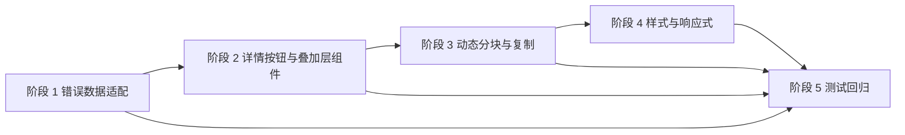

# 2026-04-12 聊天失败卡片错误详情叠加层实施计划

## 文档定位

本文将已确认设计文档 [`2026-04-12-error-detail-overlay-design.md`](./2026-04-12-error-detail-overlay-design.md) 转换为可直接委派给 code 模式的实施计划。范围仅覆盖实施阶段划分、目标文件、数据适配方案、动态分块落地规则、样式与交互收口、测试回归与风险控制，不包含任何代码实现，也不修改 Markdown 以外的文件。

后续代码实施必须始终以 [`2026-04-12-error-detail-overlay-design.md`](./2026-04-12-error-detail-overlay-design.md) 为最高依据；若局部现状、旧测试断言或临时实现习惯与设计口径冲突，统一以设计文档和本文的阶段顺序裁决。

## 实施目标

1. 在不破坏失败卡片默认简洁性的前提下，为三类失败来源提供统一的错误详情叠加层入口与承载结构。
2. 在错误进入聊天消息链路时建立统一错误详情视图模型，避免详情组件直接拼接多源底层错误对象。
3. 将动态分块实现为“信息组驱动”的稳定渲染与复制机制，而不是按失败来源写死布局。
4. 把总复制与单块复制沉淀为独立 helper，确保复制输出稳定、结构化、可转交。
5. 通过独立 overlay 组件、view-model 文件、copy helper、styles 与测试文件，让后续实现具备清晰边界、便于回归。

## 执行原则

1. **先数据适配，后界面渲染。** 先把发送前校验失败、`run/start` 请求失败、流式运行失败统一整理成单一详情输入，再接入详情按钮和 overlay。
2. **先稳定最小链路，后补增强能力。** 先打通“失败卡片可打开统一详情层”的主链路，再补动态分块、复制、响应式与交互细节。
3. **默认卡片保持克制。** 任何新增字段、诊断内容、原始详情都只能进入 overlay，不得回流到消息主 UI。
4. **信息组驱动优先于失败类型驱动。** 三类失败只在适配阶段分流，进入展示层后统一按信息组排序、渲染与复制。
5. **测试与文件边界同步建立。** 新增独立组件、view-model、copy helper 与样式文件时，同步新增专属测试，避免后续只能依赖大而杂的集成测试排查问题。

## 建议新增文件与主要改动文件

### 必改文件

- [`frontend-copilot/src/features/copilot/CopilotMessageList.tsx`](../../frontend-copilot/src/features/copilot/CopilotMessageList.tsx)
- [`frontend-copilot/src/features/copilot/CopilotPanelShell.tsx`](../../frontend-copilot/src/features/copilot/CopilotPanelShell.tsx)
- [`frontend-copilot/src/features/copilot/run-segment-view-model.ts`](../../frontend-copilot/src/features/copilot/run-segment-view-model.ts)
- [`frontend-copilot/src/features/copilot/copilot-chat-helpers.ts`](../../frontend-copilot/src/features/copilot/copilot-chat-helpers.ts)

### 建议新增文件

- [`frontend-copilot/src/features/copilot/error-detail-overlay-view-model.ts`](../../frontend-copilot/src/features/copilot/error-detail-overlay-view-model.ts)
- [`frontend-copilot/src/features/copilot/error-detail-overlay-copy.ts`](../../frontend-copilot/src/features/copilot/error-detail-overlay-copy.ts)
- [`frontend-copilot/src/features/copilot/ErrorDetailOverlay.tsx`](../../frontend-copilot/src/features/copilot/ErrorDetailOverlay.tsx)
- [`frontend-copilot/src/features/copilot/error-detail-overlay.css`](../../frontend-copilot/src/features/copilot/error-detail-overlay.css)

### 需要同步更新或新增的测试文件

- [`frontend-copilot/src/features/copilot/CopilotMessageList.segment.test.tsx`](../../frontend-copilot/src/features/copilot/CopilotMessageList.segment.test.tsx)
- [`frontend-copilot/src/features/copilot/CopilotPanelShell.diagnostic.test.tsx`](../../frontend-copilot/src/features/copilot/CopilotPanelShell.diagnostic.test.tsx)
- [`frontend-copilot/src/features/copilot/copilot-chat-helpers.test.ts`](../../frontend-copilot/src/features/copilot/copilot-chat-helpers.test.ts)
- [`frontend-copilot/src/features/copilot/run-segment-view-model.test.ts`](../../frontend-copilot/src/features/copilot/run-segment-view-model.test.ts)
- [`frontend-copilot/src/features/copilot/error-detail-overlay-view-model.test.ts`](../../frontend-copilot/src/features/copilot/error-detail-overlay-view-model.test.ts)
- [`frontend-copilot/src/features/copilot/error-detail-overlay-copy.test.ts`](../../frontend-copilot/src/features/copilot/error-detail-overlay-copy.test.ts)
- [`frontend-copilot/src/features/copilot/ErrorDetailOverlay.test.tsx`](../../frontend-copilot/src/features/copilot/ErrorDetailOverlay.test.tsx)

## 阶段总览

| 阶段 | 名称 | 目标 | 主要文件组 | 完成标志 |
| --- | --- | --- | --- | --- |
| 阶段 1 | 错误数据适配 | 统一三类失败来源的错误详情视图模型输入，并补齐发送前失败与 `run/start` 失败的结构化字段保留 | [`copilot-chat-helpers.ts`](../../frontend-copilot/src/features/copilot/copilot-chat-helpers.ts)、[`run-segment-view-model.ts`](../../frontend-copilot/src/features/copilot/run-segment-view-model.ts)、[`error-detail-overlay-view-model.ts`](../../frontend-copilot/src/features/copilot/error-detail-overlay-view-model.ts) | 三类失败都能生成最小可打开的详情模型 |
| 阶段 2 | 详情按钮与叠加层组件 | 在失败卡片上接入低权重详情入口，并建立 overlay 打开、关闭、选中失败项传递与基础 dialog 骨架 | [`CopilotMessageList.tsx`](../../frontend-copilot/src/features/copilot/CopilotMessageList.tsx)、[`CopilotPanelShell.tsx`](../../frontend-copilot/src/features/copilot/CopilotPanelShell.tsx)、[`ErrorDetailOverlay.tsx`](../../frontend-copilot/src/features/copilot/ErrorDetailOverlay.tsx) | 所有失败卡片可打开统一 overlay，默认卡片仍然简洁 |
| 阶段 3 | 动态分块与复制 | 落地信息组生成、稳定排序、空块处理、总复制与单块复制格式 | [`error-detail-overlay-view-model.ts`](../../frontend-copilot/src/features/copilot/error-detail-overlay-view-model.ts)、[`error-detail-overlay-copy.ts`](../../frontend-copilot/src/features/copilot/error-detail-overlay-copy.ts)、[`ErrorDetailOverlay.tsx`](../../frontend-copilot/src/features/copilot/ErrorDetailOverlay.tsx) | overlay 按当前错误真实信息组动态渲染，并支持稳定复制输出 |
| 阶段 4 | 样式与响应式 | 收口极简视觉、图标按钮、面板分隔、移动端布局、关闭与焦点行为 | [`error-detail-overlay.css`](../../frontend-copilot/src/features/copilot/error-detail-overlay.css)、[`ErrorDetailOverlay.tsx`](../../frontend-copilot/src/features/copilot/ErrorDetailOverlay.tsx)、[`CopilotMessageList.tsx`](../../frontend-copilot/src/features/copilot/CopilotMessageList.tsx) | overlay 在桌面与移动宽度下均可读、可关闭、可扫描 |
| 阶段 5 | 测试回归 | 同步更新现有测试，补齐新增 view-model、copy helper 与 overlay 交互测试 | 上述相关测试文件 | 三类失败链路、复制、排序、空状态与主 UI 简洁性均有覆盖 |



## 阶段 1：错误数据适配

### 目标

在消息渲染链路中尽早形成统一错误详情视图模型，保证三类失败来源最终都能投影为同一套 overlay 输入结构，并补齐当前发送前校验失败与 `run/start` 请求失败的数据保留不足问题。

### 目标文件

- [`frontend-copilot/src/features/copilot/copilot-chat-helpers.ts`](../../frontend-copilot/src/features/copilot/copilot-chat-helpers.ts)
- [`frontend-copilot/src/features/copilot/run-segment-view-model.ts`](../../frontend-copilot/src/features/copilot/run-segment-view-model.ts)
- [`frontend-copilot/src/features/copilot/error-detail-overlay-view-model.ts`](../../frontend-copilot/src/features/copilot/error-detail-overlay-view-model.ts)
- 如实现者需要共享类型，也可在 [`frontend-copilot/src/features/copilot/run-segment-types.ts`](../../frontend-copilot/src/features/copilot/run-segment-types.ts) 增补与错误详情模型相关的公共类型

### 三类失败来源统一方案

建议在 [`error-detail-overlay-view-model.ts`](../../frontend-copilot/src/features/copilot/error-detail-overlay-view-model.ts) 定义一套独立的错误详情模型，例如：

- overlay 顶层实体：失败标题、简短说明、失败来源、失败阶段、是否存在原始详情、已排序信息组、总复制文本输入。
- 信息组实体：组键、标题、简短说明、排序权重、内容项、空状态说明、单块复制输入。
- 内容项实体：键值行、短列表、原始文本块三类最小渲染单元。

三类失败统一时建议按下列原则落地：

| 失败来源 | 当前可直接复用字段 | 需要补保留字段 | 适配重点 |
| --- | --- | --- | --- |
| 发送前校验失败 | 当前用户可见失败文案、已知错误码映射逻辑 | `code`、`details`、`stage`、`requestedMethod`、触发动作、原始 message 或等价摘要 | 不再只保留字符串 `sendError`，而是保留结构化失败对象，供 overlay 生成摘要块与请求上下文块 |
| `run/start` 请求失败 | [`RuntimeRequestError`](../../frontend-copilot/src/features/copilot/thread-run-contract.ts) 已有 `code`、`status`、`details` | `stage`、`requestedMethod`、用户文案与原始 message 的并存字段，必要时保留 status | 保持主卡片简洁文案，但把请求层错误上下文继续携带到消息列表模型 |
| 流式运行失败 | [`CopilotTerminalMessageItem`](../../frontend-copilot/src/features/copilot/run-segment-view-model.ts) 中 `failure`、`requestOptions`、`resolvedModelId`、`resolvedModelRoute`、`resolvedToolIds` | 若当前 terminal failure 未显式保留摘要标题，可在 view-model 层补投影字段 | 复用 terminal message 已有结构化字段，优先生成完整的摘要、请求 / 运行上下文、工具 / 模型上下文与原始详情块 |

### 统一字段策略

1. **可直接复用字段**
   - 流式失败中的 `failure.code`、`failure.message`、`failure.details`
   - terminal 或 run state 中的 `resolvedModelId`、`resolvedModelRoute`、`resolvedToolIds`、`requestOptions`
   - 请求错误中的 `RuntimeRequestError.code`、`RuntimeRequestError.status`、`RuntimeRequestError.details`
   - 当前主卡片使用的简洁失败标题与用户向失败文案

2. **需要额外保留的字段**
   - `stage`：用于统一归入请求 / 运行上下文块，并帮助区分发送前与启动后失败阶段
   - `requestedMethod`：用于说明失败发生在何种请求动作，如 thread 或 run/start
   - `rawMessage` 或等价字段：保留未经产品化改写的原始错误 message，仅用于原始详情块
   - `summaryMessage`：保留当前主 UI 用的简洁失败结论，避免 overlay 重新依赖展示层字符串
   - `source`：明确属于 `preflight`、`run-start`、`streaming`，但只用于适配，不外泄为 UI 文案

3. **最小兜底模型**
   - 即使只有标题与简洁失败文案，也要生成一个最小摘要块。
   - 没有 `details`、`stage` 或上下文字段时，overlay 仍可打开，并在后续分块阶段显示克制空状态。

### 本阶段实施清单

1. 梳理 [`CopilotPanelShell.tsx`](../../frontend-copilot/src/features/copilot/CopilotPanelShell.tsx) 目前把 `sendError` / `sessionError` 作为纯字符串传给 [`CopilotMessageList.tsx`](../../frontend-copilot/src/features/copilot/CopilotMessageList.tsx) 的链路，规划为结构化错误输入。
2. 在 [`copilot-chat-helpers.ts`](../../frontend-copilot/src/features/copilot/copilot-chat-helpers.ts) 为发送前校验失败与 `run/start` 请求失败定义新的结构化失败适配 helper，保留用户文案与原始诊断字段并行存在。
3. 在 [`run-segment-view-model.ts`](../../frontend-copilot/src/features/copilot/run-segment-view-model.ts) 为 terminal 失败项补充 overlay 所需字段，或增加可选 `errorDetail` 投影字段，避免 [`CopilotMessageList.tsx`](../../frontend-copilot/src/features/copilot/CopilotMessageList.tsx) 再次拼底层对象。
4. 在 [`error-detail-overlay-view-model.ts`](../../frontend-copilot/src/features/copilot/error-detail-overlay-view-model.ts) 统一提供从不同失败消息项构建 overlay 模型的入口函数。
5. 明确“主卡片字符串”和“overlay 结构化数据”分离，确保后续样式或文本改动不会影响错误详情生成。

### 完成标志

- 三类失败都能被统一适配为一个错误详情视图模型。
- 发送前校验失败与 `run/start` 请求失败不再只有一句失败文案。
- 流式运行失败可直接复用 terminal 字段生成 overlay 输入。

## 阶段 2：详情按钮与叠加层组件

### 目标

在现有失败卡片保持简洁的前提下，为失败卡片接入低权重详情按钮，并建立统一 overlay 组件、打开关闭状态与选中失败项传递链路。

### 目标文件

- [`frontend-copilot/src/features/copilot/CopilotMessageList.tsx`](../../frontend-copilot/src/features/copilot/CopilotMessageList.tsx)
- [`frontend-copilot/src/features/copilot/CopilotPanelShell.tsx`](../../frontend-copilot/src/features/copilot/CopilotPanelShell.tsx)
- [`frontend-copilot/src/features/copilot/ErrorDetailOverlay.tsx`](../../frontend-copilot/src/features/copilot/ErrorDetailOverlay.tsx)
- [`frontend-copilot/src/features/copilot/error-detail-overlay-view-model.ts`](../../frontend-copilot/src/features/copilot/error-detail-overlay-view-model.ts)

### 组件边界建议

1. [`CopilotPanelShell.tsx`](../../frontend-copilot/src/features/copilot/CopilotPanelShell.tsx)
   - 承担 overlay 选中项状态与打开关闭状态。
   - 作为聊天区域与 overlay 的共同宿主，避免把对话框状态散落在单条消息内部。
   - 负责把当前选中的错误详情模型传给 [`ErrorDetailOverlay.tsx`](../../frontend-copilot/src/features/copilot/ErrorDetailOverlay.tsx)。

2. [`CopilotMessageList.tsx`](../../frontend-copilot/src/features/copilot/CopilotMessageList.tsx)
   - 仅在失败卡片上渲染图标按钮，不自行持有 overlay 宿主。
   - 在 terminal / transient 错误消息上判断是否存在可打开详情模型。
   - 继续保持失败卡片正文简洁，不新增详情正文片段。

3. [`ErrorDetailOverlay.tsx`](../../frontend-copilot/src/features/copilot/ErrorDetailOverlay.tsx)
   - 只负责 dialog 骨架、标题区、块列表区、空状态区和复制按钮交互。
   - 不关心原始失败来源，只接收统一详情模型。

### 本阶段实施清单

1. 在 [`CopilotMessageList.tsx`](../../frontend-copilot/src/features/copilot/CopilotMessageList.tsx) 为失败项增加详情图标按钮渲染条件，限定只有具备 `errorDetail` 或可构建 overlay 模型的失败项才显示入口。
2. 将 [`CopilotPanelShell.tsx`](../../frontend-copilot/src/features/copilot/CopilotPanelShell.tsx) 当前传给消息列表的 `transientError` 从字符串规划为结构化错误输入，避免 transient 失败无法查看详情。
3. 在 [`CopilotPanelShell.tsx`](../../frontend-copilot/src/features/copilot/CopilotPanelShell.tsx) 添加 overlay 选中态、关闭态和事件回调，并把回调透传给 [`CopilotMessageList.tsx`](../../frontend-copilot/src/features/copilot/CopilotMessageList.tsx)。
4. 新增 [`ErrorDetailOverlay.tsx`](../../frontend-copilot/src/features/copilot/ErrorDetailOverlay.tsx) 的基础 dialog 骨架，包括标题、关闭按钮、总复制按钮、主体区容器与空状态占位。
5. 复核现有设置页 dialog 交互语义，沿用同类遮罩、Esc 关闭与焦点回收口径，但不在计划阶段展开具体实现细节。

### 完成标志

- 失败卡片存在稳定的详情按钮入口。
- overlay 打开关闭链路完整，且不要求消息列表内部管理全局对话框状态。
- 默认失败卡片仍然只显示简洁标题与失败摘要。

## 阶段 3：动态分块与复制

### 目标

把设计中的动态分块与复制规则沉淀为独立 view-model 与 copy helper，确保不同失败来源进入 overlay 后拥有一致的阅读顺序、空状态策略与复制格式。

### 目标文件

- [`frontend-copilot/src/features/copilot/error-detail-overlay-view-model.ts`](../../frontend-copilot/src/features/copilot/error-detail-overlay-view-model.ts)
- [`frontend-copilot/src/features/copilot/error-detail-overlay-copy.ts`](../../frontend-copilot/src/features/copilot/error-detail-overlay-copy.ts)
- [`frontend-copilot/src/features/copilot/ErrorDetailOverlay.tsx`](../../frontend-copilot/src/features/copilot/ErrorDetailOverlay.tsx)

### 动态分块落地规则

#### 1. 分组生成

建议在 [`error-detail-overlay-view-model.ts`](../../frontend-copilot/src/features/copilot/error-detail-overlay-view-model.ts) 中用独立函数按信息语义生成分组，而不是在组件内内联拼接：

- `summary` 组：标题、简洁说明、失败阶段短描述、错误码短标签。
- `request-context` 组：`stage`、`requestedMethod`、请求动作、运行进入点、必要 request options 摘要。
- `tool-model-context` 组：`resolvedModelId`、路由快照摘要、`resolvedToolIds`、工具相关 details。
- `raw-details` 组：原始 `details`、原始 message、未归类诊断文本。

同一底层字段允许被不同 helper 先规整后归并到上述组中，但最终输出到 UI 时必须只体现这套稳定组类别。

#### 2. 稳定排序

所有组统一按固定权重排序：

1. `summary`
2. `request-context`
3. `tool-model-context`
4. `raw-details`

排序必须独立于失败来源，不能出现“流式失败四块、请求失败两块时就改变顺序规则”的特判。

#### 3. 空块与无详情处理

- 若某组没有任何可展示内容，则默认不生成该组。
- 若最终只有摘要组，则 overlay 主体只渲染摘要组，不强行补空容器。
- 若摘要组之外完全没有更多内容，overlay 需在主体区或补充说明区显示“暂无更多详情”之类克制提示。
- 若连摘要之外的原始 `details` 也为空，不能关闭详情入口，只能显示最小信息与空状态说明。

#### 4. 总复制输出格式

建议在 [`error-detail-overlay-copy.ts`](../../frontend-copilot/src/features/copilot/error-detail-overlay-copy.ts) 中统一实现总复制格式，文本结构建议为：

```text
错误详情

[摘要]
标题: 发送失败
说明: 当前模型不可用，请重新选择模型。
失败阶段: run-start
错误码: provider_catalog_only

[请求 / 运行上下文]
请求动作: run/start
阶段: run-start

[工具 / 模型上下文]
模型: openrouter/auto
工具: tool.weather-current

[原始详情]
message: provider not enabled
providerId: openrouter
```

总复制时只输出真实存在的组，不输出空标题块或无内容占位。

#### 5. 单块复制输出格式

单块复制应保留组标题作为首行，然后仅输出该组的键值或原始文本，例如：

```text
[请求 / 运行上下文]
请求动作: run/start
阶段: run-start
```

对于原始详情块，应尽量保留原始顺序和原始文本特征，不把所有原始内容强行再摘要化一次。

### 本阶段实施清单

1. 在 [`error-detail-overlay-view-model.ts`](../../frontend-copilot/src/features/copilot/error-detail-overlay-view-model.ts) 中拆分“收集字段”“组装内容项”“生成排序后分组”“生成空状态说明”四层 helper，避免单函数膨胀。
2. 在 [`error-detail-overlay-copy.ts`](../../frontend-copilot/src/features/copilot/error-detail-overlay-copy.ts) 中分别实现总复制与单块复制，保证 UI 按钮只负责调用，不内置字符串模板。
3. 在 [`ErrorDetailOverlay.tsx`](../../frontend-copilot/src/features/copilot/ErrorDetailOverlay.tsx) 中按分组数组渲染，不以失败来源分支渲染不同组件骨架。
4. 约束请求 / 运行上下文中的 `requestOptions` 等复杂对象只显示适度摘要，完整原始内容应落到原始详情块，避免上下文块过重。
5. 保证复制文案与块标题命名一致，减少界面阅读与复制后文本之间的语义跳变。

### 完成标志

- overlay 的块数由信息组决定，而不是由失败类型决定。
- 所有组拥有稳定排序与稳定标题。
- 总复制与单块复制都输出结构化纯文本摘要。
- 数据缺失时显示克制空状态，而不是禁止打开详情。

## 阶段 4：样式与响应式

### 目标

将 overlay 收口到极简视觉方向，并明确图标按钮、块分隔、桌面与移动宽度适配、关闭行为与焦点行为，确保新交互不会破坏现有聊天区阅读节奏。

### 目标文件

- [`frontend-copilot/src/features/copilot/error-detail-overlay.css`](../../frontend-copilot/src/features/copilot/error-detail-overlay.css)
- [`frontend-copilot/src/features/copilot/ErrorDetailOverlay.tsx`](../../frontend-copilot/src/features/copilot/ErrorDetailOverlay.tsx)
- [`frontend-copilot/src/features/copilot/CopilotMessageList.tsx`](../../frontend-copilot/src/features/copilot/CopilotMessageList.tsx)
- 如需入口按钮样式复用，可同步复核 [`frontend-copilot/src/App.css`](../../frontend-copilot/src/App.css) 或现有 controls 样式入口，但本轮计划优先以独立样式文件承载 overlay 相关规则

### 样式与交互计划

1. **极简 overlay 骨架**
   - 居中显示、轻遮罩、弱阴影、细线分隔。
   - 顶部区只保留标题、一句话说明、总复制按钮、关闭按钮。
   - 主体区通过节奏化留白与分隔线区分块，而不是厚重卡片堆叠。

2. **详情图标按钮**
   - 附着在失败卡片头部或操作区，视觉权重低于失败标题。
   - 使用现有 icon-button 语义，hover 与 focus 反馈轻量，不喧宾夺主。
   - 不在非失败消息、普通 assistant 消息或工具消息上误展示。

3. **面板分隔与内容布局**
   - 块标题、简短说明、内容区形成固定阅读节奏。
   - 键值行支持长文本换行，原始详情块使用等宽或半等宽排版但保持克制。
   - 单块复制按钮统一放在块标题区，避免每行都出现操作噪音。

4. **响应式布局**
   - 桌面宽度下保持居中中等宽度，优先保障阅读长度与扫描性。
   - 窄屏下改为接近全宽的安全边距布局，主体区允许纵向滚动。
   - 顶部操作区在移动端可换行，但必须保证关闭按钮与总复制按钮始终可触达。

5. **关闭与焦点行为**
   - 支持关闭按钮、遮罩点击与 Esc 关闭。
   - 打开时焦点进入 dialog 内首个可操作控件或标题区域，关闭后返回触发按钮。
   - 复制成功反馈应轻量，不打断焦点与阅读节奏。

### 完成标志

- overlay 视觉方向符合极简约束，不向消息流扩散诊断内容。
- 桌面与移动布局都能稳定阅读完整分块。
- 关闭和焦点回收行为符合常规 dialog 预期。

## 阶段 5：测试回归

### 目标

用最小但明确的测试集覆盖三类失败来源、统一 view-model、动态分块、复制输出、主卡片简洁性与 overlay 交互，避免后续实现只靠手工验证。

### 需要更新或新增的测试文件

| 测试文件 | 类型 | 主要验证内容 |
| --- | --- | --- |
| [`frontend-copilot/src/features/copilot/copilot-chat-helpers.test.ts`](../../frontend-copilot/src/features/copilot/copilot-chat-helpers.test.ts) | 更新 | 发送前校验失败与 `run/start` 请求失败不再只生成字符串文案，而会保留结构化错误详情字段 |
| [`frontend-copilot/src/features/copilot/run-segment-view-model.test.ts`](../../frontend-copilot/src/features/copilot/run-segment-view-model.test.ts) | 更新 | 流式 terminal 失败会携带 overlay 所需的错误详情输入，且不影响现有简洁失败文案 |
| [`frontend-copilot/src/features/copilot/error-detail-overlay-view-model.test.ts`](../../frontend-copilot/src/features/copilot/error-detail-overlay-view-model.test.ts) | 新增 | 三类失败来源会被统一映射为相同 overlay 模型；分组生成、稳定排序、空组过滤、无详情兜底均正确 |
| [`frontend-copilot/src/features/copilot/error-detail-overlay-copy.test.ts`](../../frontend-copilot/src/features/copilot/error-detail-overlay-copy.test.ts) | 新增 | 总复制与单块复制的文本格式稳定；缺组时不输出空块；原始详情块保留原始文本特征 |
| [`frontend-copilot/src/features/copilot/ErrorDetailOverlay.test.tsx`](../../frontend-copilot/src/features/copilot/ErrorDetailOverlay.test.tsx) | 新增 | overlay 标题区、块列表、空状态、总复制按钮、单块复制按钮、关闭按钮与响应式 class 结构正确 |
| [`frontend-copilot/src/features/copilot/CopilotMessageList.segment.test.tsx`](../../frontend-copilot/src/features/copilot/CopilotMessageList.segment.test.tsx) | 更新 | 失败卡片仍保持简洁，不直接渲染 diagnostic 原文；存在详情按钮；点击或渲染条件只在失败卡片生效 |
| [`frontend-copilot/src/features/copilot/CopilotPanelShell.diagnostic.test.tsx`](../../frontend-copilot/src/features/copilot/CopilotPanelShell.diagnostic.test.tsx) | 更新 | shell 能承载 overlay 开关状态；隐藏诊断主 UI 的同时仍允许失败卡片通过详情入口查看结构化详情 |

### 各类测试关注点

1. **数据适配测试**
   - 验证发送前校验失败、`run/start` 请求失败、流式失败都能生成统一模型。
   - 验证 `code`、`details`、`stage`、`requestedMethod`、`rawMessage` 等关键字段保留策略。
   - 验证缺字段时仍生成最小摘要模型，而不是返回 `null`。

2. **动态分块测试**
   - 验证不同失败来源在信息不足时块数不同，但顺序始终一致。
   - 验证空组不会渲染，且只有摘要时会出现“暂无更多详情”之类兜底提示。
   - 验证原始详情块始终排在最后。

3. **复制测试**
   - 验证总复制按组输出结构化纯文本。
   - 验证单块复制仅输出该组信息，不混入其他组。
   - 验证缺失组不会输出空节标题。

4. **渲染与交互测试**
   - 验证失败卡片默认仍只显示简洁摘要，不把 diagnostic 直接泄漏回消息流。
   - 验证详情按钮只对失败卡片开放。
   - 验证 overlay 可关闭、可复制、可显示空状态。

5. **回归测试**
   - 验证现有发送失败简洁文案保持不变或仅按设计微调。
   - 验证工具失败、模型不可用、思考设置不支持等典型错误仍能显示现有简洁卡片结论。
   - 验证引入 overlay 后不会改变非失败消息、assistant 流式消息与工具消息的既有渲染。

## 风险与回归关注点

### 1. 破坏默认简洁错误卡

若实现时把结构化错误字段重新拼回 [`CopilotMessageList.tsx`](../../frontend-copilot/src/features/copilot/CopilotMessageList.tsx) 主视图，会导致失败卡片膨胀。必须坚持“简洁卡片文本”和“overlay 详情模型”双轨分离。

### 2. 将 diagnostic 原文重新泄漏到主 UI

当前消息列表已过滤 diagnostic 卡片。后续实现若为了省事直接把 diagnostic 或 raw message 再渲染到失败卡正文，会违反设计目标。原始内容只能进入 [`ErrorDetailOverlay.tsx`](../../frontend-copilot/src/features/copilot/ErrorDetailOverlay.tsx) 的最后一组。

### 3. 发送失败结构化数据补齐不足

当前 [`CopilotPanelShell.tsx`](../../frontend-copilot/src/features/copilot/CopilotPanelShell.tsx) 仍以字符串传递 transient 错误。若这一层不改，发送前校验失败与 `run/start` 失败只能打开空壳 overlay。必须优先补齐结构化错误对象。

### 4. 按失败类型硬编码布局

若 [`ErrorDetailOverlay.tsx`](../../frontend-copilot/src/features/copilot/ErrorDetailOverlay.tsx) 中出现三套分支布局，后续新增失败来源时会迅速失控。统一策略应固定在 [`error-detail-overlay-view-model.ts`](../../frontend-copilot/src/features/copilot/error-detail-overlay-view-model.ts) 的信息组生成层。

### 5. 复制输出退化为底层对象倾倒

若复制直接 `JSON.stringify` 整个错误对象，虽然实现快，但会破坏“可贴给开发者或 issue”的目标。复制必须由 [`error-detail-overlay-copy.ts`](../../frontend-copilot/src/features/copilot/error-detail-overlay-copy.ts) 统一格式化。

### 6. 空状态处理不一致

若部分失败没有更多详情时直接隐藏按钮，而另一部分仍可打开 overlay，会让交互断裂。首版统一要求：只要是失败卡片，就尽量提供详情入口；即便信息有限，也应由 overlay 承接最小摘要和空状态。

### 7. 响应式与焦点行为回归

overlay 若只在桌面宽度验证，移动端可能出现按钮挤压、内容不可滚动或关闭按钮不可触达；若忽略焦点回收，键盘用户体验会退化。阶段 4 与阶段 5 必须同步覆盖这些点。

## 建议的实施顺序与委派方式

若后续切换到 code 模式，最适合按以下文件组顺序实施：

1. **数据适配文件组**：[`frontend-copilot/src/features/copilot/copilot-chat-helpers.ts`](../../frontend-copilot/src/features/copilot/copilot-chat-helpers.ts)、[`frontend-copilot/src/features/copilot/run-segment-view-model.ts`](../../frontend-copilot/src/features/copilot/run-segment-view-model.ts)、[`frontend-copilot/src/features/copilot/error-detail-overlay-view-model.ts`](../../frontend-copilot/src/features/copilot/error-detail-overlay-view-model.ts)
2. **入口与宿主文件组**：[`frontend-copilot/src/features/copilot/CopilotPanelShell.tsx`](../../frontend-copilot/src/features/copilot/CopilotPanelShell.tsx)、[`frontend-copilot/src/features/copilot/CopilotMessageList.tsx`](../../frontend-copilot/src/features/copilot/CopilotMessageList.tsx)、[`frontend-copilot/src/features/copilot/ErrorDetailOverlay.tsx`](../../frontend-copilot/src/features/copilot/ErrorDetailOverlay.tsx)
3. **复制与样式文件组**：[`frontend-copilot/src/features/copilot/error-detail-overlay-copy.ts`](../../frontend-copilot/src/features/copilot/error-detail-overlay-copy.ts)、[`frontend-copilot/src/features/copilot/error-detail-overlay.css`](../../frontend-copilot/src/features/copilot/error-detail-overlay.css)
4. **测试文件组**：[`frontend-copilot/src/features/copilot/error-detail-overlay-view-model.test.ts`](../../frontend-copilot/src/features/copilot/error-detail-overlay-view-model.test.ts)、[`frontend-copilot/src/features/copilot/error-detail-overlay-copy.test.ts`](../../frontend-copilot/src/features/copilot/error-detail-overlay-copy.test.ts)、[`frontend-copilot/src/features/copilot/ErrorDetailOverlay.test.tsx`](../../frontend-copilot/src/features/copilot/ErrorDetailOverlay.test.tsx) 及现有相关测试文件

这种顺序能够先解决“有没有足够数据”的根问题，再接 UI 入口和 overlay 骨架，最后收口复制、样式与回归测试，返工最少。

## 完成定义

本计划对应的后续代码实施，只有在同时满足以下条件时才算完成：

1. 三类失败来源都能从失败卡片打开统一错误详情 overlay。
2. 默认失败卡片仍然保持简洁，不直接展示 diagnostic 或原始详情。
3. overlay 按信息组动态分块，排序稳定，空状态克制可读。
4. 总复制与单块复制都输出结构化纯文本摘要。
5. 发送前校验失败与 `run/start` 请求失败已真正保留结构化错误字段，而不是仍只剩一句字符串文案。
6. 相关前端测试已覆盖数据适配、分块、复制、交互与回归风险。