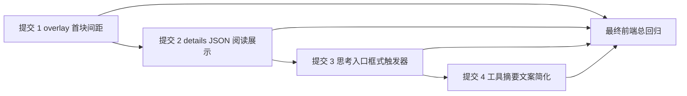

# 2026-04-12 UI 抛光后续四项实施计划

## 文档定位

本文将已确认设计文档 [`2026-04-12-ui-polish-followup-design.md`](./2026-04-12-ui-polish-followup-design.md) 转换为可直接执行的实施计划。范围仅覆盖 4 个已确认 UI 抛光点的实施顺序、提交边界、目标文件组、最相关测试文件组、建议提交信息、验证策略与风险控制，不包含任何代码实现，也不修改 Markdown 以外的文件。

后续实施必须始终以 [`2026-04-12-ui-polish-followup-design.md`](./2026-04-12-ui-polish-followup-design.md) 为最高依据；若局部现状、旧断言或临时实现习惯与设计口径冲突，统一以设计文档与本文的提交阶段顺序裁决。

## 实施目标

1. 将四项 UI 抛光严格拆分为 4 次独立 git 提交，不混合实现与测试改动。
2. 为每次提交明确主要修改文件组、最相关测试文件组与建议提交信息，便于直接进入实现。
3. 对原始 `details` 的 JSON 阅读展示、复制边界、思考入口触发器文案与工具摘要文案收敛给出可执行约束。
4. 建立“每提交先跑相关子集测试、四项完成后再跑前端总回归”的验证顺序。
5. 明确每项改动的回归关注点，避免 UI 抛光牵连非目标区域。

## 执行原则

1. **严格按提交边界推进。** 四项抛光分别落在 4 次独立提交内，每次提交同时包含该项最小必要实现与最相关测试更新。
2. **先局部收敛，再总体验证。** 每次提交前先跑对应子集测试；四次提交全部完成后，再跑一次前端总回归。
3. **阅读展示与复制输出分离。** 原始 `details` 即使启用结构化阅读，也不得改变复制输出的纯文本语义。
4. **视觉语言统一优先于完全复刻。** 思考入口只要求与相邻触发器进入同一组视觉语言，不追求像素级完全一致。
5. **只改目标范围。** 不扩大到 overlay 结构重写、全局工具栏重做或无关文案体系重构。

## 阶段总览

| 提交 | 主题 | 目标 | 主要文件组 | 最相关测试文件组 | 完成标志 |
| --- | --- | --- | --- | --- | --- |
| 提交 1 | 错误详情叠加层首块间距修复 | 修正 overlay 首块与顶部边界线的呼吸感，只改顶部节奏，不牵动后续普通文本块间距 | [`error-detail-overlay.css`](../../frontend-copilot/src/features/copilot/error-detail-overlay.css)、[`ErrorDetailOverlay.tsx`](../../frontend-copilot/src/features/copilot/ErrorDetailOverlay.tsx) | [`ErrorDetailOverlay.test.tsx`](../../frontend-copilot/src/features/copilot/ErrorDetailOverlay.test.tsx)、[`CopilotPanelShell.diagnostic.test.tsx`](../../frontend-copilot/src/features/copilot/CopilotPanelShell.diagnostic.test.tsx) | overlay 首块不再贴边，其他块间距与普通文本阅读节奏保持稳定 |
| 提交 2 | 原始 `details` 的 JSON 阅读展示 | 仅对确认是 JSON 的原始 `details` 启用结构化阅读，默认展开到第二层，非 JSON 保持纯文本，复制仍输出纯文本 | [`ErrorDetailOverlay.tsx`](../../frontend-copilot/src/features/copilot/ErrorDetailOverlay.tsx)、[`error-detail-overlay-view-model.ts`](../../frontend-copilot/src/features/copilot/error-detail-overlay-view-model.ts)、[`error-detail-overlay-copy.ts`](../../frontend-copilot/src/features/copilot/error-detail-overlay-copy.ts)、[`CopilotMessageList.tsx`](../../frontend-copilot/src/features/copilot/CopilotMessageList.tsx) | [`ErrorDetailOverlay.test.tsx`](../../frontend-copilot/src/features/copilot/ErrorDetailOverlay.test.tsx)、[`error-detail-overlay-view-model.test.ts`](../../frontend-copilot/src/features/copilot/error-detail-overlay-view-model.test.ts)、[`error-detail-overlay-copy.test.ts`](../../frontend-copilot/src/features/copilot/error-detail-overlay-copy.test.ts)、[`run-segment-view-model.test.ts`](../../frontend-copilot/src/features/copilot/run-segment-view-model.test.ts) | JSON `details` 可结构化阅读且默认展开 2 层，非 JSON 不变，复制结果仍是原始纯文本 |
| 提交 3 | 思考入口框式触发器 | 将思考入口改为“灯泡 + 当前标签”的框式触发器，并与相邻触发器统一到同一视觉语言 | [`CopilotComposer.tsx`](../../frontend-copilot/src/features/copilot/CopilotComposer.tsx)、[`ToolPicker.tsx`](../../frontend-copilot/src/features/copilot/components/ToolPicker.tsx)、[`copilot-composer.css`](../../frontend-copilot/src/features/copilot/copilot-composer.css) 或等价工具栏样式文件 | [`CopilotComposer.test.tsx`](../../frontend-copilot/src/features/copilot/CopilotComposer.test.tsx)、[`thinking-capabilities.test.ts`](../../frontend-copilot/src/workbench/thinking-capabilities.test.ts)、[`ToolPicker.test.tsx`](../../frontend-copilot/src/features/copilot/components/ToolPicker.test.tsx) 或现有相邻触发器测试 | 思考入口显示灯泡与当前标签，无标签时有稳定占位文案，窄宽度优先截断文本，不压缩图标与点击区域 |
| 提交 4 | 工具摘要文案简化 | 将工具摘要文案收敛为“未启用工具”/“启用 N 项工具”，并同步评估 aria、title 与测试断言 | [`ToolPicker.tsx`](../../frontend-copilot/src/features/copilot/components/ToolPicker.tsx)、[`CopilotComposer.tsx`](../../frontend-copilot/src/features/copilot/CopilotComposer.tsx) 及相关文案 helper | [`ToolPicker.test.tsx`](../../frontend-copilot/src/features/copilot/components/ToolPicker.test.tsx)、[`CopilotComposer.test.tsx`](../../frontend-copilot/src/features/copilot/CopilotComposer.test.tsx) 或覆盖工具栏摘要文案的现有测试 | 可见文案已收敛，aria/title 如需保留补充语义已同步更新，断言不再依赖旧长句 |

## 提交 1：错误详情叠加层首块间距修复

### 目标

只修正 [`ErrorDetailOverlay.tsx`](../../frontend-copilot/src/features/copilot/ErrorDetailOverlay.tsx) 首块内容与顶部边界线之间的节奏问题，让 overlay 打开后第一块内容获得稳定呼吸感；不调整整体层级结构，不借机放大全局容器内边距，不改变后续普通文本块之间的统一间距。

### 目标文件组

- [`frontend-copilot/src/features/copilot/error-detail-overlay.css`](../../frontend-copilot/src/features/copilot/error-detail-overlay.css)
- [`frontend-copilot/src/features/copilot/ErrorDetailOverlay.tsx`](../../frontend-copilot/src/features/copilot/ErrorDetailOverlay.tsx)

如当前首块样式由分块容器或 section 首元素规则控制，也可同步检查其直接关联的样式文件，但应坚持“只改顶部节奏，不改整体块间距系统”。

### 最相关测试文件组

- [`frontend-copilot/src/features/copilot/ErrorDetailOverlay.test.tsx`](../../frontend-copilot/src/features/copilot/ErrorDetailOverlay.test.tsx)
- [`frontend-copilot/src/features/copilot/CopilotPanelShell.diagnostic.test.tsx`](../../frontend-copilot/src/features/copilot/CopilotPanelShell.diagnostic.test.tsx)

### 实施要点

1. 优先在 overlay body 顶部 `padding` 或首块专属顶部间距中选一个最小改动点，不引入新的结构包裹层。
2. 若样式实现依赖首块选择器，应确保仅影响首块与顶部边界的特殊关系，不改后续块之间的间距规则。
3. 验收口径是“首块不再贴边，但没有突兀大空白”，而不是简单增加大量顶部留白。
4. 实现完成后要复核摘要块、请求上下文块、原始详情块在首位出现时的节奏是否一致。

### 建议提交信息

- `fix(ui): refine first block spacing in error detail overlay`

### 提交前验证

1. 先跑 [`ErrorDetailOverlay.test.tsx`](../../frontend-copilot/src/features/copilot/ErrorDetailOverlay.test.tsx) 相关子集，确认 overlay 渲染与交互未被样式调整破坏。
2. 如 [`CopilotPanelShell.diagnostic.test.tsx`](../../frontend-copilot/src/features/copilot/CopilotPanelShell.diagnostic.test.tsx) 覆盖 overlay 打开链路，再补跑对应子集，确认宿主集成未回归。
3. 进行一次人工视觉复核，重点检查 overlay 首块、后续普通文本块与窄宽度下的纵向节奏。

### 回归关注点

- 不影响 overlay 其他普通文本块的统一间距。
- 不因顶部留白调整导致小高度视口出现更早的滚动拥挤感。
- 不引入额外 DOM 结构导致测试快照或可访问性结构无谓变化。

## 提交 2：原始 `details` 的 JSON 阅读展示

### 目标

对原始 `details` 建立“仅在确认是合法 JSON 时启用结构化阅读，否则保持纯文本”的稳定规则；默认展开到第二层；复制逻辑继续输出纯文本，不被 viewer 展示状态污染。

### 目标文件组

- [`frontend-copilot/src/features/copilot/ErrorDetailOverlay.tsx`](../../frontend-copilot/src/features/copilot/ErrorDetailOverlay.tsx)
- [`frontend-copilot/src/features/copilot/error-detail-overlay-view-model.ts`](../../frontend-copilot/src/features/copilot/error-detail-overlay-view-model.ts)
- [`frontend-copilot/src/features/copilot/error-detail-overlay-copy.ts`](../../frontend-copilot/src/features/copilot/error-detail-overlay-copy.ts)
- [`frontend-copilot/src/features/copilot/CopilotMessageList.tsx`](../../frontend-copilot/src/features/copilot/CopilotMessageList.tsx)

如现有结构化 JSON 阅读能力来自 [`ToolStructuredContent()`](../../frontend-copilot/src/features/copilot/CopilotMessageList.tsx:667) 或相邻 helper，可在实现时直接复用，但复用边界仍应限制在“原始 `details`”这一项。

### 最相关测试文件组

- [`frontend-copilot/src/features/copilot/ErrorDetailOverlay.test.tsx`](../../frontend-copilot/src/features/copilot/ErrorDetailOverlay.test.tsx)
- [`frontend-copilot/src/features/copilot/error-detail-overlay-view-model.test.ts`](../../frontend-copilot/src/features/copilot/error-detail-overlay-view-model.test.ts)
- [`frontend-copilot/src/features/copilot/error-detail-overlay-copy.test.ts`](../../frontend-copilot/src/features/copilot/error-detail-overlay-copy.test.ts)
- [`frontend-copilot/src/features/copilot/run-segment-view-model.test.ts`](../../frontend-copilot/src/features/copilot/run-segment-view-model.test.ts)

### 实施要点

1. 只对“原始 `details`”做 JSON 判定，其他摘要块、说明块、普通文本块即使看起来像 JSON，也不自动切到结构化阅读。
2. JSON 判定必须是可确认的合法 JSON；若解析失败、类型不适合 viewer 或源字符串不满足判断条件，则回退纯文本展示。
3. 结构化阅读默认展开到第二层，以便初始打开即可暴露主要对象层级，但保留更深层折叠性。
4. 非 JSON 的 `details` 保持现有纯文本代码块或文本块展示，不新增额外兼容分支。
5. 复制逻辑必须继续输出纯文本：总复制保持现有汇总结构，单块复制中的原始 `details` 仍输出原始文本或原始纯文本格式，而不是 viewer 树形快照或重新格式化后的界面结果。
6. 若实现中需要在 view-model 中增加 `details` 的阅读模式标记，应明确区分“用于展示的解析结果”和“用于复制的原始文本”。

### 建议提交信息

- `feat(ui): render raw error details as structured json when valid`

### 提交前验证

1. 先跑 [`error-detail-overlay-view-model.test.ts`](../../frontend-copilot/src/features/copilot/error-detail-overlay-view-model.test.ts)，覆盖合法 JSON、非法 JSON、非对象 JSON 与原始字符串保留等分支。
2. 再跑 [`ErrorDetailOverlay.test.tsx`](../../frontend-copilot/src/features/copilot/ErrorDetailOverlay.test.tsx)，确认 JSON viewer 默认展开层级、非 JSON 回退与复制入口行为正确。
3. 跑 [`error-detail-overlay-copy.test.ts`](../../frontend-copilot/src/features/copilot/error-detail-overlay-copy.test.ts)，确认总复制与单块复制都仍输出纯文本。
4. 如 [`run-segment-view-model.test.ts`](../../frontend-copilot/src/features/copilot/run-segment-view-model.test.ts) 负责构造原始 `details` 输入，再补跑对应子集，确认上游数据投影未被破坏。

### 回归关注点

- 不扩大到 overlay 其他普通文本块。
- 不改变复制输出格式。
- 不因默认展开层级导致 overlay 初始渲染变得不可扫读。
- 不让非 JSON `details` 误入结构化 viewer，造成阅读语义跳变。

## 提交 3：思考入口改为框式触发器

### 目标

把聊天区思考入口从纯图标按钮升级为“灯泡 + 当前标签”的框式触发器，并让它与相邻触发器进入同一组视觉语言；不要求像素级完全一致，但应避免继续表现为孤立的小图标按钮。

### 目标文件组

- [`frontend-copilot/src/features/copilot/CopilotComposer.tsx`](../../frontend-copilot/src/features/copilot/CopilotComposer.tsx)
- [`frontend-copilot/src/features/copilot/components/ToolPicker.tsx`](../../frontend-copilot/src/features/copilot/components/ToolPicker.tsx)
- [`frontend-copilot/src/features/copilot/copilot-composer.css`](../../frontend-copilot/src/features/copilot/copilot-composer.css) 或当前实际承载工具栏触发器样式的等价文件
- 如思考标签格式化依赖专用 helper，也可同步检查 thinking display / formatter 相关文件，但不扩大到 thinking 能力判定逻辑

### 最相关测试文件组

- [`frontend-copilot/src/features/copilot/CopilotComposer.test.tsx`](../../frontend-copilot/src/features/copilot/CopilotComposer.test.tsx)
- [`frontend-copilot/src/workbench/thinking-capabilities.test.ts`](../../frontend-copilot/src/workbench/thinking-capabilities.test.ts)
- [`frontend-copilot/src/features/copilot/components/ToolPicker.test.tsx`](../../frontend-copilot/src/features/copilot/components/ToolPicker.test.tsx) 或覆盖相邻触发器一致性的现有工具栏渲染测试

若当前仓库没有上述测试文件，应在实现阶段用现有最接近的 composer / thinking / toolbar 测试替代，但提交边界仍然不变。

### 实施要点

1. 触发器结构应至少包含左侧灯泡图标与右侧当前标签文本，允许在局部宽度和字重上与相邻触发器存在适度差异，但需统一到同一视觉语言。
2. 无标签时必须使用稳定占位文案，避免退化回只剩图标；占位文案应短、稳、可持续，不承担解释性职责。
3. 在窄宽度下若文本过长，应优先截断文本，而不是压缩图标、边框或点击区域；点击热区与图标可识别性应优先保住。
4. 验收时应同时检查常见标签、有占位标签、长标签、窄宽度与 hover/focus 状态，而不只是静态宽屏截图。
5. 如当前相邻触发器已使用统一 button/trigger 基础类，应优先复用；若无法直接复用，也应对齐高度、圆角、内边距、边框和文字权重节奏。

### 建议提交信息

- `feat(ui): restyle thinking entry as labeled toolbar trigger`

### 提交前验证

1. 先跑 [`CopilotComposer.test.tsx`](../../frontend-copilot/src/features/copilot/CopilotComposer.test.tsx) 或现有 composer 相关子集，确认触发器渲染、标签显示与点击行为未回归。
2. 如 thinking 标签来自能力或显示映射，补跑 [`thinking-capabilities.test.ts`](../../frontend-copilot/src/workbench/thinking-capabilities.test.ts) 或相邻映射测试，确认标签来源稳定。
3. 如与相邻触发器共享样式或结构，补跑工具栏触发器相关测试，确认未影响附件 / 工具入口的既有行为。
4. 进行一次人工窄屏检查，重点看文本截断、图标尺寸、按钮高度与点击区域。

### 回归关注点

- 不让思考入口在窄屏下变得难点。
- 不因显示标签导致工具栏横向挤压失衡。
- 不因占位文案缺失造成按钮宽度和视觉重心大幅波动。
- 不误改 thinking 能力计算或标签来源逻辑。

## 提交 4：工具摘要文案简化

### 目标

将工具摘要文案统一收敛为“未启用工具”与“启用 N 项工具”，并明确同步检查 aria、title 与测试断言，确保可见文案变短后不破坏可访问性或现有行为判断。

### 目标文件组

- [`frontend-copilot/src/features/copilot/components/ToolPicker.tsx`](../../frontend-copilot/src/features/copilot/components/ToolPicker.tsx)
- [`frontend-copilot/src/features/copilot/CopilotComposer.tsx`](../../frontend-copilot/src/features/copilot/CopilotComposer.tsx)
- 与工具摘要字符串构造相关的 helper、常量或 aria/title 绑定文件

### 最相关测试文件组

- [`frontend-copilot/src/features/copilot/components/ToolPicker.test.tsx`](../../frontend-copilot/src/features/copilot/components/ToolPicker.test.tsx)
- [`frontend-copilot/src/features/copilot/CopilotComposer.test.tsx`](../../frontend-copilot/src/features/copilot/CopilotComposer.test.tsx)

如可访问名称或 title 在其他文件断言中被引用，也应把这些测试纳入本提交，而不是延后到统一回归阶段。

### 实施要点

1. 可见文案只保留两种状态：`未启用工具` 与 `启用 N 项工具`。
2. 需要同步评估 aria-label、`title`、tooltip 文案与测试断言；若它们当前复用可见文本且不会损失语义，可一并收敛；若需要补充作用说明，也应保持简短，不把旧长句完整搬回主视觉层。
3. 若现有测试直接断言“当前已选择 N 项工具”或同类长句，应在本提交同步替换，不把断言修复留到最后。
4. 如工具摘要还参与空状态、禁用态或计数态分支，应统一检查这些分支都落在新文案体系内。

### 建议提交信息

- `refactor(ui): simplify tool selection summary copy`

### 提交前验证

1. 先跑 [`ToolPicker.test.tsx`](../../frontend-copilot/src/features/copilot/components/ToolPicker.test.tsx)，确认 0 项与多项工具场景都命中新文案。
2. 如 [`CopilotComposer.test.tsx`](../../frontend-copilot/src/features/copilot/CopilotComposer.test.tsx) 覆盖工具栏触发器整体渲染，再补跑对应子集，确认摘要文本改动未影响宿主组件断言。
3. 对 aria-label、`title`、tooltip 或快照断言做一次专项复核，确认可访问性与测试口径同步更新。

### 回归关注点

- 不因文案修改破坏已有测试。
- 不因可见文案变短而削弱可访问性。
- 不出现可见文案、aria 与 title 三者口径不一致。
- 不让工具数为 0、1、N 时出现残留旧文案分支。

## 测试与验证策略

### 分提交验证顺序

后续实现应严格按照以下顺序推进：

1. 完成提交 1 的代码与相关测试改动后，先跑提交 1 对应的最相关子集测试，再提交。
2. 完成提交 2 的代码与相关测试改动后，先跑提交 2 对应的最相关子集测试，再提交。
3. 完成提交 3 的代码与相关测试改动后，先跑提交 3 对应的最相关子集测试，再提交。
4. 完成提交 4 的代码与相关测试改动后，先跑提交 4 对应的最相关子集测试，再提交。

不得把四项改动全部堆完后再一次性补测试，也不得把某项最相关测试拖到后一个提交统一修复。

### 最终总回归

四项都完成后，再统一跑一次前端总回归，确认四个提交叠加后的组合状态没有交叉回归。总回归至少应覆盖：

- 错误详情 overlay 主链路与复制链路
- composer / toolbar 触发器主链路
- thinking 标签显示主链路
- 工具摘要文案与可访问性主链路

### 结果汇总要求

最终实施结果汇总必须能够按 4 次提交分别说明：

1. 对应提交改了哪些文件组。
2. 跑了哪些最相关子集测试。
3. 是否通过。
4. 最终前端总回归是否通过。

建议在实施报告中沿用“提交 1 / 提交 2 / 提交 3 / 提交 4 / 最终总回归”的固定结构，避免结果描述与提交边界脱节。

## 风险与回归关注点

### 1. overlay 节奏风险

首块间距修复若落到过重的全局 `padding`，可能误伤 overlay 其他普通文本块与整体可视密度。因此应优先修正首块与顶部边界的特殊关系，而不是连带重写整个容器留白系统。

### 2. JSON 适用面扩张风险

若把结构化阅读扩展到所有文本块，容易误伤本应按纯文本阅读的内容，造成阅读语义跳变。JSON viewer 只能服务于确认是合法 JSON 的原始 `details`。

### 3. 复制一致性风险

若 viewer 展示层直接复用到复制输出层，可能让复制结果混入折叠状态、树状阅读结构或重新格式化文本，破坏排障转交稳定性。因此必须坚持“阅读升级，复制不变”。

### 4. 工具栏可点击性风险

思考入口加入标签后，若窄宽度下优先压缩图标和点击区域，会让按钮更难点，也会破坏与相邻触发器的一致性。窄屏策略必须优先截断文本，而不是压缩核心交互热区。

### 5. 文案与可访问性脱节风险

工具摘要文案收敛若只改可见文本、不复核 aria、`title` 与测试断言，容易造成口径不一致或直接破坏已有测试。该项必须把可访问性与断言同步纳入同一提交。

## 实施优先级建议

若后续进入 code 模式，最适合优先实施的文件组如下：

1. [`frontend-copilot/src/features/copilot/error-detail-overlay.css`](../../frontend-copilot/src/features/copilot/error-detail-overlay.css) 与 [`frontend-copilot/src/features/copilot/ErrorDetailOverlay.tsx`](../../frontend-copilot/src/features/copilot/ErrorDetailOverlay.tsx)，先完成提交 1。
2. [`frontend-copilot/src/features/copilot/error-detail-overlay-view-model.ts`](../../frontend-copilot/src/features/copilot/error-detail-overlay-view-model.ts)、[`frontend-copilot/src/features/copilot/error-detail-overlay-copy.ts`](../../frontend-copilot/src/features/copilot/error-detail-overlay-copy.ts)、[`frontend-copilot/src/features/copilot/ErrorDetailOverlay.tsx`](../../frontend-copilot/src/features/copilot/ErrorDetailOverlay.tsx)，再推进提交 2。
3. [`frontend-copilot/src/features/copilot/CopilotComposer.tsx`](../../frontend-copilot/src/features/copilot/CopilotComposer.tsx) 与工具栏相关样式文件，推进提交 3。
4. [`frontend-copilot/src/features/copilot/components/ToolPicker.tsx`](../../frontend-copilot/src/features/copilot/components/ToolPicker.tsx) 及其文案断言文件，完成提交 4。

## 结论

本实施计划已将 4 个 UI 抛光点拆解为 4 次独立提交，并为每一项明确了目标文件组、最相关测试文件组、提交信息建议、验证顺序与回归关注点。后续实现应严格执行“单项子集验证先于提交、四项完成后统一前端总回归”的顺序，确保 UI 抛光保持可回溯、可审阅、可回退。