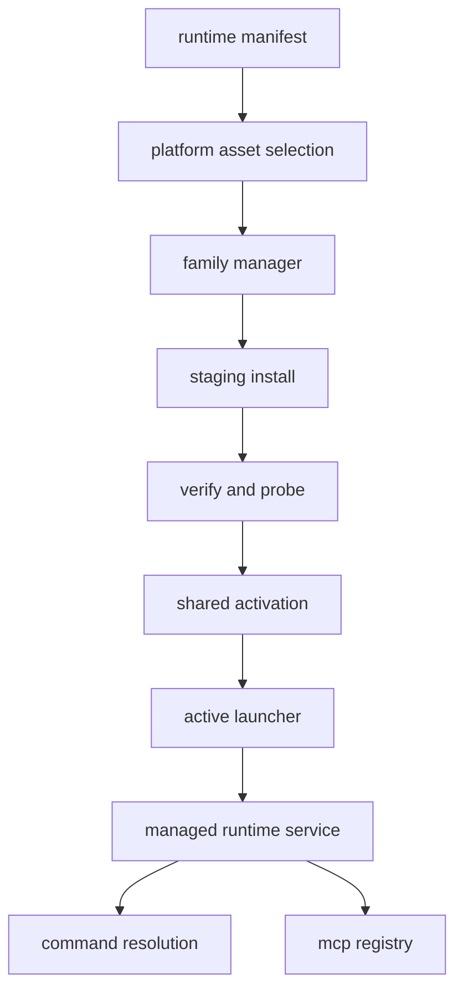
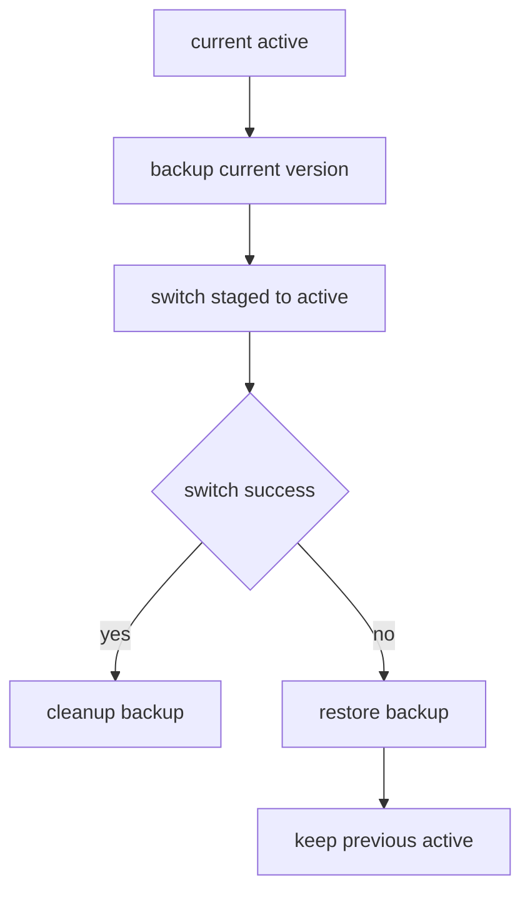

# 2026-04-22 跨平台 managed runtime 后续收口设计

## 1. 背景与问题归类

上一轮 [`docs/plans/2026-04-22-mcp-managed-runtime-design.md`](docs/plans/2026-04-22-mcp-managed-runtime-design.md) 已经把 MCP 运行时收口到应用内托管模型，但 reviewer 新一轮评论与跨平台 CI 红灯说明，当前实现边界仍然没有完全统一。问题并不只是某个平台少了一个分发包，而是同一套 managed runtime 契约在资产声明、安装激活、降级策略、目录暴露与错误展示五个层面仍有漂移。

本轮问题可以归纳为以下五类。

### 1.1 平台资产声明与真实安装链脱节

当前 Node/npm 与 Python/uv 的平台支持口径还不完全一致。上层服务、命令解析与测试有时会把 macOS 或 Linux 视为“支持的平台”，但实际安装链并没有在所有运行时家族上采用同一套便携式落盘与激活模型，导致 CI 在进入 managed runtime main-process 与 MCP registry main-process 相关测试时出现系统性红灯。

### 1.2 服务初始化与安装动作边界耦合过深

当前逻辑容易把“当前平台暂时没有可安装资产”与“整个服务不可初始化”混为一谈。这会让非 Windows 平台在只需要读取状态、加载空 registry 或完成普通启动时，也被迫进入硬失败路径，造成不必要的跨平台阻断。

### 1.3 激活顺序仍可能破坏已有可用版本

reviewer 已明确指出，现有激活链如果采用“先删旧版本，再切换新版本”的顺序，一旦 rename 或收尾步骤失败，就可能把原先可用的 active 版本一并破坏。这个问题属于运行时基础设施层缺陷，不能继续以平台差异或单个 manager 特例来规避，而应由共享激活层统一修正。

### 1.4 目录可见性与执行闭环仍可能失配

后端默认装配路径虽然已经对 provider 注入做了约束，但只要存在绕过默认 composition、直接传入 `mcp_catalog_provider` 的路径，目录层仍有可能把不可执行的 MCP 工具暴露给前端。也就是说，目录暴露仍然不能只依赖默认路径约束，而需要在最终公开目录层再次确认可执行闭环。

### 1.5 普通工具错误与 MCP 专属错误展示混淆

前端错误详情当前对 MCP 失败的判定仍偏宽松。只要 payload 中存在普通 `toolId`，就可能误进入 MCP 详情分支，导致本来属于内建工具的失败，也显示服务器、阶段、`snapshotRevision` 等仅对 MCP 有意义的字段。这会污染用户诊断信息，也掩盖真实错误来源。

## 2. 目标与非目标

### 2.1 目标

本设计只解决本轮已确认的跨平台 managed runtime 与相关契约收口问题。

1. 继续采用单一资产模型，把 Node/npm 与 Python/uv 都收口到统一便携式安装与激活体系。
2. 让平台差异只体现在 manifest 资产选择、下载源解析与路径探测细节，不体现在上层服务接口与状态语义。
3. 把跨平台降级策略改为按动作降级，使 macOS 与 Linux 在无法安装某类资产时仍可初始化服务、读取状态并加载空 registry。
4. 把运行时激活统一改为原子切换与失败回滚，避免安装失败破坏已有 active 版本。
5. 在后端最终目录公开层兜底，确保不可执行 MCP 工具无论通过默认 composition 还是手动 scaffold 路径都不会暴露到目录中。
6. 收窄前端 MCP 错误详情判定，确保只有明确属于 MCP 的失败才显示 MCP 专属诊断字段。
7. 明确跨平台测试、回滚测试、目录过滤测试与错误详情测试的最终验收口径。

### 2.2 非目标

本设计明确不覆盖以下事项。

- 不把 Windows、macOS、Linux 拆成三套独立安装体系。
- 不重新引入系统 Python、系统 Node、系统 `uvx` 或系统 `npx` 作为正式依赖。
- 不新增新的 runtime family，也不扩展为通用插件分发平台。
- 不设计新的前端安装入口或 UI 大改；本轮只收口既有 runtime 服务与相关契约。
- 不实现代码，不修改既有设计文档，只新增本设计文档。

## 3. 方案对比

### 3.1 方案 A：统一便携式模型

这是推荐方案，也是当前已被确认采用的方向。

核心做法如下。

- 继续以 `frontend-copilot/electron/managed-runtime/runtime-manifest.ts` 作为唯一版本与分发事实源。
- Node/npm 与 Python/uv 都声明为可下载、可校验、可解压到应用私有目录的跨平台资产集合。
- 所有平台共用“版本目录 → active 指针 → launcher 解析”的统一激活模型。
- 非 Windows 平台不再因为暂缺某类安装动作而让服务整体硬失败，而是把 install 或 repair 作为单独可判定的动作。
- 安装成功与失败的边界由共享激活层保证原子切换与回滚。

优点：

- 契约最一致，manifest、安装器、服务状态、命令解析与测试都围绕同一事实源收口。
- 上层模块只消费统一状态与 launcher 结果，不需要为不同平台写分支语义。
- 后续若继续扩展资产矩阵，只需补 manifest 与平台化探测规则，而不需要重做服务接口。

代价：

- 需要补齐 macOS 与 Linux 的官方分发资产、校验信息与路径探测规则。
- Python/uv 侧要从现有平台差异路径进一步收口到便携式落盘模型。

### 3.2 方案 B：混合模型

这个方案保持 Windows 使用便携式安装，但让 macOS 与 Linux 继续依赖系统 Python 或系统级安装器，只为 Node/npm 维持 archive 激活链。

优点：

- 短期实现改动可能较少。
- 某些平台可以复用现有系统环境。

缺点：

- 运行时来源重新分裂，应用内托管与系统依赖并存，违背之前已经确认的托管运行时方向。
- 错误定位会重新退回到用户系统层面，CI 与用户环境的差异更难收口。
- 上层服务必须重新区分托管路径与系统路径，状态语义会继续变复杂。

### 3.3 方案 C：按平台拆分三套安装体系

这个方案为 Windows、macOS、Linux 分别建设独立的资产声明、安装流程、激活方式与支持语义。

优点：

- 可以针对每个平台使用最原生的安装方式。

缺点：

- 安装、回滚、测试与诊断链完全碎片化，维护成本最高。
- 同一个 runtime family 在不同平台上的状态语义与故障边界会继续漂移。
- 与“平台差异只体现在资产选择和路径探测细节”的已确认目标相冲突。

### 3.4 方案结论

推荐采用方案 A。当前问题的核心不是某个平台少一个下载步骤，而是 managed runtime 需要重新回到单一事实源、统一激活模型与统一状态语义。只有统一便携式模型才能同时收口跨平台资产、降级策略、回滚机制、目录暴露与错误展示。

## 4. 最终设计

### 4.1 设计原则

最终设计围绕以下五条原则展开。

1. 单一事实源优先于平台特例。
2. 统一便携式布局优先于系统依赖。
3. 动作级降级优先于平台级硬失败。
4. 原子激活优先于破坏性切换。
5. 可执行性与 MCP 身份确认优先于宽松暴露。

### 4.2 总体架构

`runtime-manifest.ts` 继续作为版本、平台资产、校验元数据与 launcher 目标矩阵的唯一事实源。`ManagedRuntimeService.ts` 只消费 manifest 解析结果与统一 manager 接口，对上输出 `ready`、`missing`、`installing`、`failed` 这类统一状态，并向命令解析与 MCP registry 提供统一 launcher 结果。

Node/npm 与 Python/uv 虽然保留各自 manager，但两者都必须使用相同的目录布局和激活模型：每个 runtime family 在应用数据目录中维护版本目录、staging 目录、active 指针与诊断信息；下载、校验、探测、激活都在各自 manager 中处理，但 active 切换与失败回滚统一由共享安装层负责。

### 4.3 模块职责收口

- `frontend-copilot/electron/managed-runtime/runtime-manifest.ts`：声明所有受支持平台的官方资产、校验信息、布局预期与 launcher 元数据。
- `frontend-copilot/electron/managed-runtime/download-source.ts`：根据 manifest 目标矩阵解析下载源，不改变上层入口，只扩展平台资产选择能力。
- `frontend-copilot/electron/managed-runtime/uv/UvRuntimeManager.ts`：在 Windows、macOS、Linux 上统一把 Python 与 uv 安装到应用私有目录，输出与 Node manager 同构的状态与 launcher 结果。
- `frontend-copilot/electron/managed-runtime/RuntimeInstallShared.ts`：负责版本目录切换、active 更新、备份清理与失败回滚，成为所有 runtime family 共用的激活安全层。
- `frontend-copilot/electron/managed-runtime/ManagedRuntimeService.ts`：负责状态聚合、动作编排、安装能力判定与统一错误语义。
- `frontend-copilot/electron/managed-runtime/command-resolution.ts` 与 `frontend-copilot/electron/mcp-registry/main-process.ts`：只消费统一状态与 launcher 结果，不再内建平台级语义分叉。
- `backend/app/copilot_runtime/composition.py`：在最终目录公开层继续兜底 MCP 工具的可执行性过滤。
- `frontend-copilot/src/features/copilot/error-detail-overlay-view-model.ts`：按更严格的 MCP 身份规则决定是否进入 MCP 错误详情分支。

## 5. 模块影响面

| 模块 | 主要文件 | 影响内容 | 收口方向 |
| --- | --- | --- | --- |
| 运行时事实源 | `frontend-copilot/electron/managed-runtime/runtime-manifest.ts` | 平台资产矩阵、校验元数据、launcher 声明 | 统一为单一便携式资产模型 |
| 下载源解析 | `frontend-copilot/electron/managed-runtime/download-source.ts` | 不同平台下载目标选择 | 扩展到 macOS 与 Linux 官方资产 |
| Python 与 uv 安装 | `frontend-copilot/electron/managed-runtime/uv/UvRuntimeManager.ts` | 私有目录布局、版本探测、launcher 解析 | 与 Windows 同构的便携式模型 |
| 共享激活链 | `frontend-copilot/electron/managed-runtime/RuntimeInstallShared.ts` | active 切换、备份、回滚 | 原子切换与失败回滚 |
| 统一服务层 | `frontend-copilot/electron/managed-runtime/ManagedRuntimeService.ts` | 状态聚合、能力判定、动作降级 | 初始化与安装动作解耦 |
| 命令解析与 registry | `frontend-copilot/electron/managed-runtime/command-resolution.ts`、`frontend-copilot/electron/mcp-registry/main-process.ts` | launcher 消费、平台支持反馈 | 只消费统一状态与 launcher |
| 后端目录暴露 | `backend/app/copilot_runtime/composition.py` | MCP provider 合入全局目录的最终过滤 | 可执行性先于可见性 |
| 前端错误详情 | `frontend-copilot/src/features/copilot/error-detail-overlay-view-model.ts` | MCP 详情分支判定 | 明确 MCP 才展示 MCP 专属字段 |
| 测试层 | `frontend-copilot/electron/managed-runtime/main-process.test.ts`、`frontend-copilot/electron/mcp-registry/main-process.test.ts`、`backend/tests/unit/copilot_runtime/test_composition.py` | 跨平台状态、回滚与目录契约断言 | 全部跟随最终统一契约 |

## 6. 跨平台资产与安装策略

### 6.1 单一 manifest 资产模型

`runtime-manifest.ts` 继续作为唯一版本与分发事实源，不再把 Windows、macOS、Linux 拆成三套安装体系。manifest 需要同时表达以下内容。

- runtime family 与固定版本。
- 平台与架构对应的官方分发资产。
- 归档格式、校验信息与预期目录布局。
- 关键 launcher 的探测规则与版本校验策略。
- 是否存在该平台的 install 或 repair 可执行资产。

这意味着“是否支持某个平台的安装动作”不再由各处自行猜测，而是统一由 manifest 是否存在受支持资产来回答。

### 6.2 Node/npm 资产策略

Node/npm 继续沿用现有 archive 激活链，不改变用户入口，只扩展资产矩阵。

- Windows 维持现有 archive 模型。
- macOS 与 Linux 补齐官方 tarball 或 zip 资产及校验信息。
- 下载、解压、校验、激活、launcher 解析继续复用已有模型。
- `download-source.ts` 只负责根据平台目标矩阵解析对应分发源，不改变 `ManagedRuntimeService.ts` 的上层接口。

因此，Node/npm 的跨平台差异只停留在“选择哪个官方包、落盘后如何找到 launcher”，而不会扩散到服务状态或安装入口设计。

### 6.3 Python/uv 资产策略

Python/uv 同样改为统一便携目录布局，不再依赖系统 Python、系统 `uvx` 或系统级安装器。

- `UvRuntimeManager.ts` 在 Windows、macOS、Linux 上都把 Python 与 uv 安装到应用数据目录。
- 非 Windows 平台补的是可直接落盘、可探测版本、可参与统一激活链的官方可分发资产，而不是系统安装器依赖。
- Python 与 uv 的版本目录、active 指针、launcher 解析都与 Windows 侧保持同构。
- manager 对上返回的状态、错误摘要与 launcher 结果必须与 Node manager 使用同一套语义。

这样做的关键收益是，Python/uv 终于与 Node/npm 共用同一类安装与故障模型，避免出现一边是托管 archive，一边仍是系统依赖的契约裂缝。

### 6.4 统一激活模型

所有 runtime family 都采用“版本目录 → active 指针 → launcher 解析”的统一便携式布局。

1. 新版本先下载并解压到 staging 或待激活目录。
2. 在未影响当前 active 的前提下完成结构校验与版本探测。
3. 只有校验通过后才进入共享激活层切换 active。
4. 上层命令解析始终只读取 active 指针对应 launcher。

该模型保证平台差异仅限于归档结构与 launcher 探测细节，而不是目录语义本身。

### 6.5 安装能力判定

`ManagedRuntimeService.ts` 在 install 或 repair 入口处按动作判定是否支持。

- 若 manifest 中存在当前平台对应 runtime family 的资产，则允许继续安装或修复。
- 若 manifest 不存在该平台资产，则返回统一的“不支持该动作”结果，但不影响服务初始化、状态读取与普通启动流程。
- 同一平台上，不同 runtime family 可以独立判定是否存在受支持资产；服务层只汇总统一状态与动作能力描述。

## 7. 降级、回滚与错误流

### 7.1 按动作降级而非平台硬失败

macOS 与 Linux 上的 managed runtime 服务与 MCP registry 不再因为“当前 install 链尚无资产”而整体初始化失败。最终行为如下。

- 服务仍可初始化。
- 仍可读取当前状态。
- 仍可返回空 registry 或缺失状态。
- 只有用户显式执行 install 或 repair 时，才根据 manifest 中是否存在受支持资产决定是否继续。

这样可以让 CI 与应用启动链在非 Windows 平台上先恢复到契约安全状态，而不是被安装动作能力反向拖垮。

### 7.2 原子切换与失败回滚

`RuntimeInstallShared.ts` 中的激活链统一改为“备份旧版本 → 切换 staged 版本 → 成功后清理备份；失败则回滚旧版本”。

关键约束如下。

- 旧版本在新版本真正切换成功前不能被破坏。
- 失败回滚由共享激活层统一处理，而不是散落在各个 manager 内部。
- 任一平台上 rename、目录替换或收尾清理失败时，最终都必须保住原有可用版本。

### 7.3 统一错误流

错误流同样需要收口到统一状态与动作结果。

- 平台无资产：返回动作不支持或保持 `missing`，不把服务打成初始化异常。
- 下载或校验失败：返回 `failed` 与明确的阶段摘要，但不污染已有 active 版本。
- launcher 探测失败：视为当前候选版本不可激活，进入 `failed`，并保留旧版本。
- registry 侧若运行时不可用，只消费统一状态与 launcher 缺失结果，不再自行推导平台支持语义。

## 8. 后端目录兜底

后端目录暴露必须在最终公开目录层再次确认执行闭环，而不只依赖默认装配路径的 provider 注入约束。

设计要求如下。

1. `build_default_runtime_dependencies` 继续约束默认依赖集合中何时允许注入 `mcp_catalog_provider`。
2. `RuntimeScaffold` 在把 `mcp_catalog_provider` 合入全局目录前，必须再次确认目录中的 MCP `toolId` 在当前执行闭环里真实可解析。
3. 这里的“真实可解析”至少要求当前运行时具备把目录项映射到实际执行器的闭环，而不是只有静态目录条目。
4. 即使调用方绕过默认 composition、直接传入 provider，只要闭环不成立，这些 MCP 条目也不能进入最终公开目录。

该兜底会让前端 tool catalog、权限页与运行时选择器重新获得稳定事实：能看见的 MCP 工具必须也是当前进程闭环内可以执行的工具。

## 9. 前端错误详情判定

`readMcpFailureDetail()` 的判定逻辑改为更严格的 MCP 身份确认，而不是只要存在普通 `toolId` 就进入 MCP 分支。

建议规则如下。

- 若 `toolId` 具有 MCP 风格前缀，例如 `mcp.`，可判定为 MCP 候选。
- 若上下文包含 `serverId`、`remoteToolName` 或 `requestedRemoteToolName` 这类 MCP 专属字段之一，也可判定为 MCP 候选。
- 只有满足上述任一 MCP 识别条件时，才展示服务器、阶段、`snapshotRevision` 等 MCP 专属诊断字段。
- 普通内建工具失败，例如 `tool.remote-search`，即使存在一般性 `toolId`，也继续走普通错误详情视图。

这一收口会减少错误详情误导，确保 MCP 诊断字段只在真正有 MCP 语义时才出现。

## 10. 测试与验收标准

### 10.1 测试收口

本轮测试分三层同步收口。

1. 跨平台 managed runtime 测试：`frontend-copilot/electron/managed-runtime/main-process.test.ts` 与 `frontend-copilot/electron/mcp-registry/main-process.test.ts` 在 Linux 与 macOS 上验证服务可初始化、空状态可读取、install 或 repair 仅在存在平台资产时才支持。
2. 激活与回滚测试：为共享激活层或调用它的 manager 增加 rename 或切换失败场景，断言旧版本在失败后仍然保留且仍是 active。
3. 目录与错误详情测试：补上“绕过默认 composition 直接传 `mcp_catalog_provider` 也不会暴露不可执行 MCP”与“普通 `tool.remote-search` 失败不进入 MCP 详情”的反例测试。

### 10.2 验收标准

本轮完成后，以下结果必须同时成立。

1. Linux 与 macOS CI 不再因为托管运行时 target 解析把 managed runtime main-process 与 MCP registry main-process 一并打崩。
2. 运行时激活失败不会破坏已有可用版本。
3. 前端普通工具失败不再误显示 MCP 专属诊断字段。
4. 后端无论走默认装配还是手动 scaffold 路径，都不会把不可执行 MCP 工具暴露到目录中。
5. `ManagedRuntimeService.ts`、`command-resolution.ts` 与 `mcp-registry/main-process.ts` 最终只消费统一状态与统一 launcher 结果，而不再分叉平台级上层语义。

## 11. 风险与回滚

### 11.1 主要风险

本轮主要风险有四类。

- manifest 资产矩阵与真实官方分发结构若再次漂移，非 Windows 平台安装动作仍可能退回 `failed`。
- Python/uv 便携式资产在不同平台上的落盘结构若存在细微差异，launcher 探测规则需要足够保守，否则会误判为可激活。
- 后端目录过滤如果判定条件过严，短期内可能隐藏本应可执行的 MCP 条目；但这属于可执行性优先策略下的安全退化。
- 前端 MCP 错误识别规则如果过宽，会继续误判普通工具；如果过窄，则可能漏掉部分真实 MCP 失败，需要靠测试样例补齐边界。

### 11.2 回滚原则

如果后续实现落地后发现问题，回滚也必须保持契约完整，不允许退回到更模糊的灰区状态。

- 可以回滚到更小的资产矩阵，例如临时只保留已验证通过的平台资产。
- 可以把某些 install 或 repair 动作明确收紧为不支持，但不能让服务初始化重新硬失败。
- 可以临时隐藏无法确认执行闭环的 MCP 条目，但不能重新暴露不可执行目录项。
- 可以调整 MCP 身份识别条件，但不能重新把普通工具错误默认展示为 MCP 详情。
- 绝不能回滚原子切换与失败回滚原则，因为这会重新引入破坏已有 active 版本的风险。

## 12. 设计结论

本轮 follow-up 的核心，不是为每个平台补几段安装脚本，而是把跨平台 managed runtime 重新拉回到统一便携式模型之下。最终系统只有一套 manifest 事实源、一套版本目录与 active 指针语义、一套动作级降级规则、一套原子切换与失败回滚链，以及一套对目录暴露与 MCP 错误详情的严格判定边界。

因此，本设计明确采用统一便携式模型：Node/npm 与 Python/uv 都作为可下载、可校验、可解压到应用私有目录的跨平台资产集合，由统一服务层输出统一状态与 launcher 结果；平台差异只保留在资产选择与路径探测细节中，不再泄露到上层契约。