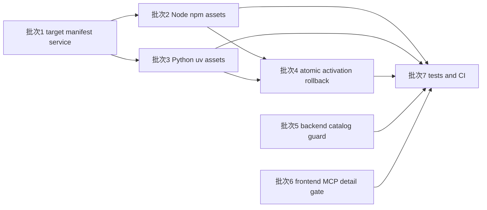

# 2026-04-22 跨平台 managed runtime follow-up 实施计划

> 依据：[`docs/plans/2026-04-22-cross-platform-managed-runtime-followup-design.md`](docs/plans/2026-04-22-cross-platform-managed-runtime-followup-design.md)
>
> 性质：本文档只做实施规划，不包含任何实现代码；实施范围严格承接已确认设计，围绕跨平台 managed runtime follow-up、reviewer 评论与 CI 红灯暴露出的契约漂移做分批收口，不扩展到新功能、新 runtime family 或无关重构。

## 1. 目标与实施边界

本轮实现计划只围绕以下七类结果展开。

1. 把 [`frontend-copilot/electron/managed-runtime/runtime-manifest.ts`](frontend-copilot/electron/managed-runtime/runtime-manifest.ts)、[`frontend-copilot/electron/managed-runtime/download-source.ts`](frontend-copilot/electron/managed-runtime/download-source.ts) 与 [`frontend-copilot/electron/managed-runtime/ManagedRuntimeService.ts`](frontend-copilot/electron/managed-runtime/ManagedRuntimeService.ts) 收口到统一的跨平台 target 与动作能力模型，让 manifest 成为唯一事实源。
2. 为 Node/npm 补齐 Windows、macOS、Linux 三类平台上的官方资产、校验元数据与 launcher 路径探测，继续沿用 archive 激活链但不再遗漏非 Windows 目标。
3. 为 Python/uv 补齐统一便携目录布局、跨平台资产与 launcher 路径探测，让 [`frontend-copilot/electron/managed-runtime/uv/UvRuntimeManager.ts`](frontend-copilot/electron/managed-runtime/uv/UvRuntimeManager.ts) 在三类平台上都回到应用私有目录模型。
4. 把 [`frontend-copilot/electron/managed-runtime/RuntimeInstallShared.ts`](frontend-copilot/electron/managed-runtime/RuntimeInstallShared.ts) 统一改为原子激活与失败回滚，确保切换失败不会破坏已有 active 版本。
5. 在 [`backend/app/copilot_runtime/composition.py`](backend/app/copilot_runtime/composition.py) 的最终公开目录层补上可执行性兜底，避免默认装配与手动 scaffold 路径暴露不可执行 MCP 工具。
6. 收紧 [`readMcpFailureDetail()`](frontend-copilot/src/features/copilot/error-detail-overlay-view-model.ts:471) 的 MCP 身份判定，避免普通工具失败误进入 MCP 诊断详情分支。
7. 把前后端测试与 CI 统一收口到最终契约，确保 Linux 与 macOS 不再因 managed runtime target 解析或错误详情判定漂移而持续红灯。

### 1.1 成功标准

本轮完成后，以下结果必须同时成立。

1. Linux 与 macOS CI 不再因为托管运行时 target 解析把 managed runtime main-process 与 MCP registry main-process 一并打崩。
2. Node/npm 与 Python/uv 都以 manifest 为唯一事实源，按平台资产存在性决定 install 或 repair 是否可执行，而不是由上层模块各自猜测支持语义。
3. 激活失败、rename 失败或收尾失败都不会破坏旧的 active 版本。
4. 后端无论走默认装配还是手动 scaffold 路径，都不会把当前执行闭环内不可解析的 MCP 工具暴露到最终目录。
5. 普通工具失败不再误显示 MCP 专属诊断字段，真正的 MCP 失败仍能保留服务器、阶段与快照相关细节。

### 1.2 范围内

- managed runtime target 解析、manifest 资产矩阵、动作级降级与统一 launcher 语义收口。
- Node/npm 与 Python/uv 的跨平台资产声明、校验、解压、路径探测与私有目录布局补齐。
- 共享激活层的原子切换、备份清理与失败回滚测试。
- backend 最终目录公开层的 MCP 可执行性兜底过滤。
- front-end MCP 错误详情判定修复与直接耦合测试。
- managed runtime、MCP registry、backend composition 与相关 CI 的回归封口。

### 1.3 范围外

- 不新增新的 runtime family、安装入口、配置页面或版本选择能力。
- 不重新引入系统 Python、系统 Node、系统 `uvx` 或系统 `npx` 作为正式依赖。
- 不把 Windows、macOS、Linux 拆成三套独立安装体系。
- 不为了兼容旧测试而保留已被设计判定为错误的历史行为。
- 当前文档提交物只包括 [`docs/plans/2026-04-22-cross-platform-managed-runtime-followup-implementation-plan.md`](docs/plans/2026-04-22-cross-platform-managed-runtime-followup-implementation-plan.md)，不能混入实现代码或设计文档修改。

## 2. 实施批次总览

| 批次 | 目标 | 主要文件 | 前置依赖 | 串并行关系 | 核心交付 |
| --- | --- | --- | --- | --- | --- |
| 批次 1 | 跨平台 managed runtime target、manifest 与 service 能力模型收口 | [`frontend-copilot/electron/managed-runtime/runtime-manifest.ts`](frontend-copilot/electron/managed-runtime/runtime-manifest.ts) [`frontend-copilot/electron/managed-runtime/download-source.ts`](frontend-copilot/electron/managed-runtime/download-source.ts) [`frontend-copilot/electron/managed-runtime/ManagedRuntimeService.ts`](frontend-copilot/electron/managed-runtime/ManagedRuntimeService.ts) [`frontend-copilot/electron/managed-runtime/command-resolution.ts`](frontend-copilot/electron/managed-runtime/command-resolution.ts) [`frontend-copilot/electron/managed-runtime/main-process.test.ts`](frontend-copilot/electron/managed-runtime/main-process.test.ts) [`frontend-copilot/electron/mcp-registry/main-process.ts`](frontend-copilot/electron/mcp-registry/main-process.ts) [`frontend-copilot/electron/mcp-registry/main-process.test.ts`](frontend-copilot/electron/mcp-registry/main-process.test.ts) | 无 | 串行起点；完成后其余前端 runtime 批次才有稳定契约可依赖 | manifest 成为唯一 target 与动作能力事实源；macOS 与 Linux 可初始化服务并读取状态，install 或 repair 才按资产存在性判定支持 |
| 批次 2 | Node/npm 跨平台资产、校验与路径探测补齐 | [`frontend-copilot/electron/managed-runtime/runtime-manifest.ts`](frontend-copilot/electron/managed-runtime/runtime-manifest.ts) [`frontend-copilot/electron/managed-runtime/download-source.ts`](frontend-copilot/electron/managed-runtime/download-source.ts) [`frontend-copilot/electron/managed-runtime/archive.ts`](frontend-copilot/electron/managed-runtime/archive.ts) [`frontend-copilot/electron/managed-runtime/verification.ts`](frontend-copilot/electron/managed-runtime/verification.ts) [`frontend-copilot/electron/managed-runtime/node/NodeRuntimeManager.ts`](frontend-copilot/electron/managed-runtime/node/NodeRuntimeManager.ts) [`frontend-copilot/electron/managed-runtime/node/NodeRuntimeManager.test.ts`](frontend-copilot/electron/managed-runtime/node/NodeRuntimeManager.test.ts) [`frontend-copilot/electron/managed-runtime/download-source.test.ts`](frontend-copilot/electron/managed-runtime/download-source.test.ts) | 批次 1 | 可与批次 3 并行；批次 4 前需冻结 Node 家族目录与 launcher 契约 | Node/npm 在三类平台上都具备可下载、可校验、可探测 launcher 的私有资产链 |
| 批次 3 | Python/uv 跨平台资产、校验与路径探测补齐 | [`frontend-copilot/electron/managed-runtime/runtime-manifest.ts`](frontend-copilot/electron/managed-runtime/runtime-manifest.ts) [`frontend-copilot/electron/managed-runtime/download-source.ts`](frontend-copilot/electron/managed-runtime/download-source.ts) [`frontend-copilot/electron/managed-runtime/verification.ts`](frontend-copilot/electron/managed-runtime/verification.ts) [`frontend-copilot/electron/managed-runtime/uv/UvRuntimeManager.ts`](frontend-copilot/electron/managed-runtime/uv/UvRuntimeManager.ts) [`frontend-copilot/electron/managed-runtime/uv/UvRuntimeManager.test.ts`](frontend-copilot/electron/managed-runtime/uv/UvRuntimeManager.test.ts) [`.github/scripts/download-distributable-python.ps1`](.github/scripts/download-distributable-python.ps1) [`.github/scripts/download-distributable-python.sh`](.github/scripts/download-distributable-python.sh) [`.github/scripts/macos_python_runtime_relocator.py`](.github/scripts/macos_python_runtime_relocator.py) | 批次 1 | 可与批次 2 并行；批次 4 前需冻结 Python 与 uv 的目录布局和 launcher 契约 | Python 与 uv 在三类平台上统一落到应用私有目录，launcher 解析与状态语义与 Node 家族同构 |
| 批次 4 | 原子激活与失败回滚 | [`frontend-copilot/electron/managed-runtime/RuntimeInstallShared.ts`](frontend-copilot/electron/managed-runtime/RuntimeInstallShared.ts) [`frontend-copilot/electron/managed-runtime/node/NodeRuntimeManager.ts`](frontend-copilot/electron/managed-runtime/node/NodeRuntimeManager.ts) [`frontend-copilot/electron/managed-runtime/uv/UvRuntimeManager.ts`](frontend-copilot/electron/managed-runtime/uv/UvRuntimeManager.ts) [`frontend-copilot/electron/managed-runtime/ManagedRuntimeService.install.test.ts`](frontend-copilot/electron/managed-runtime/ManagedRuntimeService.install.test.ts) [`frontend-copilot/electron/managed-runtime/node/NodeRuntimeManager.test.ts`](frontend-copilot/electron/managed-runtime/node/NodeRuntimeManager.test.ts) [`frontend-copilot/electron/managed-runtime/uv/UvRuntimeManager.test.ts`](frontend-copilot/electron/managed-runtime/uv/UvRuntimeManager.test.ts) | 批次 2、批次 3 | 在两个 runtime family 的 verify 与 launcher 契约冻结后串行收口 | 共享激活层统一负责备份、切换、清理与失败恢复，旧 active 在任何切换失败场景下仍可保留 |
| 批次 5 | backend 目录失配兜底 | [`backend/app/copilot_runtime/composition.py`](backend/app/copilot_runtime/composition.py) [`backend/tests/unit/copilot_runtime/test_composition.py`](backend/tests/unit/copilot_runtime/test_composition.py) [`backend/tests/unit/copilot_runtime/test_mcp_catalog_provider.py`](backend/tests/unit/copilot_runtime/test_mcp_catalog_provider.py) [`backend/tests/unit/copilot_runtime/test_mcp_tool_executor.py`](backend/tests/unit/copilot_runtime/test_mcp_tool_executor.py) | 无 | 可与批次 2、批次 3、批次 4 并行推进 | 默认装配与手动 scaffold 都只暴露当前执行闭环里真实可解析的 MCP 条目 |
| 批次 6 | 前端 MCP 错误详情判定修复 | [`frontend-copilot/src/features/copilot/error-detail-overlay-view-model.ts`](frontend-copilot/src/features/copilot/error-detail-overlay-view-model.ts) [`frontend-copilot/src/features/copilot/error-detail-overlay-view-model.test.ts`](frontend-copilot/src/features/copilot/error-detail-overlay-view-model.test.ts) [`frontend-copilot/src/features/copilot/error-detail-overlay-copy.test.ts`](frontend-copilot/src/features/copilot/error-detail-overlay-copy.test.ts) | 无 | 可与批次 5 并行；最终在批次 7 汇总回归 | 只有明确属于 MCP 的失败才进入 MCP 详情分支，普通工具失败回到通用错误详情 |
| 批次 7 | 测试与 CI 回归封口 | [`frontend-copilot/electron/managed-runtime/main-process.test.ts`](frontend-copilot/electron/managed-runtime/main-process.test.ts) [`frontend-copilot/electron/mcp-registry/main-process.test.ts`](frontend-copilot/electron/mcp-registry/main-process.test.ts) [`frontend-copilot/electron/managed-runtime/command-resolution.test.ts`](frontend-copilot/electron/managed-runtime/command-resolution.test.ts) [`frontend-copilot/electron/preload.managed-runtime.test.ts`](frontend-copilot/electron/preload.managed-runtime.test.ts) [`backend/tests/unit/copilot_runtime/test_composition.py`](backend/tests/unit/copilot_runtime/test_composition.py) [`frontend-copilot/src/features/copilot/error-detail-overlay-view-model.test.ts`](frontend-copilot/src/features/copilot/error-detail-overlay-view-model.test.ts) [`.github/workflows/frontend-validation.yml`](.github/workflows/frontend-validation.yml) [`.github/workflows/backend-static-checks.yml`](.github/workflows/backend-static-checks.yml) [`.github/workflows/desktop-bundled-runtime-packaging.yml`](.github/workflows/desktop-bundled-runtime-packaging.yml) | 批次 1-6 | 串行收尾；只做测试、夹具与 CI 契约封口 | Linux 与 macOS 相关红灯消失，测试矩阵只断言最终契约，不再兼容旧的错误语义 |

## 3. 批次拆解

### 3.1 批次 1：跨平台 managed runtime target、manifest 与 service 能力模型收口

#### 目标

先冻结 managed runtime 的统一事实源与动作级降级语义。该批次不负责补齐全部平台资产本身，而是先让 [`frontend-copilot/electron/managed-runtime/runtime-manifest.ts`](frontend-copilot/electron/managed-runtime/runtime-manifest.ts)、[`frontend-copilot/electron/managed-runtime/download-source.ts`](frontend-copilot/electron/managed-runtime/download-source.ts) 与 [`frontend-copilot/electron/managed-runtime/ManagedRuntimeService.ts`](frontend-copilot/electron/managed-runtime/ManagedRuntimeService.ts) 对“当前平台能否初始化服务、能否读取状态、何时允许 install 或 repair”给出同一答案。

#### 涉及文件与职责

| 文件 | 本批职责 |
| --- | --- |
| [`frontend-copilot/electron/managed-runtime/runtime-manifest.ts`](frontend-copilot/electron/managed-runtime/runtime-manifest.ts) | 定义统一的 family、platform、asset、launcher 与动作能力元数据，成为唯一 target 事实源。 |
| [`frontend-copilot/electron/managed-runtime/download-source.ts`](frontend-copilot/electron/managed-runtime/download-source.ts) | 按 manifest 目标矩阵解析下载源，移除上层自行推断平台支持的分叉。 |
| [`frontend-copilot/electron/managed-runtime/ManagedRuntimeService.ts`](frontend-copilot/electron/managed-runtime/ManagedRuntimeService.ts) | 把平台级硬失败改为动作级降级，保证 macOS 与 Linux 仍可初始化服务、读取状态与返回统一缺失结果。 |
| [`frontend-copilot/electron/managed-runtime/command-resolution.ts`](frontend-copilot/electron/managed-runtime/command-resolution.ts) | 只消费统一 launcher 结果，不再自行扩散平台支持语义。 |
| [`frontend-copilot/electron/mcp-registry/main-process.ts`](frontend-copilot/electron/mcp-registry/main-process.ts) | 在 registry main-process 层接受“服务已初始化但当前动作不支持”的状态，不把它重新放大为整体初始化失败。 |
| [`frontend-copilot/electron/managed-runtime/main-process.test.ts`](frontend-copilot/electron/managed-runtime/main-process.test.ts) 与 [`frontend-copilot/electron/mcp-registry/main-process.test.ts`](frontend-copilot/electron/mcp-registry/main-process.test.ts) | 回归 Linux 与 macOS 初始化、状态读取与空 registry 场景。 |

#### 实施要点

1. 先冻结 manifest 中 family 级别的 target 描述方式，明确平台支持与动作支持都由资产存在性派生，而不是由 service 或 test 硬编码。
2. 把 `missing`、`ready`、`failed` 与“当前动作不支持”之间的边界放到 service 层统一定义，避免 unsupported platform 再次被误报成整体初始化异常。
3. [`frontend-copilot/electron/managed-runtime/ManagedRuntimeService.ts`](frontend-copilot/electron/managed-runtime/ManagedRuntimeService.ts) 对外继续输出统一状态与 launcher 结果；对内则只在 install 或 repair 入口做动作级 capability gate。
4. [`frontend-copilot/electron/mcp-registry/main-process.ts`](frontend-copilot/electron/mcp-registry/main-process.ts) 与 [`frontend-copilot/electron/managed-runtime/command-resolution.ts`](frontend-copilot/electron/managed-runtime/command-resolution.ts) 只消费统一状态，不再自行判定某个平台是否应整体禁用 managed runtime。
5. 所有与非 Windows 平台相关的测试断言，统一改为“可初始化、可读取状态、动作按资产存在性判定”，不再沿用旧的硬失败预期。

#### 验证方式

1. 扩展 [`frontend-copilot/electron/managed-runtime/runtime-manifest.test.ts`](frontend-copilot/electron/managed-runtime/runtime-manifest.test.ts)，验证 manifest target 与动作能力的导出形状稳定。
2. 扩展 [`frontend-copilot/electron/managed-runtime/ManagedRuntimeService.test.ts`](frontend-copilot/electron/managed-runtime/ManagedRuntimeService.test.ts)，验证 Linux 与 macOS 不再因初始化阶段直接报 unsupported。
3. 扩展 [`frontend-copilot/electron/managed-runtime/main-process.test.ts`](frontend-copilot/electron/managed-runtime/main-process.test.ts)，验证 main-process 仍可读取状态并暴露统一结果。
4. 扩展 [`frontend-copilot/electron/mcp-registry/main-process.test.ts`](frontend-copilot/electron/mcp-registry/main-process.test.ts)，验证 registry 在 launcher 缺失或空 registry 场景下不再整体崩溃。

#### 单独提交边界

- 本批提交只包含 target 模型、manifest 语义、service 动作级降级与直接耦合测试。
- 不混入 Node/npm 与 Python/uv 的具体跨平台资产补齐。
- 不混入 [`frontend-copilot/electron/managed-runtime/RuntimeInstallShared.ts`](frontend-copilot/electron/managed-runtime/RuntimeInstallShared.ts) 的原子回滚重构、backend 目录兜底或前端错误详情修复。

### 3.2 批次 2：Node/npm 跨平台资产、校验与路径探测补齐

#### 目标

在批次 1 已冻结的 capability 模型上，把 Node/npm 继续沿用 archive 激活链，但补齐 macOS 与 Linux 上的官方资产、校验信息与 launcher 探测规则。该批次完成后，Node family 在三类平台上都能给出统一的下载、校验与 launcher 解析结果。

#### 涉及文件与职责

| 文件 | 本批职责 |
| --- | --- |
| [`frontend-copilot/electron/managed-runtime/runtime-manifest.ts`](frontend-copilot/electron/managed-runtime/runtime-manifest.ts) | 补齐 Node/npm 在 Windows、macOS、Linux 上的官方归档资产、校验信息与 layout 元数据。 |
| [`frontend-copilot/electron/managed-runtime/download-source.ts`](frontend-copilot/electron/managed-runtime/download-source.ts) | 按平台与架构选择 Node 资产，不再遗漏 darwin 或 linux 目标。 |
| [`frontend-copilot/electron/managed-runtime/archive.ts`](frontend-copilot/electron/managed-runtime/archive.ts) | 统一处理 zip、tarball 等归档格式的解压行为与目录布局校验。 |
| [`frontend-copilot/electron/managed-runtime/verification.ts`](frontend-copilot/electron/managed-runtime/verification.ts) | 增补 Node、npm、npx 的版本探测与最小结构校验。 |
| [`frontend-copilot/electron/managed-runtime/node/NodeRuntimeManager.ts`](frontend-copilot/electron/managed-runtime/node/NodeRuntimeManager.ts) | 用 manifest 元数据驱动 Node family 的下载、校验、解压与 launcher 解析。 |
| [`frontend-copilot/electron/managed-runtime/node/NodeRuntimeManager.test.ts`](frontend-copilot/electron/managed-runtime/node/NodeRuntimeManager.test.ts) 与 [`frontend-copilot/electron/managed-runtime/download-source.test.ts`](frontend-copilot/electron/managed-runtime/download-source.test.ts) | 覆盖多平台资产选择、归档布局与 launcher 探测断言。 |

#### 实施要点

1. 为 Node family 明确每个平台对应的官方分发资产、checksum、归档格式与预期目录布局，全部收口到 manifest 中。
2. 保持现有 archive 激活链与上层接口不变，差异只体现在“下载哪个包”与“解压后如何探测 launcher”。
3. 把 `node`、`npm`、`npx` 的路径探测规则统一为“从版本目录或 active 指针解析”，不再回退到系统 PATH 作为成功条件。
4. 让校验逻辑既覆盖文件存在性，也覆盖最小版本与目录形状，避免某个平台解压成功但 launcher 指向错误结构时被误判为 ready。
5. 把与 Node family 直接耦合的失败摘要、诊断字段与测试夹具同步收口，确保后续批次不再为平台特例补额外分支。

#### 验证方式

1. 扩展 [`frontend-copilot/electron/managed-runtime/runtime-manifest.test.ts`](frontend-copilot/electron/managed-runtime/runtime-manifest.test.ts)，验证 Node family 的资产矩阵覆盖三类平台。
2. 扩展 [`frontend-copilot/electron/managed-runtime/download-source.test.ts`](frontend-copilot/electron/managed-runtime/download-source.test.ts)，验证 darwin 与 linux 的 target 解析与下载源选择。
3. 扩展 [`frontend-copilot/electron/managed-runtime/node/NodeRuntimeManager.test.ts`](frontend-copilot/electron/managed-runtime/node/NodeRuntimeManager.test.ts)，验证 `node`、`npm` 与 `npx` 在三类平台上的 launcher 探测与校验结果。
4. 扩展 [`frontend-copilot/electron/managed-runtime/command-resolution.test.ts`](frontend-copilot/electron/managed-runtime/command-resolution.test.ts)，验证 npx 解析基于托管 launcher，而不是系统命令探测。

#### 单独提交边界

- 本批提交只包含 Node/npm family 的资产矩阵、校验与路径探测，以及直接耦合测试。
- 不混入 Python/uv 的资产补齐。
- 不把共享激活层的原子回滚重构夹带进来，除非只是最小接口对接，完整回滚逻辑应留到批次 4。

### 3.3 批次 3：Python/uv 跨平台资产、校验与路径探测补齐

#### 目标

把 [`frontend-copilot/electron/managed-runtime/uv/UvRuntimeManager.ts`](frontend-copilot/electron/managed-runtime/uv/UvRuntimeManager.ts) 从当前仍带平台差异的实现，收口到与 Node family 同构的便携式目录模型。该批次完成后，Python 与 uv 在 Windows、macOS、Linux 上都安装到应用私有目录，并通过统一的 launcher 解析与状态语义对上暴露。

#### 涉及文件与职责

| 文件 | 本批职责 |
| --- | --- |
| [`frontend-copilot/electron/managed-runtime/runtime-manifest.ts`](frontend-copilot/electron/managed-runtime/runtime-manifest.ts) | 补齐 Python 与 uv 在三类平台上的官方资产、checksum、布局与 launcher 元数据。 |
| [`frontend-copilot/electron/managed-runtime/download-source.ts`](frontend-copilot/electron/managed-runtime/download-source.ts) | 支持 Python/uv 资产在不同平台上的下载源解析。 |
| [`frontend-copilot/electron/managed-runtime/verification.ts`](frontend-copilot/electron/managed-runtime/verification.ts) | 增补 Python 解释器、`uv` 与 `uvx` 的路径与版本探测规则。 |
| [`frontend-copilot/electron/managed-runtime/uv/UvRuntimeManager.ts`](frontend-copilot/electron/managed-runtime/uv/UvRuntimeManager.ts) | 统一处理 Python 与 uv 的落盘布局、版本目录、active 解析与 launcher 输出。 |
| [`.github/scripts/download-distributable-python.ps1`](.github/scripts/download-distributable-python.ps1)、[`.github/scripts/download-distributable-python.sh`](.github/scripts/download-distributable-python.sh) 与 [`.github/scripts/macos_python_runtime_relocator.py`](.github/scripts/macos_python_runtime_relocator.py) | 如现有可分发资产准备流程需要同步调整，负责与便携式目录布局保持一致。 |
| [`frontend-copilot/electron/managed-runtime/uv/UvRuntimeManager.test.ts`](frontend-copilot/electron/managed-runtime/uv/UvRuntimeManager.test.ts) | 覆盖 Python、`uv` 与 `uvx` 在三类平台上的安装后探测与状态断言。 |

#### 实施要点

1. 明确 Python/uv 在每个平台上的可分发资产来源、校验信息与预期落盘布局，保持“版本目录 → active 指针 → launcher 解析”的统一形状。
2. [`frontend-copilot/electron/managed-runtime/uv/UvRuntimeManager.ts`](frontend-copilot/electron/managed-runtime/uv/UvRuntimeManager.ts) 不再把非 Windows 平台视为特例路径，而是统一先把资产安装到应用私有目录，再从版本目录探测 Python、`uv` 与 `uvx`。
3. 把 Python 与 uv 视为同一 runtime family 的统一激活单元，避免只更新其中一部分就对上暴露 ready。
4. 若现有可分发 Python 资产准备脚本仍携带平台专用目录假设，需要同步调整这些脚本与测试夹具，但只服务于应用内托管模型，不重新引入系统安装器依赖。
5. 继续沿用批次 1 的动作级降级规则：某个平台若 manifest 暂无对应资产，只在 install 或 repair 入口体现为动作不支持，而不让服务初始化重新硬失败。

#### 验证方式

1. 扩展 [`frontend-copilot/electron/managed-runtime/runtime-manifest.test.ts`](frontend-copilot/electron/managed-runtime/runtime-manifest.test.ts)，验证 Python/uv family 的目标矩阵与资产元数据覆盖三类平台。
2. 扩展 [`frontend-copilot/electron/managed-runtime/download-source.test.ts`](frontend-copilot/electron/managed-runtime/download-source.test.ts)，验证 Python/uv 的平台资产选择与下载源解析。
3. 扩展 [`frontend-copilot/electron/managed-runtime/uv/UvRuntimeManager.test.ts`](frontend-copilot/electron/managed-runtime/uv/UvRuntimeManager.test.ts)，验证 Python、`uv` 与 `uvx` 在三类平台上的 launcher 探测与 ready 条件。
4. 扩展 [`frontend-copilot/electron/managed-runtime/command-resolution.test.ts`](frontend-copilot/electron/managed-runtime/command-resolution.test.ts)，验证 `uvx` 命令解析依赖托管 launcher 而不是系统路径。

#### 单独提交边界

- 本批提交只包含 Python/uv family 的资产、目录布局、路径探测及其直接耦合脚本与测试。
- 不混入 Node/npm 的资产补齐。
- 不把原子激活与失败回滚的完整实现塞入本批，相关安全切换逻辑应留到批次 4。

### 3.4 批次 4：原子激活与失败回滚

#### 目标

把共享安装层统一收口到“备份旧 active → 切换 staged 版本 → 成功清理备份；失败恢复旧 active”的安全顺序。该批次完成后，任何 runtime family 在 rename、目录替换、探测收尾或清理阶段失败，都不会破坏已有可用版本。

#### 涉及文件与职责

| 文件 | 本批职责 |
| --- | --- |
| [`frontend-copilot/electron/managed-runtime/RuntimeInstallShared.ts`](frontend-copilot/electron/managed-runtime/RuntimeInstallShared.ts) | 实现统一的版本目录命名、备份、切换、恢复与清理流程。 |
| [`frontend-copilot/electron/managed-runtime/node/NodeRuntimeManager.ts`](frontend-copilot/electron/managed-runtime/node/NodeRuntimeManager.ts) | 改为仅在 verify 与 launcher probe 全部通过后调用共享激活层。 |
| [`frontend-copilot/electron/managed-runtime/uv/UvRuntimeManager.ts`](frontend-copilot/electron/managed-runtime/uv/UvRuntimeManager.ts) | 与 Node family 同样使用共享激活层完成切换与回滚。 |
| [`frontend-copilot/electron/managed-runtime/ManagedRuntimeService.install.test.ts`](frontend-copilot/electron/managed-runtime/ManagedRuntimeService.install.test.ts) | 补足 install、repair 与失败回滚的高层编排回归。 |
| [`frontend-copilot/electron/managed-runtime/node/NodeRuntimeManager.test.ts`](frontend-copilot/electron/managed-runtime/node/NodeRuntimeManager.test.ts) 与 [`frontend-copilot/electron/managed-runtime/uv/UvRuntimeManager.test.ts`](frontend-copilot/electron/managed-runtime/uv/UvRuntimeManager.test.ts) | 覆盖 family manager 在共享激活层失败时保留旧 active 的场景。 |

#### 实施要点

1. 把旧 active 的备份、staged 目录切换与失败恢复都集中到 [`frontend-copilot/electron/managed-runtime/RuntimeInstallShared.ts`](frontend-copilot/electron/managed-runtime/RuntimeInstallShared.ts)，避免每个 manager 自己决定切换顺序。
2. 明确只有 verify、layout 校验与 launcher 探测全部通过后，family manager 才允许进入共享激活层。
3. 把 rename 失败、active 替换失败、备份清理失败等场景都定义为“新版本不可完全激活”，默认优先保住旧版本，而不是继续尝试破坏性清理。
4. 对诊断摘要与错误分类做最小同步调整，使失败后既能说明切换阶段，又不会误把旧 active 标记为损坏。
5. 如共享激活层需要新增测试夹具或失败注入点，应以复用 Node 与 uv 两个 family 为前提，而不是为单一 family 写分叉实现。

#### 验证方式

1. 扩展 [`frontend-copilot/electron/managed-runtime/ManagedRuntimeService.install.test.ts`](frontend-copilot/electron/managed-runtime/ManagedRuntimeService.install.test.ts)，验证 install 或 repair 在激活失败后仍保持旧 active 可用。
2. 扩展 [`frontend-copilot/electron/managed-runtime/node/NodeRuntimeManager.test.ts`](frontend-copilot/electron/managed-runtime/node/NodeRuntimeManager.test.ts)，验证 Node family 的 rename 或切换失败不会污染旧版本。
3. 扩展 [`frontend-copilot/electron/managed-runtime/uv/UvRuntimeManager.test.ts`](frontend-copilot/electron/managed-runtime/uv/UvRuntimeManager.test.ts)，验证 Python/uv family 同样遵守共享回滚语义。
4. 如 [`frontend-copilot/electron/managed-runtime/verification.test.ts`](frontend-copilot/electron/managed-runtime/verification.test.ts) 需补边界测试，应验证 verify 失败的候选版本根本不会进入激活阶段。

#### 单独提交边界

- 本批提交只包含共享激活层、family manager 的调用方式调整与直接耦合测试。
- 不混入新的平台资产矩阵扩展。
- 不混入 backend 目录兜底、前端 MCP 错误详情或 CI 工作流修改。

### 3.5 批次 5：backend 目录失配兜底

#### 目标

让 backend 目录暴露重新遵守“可执行性先于可见性”的最终约束。即使调用方绕过默认 composition、直接传入 provider，只要当前执行闭环内无法真实解析对应 MCP `toolId`，这些条目也不能进入最终公开目录。

#### 涉及文件与职责

| 文件 | 本批职责 |
| --- | --- |
| [`backend/app/copilot_runtime/composition.py`](backend/app/copilot_runtime/composition.py) | 在默认依赖拼装之外，再于 `RuntimeScaffold` 公开目录层执行一次 MCP 可执行性确认。 |
| [`backend/tests/unit/copilot_runtime/test_composition.py`](backend/tests/unit/copilot_runtime/test_composition.py) | 覆盖默认装配与手动 scaffold 两条路径下的目录过滤断言。 |
| [`backend/tests/unit/copilot_runtime/test_mcp_catalog_provider.py`](backend/tests/unit/copilot_runtime/test_mcp_catalog_provider.py) | 验证 provider 本身仍能生成条目，但不会在无执行闭环时被最终目录采纳。 |
| [`backend/tests/unit/copilot_runtime/test_mcp_tool_executor.py`](backend/tests/unit/copilot_runtime/test_mcp_tool_executor.py) | 如目录与执行器闭环判定共享依赖，需要同步验证可执行路径与不可执行路径。 |

#### 实施要点

1. 保留 [`build_default_runtime_dependencies()`](backend/app/copilot_runtime/composition.py:55) 对 provider 注入条件的约束，但不把它当作唯一兜底点。
2. 在 `RuntimeScaffold` 合并 `mcp_catalog_provider` 之前，重新确认目录中的 MCP `toolId` 是否能在当前执行闭环里真实解析到执行器。
3. 把“provider 能产出目录项”与“最终全局目录可以公开这些目录项”明确拆开，避免手动 scaffold 路径绕过默认装配判断。
4. 若闭环不成立，宁可隐藏 MCP 条目，也不要继续暴露不可执行目录项；同时保持非 MCP 条目与可执行 MCP 条目的目录稳定性。
5. 更新测试时只跟随最终公开目录策略，不兼容旧的“目录可见但执行必失败”状态。

#### 验证方式

1. 扩展 [`backend/tests/unit/copilot_runtime/test_composition.py`](backend/tests/unit/copilot_runtime/test_composition.py)，覆盖默认装配、手动 scaffold、缺少 bridge、缺少 loader 与全部齐备的组合。
2. 扩展 [`backend/tests/unit/copilot_runtime/test_mcp_catalog_provider.py`](backend/tests/unit/copilot_runtime/test_mcp_catalog_provider.py)，验证 provider 输出不变但最终目录采纳条件收紧。
3. 如执行器闭环判定与目录过滤共用依赖，扩展 [`backend/tests/unit/copilot_runtime/test_mcp_tool_executor.py`](backend/tests/unit/copilot_runtime/test_mcp_tool_executor.py) 验证可解析 `toolId` 才会暴露。
4. 人工回归应覆盖 tool catalog 或目录 API 输出，确认前端不再看到不可执行 MCP 工具。

#### 单独提交边界

- 本批提交只包含 backend composition 与目录过滤规则及其直接耦合测试。
- 不混入 Electron managed runtime 资产、原子回滚或前端错误详情逻辑。
- 若批次 7 之前出现与目录过滤直接耦合的最小测试夹具调整，可随本批提交；其余跨层测试收尾留到批次 7。

### 3.6 批次 6：前端 MCP 错误详情判定修复

#### 目标

收紧前端错误详情中的 MCP 身份识别规则，确保只有明确属于 MCP 的失败才进入 MCP 专属诊断视图。该批次完成后，普通工具失败不会再展示服务器、阶段、`snapshotRevision` 等仅对 MCP 成立的字段。

#### 涉及文件与职责

| 文件 | 本批职责 |
| --- | --- |
| [`frontend-copilot/src/features/copilot/error-detail-overlay-view-model.ts`](frontend-copilot/src/features/copilot/error-detail-overlay-view-model.ts) | 收紧 [`readMcpFailureDetail()`](frontend-copilot/src/features/copilot/error-detail-overlay-view-model.ts:471) 的身份判定与字段选择。 |
| [`frontend-copilot/src/features/copilot/error-detail-overlay-view-model.test.ts`](frontend-copilot/src/features/copilot/error-detail-overlay-view-model.test.ts) | 覆盖明确 MCP 与明确非 MCP 两类反例。 |
| [`frontend-copilot/src/features/copilot/error-detail-overlay-copy.test.ts`](frontend-copilot/src/features/copilot/error-detail-overlay-copy.test.ts) | 验证复制文本或展示文案不会把普通工具失败误导成 MCP 诊断。 |

#### 实施要点

1. 把 MCP 候选识别规则收紧为显式信号，例如 `toolId` 具有 `mcp.` 风格前缀，或上下文中存在 `serverId`、`remoteToolName`、`requestedRemoteToolName` 等 MCP 专属字段。
2. 只有满足明确 MCP 条件时，才允许读取并展示服务器、阶段、`snapshotRevision` 等专属字段；普通工具失败继续走通用错误详情。
3. 对边界输入做显式区分：普通 `toolId`、带 remote 含义但非 MCP 的工具、真实 MCP 失败、字段缺失或部分缺失的 payload。
4. 如复制文案、视图模型分组或消息摘要会复用 MCP 细节判断，需要同步更新这些派生逻辑，避免 UI 显示与复制文本出现分叉。
5. 本批不扩展新的错误展示能力，只修复“误判进入 MCP 详情分支”的边界。

#### 验证方式

1. 扩展 [`frontend-copilot/src/features/copilot/error-detail-overlay-view-model.test.ts`](frontend-copilot/src/features/copilot/error-detail-overlay-view-model.test.ts)，验证真实 MCP 失败仍保留专属字段。
2. 在同一测试文件中补“普通 `tool.remote-search` 失败”之类反例，验证不会进入 MCP 详情分支。
3. 扩展 [`frontend-copilot/src/features/copilot/error-detail-overlay-copy.test.ts`](frontend-copilot/src/features/copilot/error-detail-overlay-copy.test.ts)，验证复制输出不再包含误判的 MCP 字段。
4. 人工回归应覆盖普通工具失败、MCP 工具失败与字段不完整三类错误详情展示。

#### 单独提交边界

- 本批提交只包含前端错误详情判定、派生复制逻辑与直接耦合测试。
- 不混入 managed runtime 资产、backend 目录过滤或 CI 工作流改动。
- 若发现当前测试夹具依赖旧错误 payload 形状，只做与该视图模型直接耦合的最小修正。

### 3.7 批次 7：测试与 CI 回归封口

#### 目标

把前六个批次形成的最终契约统一沉淀到自动化测试与 CI。该批次不承担新产品行为设计，只负责清理残留旧断言、补齐跨层回归矩阵，并确保 Linux 与 macOS 相关红灯真正消失。

#### 涉及文件与职责

| 文件 | 本批职责 |
| --- | --- |
| [`frontend-copilot/electron/managed-runtime/main-process.test.ts`](frontend-copilot/electron/managed-runtime/main-process.test.ts) | 汇总 managed runtime 在不同平台上的初始化、状态读取与动作级降级断言。 |
| [`frontend-copilot/electron/mcp-registry/main-process.test.ts`](frontend-copilot/electron/mcp-registry/main-process.test.ts) | 汇总 registry main-process 在 launcher 缺失、空 registry 与 managed runtime 状态变化下的最终行为。 |
| [`frontend-copilot/electron/managed-runtime/command-resolution.test.ts`](frontend-copilot/electron/managed-runtime/command-resolution.test.ts) | 汇总 npx 与 `uvx` 在最终支持矩阵下的命令解析结果。 |
| [`frontend-copilot/electron/preload.managed-runtime.test.ts`](frontend-copilot/electron/preload.managed-runtime.test.ts) | 验证 preload 暴露的 managed runtime API 与最终状态语义保持一致。 |
| [`backend/tests/unit/copilot_runtime/test_composition.py`](backend/tests/unit/copilot_runtime/test_composition.py) | 汇总 backend 目录暴露与执行闭环兜底的最终断言。 |
| [`frontend-copilot/src/features/copilot/error-detail-overlay-view-model.test.ts`](frontend-copilot/src/features/copilot/error-detail-overlay-view-model.test.ts) | 汇总普通工具与 MCP 工具失败的最终错误详情回归。 |
| [`.github/workflows/frontend-validation.yml`](.github/workflows/frontend-validation.yml)、[`.github/workflows/backend-static-checks.yml`](.github/workflows/backend-static-checks.yml) 与 [`.github/workflows/desktop-bundled-runtime-packaging.yml`](.github/workflows/desktop-bundled-runtime-packaging.yml) | 如测试矩阵、平台夹具或 runtime packaging 校验需要同步调整，由此批统一封口，但只服务于最终契约执行。 |

#### 实施要点

1. 先清点哪些测试应在对应功能批次内直接跟改，哪些跨层残留断言留到本批统一收尾，避免把产品逻辑改动偷渡为“测试批”。
2. 所有 managed runtime 相关测试都统一断言“服务可初始化、状态可读取、install 或 repair 按资产存在性判定”，不再接受旧的整体硬失败语义。
3. 回滚相关测试必须显式覆盖“新版本激活失败后旧 active 仍保留”的最终契约，而不是只断言错误抛出。
4. backend 目录与前端错误详情的最终断言都只针对收紧后的结果，不再兼容“不可执行 MCP 可见”或“普通工具误判为 MCP”的旧行为。
5. 如 CI workflow 需要补平台矩阵、测试入口或 runtime packaging 校验，只允许为执行最终契约服务，不允许通过放宽产品行为换取绿灯。

#### 验证方式

1. 前端与 Electron 自动化矩阵至少覆盖：Linux 与 macOS 初始化不崩、空 registry 可读取、npx 与 `uvx` 解析跟随最终支持矩阵、普通工具错误不进入 MCP 详情。
2. backend 自动化矩阵至少覆盖：默认装配、手动 scaffold、可执行与不可执行 MCP 条目过滤、目录与执行闭环一致性。
3. CI 通过标准不是“旧测试全绿”，而是“跟随最终契约更新后的相关测试与工作流全绿”。
4. 人工验收至少覆盖：非 Windows 平台 managed runtime 状态读取、激活失败保留旧版本、backend 不暴露不可执行 MCP、普通工具失败不显示 MCP 诊断。

#### 单独提交边界

- 本批提交只包含测试、夹具与 CI 工作流封口，以及与测试直接耦合的最小修正。
- 若本批发现仍需更改产品逻辑，应把逻辑回拨到对应功能批次，而不是继续把逻辑塞进回归批次。
- 本批作为实现阶段的最终收尾提交，不替代当前计划文档必须单独成 commit 的要求。

## 4. 推荐串并行关系

### 推荐合入顺序

1. 先合入批次 1，冻结 target、manifest 与动作级降级语义，避免后续各批次在不同平台支持口径上继续漂移。
2. 批次 2 与批次 3 在批次 1 完成后可并行推进，但各自必须把直接耦合测试随批次同步更新。
3. 批次 4 在 Node/npm 与 Python/uv 的 verify、layout 与 launcher 契约稳定后串行收口，确保共享激活层不会因 family 细节仍在变动而反复返工。
4. 批次 5 与批次 6 可与批次 2 至批次 4 并行推进，因为它们分别收口 backend 目录暴露与前端错误详情边界，依赖面相对独立。
5. 批次 7 最后统一汇总测试与 CI；若批次 7 发现新的产品逻辑缺口，应回到对应批次修正，而不是在收尾提交里继续扩散逻辑改动。

## 5. 当前文档交付要求

1. 当前子任务交付物只包括 [`docs/plans/2026-04-22-cross-platform-managed-runtime-followup-implementation-plan.md`](docs/plans/2026-04-22-cross-platform-managed-runtime-followup-implementation-plan.md)。
2. 当前文档提交必须单独成一个 git commit，不能混入实现代码，也不能混入 [`docs/plans/2026-04-22-cross-platform-managed-runtime-followup-design.md`](docs/plans/2026-04-22-cross-platform-managed-runtime-followup-design.md) 的修改。
3. 建议提交信息保持为 `docs(plan): outline cross-platform managed runtime follow-up`。
4. 后续实现阶段应按本文七个批次推进，并在每个批次内维持清晰的提交边界，避免把跨平台资产、回滚、backend 目录兜底与前端错误判定重新揉成单个大提交。
