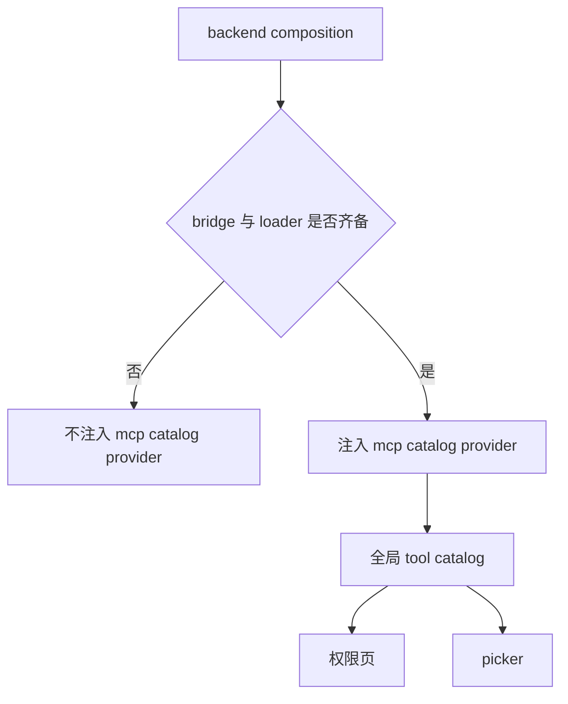
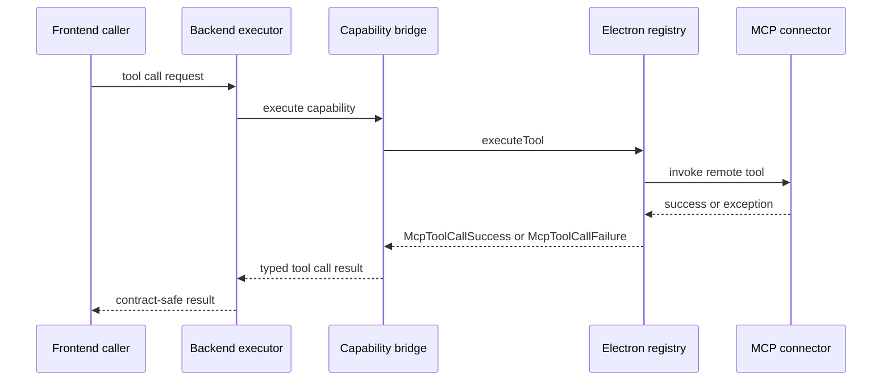
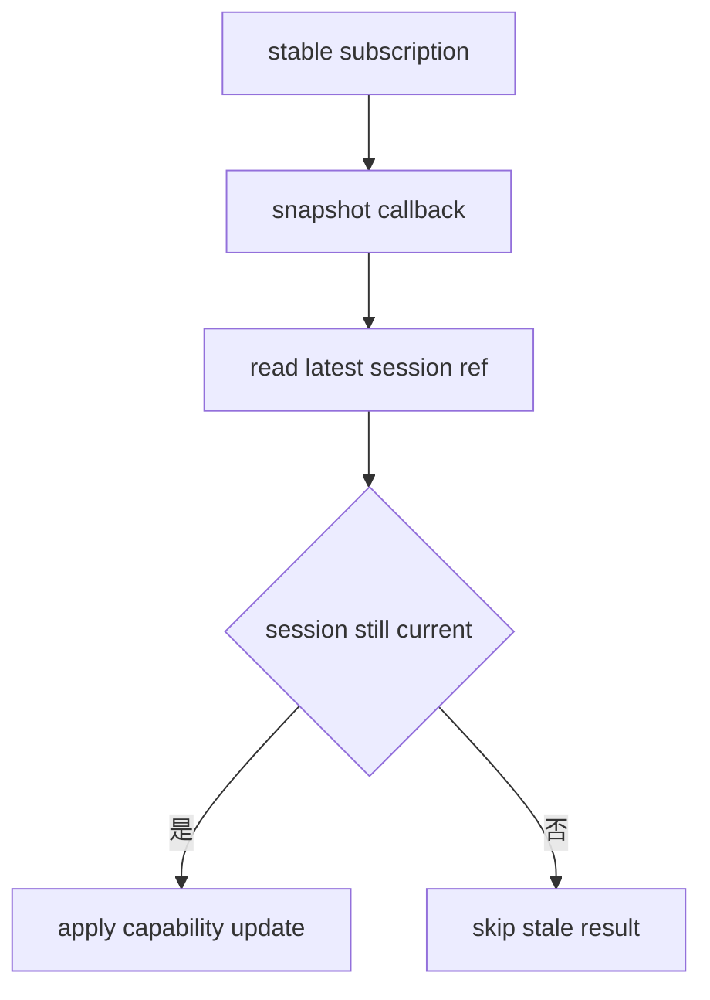

# 2026-04-22 reviewer 评论与 CI 回归严格契约收口设计

## 1. 背景与问题归类

本轮问题不是单点缺陷，而是同一组 MCP 与 managed runtime 契约在多个层级同时漂移后的集中暴露。reviewer 评论与 CI 红灯共同指向三个已经发生的事实。

- 第一，系统会暴露一部分实际上无法执行的 MCP 工具，导致目录可见性与可执行性脱节。
- 第二，工具调用异常时返回的 payload 漂移到 registry failure envelope，导致 capability bridge 与上游调用方收到不合法的跨层错误形状。
- 第三，managed runtime 的平台支持声明宽于真实安装链能力，导致 UI、命令解析与安装器对同一目标平台给出彼此矛盾的信号。

除此之外，前端 MCP 会话刷新链还存在一类时序性问题：订阅回调与异步返回会读取闭包中的过期 session 列表，导致 live capabilities 可能刷到错误会话，或者被过期状态静默覆盖。

结合已确认结论，本轮问题可归纳为四类契约不一致。

### 1.1 目录可见性先于可执行性

后端全局目录当前可能在不具备真实执行入口的前提下合入 MCP 条目，造成前端 tool catalog、权限页与 picker 看到了“理论上存在、实际上不可执行”的工具。

### 1.2 错误 envelope 跨层漂移

Electron 侧 `executeTool` 在异常分支返回了不属于工具调用语义的 failure 形状，破坏了 MCP tool call contract，也让上层 bridge 无法只根据 `McpToolCallSuccess` / `McpToolCallFailure` 两类结果稳定收敛。

### 1.3 平台支持声明宽于安装器现实能力

当前 managed runtime manifest 与安装器能力没有完全一致。只要某个平台或分发策略在 `UvRuntimeManager.installOrRepair` 尚未真正打通，manifest 与解析逻辑就不应继续宣称“已支持”。

### 1.4 snapshot 订阅读取了陈旧会话

前端工作区的 MCP snapshot 订阅链如果持续闭包捕获旧的 session 列表，那么即使订阅本身成功，异步返回仍可能基于过期快照做状态判断，最终把 capability 更新应用到错误会话，或者错误跳过本应生效的更新。

## 2. 目标与非目标

### 2.1 目标

本次设计只解决已确认的严格契约一致性收口问题。

1. 收口 MCP 会话刷新链，使订阅生命周期稳定，且订阅回调与异步返回始终读取最新 session 快照。
2. 收口 MCP 工具调用失败语义，使异常路径始终返回合法 `McpToolCallFailure`，不再混入 registry API failure。
3. 收口工具名称显示边界，使空白 `toolId` 不会生成误导性标题。
4. 收口后端目录暴露规则，使 MCP 条目只有在真实可执行时才进入全局目录。
5. 收口 managed runtime 支持声明，使 manifest、命令解析与安装器能力保持一致。
6. 收口测试预期，使前后端测试只跟随最终契约，不为保留旧行为而额外兼容。

### 2.2 非目标

本设计明确不覆盖以下事项。

- 不扩展 MCP 新功能，不新增新的目录来源、bridge 类型或 runtime family。
- 不为了兼容旧测试而保留本轮已判定错误的历史行为。
- 不重构整套 capability bridge、tool catalog 或 managed runtime 架构。
- 不引入新的平台支持承诺；首期只承认当前真实可安装的目标组合。
- 本文档只定义设计，不修改任何实现代码或既有设计文档。

## 3. 方案对比

### 3.1 方案 A：严格契约收口，按真实能力暴露与声明

这是推荐方案，也是本轮已确认的方向。

核心做法如下。

- 目录层坚持“可执行性先于可见性”，无 host bridge 或无动态 loader 时不暴露 MCP 工具。
- 工具调用层坚持“工具调用失败仍是工具调用契约内失败”，异常时返回合法 `McpToolCallFailure`。
- managed runtime 支持层坚持“只声明当前真实可安装目标”，不保留未实现目标的宽泛支持。
- 前端订阅层坚持“稳定订阅 + 最新 session 引用”，不让旧闭包参与 live capability 判定。
- 测试层全部改为跟随最终契约，不为绿灯保留旧 envelope 或旧目录策略。

优点：

- 契约边界清晰，前后端、bridge、安装器与测试可以围绕同一事实收敛。
- reviewer 提到的三类不一致都能在同一轮修复里消失。
- 后续维护成本最低，因为不会再保留“目录可见但不可执行”“声明支持但必然失败”这类灰区状态。

代价：

- 需要同步调整前端、Electron、后端与测试预期。
- 某些过去“看得到”的能力会在短期内被隐藏，直到执行链真正具备为止。

### 3.2 方案 B：保留宽暴露，增加降级标记与 UI 提示

这个方案允许后端继续把 MCP 条目放进目录，但通过 sourceKind、状态标签或 UI 提示告知“当前不可执行”或“当前平台不支持”。错误返回层也通过上层桥接兼容旧 envelope。

优点：

- 表面改动较小，短期内用户仍能看到更多条目。
- 部分测试也许可以通过补充兼容断言较快转绿。

缺点：

- 目录事实与执行事实继续分离，reviewer 指出的核心不一致不会真正消失。
- 上层需要持续理解更多灰区状态，长期成本更高。
- capability bridge 仍需承担额外兼容逻辑，错误定位会继续模糊。

### 3.3 方案 C：仅修测试与文案，最小化行为改动

这个方案只改测试预期、错误文案与前端展示，不触碰底层暴露边界、payload contract 与 platform support 判断。

优点：

- 改动面最小。

缺点：

- 无法解决根因，只是把不一致包装得更隐蔽。
- reviewer 评论不会真正闭合，后续还会在其他入口继续暴露。

### 3.4 方案结论

推荐采用方案 A。当前问题的共同根因就是契约边界漂移，只有把目录暴露、错误返回、平台支持、会话刷新与测试预期全部收口到真实能力边界，系统行为才会重新一致。

## 4. 最终设计

### 4.1 设计原则

最终设计围绕四条统一原则展开。

1. 可执行性先于可见性。
2. 契约内失败优先于跨层 envelope 复用。
3. 支持声明必须小于等于真实安装能力。
4. live 状态更新必须只依赖最新 snapshot。

### 4.2 MCP 会话刷新链

前端工作区中的 MCP snapshot 订阅改为稳定订阅模型。`useEffect` 不再因为 session 列表变化而反复退订与重订阅，而是只建立一条稳定订阅链；订阅回调与异步返回都通过最新 session 引用读取当前快照，而不是闭包捕获旧的 `sessionListState.sessions`。

这一设计保证两件事。

- 订阅生命周期稳定，不会因普通 session 列表变动而频繁重建。
- 即使异步返回晚于某次 session 切换，能力更新仍只会落到当前真实会话，不会基于过期列表错误跳过或覆盖更新。

### 4.3 MCP 工具调用失败契约

Electron registry 中的工具调用异常路径统一收口到 `McpToolCallFailure`。`executeTool` 不再复用返回 registry failure 形状的通用包装，而是保留当前请求上下文中的工具标识，并把异常映射为合法的工具调用失败语义。

这里的关键约束是：

- 成功路径只返回 `McpToolCallSuccess`。
- 失败路径只返回 `McpToolCallFailure`。
- registry API 自身的错误 envelope 不再穿透到工具调用结果中。

这样做之后，capability bridge 与上游调用者只需要围绕工具调用契约消费结果，不再承担“判断这次失败究竟属于 tool call 还是 registry API”的额外分支。

### 4.4 工具名称回退边界

工具名显示逻辑恢复对空白 `toolId` 的 `trim` 与 empty guard。对于空字符串或仅包含空白字符的 `toolId`，显示层不再拼装误导性标题，而是走更安全的回退路径。

这项调整虽然较小，但它直接影响权限页、聊天消息与工具调用记录的可理解性。名称显示不能把无效标识伪装成有效工具标题。

### 4.5 目录暴露边界

后端组合层把 MCP 目录暴露规则收口到“真实可执行时才可见”。只有同时具备 MCP snapshot 来源与动态执行链时，才把 `mcp_catalog_provider` 注入全局目录，并把 MCP 条目并入默认依赖集合。

换句话说，以下任一条件不成立时，都不得暴露 MCP 工具。

- 没有 `host_capability_bridge_client`。
- 没有 `McpExecutableToolLoader` 或等价动态执行入口。
- 无法形成从目录项到实际执行器的闭环。

该规则会直接影响前端 tool catalog、权限页与 picker：如果工具无法实际执行，这些入口就不应继续看到它。

### 4.6 托管运行时支持边界

managed runtime 支持声明收口到当前真实安装能力。既然当前 `UvRuntimeManager.installOrRepair` 首期只实现 `portable-archive` 路径，那么 manifest、平台解析与 UI 状态都必须与这一事实一致。

本轮允许两种实现落点，但对外语义必须一致。

- 要么收紧 `resolveManagedRuntimeTarget` 的支持平台判断。
- 要么把 runtime manifest 缩减到当前真正可安装的平台与分发组合。

无论采用哪种落点，最终契约都必须满足以下要求。

- UI 不再把未实现目标展示为已支持。
- 命令解析不再把未实现目标导向必然失败的安装链。
- 安装器、manifest 与平台判断三者对同一目标给出一致答案。

### 4.7 测试策略收敛

测试只跟随最终契约，而不为旧行为兜底。

- 前端契约测试接受真实暴露 API 集合，`preload.test.ts` 把 `managedRuntime` 纳入最终预期。
- 前端行为测试更新 command resolution 断言，校验当前真实的 managed 与 unmanaged 解析结果，不再保留旧返回形状。
- 后端组合测试更新目录暴露预期，明确验证“不可执行则不暴露”的最终 provider 契约，并同步核实 `sourceKind` 相关断言。

## 5. 模块影响面

| 模块 | 主要文件 | 影响内容 | 收口方向 |
| --- | --- | --- | --- |
| 前端工作区会话刷新 | `frontend-copilot/src/workbench/assistant/useAssistantWorkspaceState.ts` | MCP snapshot 订阅时机、session 读取方式 | 稳定订阅，始终读取最新 session 快照 |
| Electron MCP registry | `frontend-copilot/electron/mcp-registry/main-process.ts` | `executeTool` 异常分支返回语义 | 统一返回合法 `McpToolCallFailure` |
| 聊天消息展示 | `frontend-copilot/src/features/copilot/messages/CopilotMessagesShell.tsx` | toolId 显示名回退 | 恢复 trim 与空值 guard |
| 后端运行时组合 | `backend/app/copilot_runtime/composition.py` | 默认依赖、目录 provider 注入条件 | 无执行链则不暴露 MCP 条目 |
| 托管运行时清单与解析 | `frontend-copilot/electron/managed-runtime/runtime-manifest.ts`、`frontend-copilot/electron/managed-runtime/ManagedRuntimeService.ts`、`frontend-copilot/electron/managed-runtime/uv/UvRuntimeManager.ts` | 支持平台声明、目标解析、安装能力一致性 | 仅声明当前真实可安装目标 |
| 前端测试 | `frontend-copilot/electron/preload.test.ts`、`frontend-copilot/electron/managed-runtime/command-resolution.test.ts` | API 暴露与命令解析断言 | 跟随最终契约更新 |
| 后端测试 | `backend/tests/unit/copilot_runtime/test_composition.py` | provider 注入与目录暴露断言 | 跟随可执行性优先规则更新 |

## 6. 数据流与错误流

### 6.1 目录暴露数据流

这条数据流强调一个前提：只有后端确认目录项可被真实执行时，MCP 工具才进入统一 catalog，然后再被前端各入口消费。

### 6.2 工具调用错误流

这条错误流的关键点在于：无论远端工具调用是否抛错，`REG` 返回给 `BR` 的都必须仍是工具调用契约内的结果，而不是 registry API 自身的 envelope。

### 6.3 会话刷新状态流

这里的重点不是多做一次比较，而是彻底避免订阅链依赖闭包中的旧 session 列表。只有最新 session ref 才能参与状态应用决策。

## 7. 测试与验收标准

### 7.1 测试收口

本轮测试按三类同步调整。

1. 前端契约测试：`frontend-copilot/electron/preload.test.ts` 接受真实暴露的 preload API 集合，把 `managedRuntime` 纳入预期。
2. 前端行为测试：`frontend-copilot/electron/managed-runtime/command-resolution.test.ts` 与相关测试断言当前真实的 managed 与 unmanaged 解析结果，不再保留旧返回形状。
3. 后端组合测试：`backend/tests/unit/copilot_runtime/test_composition.py` 改为断言最终目录策略，即不可执行则不暴露，同时核实 `sourceKind` 断言与最终 provider 契约一致。

### 7.2 验收标准

本轮完成后，以下结果必须同时成立。

1. reviewer 提到的“目录能看到但不能跑”不再出现。
2. reviewer 提到的“工具调用异常返回错 payload”不再出现。
3. reviewer 提到的“平台看起来支持但安装必然失败”不再出现。
4. MCP 会话刷新链不会因 session 列表变化反复退订与重订阅。
5. live capabilities 不会因陈旧闭包被写入错误会话。
6. `frontend-copilot/electron/preload.test.ts`、`frontend-copilot/electron/managed-runtime/command-resolution.test.ts` 与 `backend/tests/unit/copilot_runtime/test_composition.py` 会跟随最终契约一起转绿。

## 8. 风险与回滚

### 8.1 主要风险

本轮最主要的风险有四类。

- 严格隐藏不可执行 MCP 条目后，短期内会出现“之前能看到，现在看不到”的体验变化；但这是契约收口后的预期结果，而不是回归。
- managed runtime 支持范围收紧后，部分平台会从“宣称支持”变成“明确不支持”，需要确保 UI 文案与状态提示同步一致。
- 工具调用错误 envelope 收口后，少量上层测试或辅助日志可能需要同步适配 typed failure 语义。
- 稳定订阅改造后，如果最新 session ref 的更新时机不一致，可能暴露新的竞态；因此测试必须覆盖快速切 session 与异步返回交错场景。

### 8.2 回滚原则

如果本轮上线后发现严格收口导致新的阻断，回滚也必须保持契约完整，不允许退回到新的灰区状态。

- 可以回滚到“更少暴露能力”的安全状态，例如临时完全关闭某类 MCP 条目注入。
- 不可以回滚到“继续暴露不可执行目录项”或“继续宣称未实现平台支持”的状态。
- 如果工具调用失败映射出现问题，回滚应保持 typed failure 语义，再缩小具体错误细节，而不是重新把 registry failure envelope 暴露给上层。

## 9. 设计结论

本轮修复的本质不是分别修三个红点，而是把 MCP 与 managed runtime 的若干边界重新收口到同一条严格契约线上。目录是否可见、工具是否可调用、平台是否被声明支持、live state 是否可以被应用，都必须以真实能力为准，而不是以中间层的历史包装或宽松假设为准。

因此，本设计采用方案 A：严格契约收口。最终系统只暴露真实可执行的 MCP 工具，只返回合法的工具调用失败语义，只声明当前真实可安装的平台目标，并让前端订阅链始终围绕最新 session 快照工作。测试与 CI 也同步收口到这一最终契约，不再为旧行为保留兼容分支。
