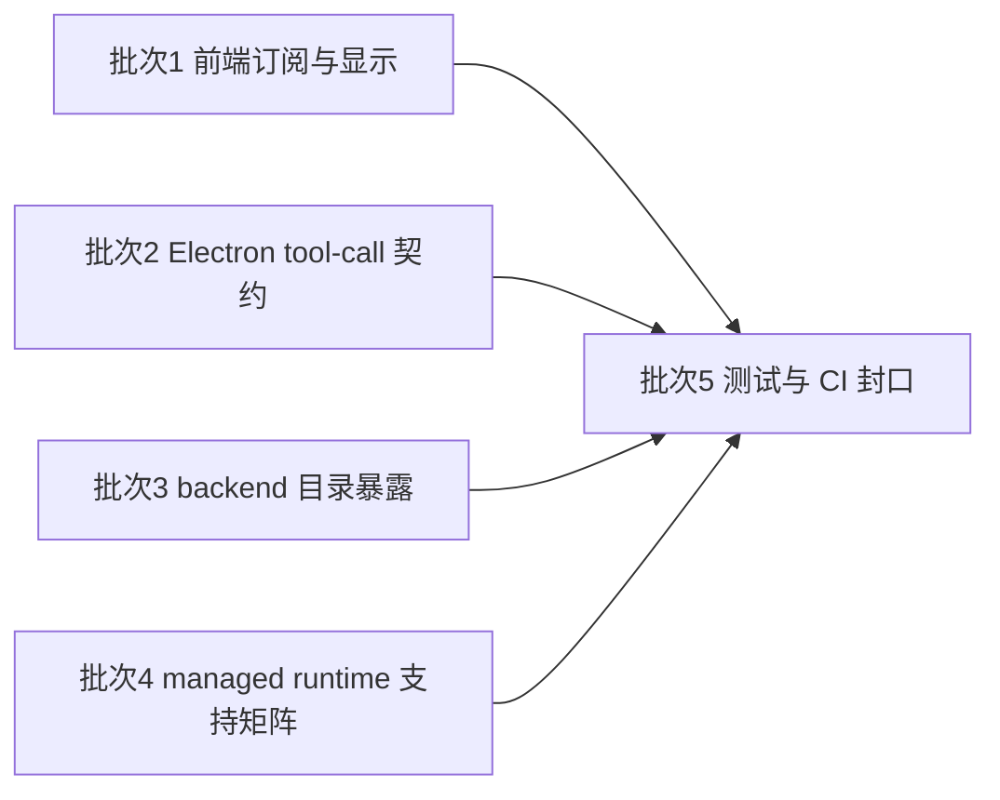

# 2026-04-22 reviewer 评论与 CI 回归严格契约收口实现计划

> 依据：[`docs/plans/2026-04-22-reviewer-ci-regression-design.md`](docs/plans/2026-04-22-reviewer-ci-regression-design.md)
>
> 性质：本文档只做实施规划，不包含任何实现代码；实施范围严格承接已确认设计，围绕 reviewer 评论与 CI 红灯暴露出的 MCP / managed runtime 契约漂移做分批收口，不扩展到新功能、新平台承诺或无关重构。

## 1. 目标与实施边界

本轮实现计划只围绕以下五类结果展开。

1. 前端工作区中的 MCP snapshot 订阅改为稳定订阅链，修复 [`frontend-copilot/src/workbench/assistant/useAssistantWorkspaceState.ts`](frontend-copilot/src/workbench/assistant/useAssistantWorkspaceState.ts) 的陈旧闭包与反复退订重订阅问题，并同步修复 [`frontend-copilot/src/features/copilot/messages/CopilotMessagesShell.tsx`](frontend-copilot/src/features/copilot/messages/CopilotMessagesShell.tsx) 对空白 `toolId` 的显示边界。
2. Electron 侧 [`executeTool()`](frontend-copilot/electron/mcp-registry/main-process.ts:126) 的异常路径统一返回合法工具调用失败契约，不再把 registry API failure envelope 透传给上游。
3. 后端 [`build_default_runtime_dependencies()`](backend/app/copilot_runtime/composition.py:55) 收紧目录暴露规则，没有 host bridge 或动态执行链时不再把 MCP 条目并入全局目录。
4. 托管运行时支持声明与真实安装能力重新对齐，使 [`frontend-copilot/electron/managed-runtime/runtime-manifest.ts`](frontend-copilot/electron/managed-runtime/runtime-manifest.ts)、[`frontend-copilot/electron/managed-runtime/ManagedRuntimeService.ts`](frontend-copilot/electron/managed-runtime/ManagedRuntimeService.ts)、[`frontend-copilot/electron/managed-runtime/uv/UvRuntimeManager.ts`](frontend-copilot/electron/managed-runtime/uv/UvRuntimeManager.ts) 只声明当前真正可安装的目标组合。
5. 前后端测试与 CI 全部收口到最终契约，重点覆盖 [`frontend-copilot/electron/preload.test.ts`](frontend-copilot/electron/preload.test.ts)、[`frontend-copilot/electron/managed-runtime/command-resolution.test.ts`](frontend-copilot/electron/managed-runtime/command-resolution.test.ts)、[`backend/tests/unit/copilot_runtime/test_composition.py`](backend/tests/unit/copilot_runtime/test_composition.py) 以及与 MCP 调用链直接相关的 Electron、frontend、backend 回归测试。

### 1.1 成功标准

本轮完成后，以下结果必须同时成立。

1. 不再出现“目录里能看到 MCP 工具，但执行链实际无法运行”的状态。
2. 不再出现“工具调用失败返回错 payload 形状”的状态。
3. 不再出现“平台看起来支持，但安装必然失败”的状态。
4. MCP live capabilities 刷新不再依赖旧 session 闭包，也不会因 session 变化频繁退订重订阅。
5. 相关自动化测试与 CI 只对最终契约断言，并对本轮已确认错误行为去兼容。

### 1.2 范围内

- 收口前端 MCP session live refresh、工具标题回退边界与直接耦合的页面断言。
- 收口 Electron MCP tool-call 错误 envelope 与 bridge 可见的结果形状。
- 收口 backend 全局目录的 MCP provider 注入条件与默认依赖拼装逻辑。
- 收口 managed runtime target 支持矩阵、命令解析与安装器真实能力的一致性。
- 收口前后端测试与 CI 回归清单。

### 1.3 范围外

- 不新增新的 MCP 目录来源、server 类型、bridge 类型或 managed runtime family。
- 不为了兼容旧测试保留已被设计判定为错误的历史行为。
- 不扩展首期未实现的平台或分发策略。
- 不重构整套 capability bridge、tool catalog 或 managed runtime 架构。
- 本次规划交付物只包括 [`docs/plans/2026-04-22-reviewer-ci-regression-implementation-plan.md`](docs/plans/2026-04-22-reviewer-ci-regression-implementation-plan.md)；当前文档提交不能混入实现代码或设计文档变更。

## 2. 实施批次总览

| 批次 | 目标 | 主要文件 | 前置依赖 | 串并行关系 | 核心交付 |
| --- | --- | --- | --- | --- | --- |
| 批次 1 | 前端订阅链与工具显示边界修复 | [`frontend-copilot/src/workbench/assistant/useAssistantWorkspaceState.ts`](frontend-copilot/src/workbench/assistant/useAssistantWorkspaceState.ts) [`frontend-copilot/src/features/copilot/messages/CopilotMessagesShell.tsx`](frontend-copilot/src/features/copilot/messages/CopilotMessagesShell.tsx) [`frontend-copilot/src/workbench/assistant/AssistantWorkspace.test.tsx`](frontend-copilot/src/workbench/assistant/AssistantWorkspace.test.tsx) [`frontend-copilot/src/features/copilot/CopilotMessageList.segment.test.tsx`](frontend-copilot/src/features/copilot/CopilotMessageList.segment.test.tsx) [`frontend-copilot/src/features/copilot/CopilotChatPanel.composer.test.tsx`](frontend-copilot/src/features/copilot/CopilotChatPanel.composer.test.tsx) | 无 | 串行起点；完成后其余批次可并行推进 | live capabilities 只消费最新 session，空白 `toolId` 不再伪装成有效标题 |
| 批次 2 | Electron MCP tool-call 契约修复 | [`frontend-copilot/electron/mcp-registry/main-process.ts`](frontend-copilot/electron/mcp-registry/main-process.ts) [`frontend-copilot/electron/capability-bridge/services/DesktopCapabilityMcpService.ts`](frontend-copilot/electron/capability-bridge/services/DesktopCapabilityMcpService.ts) [`frontend-copilot/electron/capability-bridge/ipc/DesktopCapabilityBridgeMainProcess.test.ts`](frontend-copilot/electron/capability-bridge/ipc/DesktopCapabilityBridgeMainProcess.test.ts) [`frontend-copilot/electron/mcp-registry/service.test.ts`](frontend-copilot/electron/mcp-registry/service.test.ts) | 无 | 与批次 3、批次 4 可并行；最终在批次 5 汇总回归 | 所有 `call_tool` 异常都回到合法 tool-call failure 形状 |
| 批次 3 | backend 目录暴露边界收紧 | [`backend/app/copilot_runtime/composition.py`](backend/app/copilot_runtime/composition.py) [`backend/tests/unit/copilot_runtime/test_composition.py`](backend/tests/unit/copilot_runtime/test_composition.py) [`backend/tests/unit/copilot_runtime/test_mcp_catalog_provider.py`](backend/tests/unit/copilot_runtime/test_mcp_catalog_provider.py) | 无 | 与批次 2、批次 4 可并行 | 无 host bridge 或无动态 loader 时，MCP 条目不再进入全局目录 |
| 批次 4 | managed runtime 平台支持声明收口 | [`frontend-copilot/electron/managed-runtime/runtime-manifest.ts`](frontend-copilot/electron/managed-runtime/runtime-manifest.ts) [`frontend-copilot/electron/managed-runtime/ManagedRuntimeService.ts`](frontend-copilot/electron/managed-runtime/ManagedRuntimeService.ts) [`frontend-copilot/electron/managed-runtime/uv/UvRuntimeManager.ts`](frontend-copilot/electron/managed-runtime/uv/UvRuntimeManager.ts) [`frontend-copilot/electron/managed-runtime/command-resolution.test.ts`](frontend-copilot/electron/managed-runtime/command-resolution.test.ts) [`frontend-copilot/electron/managed-runtime/runtime-manifest.test.ts`](frontend-copilot/electron/managed-runtime/runtime-manifest.test.ts) [`frontend-copilot/electron/managed-runtime/ManagedRuntimeService.test.ts`](frontend-copilot/electron/managed-runtime/ManagedRuntimeService.test.ts) | 无 | 可与批次 2、批次 3 并行；须在批次 5 前冻结支持矩阵 | manifest、target 解析、安装器真实能力三者对同一平台给出一致答案 |
| 批次 5 | 测试与 CI 回归封口 | [`frontend-copilot/electron/preload.test.ts`](frontend-copilot/electron/preload.test.ts) [`frontend-copilot/electron/managed-runtime/command-resolution.test.ts`](frontend-copilot/electron/managed-runtime/command-resolution.test.ts) [`frontend-copilot/electron/preload.managed-runtime.test.ts`](frontend-copilot/electron/preload.managed-runtime.test.ts) [`frontend-copilot/electron/mcp-registry/service.test.ts`](frontend-copilot/electron/mcp-registry/service.test.ts) [`frontend-copilot/electron/capability-bridge/ipc/DesktopCapabilityBridgeMainProcess.test.ts`](frontend-copilot/electron/capability-bridge/ipc/DesktopCapabilityBridgeMainProcess.test.ts) [`frontend-copilot/src/workbench/assistant/AssistantWorkspace.test.tsx`](frontend-copilot/src/workbench/assistant/AssistantWorkspace.test.tsx) [`backend/tests/unit/copilot_runtime/test_composition.py`](backend/tests/unit/copilot_runtime/test_composition.py) [`backend/tests/unit/copilot_runtime/test_mcp_tool_executor.py`](backend/tests/unit/copilot_runtime/test_mcp_tool_executor.py) | 批次 1-4 | 串行收尾 | 自动化断言与 CI 全部对齐最终契约，不再被旧行为绑架 |

## 3. 批次拆解

### 3.1 批次 1：前端订阅链与工具显示边界修复

#### 目标

先收口最容易把错误事实直接暴露到用户界面的前端链路：一是 MCP snapshot 订阅的稳定性与最新 session 读取，二是空白 `toolId` 的显示回退边界。该批次完成后，聊天页与工作区不会再把过期能力状态写入错误会话，也不会把无效工具标识显示成看似有效的标题。

#### 涉及文件与职责

| 文件 | 本批职责 |
| --- | --- |
| [`frontend-copilot/src/workbench/assistant/useAssistantWorkspaceState.ts`](frontend-copilot/src/workbench/assistant/useAssistantWorkspaceState.ts) | 把 session 相关的 MCP snapshot 监听改为稳定订阅模型，并通过最新 session 引用而非闭包快照做状态决策。 |
| [`frontend-copilot/src/features/copilot/messages/CopilotMessagesShell.tsx`](frontend-copilot/src/features/copilot/messages/CopilotMessagesShell.tsx) | 收紧工具标题回退逻辑，明确空字符串或仅空白字符的 `toolId` 不参与误导性标题拼装。 |
| [`frontend-copilot/src/workbench/assistant/AssistantWorkspace.test.tsx`](frontend-copilot/src/workbench/assistant/AssistantWorkspace.test.tsx) | 回归快速切 session、同轮目录更新与 stale request 被丢弃的场景。 |
| [`frontend-copilot/src/features/copilot/CopilotMessageList.segment.test.tsx`](frontend-copilot/src/features/copilot/CopilotMessageList.segment.test.tsx) | 校验失败或完成消息在空白 `toolId` 场景下走安全回退。 |
| [`frontend-copilot/src/features/copilot/CopilotChatPanel.composer.test.tsx`](frontend-copilot/src/features/copilot/CopilotChatPanel.composer.test.tsx) | 覆盖 tool phase 数据缺失或空白时的聊天消息显示边界。 |

#### 实施要点

1. 把 MCP registry subscription 的生命周期与 session 列表变化解耦，避免普通 session 变动引起重复退订与重订阅。
2. 把“当前可写入的 session”判断收口为读取最新引用，而不是依赖 effect 建立时捕获的 session 快照。
3. 保留现有 stale-request guard，但让 guard 判断基于最新 capabilities version / session ref，而不是旧闭包中的列表索引。
4. 工具标题回退链明确区分三类输入：有效 `toolId`、空白 `toolId`、完全缺失 `toolId`；只有第一类允许参与名称推导。
5. 页面层若仍需要 fallback 文案，应使用“未提供工具标识”这一安全语义，而不是把空白值裁剪后当作真实工具名。

#### 验证方式

1. 扩展 [`frontend-copilot/src/workbench/assistant/AssistantWorkspace.test.tsx`](frontend-copilot/src/workbench/assistant/AssistantWorkspace.test.tsx)，验证快速切换 session 与异步 snapshot 返回交错时，只会把最新结果应用到当前 session。
2. 验证单次订阅在普通 session 列表变化后不会重复重建，至少要覆盖“初始订阅 -> session 列表更新 -> 仍使用同一订阅通道”的断言。
3. 扩展 [`frontend-copilot/src/features/copilot/CopilotMessageList.segment.test.tsx`](frontend-copilot/src/features/copilot/CopilotMessageList.segment.test.tsx) 或直接耦合的消息测试，验证空白 `toolId` 不会显示误导性标题。
4. 人工回归应覆盖：同一聊天线程中 MCP 工具列表更新后，工具可见性与消息标题都与最新目录一致。

#### 提交边界

- 本批提交只包含前端工作区订阅链、聊天消息显示边界及其直接耦合测试。
- 不混入 [`frontend-copilot/electron/mcp-registry/main-process.ts`](frontend-copilot/electron/mcp-registry/main-process.ts) 的错误契约修复。
- 不混入 [`backend/app/copilot_runtime/composition.py`](backend/app/copilot_runtime/composition.py) 或 managed runtime 平台支持矩阵调整。

### 3.2 批次 2：Electron MCP tool-call 契约修复

#### 目标

把 Electron 侧 MCP 工具调用失败语义重新拉回工具调用契约本身：无论底层 connector、registry service 还是 bridge 触发异常，[`executeTool()`](frontend-copilot/electron/mcp-registry/main-process.ts:126) 返回给上游的都必须是合法的工具调用成功或失败结果，而不是 registry API 自身的 envelope。

#### 涉及文件与职责

| 文件 | 本批职责 |
| --- | --- |
| [`frontend-copilot/electron/mcp-registry/main-process.ts`](frontend-copilot/electron/mcp-registry/main-process.ts) | 收口 main-process 层对工具调用异常的包装方式，固定输出形状。 |
| [`frontend-copilot/electron/capability-bridge/services/DesktopCapabilityMcpService.ts`](frontend-copilot/electron/capability-bridge/services/DesktopCapabilityMcpService.ts) | 确保 bridge 消费者只处理 tool-call success 或 tool-call failure，不再被迫识别 registry API failure。 |
| [`frontend-copilot/electron/capability-bridge/ipc/DesktopCapabilityBridgeMainProcess.test.ts`](frontend-copilot/electron/capability-bridge/ipc/DesktopCapabilityBridgeMainProcess.test.ts) | 回归结构化调用成功与失败的透传。 |
| [`frontend-copilot/electron/mcp-registry/service.test.ts`](frontend-copilot/electron/mcp-registry/service.test.ts) | 补足 execute 路径对 drift、missing target、remote failure、unexpected exception 的断言。 |

#### 实施要点

1. 明确 `call_tool` 请求的成功和失败都属于工具调用语义，不复用 registry 管理类 API 的失败 envelope。
2. 异常路径必须保留当前请求上下文中的 `toolId`、`serverId`、可用时的 target 摘要与结构化错误码，避免上游丢失定位线索。
3. 如果底层异常原本没有标准错误码，本批要先映射到稳定的工具调用失败类别，再由 bridge 继续透传。
4. main-process 层不再为了“看起来统一”把工具调用失败和 registry load/save 失败揉成同一结果形状。
5. 如共享类型有最小范围调整，修改面应控制在 Electron MCP registry 与 capability bridge 边界内，不扩大到无关 preload 或 renderer API。

#### 验证方式

1. 扩展 [`frontend-copilot/electron/capability-bridge/ipc/DesktopCapabilityBridgeMainProcess.test.ts`](frontend-copilot/electron/capability-bridge/ipc/DesktopCapabilityBridgeMainProcess.test.ts)，覆盖 registry 返回结构化失败时 bridge 仍保持 tool-call failure 形状。
2. 扩展 [`frontend-copilot/electron/mcp-registry/service.test.ts`](frontend-copilot/electron/mcp-registry/service.test.ts)，覆盖 remote tool failure、missing tool、snapshot drift 与 unexpected exception。
3. 验证任何异常场景下都不会返回 registry 管理 API 的 `load/save/test connection` 风格 payload。
4. 如批次 5 之前存在跨层集成测试，应在该集成路径上确认 backend / bridge / main 三层看到的错误形状一致。

#### 提交边界

- 本批提交只包含 Electron MCP tool-call 契约修复与直接耦合的 Electron 测试。
- 如果必须修改共享类型，只允许触及 tool-call 结果直接依赖的最小集合。
- 不混入前端订阅显示问题、backend 目录暴露问题或 managed runtime 支持矩阵问题。

### 3.3 批次 3：backend 目录暴露边界收紧

#### 目标

让 backend 默认依赖拼装重新遵守“可执行性先于可见性”的规则。全局目录只有在 MCP snapshot 来源与真实动态执行链同时存在时，才允许暴露 MCP 条目；否则宁可不显示，也不能让前端看到必然无法执行的工具。

#### 涉及文件与职责

| 文件 | 本批职责 |
| --- | --- |
| [`backend/app/copilot_runtime/composition.py`](backend/app/copilot_runtime/composition.py) | 调整默认依赖构建与目录 provider 注入条件，确保 MCP 暴露依赖真实执行闭环。 |
| [`backend/tests/unit/copilot_runtime/test_composition.py`](backend/tests/unit/copilot_runtime/test_composition.py) | 回归 provider 注入条件、sourceKind 输出与默认目录结果。 |
| [`backend/tests/unit/copilot_runtime/test_mcp_catalog_provider.py`](backend/tests/unit/copilot_runtime/test_mcp_catalog_provider.py) | 验证 MCP provider 本身的输出仍保持稳定，但不会在不具备执行链时被全局目录采纳。 |
| [`backend/tests/unit/copilot_runtime/test_mcp_tool_executor.py`](backend/tests/unit/copilot_runtime/test_mcp_tool_executor.py) | 如目录暴露条件影响可执行工具装配，需同步核对执行器装载前提。 |

#### 实施要点

1. 以 [`build_default_runtime_dependencies()`](backend/app/copilot_runtime/composition.py:55) 为唯一收口点，统一判断 host bridge、snapshot provider、dynamic loader 是否齐备。
2. 只要缺失 `host_capability_bridge_client`、`McpExecutableToolLoader` 或同等动态执行入口中的任一项，就不把 MCP 目录 provider 合入全局目录。
3. 目录 provider 的“能生成条目”与全局目录的“应该暴露条目”要明确拆开，避免 provider 本身能力被误当成暴露许可。
4. 更新默认目录中的 `sourceKind`、order 与 group 相关断言时，只跟随最终暴露策略，不兼容旧的“可见但不可执行”状态。
5. 如执行器装配与目录装配当前共享同一组依赖判断，优先保持二者同源，避免后续再次漂移。

#### 验证方式

1. 扩展 [`backend/tests/unit/copilot_runtime/test_composition.py`](backend/tests/unit/copilot_runtime/test_composition.py)，覆盖以下组合：仅有 snapshot、仅有 host bridge、两者都有但无 loader、三者齐备。
2. 验证缺少动态执行链时，全局目录中不会再出现 `sourceKind = mcp` 的条目。
3. 验证动态执行链齐备时，MCP provider 仍能稳定进入目录，避免本批误伤真实可执行场景。
4. 如 backend 有 HTTP 层集成测试覆盖目录输出，应在批次 5 中补一次端到端断言，确认前端看见的目录也同步收紧。

#### 提交边界

- 本批提交只包含 backend composition 目录暴露规则与其直接耦合的 backend 测试。
- 不在本批混入 Electron bridge 错误 envelope 修复。
- 不在本批混入 managed runtime 平台支持矩阵或前端聊天页显示修复。

### 3.4 批次 4：managed runtime 平台支持声明收口

#### 目标

把 managed runtime 的 manifest、target 解析与安装器能力重新收口到同一事实源上：当前 installer 真正支持哪些 target，外层就只声明哪些 target。任何首期尚未打通的平台或分发策略，都必须从支持声明中拿掉，不能继续以“理论支持”形式暴露给 UI、命令解析或测试。

#### 涉及文件与职责

| 文件 | 本批职责 |
| --- | --- |
| [`frontend-copilot/electron/managed-runtime/runtime-manifest.ts`](frontend-copilot/electron/managed-runtime/runtime-manifest.ts) | 收紧 family manifest 中的平台与构件声明，去掉 installer 尚未兑现的目标。 |
| [`frontend-copilot/electron/managed-runtime/ManagedRuntimeService.ts`](frontend-copilot/electron/managed-runtime/ManagedRuntimeService.ts) | 收紧 target 解析和 load / install 入口对 unsupported target 的判定。 |
| [`frontend-copilot/electron/managed-runtime/uv/UvRuntimeManager.ts`](frontend-copilot/electron/managed-runtime/uv/UvRuntimeManager.ts) | 以真实安装策略能力为准，去掉对未实现目标的隐式支持承诺。 |
| [`frontend-copilot/electron/managed-runtime/command-resolution.test.ts`](frontend-copilot/electron/managed-runtime/command-resolution.test.ts) | 更新 npx / uvx 命令解析预期，使其只反映真实支持的平台组合。 |
| [`frontend-copilot/electron/managed-runtime/runtime-manifest.test.ts`](frontend-copilot/electron/managed-runtime/runtime-manifest.test.ts) | 回归 manifest 暴露的平台与构件集合。 |
| [`frontend-copilot/electron/managed-runtime/ManagedRuntimeService.test.ts`](frontend-copilot/electron/managed-runtime/ManagedRuntimeService.test.ts) | 回归 unsupported target 早失败与状态一致性。 |
| [`frontend-copilot/electron/managed-runtime/uv/UvRuntimeManager.test.ts`](frontend-copilot/electron/managed-runtime/uv/UvRuntimeManager.test.ts) | 回归 installer 对真实支持目标与不支持目标的边界。 |

#### 实施要点

1. 先冻结“真实支持矩阵”的唯一事实源，再决定由 manifest 收紧还是 target resolver 收紧承担主入口；无论落点在哪，对外结果都必须一致。
2. 把当前 installer 仅支持的 `portable-archive` 路径当作硬边界，未实现目标不再被描述为 ready、supported 或可安装。
3. 命令解析层对 unsupported target 的结论要与安装器完全一致，避免 UI 说支持、解析器放行、安装器再失败。
4. 状态模型中若保留 `missing`、`broken`、`unsupported` 等类别，必须明确 unsupported 与 missing 的边界，避免把“不支持平台”误报成“尚未安装”。
5. 如 preload 或 renderer 已暴露 managed runtime 状态 API，本批不扩大 API 面，只收紧其返回内容与测试断言。

#### 验证方式

1. 扩展 [`frontend-copilot/electron/managed-runtime/runtime-manifest.test.ts`](frontend-copilot/electron/managed-runtime/runtime-manifest.test.ts)，验证 manifest 不再包含未兑现的目标。
2. 扩展 [`frontend-copilot/electron/managed-runtime/ManagedRuntimeService.test.ts`](frontend-copilot/electron/managed-runtime/ManagedRuntimeService.test.ts)，验证 unsupported 平台组合会在 service 层早失败，并返回稳定错误语义。
3. 扩展 [`frontend-copilot/electron/managed-runtime/command-resolution.test.ts`](frontend-copilot/electron/managed-runtime/command-resolution.test.ts)，验证命令解析不会把未实现目标导向必然失败的安装链。
4. 扩展 [`frontend-copilot/electron/managed-runtime/uv/UvRuntimeManager.test.ts`](frontend-copilot/electron/managed-runtime/uv/UvRuntimeManager.test.ts)，验证安装器与 manifest 对同一 target 给出一致答案。

#### 提交边界

- 本批提交只包含 managed runtime 支持矩阵、target 解析与 installer 真实能力对齐，以及直接耦合测试。
- 不混入 backend 目录暴露或 Electron MCP tool-call 契约修复。
- 如果 [`frontend-copilot/electron/preload.test.ts`](frontend-copilot/electron/preload.test.ts) 只因支持矩阵变化需要更新，优先把直接耦合的最小断言留到批次 5 汇总处理。

### 3.5 批次 5：测试与 CI 回归封口

#### 目标

把前四个批次收口后的最终契约统一沉淀到测试与 CI。该批次不承担新的产品行为设计，而是负责清理残留旧断言、补齐跨层回归矩阵，并验证 reviewer 提到的三类不一致已全部消失。

#### 涉及文件与职责

| 文件 | 本批职责 |
| --- | --- |
| [`frontend-copilot/electron/preload.test.ts`](frontend-copilot/electron/preload.test.ts) | 以最终暴露 API 集合为准更新 preload 断言，包括 `managedRuntime` 相关预期。 |
| [`frontend-copilot/electron/preload.managed-runtime.test.ts`](frontend-copilot/electron/preload.managed-runtime.test.ts) | 校验 preload 暴露的 managed runtime API 在最终支持矩阵下仍成立。 |
| [`frontend-copilot/electron/managed-runtime/command-resolution.test.ts`](frontend-copilot/electron/managed-runtime/command-resolution.test.ts) | 跟随最终支持矩阵更新命令解析断言。 |
| [`frontend-copilot/electron/mcp-registry/service.test.ts`](frontend-copilot/electron/mcp-registry/service.test.ts) | 汇总 executeTool 契约、snapshot drift 与 target 解析场景。 |
| [`frontend-copilot/electron/capability-bridge/ipc/DesktopCapabilityBridgeMainProcess.test.ts`](frontend-copilot/electron/capability-bridge/ipc/DesktopCapabilityBridgeMainProcess.test.ts) | 汇总 bridge 看见的 tool-call success / failure 契约。 |
| [`frontend-copilot/src/workbench/assistant/AssistantWorkspace.test.tsx`](frontend-copilot/src/workbench/assistant/AssistantWorkspace.test.tsx) | 汇总 live capabilities 刷新与 stale result 丢弃路径。 |
| [`frontend-copilot/src/features/copilot/CopilotMessageList.segment.test.tsx`](frontend-copilot/src/features/copilot/CopilotMessageList.segment.test.tsx) | 汇总空白 `toolId` 消息展示边界。 |
| [`backend/tests/unit/copilot_runtime/test_composition.py`](backend/tests/unit/copilot_runtime/test_composition.py) | 汇总目录暴露边界的最终断言。 |
| [`backend/tests/unit/copilot_runtime/test_mcp_tool_executor.py`](backend/tests/unit/copilot_runtime/test_mcp_tool_executor.py) | 汇总 tool execution 结构化失败与 target 解析回归。 |

#### 实施要点

1. 先清点哪些测试必须留在各功能批次内直接跟改，哪些残留跨层断言适合集中到本批收尾，避免把产品逻辑修复偷渡成“测试批”。
2. [`frontend-copilot/electron/preload.test.ts`](frontend-copilot/electron/preload.test.ts) 与 managed runtime 相关测试必须只反映最终 renderer 可见 API，不为旧暴露集做兼容。
3. [`frontend-copilot/electron/managed-runtime/command-resolution.test.ts`](frontend-copilot/electron/managed-runtime/command-resolution.test.ts) 只断言真实支持目标的解析行为，对 unsupported target 则断言稳定失败语义。
4. [`backend/tests/unit/copilot_runtime/test_composition.py`](backend/tests/unit/copilot_runtime/test_composition.py) 只断言最终目录暴露策略，不再接受“无执行链也可见”的旧结果。
5. 对 Electron MCP tool-call 契约的跨层断言，要明确 success / failure 两类合法结果，并排除 registry API failure 混入。
6. 若 CI 仍有红灯，只允许基于最终设计补齐遗漏断言或修正夹具，不允许重新放宽产品契约来换取绿灯。

#### 验证方式

1. 前端单测矩阵至少覆盖：稳定订阅、空白 `toolId`、preload API 集合、managed runtime command resolution、Electron tool-call failure 形状。
2. backend 单测矩阵至少覆盖：composition 暴露边界、MCP executor 失败分类、动态执行链齐备与缺失两类路径。
3. 手工验收应覆盖三条主线：目录不可执行时不可见、工具调用失败 payload 合法、unsupported platform 不再被宣称支持。
4. CI 通过标准不是“原有测试全部绿”，而是“相关测试只针对最终契约断言后全部绿”。

#### 提交边界

- 本批提交只包含测试与 CI 回归收尾，以及与测试直接耦合的最小夹具修正。
- 若批次 5 发现仍需更改产品逻辑，应把逻辑回拨到对应功能批次，而不是继续把逻辑改动塞进回归批次。
- 本批作为实现阶段的最终封口提交，不替代当前计划文档的单独文档提交要求。

## 4. 推荐串并行关系

### 推荐合入顺序

1. 先合入批次 1，尽快稳定前端 live capabilities 与消息显示边界，避免后续调试继续受到陈旧状态干扰。
2. 批次 2、批次 3、批次 4 在设计边界已经明确的前提下可以并行推进，但各自必须把直接耦合测试随批次同步更新。
3. 待错误契约、目录暴露边界与支持矩阵都冻结后，再由批次 5 汇总跨层断言与 CI 回归。
4. 如果批次 5 发现新红灯，应先判断它属于哪条主契约，再回到对应批次补齐，而不是临时增加兼容分支。

## 5. 当前文档交付要求

1. 当前子任务交付物只包括 [`docs/plans/2026-04-22-reviewer-ci-regression-implementation-plan.md`](docs/plans/2026-04-22-reviewer-ci-regression-implementation-plan.md)。
2. 当前文档提交必须单独成一个 git commit，不能混入实现代码，也不能混入 [`docs/plans/2026-04-22-reviewer-ci-regression-design.md`](docs/plans/2026-04-22-reviewer-ci-regression-design.md) 的修改。
3. 建议提交信息保持为 `docs(plan): outline reviewer and ci regression fixes`。
4. 实现阶段应按本文的五个批次推进，并在每个批次内维持清晰的提交边界，而不是把多类契约修复重新揉成一个大提交。
