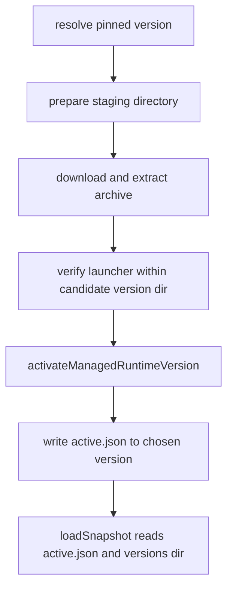
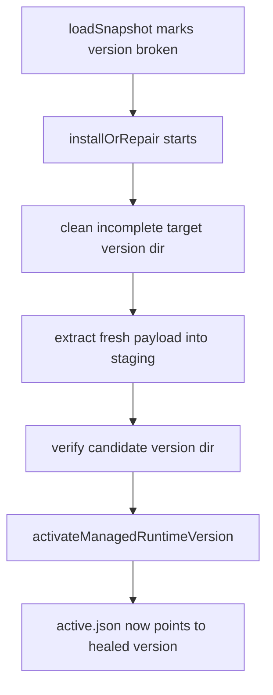

# 2026-04-23 managed runtime 安装布局与修复自愈设计

## 1. 背景与问题陈述

当前问题不是托管运行时缺少新的安装入口，而是既有安装布局、launcher 元数据与快照读取契约之间仍存在事实源漂移，导致同一轮安装或修复流程在不同阶段读到不同结论。

本轮已确认的症状可以归纳为三类。

### 1.1 公开事实源与内部路径推导不一致

当前实现同时暴露了 [`activeDir`](frontend-copilot/electron/managed-runtime/ManagedRuntimePaths.ts:36) 与 [`active.json`](frontend-copilot/electron/managed-runtime/ManagedRuntimePaths.ts:37) 两类“当前版本”事实，但它们承担的语义并不相同。若上层把 [`activeDir`](frontend-copilot/electron/managed-runtime/ManagedRuntimePaths.ts:36) 误当成最终 launcher 根目录，就会让 launcher 路径推导绕过 `versions/<version>` 的真实布局，进而在 staging 或半成品目录上做验证。

### 1.2 Windows Python launcher 元数据在安装链与读取链之间错配

[`createPythonDistribution()`](frontend-copilot/electron/managed-runtime/runtime-manifest.ts:253) 与 [`UvRuntimeManager.verifyVersionFromDirectory()`](frontend-copilot/electron/managed-runtime/uv/UvRuntimeManager.ts:166) 当前对 Windows Python launcher 的目录推导没有完全收口，导致 staging 阶段可能访问并不存在的 launcher 路径。问题本质不是 Python 版本声明错误，而是 manifest 侧写出的 launcher 预期与 manager 侧验证时读取的目录层级不完全一致。

### 1.3 残缺版本目录不能被稳定识别并一次修复

[`UvRuntimeManager.loadSnapshot()`](frontend-copilot/electron/managed-runtime/uv/UvRuntimeManager.ts:64) 与 [`NodeRuntimeManager.loadSnapshot()`](frontend-copilot/electron/managed-runtime/node/NodeRuntimeManager.ts:73) 目前可以读到活动版本，但对“版本目录存在但内容残缺”的场景缺少严格完整性判定。这会让 service 层既无法稳定把该状态标记为 broken 或 install required，也无法在用户点击一次修复时先受控清理坏目录，再重新完成 staging、验证与原子切换。

因此，本轮修复需要把 managed runtime 的安装与修复链重新收口到单一事实源、统一目录语义与可自愈的 repair 闭环上。

## 2. 目标与非目标

### 2.1 目标

本设计只覆盖本轮已确认的 managed runtime install layout repair 收口工作。

1. 明确 [`active.json`](frontend-copilot/electron/managed-runtime/ManagedRuntimePaths.ts:37) 与 `versions/<version>` 是托管运行时唯一公开事实源。
2. 收口 Windows Python launcher 路径推导，使 [`createPythonDistribution()`](frontend-copilot/electron/managed-runtime/runtime-manifest.ts:253) 与 [`UvRuntimeManager.verifyVersionFromDirectory()`](frontend-copilot/electron/managed-runtime/uv/UvRuntimeManager.ts:166) 使用一致的目录语义。
3. 让 [`UvRuntimeManager.loadSnapshot()`](frontend-copilot/electron/managed-runtime/uv/UvRuntimeManager.ts:64) 与 [`NodeRuntimeManager.loadSnapshot()`](frontend-copilot/electron/managed-runtime/node/NodeRuntimeManager.ts:73) 在活动版本目录残缺时稳定返回 broken 或 install required 语义。
4. 让 family manager 在目标版本目录已存在但不完整时，能够通过一次 [`installOrRepair()`](frontend-copilot/electron/managed-runtime/ManagedRuntimeService.ts:241) 触发受控清理、重新解压、重新验证与原子激活，实现自愈。
5. 收口测试预期，移除对 [`activeDir`](frontend-copilot/electron/managed-runtime/ManagedRuntimePaths.ts:36) 作为最终 launcher 根目录的断言，统一改为校验 [`active.json`](frontend-copilot/electron/managed-runtime/ManagedRuntimePaths.ts:37) 与 `versions/<version>` 事实源。

### 2.2 非目标

本设计明确不覆盖以下事项。

- 不扩展新的 UI、交互按钮或状态展示文案。
- 不引入新的 runtime family，也不重做整体 managed runtime 产品能力边界。
- 不扩展到无关的 MCP 功能、工具目录逻辑或历史 CI 议题。
- 不在本轮设计中讨论与当前修复无直接关系的全量回归策略。
- 不修改“单次修复”之外的用户操作模型，例如新增手工清理入口。

## 3. 事实源契约

### 3.1 单一公开事实源

从本轮开始，托管运行时的当前活动版本只通过以下两类事实对外表达。

1. [`active.json`](frontend-copilot/electron/managed-runtime/ManagedRuntimePaths.ts:37) 记录当前活动版本标识。
2. `versions/<version>` 保存该版本的真实落盘内容与 launcher 所在布局。

[`activeDir`](frontend-copilot/electron/managed-runtime/ManagedRuntimePaths.ts:36) 仍可作为内部辅助路径，但它不再被视为“最终 launcher 根目录事实源”。任何 launcher 解析、版本验证或测试断言，都必须通过“读取 [`active.json`](frontend-copilot/electron/managed-runtime/ManagedRuntimePaths.ts:37) 获得活动版本，再进入对应 `versions/<version>` 目录”这一链路完成。

### 3.2 launcher 路径推导契约

Windows Python 分发元数据与 manager 验证链必须共享同一目录推导规则。

- [`createPythonDistribution()`](frontend-copilot/electron/managed-runtime/runtime-manifest.ts:253) 负责声明 launcher 位于版本目录中的相对位置。
- [`UvRuntimeManager.verifyVersionFromDirectory()`](frontend-copilot/electron/managed-runtime/uv/UvRuntimeManager.ts:166) 负责在给定版本目录下按相同相对位置验证 launcher。
- staging 目录中的验证只能以“候选版本目录”为根，而不能提前假设 [`activeDir`](frontend-copilot/electron/managed-runtime/ManagedRuntimePaths.ts:36) 已经是最终落点。
- 激活完成后，对上层暴露的 launcher 绝对路径必须始终可重建为 `versions/<activeVersion>/<launcherRelativePath>`。

### 3.3 snapshot 状态契约

[`UvRuntimeManager.loadSnapshot()`](frontend-copilot/electron/managed-runtime/uv/UvRuntimeManager.ts:64) 与 [`NodeRuntimeManager.loadSnapshot()`](frontend-copilot/electron/managed-runtime/node/NodeRuntimeManager.ts:73) 在读取活动版本时，必须同时判断：

1. [`active.json`](frontend-copilot/electron/managed-runtime/ManagedRuntimePaths.ts:37) 是否存在且可解析。
2. `versions/<activeVersion>` 是否存在。
3. 该目录下的关键 launcher 与必要文件是否完整。

若活动版本目录缺失或残缺，则 snapshot 不能继续把该版本视为健康安装，而应返回 broken 或 install required，并把后续 repair 视为重新建立活动版本事实的动作。

## 4. 安装与修复数据流

### 4.1 正常安装流

安装与修复都围绕同一条基础链路执行。

关键约束如下。

1. 验证阶段始终在候选版本目录中完成，不直接读取活动目录捷径。
2. 只有通过验证的版本目录才允许进入 [`activateManagedRuntimeVersion()`](frontend-copilot/electron/managed-runtime/RuntimeInstallShared.ts:33)。
3. 激活完成后，对上层公开的 launcher 与状态都从 [`active.json`](frontend-copilot/electron/managed-runtime/ManagedRuntimePaths.ts:37) 与 `versions/<version>` 重建，不保留 staging 语义。

### 4.2 Windows Python 路径一致性收口

Windows Python repair 的核心不是增加新分支，而是让 manifest 与 manager 共用同一事实。

- [`createPythonDistribution()`](frontend-copilot/electron/managed-runtime/runtime-manifest.ts:253) 输出的 launcher 相对路径必须直接对应最终版本目录布局。
- [`UvRuntimeManager.verifyVersionFromDirectory()`](frontend-copilot/electron/managed-runtime/uv/UvRuntimeManager.ts:166) 只在传入的版本目录下验证这些相对路径，不额外拼出假设性的 launcher 根。
- staging 验证通过后，激活层仅做目录切换，不重新解释 launcher 布局。

这样可以消除“manifest 说 launcher 在 A 处，manager 却到 B 处查找”的错配，也避免 staging 阶段访问最终并不存在的路径。

## 5. 自愈策略

### 5.1 残缺活动目录的识别

当 [`loadSnapshot()`](frontend-copilot/electron/managed-runtime/uv/UvRuntimeManager.ts:64) 或 [`loadSnapshot()`](frontend-copilot/electron/managed-runtime/node/NodeRuntimeManager.ts:73) 发现活动版本目录缺少关键 launcher、校验文件或必要子目录时，应把当前状态标记为 broken 或 install required，而不是继续暴露一个表面可用但实际不可执行的 launcher。

### 5.2 一次 repair 的自愈闭环

当用户触发 [`installOrRepair()`](frontend-copilot/electron/managed-runtime/ManagedRuntimeService.ts:241) 时，family manager 需要在目标版本目录已存在但不完整的场景下执行受控自愈。

闭环要求如下。

1. 若目标 `versions/<version>` 已存在但残缺，先受控清理该目标版本目录。
2. 重新下载或重新解压时仍先落到 staging，不直接覆盖活动事实源。
3. 只有 staging 验证通过后才调用 [`activateManagedRuntimeVersion()`](frontend-copilot/electron/managed-runtime/RuntimeInstallShared.ts:33) 执行原子切换。
4. 整个流程对用户表现为一次 repair，无需手工删除目录或额外介入。

### 5.3 失败边界

若重新解压或验证失败，系统可以继续维持 broken 或 install required 状态，但不能留下新的半成品活动事实。也就是说，repair 失败可以不恢复为 healthy，但必须保证 [`active.json`](frontend-copilot/electron/managed-runtime/ManagedRuntimePaths.ts:37) 与 `versions/<version>` 的关系仍可被明确诊断，而不是产生新的路径漂移。

## 6. 测试与验证范围

本轮测试只覆盖与已确认设计直接相关的闭环，不扩展到无关模块。

### 6.1 Windows Python launcher 路径一致性

验证 [`createPythonDistribution()`](frontend-copilot/electron/managed-runtime/runtime-manifest.ts:253) 与 [`UvRuntimeManager.verifyVersionFromDirectory()`](frontend-copilot/electron/managed-runtime/uv/UvRuntimeManager.ts:166) 在 Windows Python 目录结构上的相对路径推导一致，且 staging 验证不再访问不存在的 launcher 路径。

### 6.2 活动版本目录残缺的 broken 判定

验证 [`UvRuntimeManager.loadSnapshot()`](frontend-copilot/electron/managed-runtime/uv/UvRuntimeManager.ts:64) 与 [`NodeRuntimeManager.loadSnapshot()`](frontend-copilot/electron/managed-runtime/node/NodeRuntimeManager.ts:73) 在活动版本目录残缺时能够稳定返回 broken 或 install required，而不是继续给出可用状态。

### 6.3 残缺目标版本目录下一次 repair 的自愈

验证 [`installOrRepair()`](frontend-copilot/electron/managed-runtime/ManagedRuntimeService.ts:241) 在目标版本目录存在但不完整时，会先清理该目录，再完成 staging、验证与激活，并在一次操作后恢复到健康状态。

### 6.4 测试预期从 `activeDir` 迁移到事实源契约

更新 [`ManagedRuntimeService.install.test.ts`](frontend-copilot/electron/managed-runtime/ManagedRuntimeService.install.test.ts:37) 等直接相关测试，删除把 [`activeDir`](frontend-copilot/electron/managed-runtime/ManagedRuntimePaths.ts:36) 视为最终 launcher 根目录的断言，改为校验 [`active.json`](frontend-copilot/electron/managed-runtime/ManagedRuntimePaths.ts:37) 与 `versions/<version>` 所表达的最终事实。

## 7. 成功标准

本轮完成后，以下结果必须同时成立。

1. 托管运行时的公开当前版本事实只通过 [`active.json`](frontend-copilot/electron/managed-runtime/ManagedRuntimePaths.ts:37) 与 `versions/<version>` 表达。
2. Windows Python launcher 路径推导在 manifest 声明、staging 验证与激活后读取三处保持一致。
3. 当活动版本目录残缺时，[`UvRuntimeManager.loadSnapshot()`](frontend-copilot/electron/managed-runtime/uv/UvRuntimeManager.ts:64) 与 [`NodeRuntimeManager.loadSnapshot()`](frontend-copilot/electron/managed-runtime/node/NodeRuntimeManager.ts:73) 都会把状态判定为 broken 或 install required。
4. 用户点击一次修复即可完成对残缺目标版本目录的受控清理、重新安装与原子切换，无需手工删目录。
5. 直接相关测试全部基于 [`active.json`](frontend-copilot/electron/managed-runtime/ManagedRuntimePaths.ts:37) 与 `versions/<version>` 契约断言，不再依赖 [`activeDir`](frontend-copilot/electron/managed-runtime/ManagedRuntimePaths.ts:36) 的旧预期。

## 8. 风险与边界

### 8.1 主要风险

- 若 Windows Python archive 的真实内部结构与 [`createPythonDistribution()`](frontend-copilot/electron/managed-runtime/runtime-manifest.ts:253) 继续漂移，则路径一致性修复仍可能只覆盖当前样例而不是根因，因此实现阶段必须把相对路径契约写成共享事实而非多处硬编码。
- 若完整性判定条件过宽，broken 目录可能继续被误判为可用；若条件过严，则可能把实际可工作的目录错误判成 install required。实现时应仅围绕关键 launcher 与必要结构做判定。
- 若 repair 前清理目标目录的边界不够受控，可能误删不应删除的内容。因此清理范围必须限定在当前 family 的目标 `versions/<version>` 目录内。

### 8.2 边界约束

- 本轮只处理 Node 与 uv family 的活动目录判定与修复自愈，不扩展到新的 runtime family。
- 本轮只要求一次 repair 能自愈坏现场，不引入新的用户可见运维操作。
- 本轮只收口直接相关测试，不扩展到无关 UI、MCP 功能或历史 CI 回归。

## 9. 设计结论

本轮 managed runtime install layout repair 的核心，不是增加新的安装入口，而是把安装、验证、激活与快照读取重新收口到一套稳定事实源之上。[`active.json`](frontend-copilot/electron/managed-runtime/ManagedRuntimePaths.ts:37) 与 `versions/<version>` 成为唯一公开事实源；Windows Python launcher 元数据与 manager 验证链共享同一目录推导；[`UvRuntimeManager.loadSnapshot()`](frontend-copilot/electron/managed-runtime/uv/UvRuntimeManager.ts:64) 与 [`NodeRuntimeManager.loadSnapshot()`](frontend-copilot/electron/managed-runtime/node/NodeRuntimeManager.ts:73) 对残缺活动目录稳定返回 broken 或 install required；[`installOrRepair()`](frontend-copilot/electron/managed-runtime/ManagedRuntimeService.ts:241) 在坏现场下可通过受控清理、staging 重装、验证与 [`activateManagedRuntimeVersion()`](frontend-copilot/electron/managed-runtime/RuntimeInstallShared.ts:33) 原子切换完成一次自愈。

因此，后续实现阶段的唯一目标应是把所有直接相关代码与测试统一到这份事实源契约之下，而不是继续依赖 [`activeDir`](frontend-copilot/electron/managed-runtime/ManagedRuntimePaths.ts:36) 的旧式 launcher 语义。
