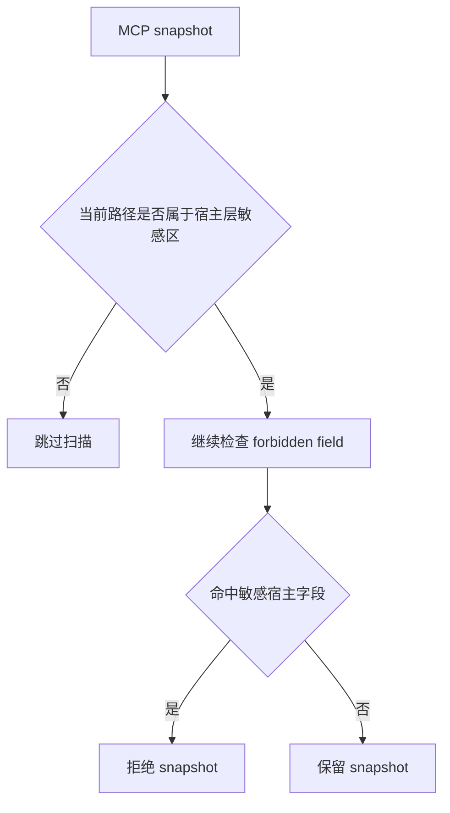
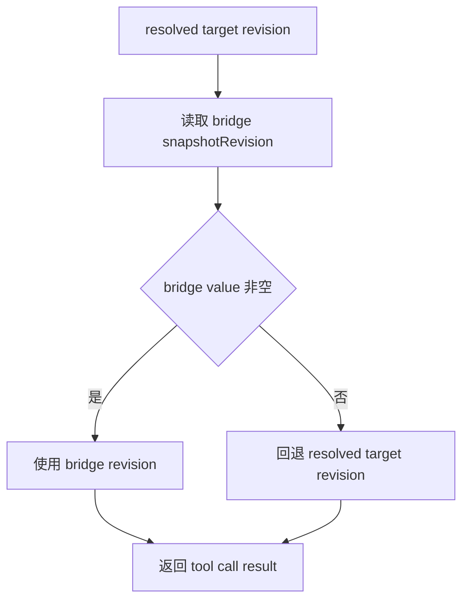
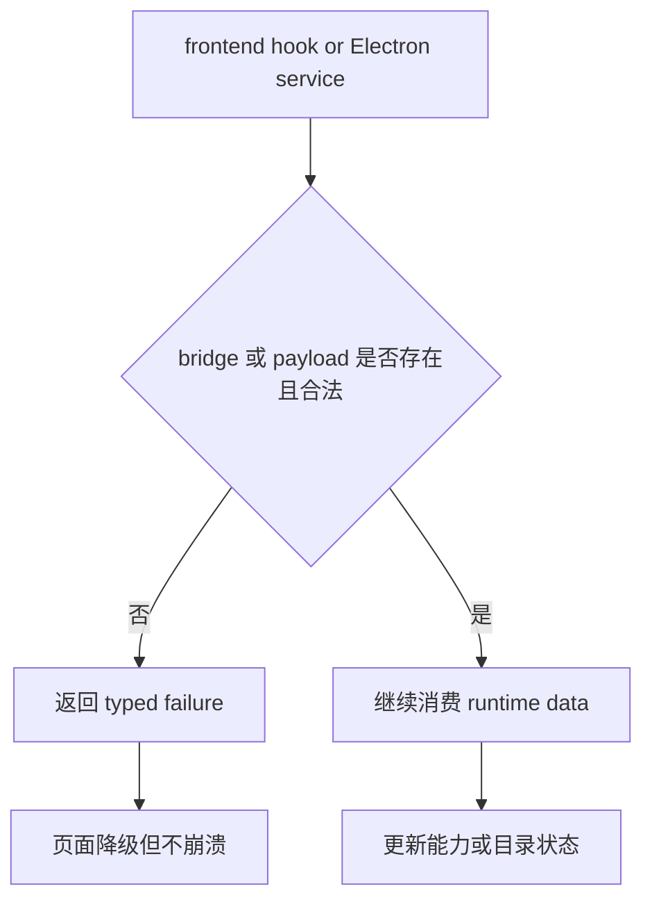

# 2026-04-23 reviewer / CI follow-up round 2 设计

## 1. 背景与问题归类

上一轮 reviewer / CI follow-up 已经完成调研、方案对比与前两节设计确认，并明确批准采用“方案 A：最小功能/CI 收口”。本轮不再重新讨论方向，而是把已确认结论沉淀为单独设计文档，供后续实现与验收直接对齐。

当前暴露的问题并不是彼此独立的零散红点，而是同一组 MCP 目录、快照、runtime bridge 与 Electron/前端契约在若干边界上同时漂移后的集中表现。结合已确认结论，本轮问题可归纳为四类。

### 1.1 backend snapshot 红线扫描边界过宽

[`collect_mcp_snapshot_forbidden_paths()`](backend/app/copilot_runtime/mcp_snapshot_provider.py:231) 当前红线扫描如果无界递归整个 MCP snapshot，就会把 [`inputSchema`](backend/app/copilot_runtime/mcp_snapshot_provider.py:75) 这类公开参数定义区域一并纳入敏感字段扫描。这样会把合法参数名如 `token`、`headers`、`args`、`command` 误判成泄漏字段，最终导致整个服务下的 MCP 工具被整组过滤。

这类误杀不是安全能力增强，而是宿主层敏感字段与远端工具公开 schema 的语义混淆。扫描应只覆盖“可能携带敏感配置的宿主层字段”，而不是把整个 snapshot 视为同一风险面。

### 1.2 `snapshotRevision` 在工具调用结果里被 `null` 擦写

[`execute_mcp_tool()`](backend/app/copilot_runtime/mcp_tool_executor.py:157) 的 success / failure 两条分支当前都允许 bridge 返回的 `snapshotRevision` 直接覆盖结果。如果 bridge 返回值为 `null`，就会把 [`resolved_target.snapshot_revision`](backend/app/copilot_runtime/mcp_tool_executor.py:191) 中已经存在的真实上下文抹掉。

这会直接影响诊断、目录漂移判断以及前端依赖 `snapshotRevision` 的缓存刷新逻辑。对于版本号这类上下文字段，本轮需要收口到“非空覆盖、空值回退”的契约。

### 1.3 managed runtime bridge 缺失时能力页直接崩溃

[`useManagedRuntime()`](frontend-copilot/src/workbench/capabilities/use-managed-runtime.ts:20) 当前直接访问 `window.managedRuntime`。在 preload 未注入、测试环境或降级场景下，这种直接访问会把 bridge 缺失放大为运行时异常，从而让 MCP 页面或能力页整体崩溃。

与之相对，[`createWindowMcpRegistryClient()`](frontend-copilot/src/workbench/capabilities/mcp-registry-client.ts:30) 已经采用 API existence guard 的模式：先判断 bridge 是否存在，再返回结构化的可消费结果。本轮需要让 managed runtime 入口对齐这一 guard 策略，把“bridge 缺失”收口为 typed failure，而不是前端 hard crash。

### 1.4 Electron tool catalog IPC 契约存在未验证字段

[`isRuntimeGlobalToolCatalogPayload()`](frontend-copilot/electron/tool-catalog/service.ts:138) 当前对 payload 的校验不够严格，`directoryVersion` 缺失或非法时仍可能继续穿透。随后 [`createElectronToolCatalogService()`](frontend-copilot/electron/tool-catalog/service.ts:29) 把不完整 payload 暴露给上层，导致 `undefined` 之类的非法值进入前端状态。

这类问题的本质是 IPC 契约没有在 runtime 可验证边界完成收口。既然 `directoryVersion` 是目录状态与缓存一致性的关键字段，就必须在 Electron service 这一层完成严格校验，并在不满足条件时返回 typed failure。

## 2. 目标与非目标

### 2.1 目标

本轮设计只解决已经确认的最小功能 / CI 收口问题，不扩面到额外重构。

1. 收口 backend MCP snapshot 红线扫描边界，使公开 schema 参数名不再导致整个 snapshot 被误判为空。
2. 收口 MCP 工具调用的 `snapshotRevision` 合并规则，使 bridge 返回非空值时可覆盖，返回 `null` 时必须回退到已解析目标版本。
3. 收口 managed runtime preload 可用性边界，使 [`useManagedRuntime()`](frontend-copilot/src/workbench/capabilities/use-managed-runtime.ts:20) 在 bridge 缺失时返回结构化失败状态而不是崩溃。
4. 收口 Electron tool catalog 的 IPC 运行时校验，使 `directoryVersion` 非法 payload 在 service 边界被拦下。
5. 收口与上述契约直接对应的测试与夹具，使 Linux CI 不再被执行位夹具误伤，且前端 fixture 与当前 MCP 契约重新一致。

### 2.2 非目标

本设计明确不覆盖以下事项。

- 不新增 MCP 功能，不扩展新的 snapshot 字段、catalog 来源或 runtime family。
- 不对 [`command-resolution.test.ts`](frontend-copilot/electron/managed-runtime/command-resolution.test.ts:1) 主动扩面；只有实现时发现它与本轮最终契约直接冲突，才顺手做必要对齐。
- 不重构整套 MCP snapshot provider、managed runtime 架构、tool catalog service 或 capability 页面。
- 不为历史错误行为保留兼容逻辑；测试和实现都应跟随最终契约收口。
- 不在本轮处理 [`tool_registry.py`](backend/app/copilot_runtime/tool_registry.py:498) 与 [`contracts.py`](backend/app/copilot_runtime/contracts.py:518) 相关的性能优化。这两处涉及动态目录加载与全局 catalog 聚合成本，属于后续专项，不纳入本轮最小功能 / CI 收口范围。
- 本文档只定义设计，不包含任何实现代码改动。

## 3. 方案对比

### 3.1 方案 A：最小功能 / CI 收口

这是推荐方案，也是本轮已被批准采用的方向。

核心做法如下。

- backend snapshot 红线扫描只检查宿主层敏感字段路径，显式跳过 [`inputSchema`](backend/app/copilot_runtime/mcp_snapshot_provider.py:75) 这类公开参数定义区域。
- backend MCP tool executor 对 `snapshotRevision` 采用“非空覆盖、空值回退”的单一合并规则。
- 前端 managed runtime hook 在读取 `window` bridge 前先做 existence guard，并将 bridge 缺失建模为结构化失败状态。
- Electron tool catalog service 对 `directoryVersion` 做严格字符串校验，非法 payload 直接返回 typed failure。
- 测试仅补与上述真实 bug 直接对应的断言、夹具与 fixture，对 Linux CI、MCP fixture 与诊断文案做最小必要校正。

优点：

- 直接针对 reviewer 评论与 CI 红灯的真实根因，不引入额外变更面。
- 前后端契约、typed failure 语义与测试口径可以在一轮内一起收口。
- 风险集中且可验证，便于后续把实现、测试与验收绑定到同一成功标准。

代价：

- 需要同时触达 backend、Electron、frontend 与测试夹具。
- 某些历史宽松行为会被明确收紧，例如 schema 区域不再参与敏感字段扫描、非法 `directoryVersion` 不再被默认吞下。

### 3.2 方案 B：宽松兼容，增加局部兜底

这个方案保留现有扫描与 bridge 返回逻辑，只在出问题的个别入口上补更多兼容判断。例如遇到 schema 参数名时临时做关键词白名单，遇到 `null` 版本时只在部分上游入口兜底，能力页也只通过 try/catch 防止崩溃。

优点：

- 表面改动分散且局部，短期内看起来风险较低。
- 某些旧测试也许可以通过补兼容断言较快转绿。

缺点：

- 根因仍未收口，snapshot、bridge、IPC 校验与测试契约会继续处于多套局部规则之下。
- 会把 typed failure、版本回退与 payload 验证逻辑拆散到多个层次，长期维护成本更高。
- reviewer 提到的契约漂移不会真正消失，只是更隐蔽。

### 3.3 方案 C：只修测试与 fixture，不改契约边界

这个方案只调整测试 fixture、诊断文案与 Linux 可执行位夹具，尽量不触碰运行时代码契约。

优点：

- 代码改动面最小。

缺点：

- 无法解决合法 MCP 工具被 schema 参数名误杀、`snapshotRevision` 被 `null` 抹掉、managed runtime bridge 缺失导致页面崩溃、非法 `directoryVersion` 穿透状态等根因。
- 只能暂时让部分测试变绿，无法作为 reviewer follow-up 的真正收口方案。

### 3.4 方案结论

推荐并采用方案 A。当前问题的共同根因不是单个实现缺陷，而是若干关键契约边界被放宽或漂移。只有把 snapshot 扫描边界、版本覆盖规则、preload bridge 守卫、IPC payload 校验与直接相关测试一起收口到最小闭环，才能同时消除 reviewer 关注点与 CI 假红。

## 4. 最终设计

### 4.1 设计原则

最终设计围绕以下四条原则展开。

1. 宿主层敏感字段扫描必须小于等于真实风险面。
2. 上下文字段只能被更可信的非空值覆盖，不能被空值抹掉。
3. bridge / IPC 契约必须先在边界完成 existence 与 shape 校验，再向上游暴露。
4. 测试只验证最终契约，不为已确认错误行为保留兼容预期。

### 4.2 backend snapshot 红线扫描边界

[`collect_mcp_snapshot_forbidden_paths()`](backend/app/copilot_runtime/mcp_snapshot_provider.py:231) 与 [`_validate_snapshot_payload()`](backend/app/copilot_runtime/mcp_snapshot_provider.py:285) 的设计收口点，是把“敏感宿主配置”和“远端工具公开 schema”从同一递归扫描面中分离出来。

本轮约束如下。

- 红线扫描只检查宿主层字段，也就是那些确实可能携带环境变量、认证头、命令行配置或本地敏感配置的 snapshot 区域。
- 对 [`inputSchema`](backend/app/copilot_runtime/mcp_snapshot_provider.py:75) 这类公开参数定义区域显式跳过，不再无界递归。
- 合法参数名如 `token`、`headers`、`args`、`command` 出现在 schema 属性名中时，不构成拒绝理由。
- 真正宿主层敏感字段若以相同名称出现在受保护路径中，仍必须被命中并触发拒绝。

这意味着扫描策略不再按“字段名是否敏感”做全局模糊判定，而是按“字段位于哪个风险层级”决定是否参与拒绝逻辑。

### 4.3 `snapshotRevision` 合并规则

[`execute_mcp_tool()`](backend/app/copilot_runtime/mcp_tool_executor.py:157) 在 success / failure 两条路径上统一采用单一版本合并规则。

- 优先读取 bridge 返回的 `snapshotRevision`。
- 仅当 bridge 返回值非空时，才允许覆盖结果中的版本号。
- 如果 bridge 返回 `null` 或缺失，则回退到 [`resolved_target.snapshot_revision`](backend/app/copilot_runtime/mcp_tool_executor.py:191)。
- 这一规则在 success 与 failure 分支中保持一致，不允许一边回退、一边擦写。

该设计的关键目的，是把“bridge 能提供更近实时的版本上下文”和“已解析目标携带稳定回退版本”结合成单一可靠来源，而不是让空值破坏已有上下文。

### 4.4 managed runtime preload 可用性守卫

[`useManagedRuntime()`](frontend-copilot/src/workbench/capabilities/use-managed-runtime.ts:20) 对外仍维持现有 hook 语义，但内部入口需要与 [`createWindowMcpRegistryClient()`](frontend-copilot/src/workbench/capabilities/mcp-registry-client.ts:30) 对齐。

最终设计要求如下。

- 在读取 `window.managedRuntime` 之前先做 existence guard。
- 当 preload 未注入、测试环境未提供 bridge、或降级场景中 bridge 明确不可用时，不抛出异常。
- hook 返回结构化失败状态，让能力页可以进入“不可用但可展示”的降级分支。
- typed failure 的形状应足够让上层区分“bridge 缺失”与“bridge 调用失败”，但本轮不扩展额外状态机。

这一设计确保 MCP 页面和 capability 页面把 bridge 缺失视为可恢复的环境状态，而不是前端崩溃条件。

### 4.5 Electron tool catalog IPC 契约收口

[`isRuntimeGlobalToolCatalogPayload()`](frontend-copilot/electron/tool-catalog/service.ts:138) 需要把 `directoryVersion` 视为强约束字段，而不是可选松散值。随后 [`createElectronToolCatalogService()`](frontend-copilot/electron/tool-catalog/service.ts:29) 只对外暴露已通过运行时校验的 payload。

本轮约束如下。

- `directoryVersion` 必须是合法非空字符串。
- hosted backend 返回缺失值、`undefined`、`null` 或其他非法形状时，应被判定为 payload 非法。
- 对外结果返回 typed failure，而不是把未验证值继续传给前端状态。
- service 层负责把 IPC payload shape 校验与上层消费边界彻底切开。

这样一来，前端 tool catalog 状态只会接收到经过 runtime 可验证的目录版本信息，缓存刷新与状态判断不会再建立在非法 payload 之上。

### 4.6 测试与 fixture 收口策略

测试只围绕本轮最终契约做最小必要补齐。

#### 4.6.1 backend 测试

backend 只补与两个真实 bug 直接对应的断言。

- 为 [`collect_mcp_snapshot_forbidden_paths()`](backend/app/copilot_runtime/mcp_snapshot_provider.py:231) / [`_validate_snapshot_payload()`](backend/app/copilot_runtime/mcp_snapshot_provider.py:285) 增加反例测试，证明 [`inputSchema`](backend/app/copilot_runtime/mcp_snapshot_provider.py:75) 内的公开参数名如 `token`、`headers`、`args`、`command` 不会再把整个 snapshot 判空。
- 同时保留真正宿主层敏感字段的拒绝断言，防止本轮修复退化成完全放松扫描。
- 为 [`execute_mcp_tool()`](backend/app/copilot_runtime/mcp_tool_executor.py:157) 增加两类断言：bridge 返回非空 `snapshotRevision` 时仍可覆盖；bridge 返回 `null` 时必须回退到 [`resolved_target.snapshot_revision`](backend/app/copilot_runtime/mcp_tool_executor.py:191)。

#### 4.6.2 frontend / Electron 测试

frontend / Electron 侧只补与本轮契约直接相关的 guard、typed failure 与夹具修复。

- [`useManagedRuntime()`](frontend-copilot/src/workbench/capabilities/use-managed-runtime.ts:20) 补“preload 缺失时不抛异常，而是返回结构化失败状态”的测试。
- [`isRuntimeGlobalToolCatalogPayload()`](frontend-copilot/electron/tool-catalog/service.ts:138) 补 `directoryVersion` 缺失或非法时返回 typed failure 的测试。
- [`verification.test.ts`](frontend-copilot/electron/managed-runtime/verification.test.ts:1) 将 POSIX 下的可执行 fixture 修正为带执行位，避免 Linux CI 因 `EACCES` 假红。
- [`ToolPicker.test.tsx`](frontend-copilot/src/features/copilot/components/ToolPicker.test.tsx:1) 的 MCP fixture 改为真实契约 `kind: 'mcp'`。
- [`CopilotPanelShell.diagnostic.test.tsx`](frontend-copilot/src/features/copilot/CopilotPanelShell.diagnostic.test.tsx:1) 的诊断文案改成与当前 MCP fixture 一致，避免旧占位工具名继续污染测试语义。
- [`command-resolution.test.ts`](frontend-copilot/electron/managed-runtime/command-resolution.test.ts:1) 不主动纳入本轮范围；仅在实现时发现与本轮最终契约直接冲突时才顺手对齐。

#### 4.6.3 最小验证矩阵

最小验证矩阵保持克制，只覆盖本轮直接影响面。

1. backend 跑与 MCP snapshot / tool executor 直接相关的 [`pytest`](backend/pyproject.toml:1) 定向用例。
2. frontend 跑 [`verification.test.ts`](frontend-copilot/electron/managed-runtime/verification.test.ts:1)、[`tool-catalog/service.test.ts`](frontend-copilot/electron/tool-catalog/service.test.ts:1)、managed runtime hook / 组件相关测试、[`ToolPicker.test.tsx`](frontend-copilot/src/features/copilot/components/ToolPicker.test.tsx:1) 与 [`CopilotPanelShell.diagnostic.test.tsx`](frontend-copilot/src/features/copilot/CopilotPanelShell.diagnostic.test.tsx:1) 这类直接相关用例。
3. 若这些通过，再补一次较小范围的前端 validation / typecheck，用于确认本轮契约修复没有再把相邻模块带崩。

## 5. 模块影响面

| 模块 | 主要文件 | 影响内容 | 收口方向 |
| --- | --- | --- | --- |
| backend snapshot provider | [`backend/app/copilot_runtime/mcp_snapshot_provider.py`](backend/app/copilot_runtime/mcp_snapshot_provider.py) | forbidden path 扫描边界、payload 校验 | 只扫描宿主层敏感字段，跳过公开 schema 区域 |
| backend MCP tool executor | [`backend/app/copilot_runtime/mcp_tool_executor.py`](backend/app/copilot_runtime/mcp_tool_executor.py) | `snapshotRevision` 合并规则 | 非空覆盖，空值回退 |
| frontend managed runtime hook | [`frontend-copilot/src/workbench/capabilities/use-managed-runtime.ts`](frontend-copilot/src/workbench/capabilities/use-managed-runtime.ts) | preload bridge 读取方式、降级状态 | existence guard + typed failure |
| frontend MCP registry client 模式参考 | [`frontend-copilot/src/workbench/capabilities/mcp-registry-client.ts`](frontend-copilot/src/workbench/capabilities/mcp-registry-client.ts) | guard 设计参考 | 复用 bridge existence guard 思路 |
| Electron tool catalog service | [`frontend-copilot/electron/tool-catalog/service.ts`](frontend-copilot/electron/tool-catalog/service.ts) | IPC payload 校验、typed failure | 强校验 `directoryVersion` |
| backend tests | [`backend/tests`](backend/tests) | snapshot / tool executor 定向断言 | 覆盖反例与回退路径 |
| frontend / Electron tests | [`frontend-copilot/electron/managed-runtime/verification.test.ts`](frontend-copilot/electron/managed-runtime/verification.test.ts)、[`frontend-copilot/electron/tool-catalog/service.test.ts`](frontend-copilot/electron/tool-catalog/service.test.ts)、[`frontend-copilot/src/features/copilot/components/ToolPicker.test.tsx`](frontend-copilot/src/features/copilot/components/ToolPicker.test.tsx)、[`frontend-copilot/src/features/copilot/CopilotPanelShell.diagnostic.test.tsx`](frontend-copilot/src/features/copilot/CopilotPanelShell.diagnostic.test.tsx) | guard、payload 校验、fixture 与诊断语义 | 仅跟随本轮最终契约 |
| 后续性能专项 | [`backend/app/copilot_runtime/tool_registry.py`](backend/app/copilot_runtime/tool_registry.py)、[`backend/app/copilot_runtime/contracts.py`](backend/app/copilot_runtime/contracts.py) | 动态工具目录加载、全局 catalog 聚合成本 | 明确留待后续，不纳入本轮 |

## 6. 数据流与错误流

### 6.1 snapshot 扫描边界

这条流强调的不是字段名本身，而是字段所在层级。相同名称出现在公开 schema 中时不构成拒绝；出现在宿主层敏感区时才触发红线。

### 6.2 `snapshotRevision` 合并流

这条流要求 success / failure 两条返回路径共享同一合并语义，避免一边保留上下文、一边被 `null` 清空。

### 6.3 managed runtime / tool catalog 边界守卫

这里的共同原则是：边界层先校验 existence 与 shape，再把结果暴露给上游。bridge 缺失与 payload 非法都应当被建模为结构化失败，而不是崩溃或未验证状态穿透。

## 7. 测试与验收标准

### 7.1 测试收口

本轮测试只覆盖直接相关模块，不主动扩面到更广泛回归。

1. backend 定向用例验证 schema 参数名不再误杀 snapshot，且真实宿主层敏感字段仍会被拒绝。
2. backend 定向用例验证 `snapshotRevision` 的非空覆盖与空值回退。
3. frontend / Electron 定向用例验证 managed runtime bridge 缺失降级、tool catalog `directoryVersion` 非法 payload 拦截、Linux 执行位夹具修复，以及 MCP fixture / 诊断文案与当前契约一致。
4. 直接相关测试通过后，再执行较小范围的 validation / typecheck 作为补充确认。

### 7.2 验收标准

本轮完成后，以下结果必须同时成立。

1. 合法 MCP 工具不会再因 [`inputSchema`](backend/app/copilot_runtime/mcp_snapshot_provider.py:75) 内的 schema 参数名被整组误杀。
2. 真实 `snapshotRevision` 上下文不会再被 bridge 返回的 `null` 覆盖掉。
3. MCP 页面或 capability 页面在缺少 [`window.managedRuntime`](frontend-copilot/src/workbench/capabilities/use-managed-runtime.ts:20) 时只会降级，不会崩溃。
4. `directoryVersion` 缺失或非法的 tool catalog payload 会在 Electron service 边界被拦下，不再进入前端状态。
5. Linux CI 不再被 [`verification.test.ts`](frontend-copilot/electron/managed-runtime/verification.test.ts:1) 的执行位夹具误伤。
6. MCP 相关前端 fixture 与诊断文案重新与当前契约对齐，不再保留旧占位语义。

## 8. 风险与后续非目标

### 8.1 主要风险

本轮主要风险集中在三类边界收紧后带来的连锁影响。

- snapshot 扫描若宿主层路径界定不准确，可能出现“误杀减少了，但真正敏感字段也漏扫”的反向风险，因此测试必须同时覆盖反例与正例。
- `snapshotRevision` 若在 success / failure 两条路径上没有完全统一合并规则，仍可能残留一侧上下文丢失。
- managed runtime guard 与 tool catalog payload 校验收紧后，部分旧测试、旧 fixture 或上层调用方可能暴露出原先依赖宽松行为的问题；这些应被视为契约对齐工作，而不是本轮回归。

### 8.2 回滚原则

如果后续实现落地后发现问题，回滚也应保持契约清晰，不允许回到更模糊的灰区。

- 可以暂时进一步收紧某些入口，例如让 bridge 缺失统一返回更保守的 failure。
- 可以临时缩小验证矩阵或隐藏未确认稳定的入口。
- 不可以回滚到“schema 参数名继续导致整组 MCP 工具消失”“`null` 继续擦掉真实 revision”“非法 `directoryVersion` 继续穿透状态”“bridge 缺失继续导致页面崩溃”的旧行为。

### 8.3 后续专项与明确留白

以下事项明确留待后续专项，不纳入本轮。

- [`tool_registry.py`](backend/app/copilot_runtime/tool_registry.py:498) 中动态工具加载路径的性能优化。
- [`contracts.py`](backend/app/copilot_runtime/contracts.py:518) 中全局 tool catalog 聚合与 MCP 目录拼装的性能优化。
- 更广泛的 managed runtime 架构整理、command resolution 扩面、以及超出本轮直接契约修复范围的测试重构。

## 9. 设计结论

本轮 reviewer / CI follow-up round 2 采用并固化方案 A：最小功能 / CI 收口。最终系统将围绕四个最小但关键的契约边界完成修复：backend snapshot 红线扫描只检查宿主层敏感字段、`snapshotRevision` 只允许被非空值覆盖、managed runtime bridge 缺失时页面只降级不崩溃、Electron tool catalog 的 `directoryVersion` 非法 payload 在 service 边界被拦下。

与之配套，测试与 fixture 也只围绕这些直接契约收口做最小必要修正：既恢复合法 MCP 工具的可见性与上下文稳定性，也消除 Linux CI 执行位假红和前端旧 fixture 漂移。至于 [`tool_registry.py`](backend/app/copilot_runtime/tool_registry.py:498) / [`contracts.py`](backend/app/copilot_runtime/contracts.py:518) 的性能优化，则明确留待后续专项，不在本轮混入处理。
