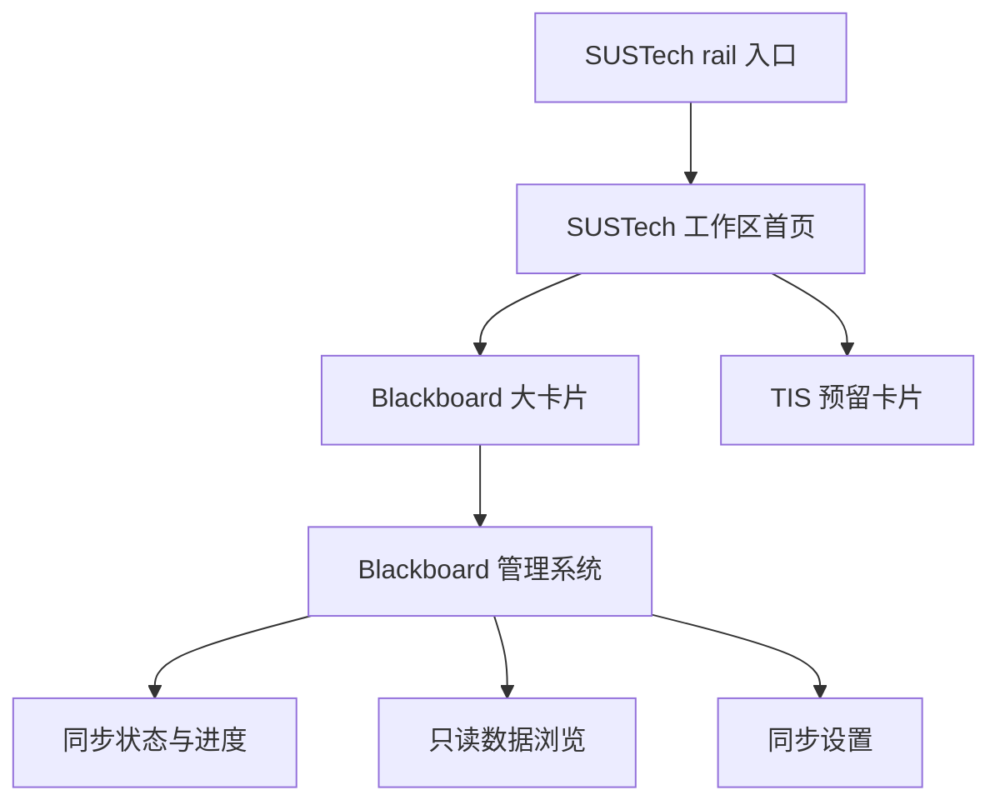
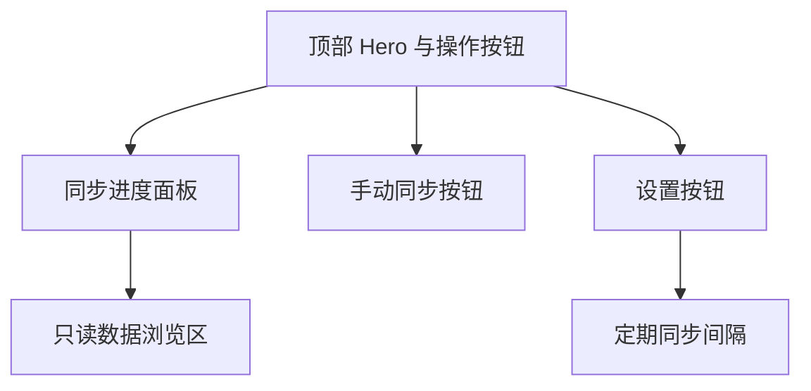
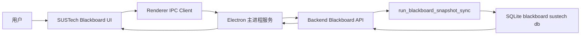

# SUSTech Blackboard 前端管理页设计

## 背景

本设计面向 `frontend-copilot` 桌面前端新增一个 `SUSTech` 一级工作区，并在其中提供 `Blackboard` 管理系统入口。首版目标是让用户在独立页面中查看 Blackboard 同步状态、手动触发同步、配置后台定期同步，并以只读方式浏览已同步的课程、公告、作业、成绩和资源列表。

现有项目已具备若干可复用基础：

- 顶层工作区由 [`App.tsx`](../../frontend-copilot/src/App.tsx) 管理，当前通过 [`WorkspaceView`](../../frontend-copilot/src/workbench/types.ts) 和 [`railPrimaryItems`](../../frontend-copilot/src/workbench/config.ts) 驱动左侧 rail 导航。
- Hub 类工作区已有可参考结构：[`HubWorkspace.tsx`](../../frontend-copilot/src/workbench/hub/HubWorkspace.tsx)。
- 能力页已有复杂工作区状态管理、二级导航、对话框和运行时状态按钮范式：[`CapabilitiesWorkspace.tsx`](../../frontend-copilot/src/workbench/capabilities/CapabilitiesWorkspace.tsx)。
- SUSTech 凭证与 Blackboard 自动下载相关设置目前在 [`SustechInfoSection.tsx`](../../frontend-copilot/src/workbench/settings/SustechInfoSection.tsx) 中已有雏形。
- 后端已有 Blackboard 快照同步主流程 [`run_blackboard_snapshot_sync`](../../backend/app/integrations/sustech/blackboard/provider/use_cases/snapshot_sync.py)，可以作为手动同步和后台定期同步的核心引擎。

## 用户确认的设计决策

1. 新增 `SUSTech` 作为左侧 rail 的一级入口。
2. 点击 `SUSTech` 后进入 `SUSTechWorkspace` 首页，首页展示一个大的 Blackboard 卡片。
3. 选择 Blackboard 后进入 Blackboard 管理系统内部页面。
4. Blackboard 首版只做只读浏览：课程、公告、作业、成绩、资源列表。
5. 文件下载首版仅保留按钮与空状态，不实现真实下载。
6. Blackboard 管理页顶部放手动同步图标按钮和设置图标按钮。
7. 设置中支持定期同步间隔，例如关闭、每两小时、每天。
8. 定期同步需要由 Electron 主进程作为桌面后台任务调度，只要主进程运行即可按间隔触发，不依赖用户是否打开 SUSTech 页面。
9. 同步中展示现代化进度：当前大步骤、线性总体进度、阶段阶梯、详细信息或日志。
10. 后续可能扩展作业上传等写操作，但首版 API 和 UI 均保持只读边界。

## 推荐方案

采用方案 A：`SUSTech` 一级工作区 + 内部 `Blackboard` 模块页 + Electron 主进程后台同步调度。

该方案最符合当前产品结构：左侧 rail 仍承载一级工作区，`SUSTech` 作为学校服务聚合入口，Blackboard 作为其中第一个成熟模块。未来可自然扩展 TIS、课程表、校园通知等模块，而不需要把每个校园系统都直接暴露成独立 rail 项。

## 信息架构



### 顶层导航

需要在 [`WorkspaceView`](../../frontend-copilot/src/workbench/types.ts) 中新增 `sustech`，并在 [`railPrimaryItems`](../../frontend-copilot/src/workbench/config.ts) 中新增 `SUSTech` rail 项。建议使用 `School` 或 `Database` 类图标，优先 `School`，因为该入口面向整个学校服务，而不是单一 Blackboard 数据库。

### SUSTech 工作区首页

新增 `frontend-copilot/src/workbench/sustech/`，建议文件结构：

```text
frontend-copilot/src/workbench/sustech/
├── SustechWorkspace.tsx
├── SustechHomeView.tsx
├── BlackboardModuleView.tsx
├── BlackboardSyncPanel.tsx
├── BlackboardDataBrowser.tsx
├── BlackboardSettingsDialog.tsx
├── sustech-workspace-state.ts
└── sustech-workspace-types.ts
```

`SustechWorkspace` 内部维护当前模块视图：

- `home`：展示 SUSTech 首页大卡片。
- `blackboard`：展示 Blackboard 管理系统。

首页首版包含：

- Blackboard 主卡片：显示最近同步状态、课程数量、公告数量、同步健康状态。
- 未来模块预留卡片：TIS 或校园服务，显示 `Coming soon`。
- 顶部说明：强调数据来自本地同步，首版只读。

## Blackboard 管理页布局

Blackboard 管理页采用三段式布局。



### 1. 顶部 Hero 与操作区

顶部包含：

- 标题：`Blackboard 管理系统`。
- 副标题：说明当前页面用于同步和浏览 Blackboard 本地快照。
- 状态摘要：最近同步时间、同步来源、数据库状态。
- 右侧两个图标按钮：
  - 手动同步按钮：点击后触发同步任务。
  - 设置按钮：打开设置弹窗。

交互状态：

- 同步运行中时，手动同步按钮进入 loading 或 disabled 状态，避免并发触发。
- 同步失败后，按钮恢复可用，错误卡片展示失败原因。
- 缺少凭证时，按钮仍可点击，但结果进入可恢复错误状态，并提示前往 SUSTech 信息设置页补充凭证。

### 2. 同步进度面板

进度面板是页面视觉重点，建议包含：

- 当前大步骤标题，例如 `认证中`、`抓取课程`、`抓取课程详情`、`同步数据库`、`完整性校验`、`完成`。
- 线性总体进度条，展示估算进度。
- 阶段阶梯或 chips，展示每个大步骤状态：pending、active、completed、failed。
- 详细信息区域：展示当前课程、已处理数量、最新 progress message。
- 可展开日志抽屉：展示后端 progress callback 和工具事件消息。

建议阶段枚举：

```text
idle
preparing
authenticating
fetching_courses
fetching_course_details
fetching_announcements
building_payloads
syncing_database
verifying
completed
failed
```

因为后端当前 [`ProgressCallback`](../../backend/app/integrations/sustech/blackboard/provider/results.py) 主要是文本消息，首版可以前端通过消息内容做弱映射；更稳妥的方案是在后端新增结构化进度事件字段，包括 `stage`、`detail`、`current`、`total`、`percent`。

### 3. 只读数据浏览区

数据浏览区采用课程侧栏 + 详情区结构：

- 左侧课程列表：课程名、课程代码、教师、同步状态。
- 右侧详情区：按 tab 或 segmented control 展示：
  - 公告
  - 作业
  - 成绩
  - 资源

首版只读，不提供编辑和上传。资源区域可以显示下载按钮，但按钮处于 disabled 或点击后弹出 `文件下载将在后续版本支持`。

空状态：

- 未同步：提示用户先点击手动同步。
- 同步中：显示 skeleton 或加载态。
- 数据库为空：展示空状态和同步入口。
- 资源下载不可用：展示说明而非报错。

## 设置弹窗与定期同步

设置弹窗由 Blackboard 页面右上角齿轮按钮打开。

首版字段：

- 定期同步：关闭、每两小时、每天。
- 下次同步时间：只读展示。
- 上次自动同步结果：成功、失败、跳过。
- 同步运行中防并发策略：如果已有同步任务运行，定期任务跳过本轮并记录状态。

配置持久化到现有 settings workspace 状态。建议扩展 SUSTech 配置结构：

```ts
sustech: {
  studentId: string
  email: string
  blackboardAutoDownloadEnabled: boolean
  blackboardDownloadLimitMb: string
  blackboardSyncInterval: 'off' | 'two_hours' | 'daily'
  blackboardLastAutoSyncAt?: string | null
  blackboardNextAutoSyncAt?: string | null
}
```

保留现有 `blackboardAutoDownloadEnabled` 和 `blackboardDownloadLimitMb`，但文件下载不在首版实现。

## Electron 后台调度

定期同步应由 Electron 主进程负责，而不是 React 页面 `setInterval`。

原因：

- 用户离开 SUSTech 页面后仍需执行。
- 渲染进程页面切换或重挂载不应影响后台任务。
- 主进程更适合统一读取 settings、调度 timer、避免并发和向 renderer 广播状态。

建议新增 Electron 服务：

```text
frontend-copilot/electron/sustech-blackboard/
├── scheduler.ts
├── ipc.ts
├── service.ts
└── types.ts
```

职责：

- 监听 settings workspace 状态变化。
- 根据 `blackboardSyncInterval` 安排下一次同步。
- 调用后端同步触发接口。
- 维护当前 sync run 状态。
- 通过 IPC 向所有 renderer 广播状态。

IPC 建议：

```text
sustech-blackboard:getStatus
sustech-blackboard:triggerSync
sustech-blackboard:updateSettings
sustech-blackboard:onSyncStateChanged
```

## 后端 API 边界

首版新增面向 UI 的轻量 API，避免通过聊天工具绕路。

建议接口：

```text
GET  /api/blackboard/sync/status
POST /api/blackboard/sync/trigger
GET  /api/blackboard/data/summary
GET  /api/blackboard/data/courses
GET  /api/blackboard/data/courses/:courseId/announcements
GET  /api/blackboard/data/courses/:courseId/assignments
GET  /api/blackboard/data/courses/:courseId/grades
GET  /api/blackboard/data/courses/:courseId/resources
```

接口原则：

- 只读数据 API 仅读取本地 SQLite。
- `trigger` 只启动同步，不直接承担复杂查询。
- 后端需要防止并发同步；如果已有任务运行，返回运行中状态。
- 进度可以通过 SSE、轮询或 Electron IPC 转发实现。首版建议 Electron 主进程持有同步状态并广播，UI 可轮询 status 作为兜底。

## 数据流



手动同步：

1. 用户点击手动同步。
2. Renderer 调用 `sustech-blackboard:triggerSync`。
3. Electron 主进程检查是否已有任务运行。
4. 主进程调用后端 `POST /api/blackboard/sync/trigger`。
5. 后端调用现有同步 use case。
6. 进度事件回传到主进程。
7. 主进程广播给 Renderer。
8. UI 更新进度面板和只读数据。

定期同步：

1. 用户在设置弹窗保存同步间隔。
2. 配置写入 settings workspace 状态。
3. Electron 主进程服务监听配置变化。
4. timer 到期后触发同一套同步流程。
5. 同步完成后更新 last/next sync 状态。

## 错误处理

首版需要覆盖以下错误：

| 场景 | UI 表现 |
|---|---|
| 缺少用户名或密码 | 进度面板显示可恢复错误，引导到 SUSTech 信息设置 |
| CAS 登录失败 | 显示后端失败消息，保留重试按钮 |
| 网络失败 | 显示网络错误和重试按钮 |
| 同步已运行 | 手动按钮禁用或提示已有任务运行 |
| 数据库未初始化 | 数据浏览区显示空状态，引导同步 |
| 同步部分课程失败 | 进度面板显示 warning，数据浏览仍展示已同步数据 |
| 只读数据 API 失败 | 详情区显示错误卡片，不影响同步面板 |

## 视觉风格

设计风格应延续现有 workbench：

- 使用卡片式 surfaces、柔和边框、低饱和背景。
- 同步进度面板可以使用更丰富的层次：渐变高亮、阶段 chips、细线性进度条、日志抽屉。
- 禁止过度动画；遵循已有 `data-animations` 偏好。
- 响应式布局在窄屏下从课程侧栏 + 详情区折叠为上下布局。

## 测试策略

### 前端测试

- `SustechWorkspace` 能从首页进入 Blackboard 模块。
- rail 中 `SUSTech` 项能激活对应工作区。
- Blackboard 手动同步按钮在运行中禁用。
- 设置弹窗能保存 `blackboardSyncInterval`。
- 进度面板能渲染 idle、running、completed、failed 状态。
- 数据浏览区能渲染空状态、课程列表、详情 tab。

### Electron 测试

- 主进程 scheduler 能根据 settings 安排 timer。
- 已有任务运行时，自动同步跳过或返回 running 状态。
- IPC `getStatus`、`triggerSync`、`updateSettings` 契约稳定。
- renderer 订阅能收到 `onSyncStateChanged`。

### 后端测试

- 同步 status 接口返回 idle/running/completed/failed。
- trigger 接口防止并发。
- 数据 summary 和课程详情接口只读返回 SQLite 数据。
- 缺少凭证、CAS 失败、网络失败返回可展示错误结构。

## 非目标

首版不实现：

- Blackboard 文件真实下载。
- 作业上传、提交、修改。
- 数据写回 Blackboard。
- 多账号切换。
- 离线队列上传。
- 系统级后台服务；仅 Electron 主进程运行期间调度。

## 实施顺序建议

1. 扩展前端工作区类型与 rail，新增 `SUSTechWorkspace` 首页。
2. 新增 Blackboard 模块页面骨架、Hero、操作按钮和设置弹窗。
3. 扩展 settings workspace 状态 schema，加入定期同步间隔。
4. 新增 Electron 主进程 Blackboard scheduler 和 IPC。
5. 新增后端 sync status、trigger、只读数据 API。
6. 接入同步进度状态与进度面板。
7. 接入只读数据浏览。
8. 补齐测试、空状态、错误状态和响应式样式。
